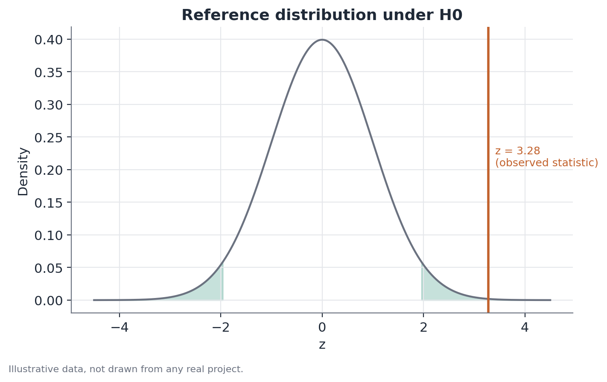

# A/B testing fundamentals

This document covers the statistical fundamentals of an A/B test —
experimental design, randomization, effect size, standard error, confidence
interval, and hypothesis testing for means and proportions. The three
documents that follow (Sample Ratio Mismatch, covariate balance, and
non-inferiority testing) treat this content as a prerequisite and go
straight to what each of them adds.

## Concept

An A/B test is a controlled, randomized experiment applied to a product or
business setting: units (usually users) are randomly assigned to a control
or treatment condition, and a pre-defined primary metric is compared between
the two groups at the end of a fixed period.

The core idea is isolating the causal effect of the change under test. In an
observational comparison — say, "before" versus "after" a launch, or users
who opted into a new feature versus those who didn't — any difference found
could come from dozens of factors that also shift over time or that
systematically differ between who opts in and who doesn't. Randomization
breaks that link: in expectation, random assignment makes the two groups
comparable on everything, observed or not, except the condition they were
assigned. That is what lets you attribute a difference in outcome to the
change being tested, with a quantifiable margin of uncertainty.

## Mathematical formulation

### Difference in means (continuous metric)

Let control ($C$) and treatment ($T$) have sample means $\bar{x}_C$ and
$\bar{x}_T$, sample variances $s_C^2$ and $s_T^2$, and sizes $n_C$ and
$n_T$. The estimated effect is:

$$
\hat{\Delta} = \bar{x}_T - \bar{x}_C
$$

The standard error of that difference, without assuming equal variances
across groups (the same logic behind Welch's t-test), is:

$$
SE(\hat{\Delta}) = \sqrt{\frac{s_T^2}{n_T} + \frac{s_C^2}{n_C}}
$$

The test statistic and the 95% confidence interval follow as:

$$
t = \frac{\hat{\Delta}}{SE(\hat{\Delta})}, \qquad
95\% \text{ CI} = \hat{\Delta} \pm z_{0.975} \cdot SE(\hat{\Delta})
$$

where $z_{0.975} \approx 1.96$ under a normal approximation (adequate with
large samples; with small samples, use the corresponding quantile of a t
distribution with Welch-Satterthwaite degrees of freedom).

### Difference in proportions (binary metric, e.g. conversion)

Let $\hat{p}_C = x_C / n_C$ and $\hat{p}_T = x_T / n_T$ be the observed rates
in each group, with $x_C$ and $x_T$ conversions and $n_C$, $n_T$ sample
sizes. The estimated effect is $\hat{\Delta} = \hat{p}_T - \hat{p}_C$. For
the hypothesis test, the pooled proportion under the null of equality is
used:

$$
\hat{p}_{pool} = \frac{x_C + x_T}{n_C + n_T}, \qquad
SE_0 = \sqrt{\hat{p}_{pool}(1-\hat{p}_{pool})\left(\frac{1}{n_C} + \frac{1}{n_T}\right)}
$$

$$
z = \frac{\hat{p}_T - \hat{p}_C}{SE_0}
$$

Note that the standard error used in the test ($SE_0$, under $H_0$) differs
from the one used to build the confidence interval around the observed
effect, which does not assume equal proportions:

$$
SE(\hat{\Delta}) = \sqrt{\frac{\hat{p}_C(1-\hat{p}_C)}{n_C} + \frac{\hat{p}_T(1-\hat{p}_T)}{n_T}}
$$

### Sample size / power

The sample size needed to detect a minimum effect $\delta$ with power
$1-\beta$ and significance $\alpha$ (two-sided test) is approximately, for a
proportion metric:

$$
n \approx \frac{\left(z_{1-\alpha/2} + z_{1-\beta}\right)^2 \cdot \left[p_C(1-p_C) + p_T(1-p_T)\right]}{\delta^2}
$$

where $z_{1-\alpha/2}$ and $z_{1-\beta}$ are the normal quantiles
corresponding to the desired confidence and power, and
$\delta = p_T - p_C$ is the smallest effect you want to be able to detect.

## Assumptions

- **Effective randomization**: every eligible unit has a known (typically
  equal) assignment probability, independent of every other unit. Without
  this, the entire causal argument collapses — hence the importance of
  checking the observed allocation share (see Sample Ratio Mismatch).
- **Independence between units**: one unit's outcome should not depend on
  which condition another unit received (no interference, or the "SUTVA" —
  Stable Unit Treatment Value Assumption). In settings with network effects
  or a shared marketplace, this can fail.
- **A well-defined, stable metric fixed before the experiment**: the primary
  metric, its aggregation window, and the eligibility criteria should be
  locked down before looking at the data, to avoid retroactive selection
  bias.
- **No uncorrected repeated peeking**: stopping the experiment as soon as the
  p-value crosses 0.05, without an appropriate sequential method, inflates
  the false-positive rate well above the nominal α.

## Hypotheses

For a continuous or proportion metric, the standard two-sided test is:

$$
H_0: \Delta = 0 \qquad H_1: \Delta \neq 0
$$

where $\Delta$ is the true (population) difference between treatment and
control. The significance level $\alpha$ is typically set at 0.05 before the
experiment. $H_0$ is rejected when the p-value is below $\alpha$, or
equivalently, when the $(1-\alpha)$ confidence interval excludes zero.

## Interpretation

Rejecting $H_0$ is evidence that the observed effect is not plausibly
explained by sampling variation alone — it is not proof of causality on its
own; the causal reading comes from randomization, not from the statistical
test in isolation. The width of the confidence interval communicates the
precision of the estimate: two experiments can share the same point
estimate with very different degrees of confidence, depending on sample
size and the metric's variability.

Distinguishing statistical significance from practical relevance is
essential. A 0.05-percentage-point effect on conversion can be statistically
significant with millions of users, yet not justify the engineering cost of
the change. Likewise, "not significant" is not the same as "zero effect" — an
underpowered experiment simply lacks the sensitivity to detect effects of
the size that actually matter; the correct thing to report there is
"insufficient evidence," not "no effect."

## Limitations

- An A/B test measures the average population effect under the specific
  conditions of the experiment (period, user mix, product context at that
  moment) — generalizing the result to a different time or population takes
  caution.
- Testing many secondary metrics at once without a multiple-comparisons
  correction raises the chance of finding spurious "effects." Interesting
  secondary findings deserve to be treated as a hypothesis for a dedicated
  follow-up experiment, not as a final conclusion.
- The aggregate result can hide heterogeneity — the effect could be positive
  for one subgroup and negative for another, canceling out overall (see
  heterogeneity/interaction testing).
- Everything hinges on randomization having worked as planned; the
  hypothesis test itself does not verify that.

## Example

Suppose an e-commerce site tests a new checkout page layout against the
current one. The team randomizes 12,000 visitors into each arm and runs the
experiment for two full weeks without stopping early.

Observed result:

| | Control | Treatment |
|---|---|---|
| Visitors | 12,000 | 12,000 |
| Conversions | 984 | 1,128 |
| Rate | 8.20% | 9.40% |

The estimated effect is $\hat{\Delta} = 0.094 - 0.082 = 0.012$ (1.2
percentage points). The pooled proportion under $H_0$ is
$\hat{p}_{pool} = (984+1128)/24000 \approx 0.088$, giving
$SE_0 \approx 0.00366$ and $z \approx 3.28$, corresponding to a p-value below
0.01. The 95% confidence interval for the difference, computed without
assuming equal proportions, runs roughly from 0.4 to 2.0 percentage points —
entirely above zero.

The statistical conclusion is clear: the new layout increased conversion, and
the size of that increase (somewhere between roughly 5% and 24% relative
lift, depending on where in the interval the true effect sits) is large
enough to warrant a cost-benefit case for shipping it. Before declaring
victory, though, the team would check: (1) whether the observed allocation
(12,000/12,000, or close to it) matches what was planned — a Sample Ratio
Mismatch test; and (2) whether any guardrail metric, such as page load time
or error rate, moved beyond an acceptable margin — a non-inferiority test.
