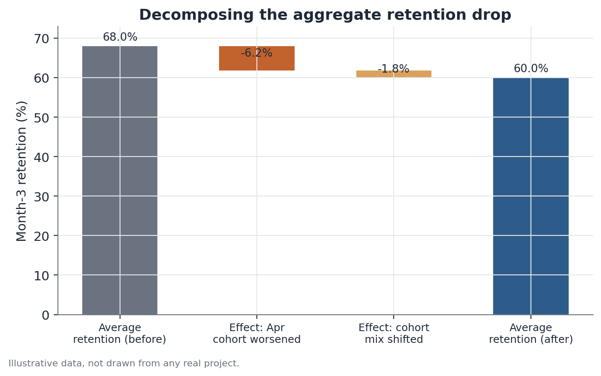

# Cohort and retention decomposition

## Concept

An aggregate retention metric — computed over the whole customer base in a
given month — blends together two axes of variation that need to be
separated for a correct reading: **lifecycle dynamics** (how a group of
customers' retention evolves as time passes since they joined) and
**composition dynamics** (how the share of customers at different lifecycle
stages shifts over the calendar, as the company grows or slows down
acquisition).

Cohort decomposition resolves that confusion by reorganizing the data around
time since joining (*tenure*) instead of calendar time. A **cohort** is the
set of customers who entered the system during the same reference period (a
month, a week). A **cohort's retention curve** is the sequence of shares of
the original cohort still active in each subsequent period. Comparing
curves from different cohorts, aligned by tenure, makes it possible to
attribute a change in the aggregate metric to three possible, non-mutually
exclusive sources: deterioration specific to one or more recent cohorts,
broad-based deterioration (a calendar event that hits every cohort
simultaneously, regardless of age), or a shift in the base's composition
(more relative weight on young cohorts, which naturally retain worse in
their first months than mature cohorts).

## Mathematical formulation

Let `N_c` be cohort `c`'s initial size (the number of customers who joined
during period `c`), and let `A_{c,t}` be the number of customers from that
cohort still active `t` periods after joining. The cohort's retention curve
is:

```
R_c(t) = A_{c,t} / N_c
```

with `R_c(0) = 1` by definition.

The aggregate retention observed at calendar period `T`, considering every
cohort that existed by `T`, is a weighted average of the individual curves,
each evaluated at a different tenure point:

```
R_aggregate(T) = Σ_c [ N_c · R_c(T − c) ] / Σ_c N_c
```

where the sum runs over every cohort `c ≤ T`, and `T − c` is cohort `c`'s
tenure at moment `T` (how much time has passed since it joined).

This formula makes the confusion mechanism explicit: `R_aggregate(T)`
changes from one calendar period to the next both because the individual
curves `R_c(·)` change (a behavior effect) and because the relative weights
`N_c` of recent versus older cohorts change (a composition effect), without
any individual curve needing to move at all.

A simple decomposition of the change in aggregate retention between two
moments (`T₀` and `T₁`) can be approximated by separating the two effects:

```
ΔR_aggregate ≈ Behavior effect + Composition effect

Behavior effect    = Σ_c w_c(T₀) · [ R_c(T₁ − c) − R_c(T₀ − c) ]
Composition effect = Σ_c [ w_c(T₁) − w_c(T₀) ] · R_c(T₁ − c)
```

where `w_c(T)` is cohort `c`'s weight in the total base at `T` (`N_c`
divided by the total active customers considered at `T`). The first term
isolates how much of the change comes from retention curves genuinely
moving; the second isolates how much comes purely from the shift in which
cohorts make up the base.



## Assumptions

- **Comparable tenure across cohorts**: the decomposition assumes "month 3
  since joining" means the same thing for every cohort — that is, the
  product or service and the onboarding process haven't changed in ways
  that invalidate comparing tenure between cohorts far apart in time.
- **Consistent definition of "active"**: the activity metric defining
  `A_{c,t}` (active subscription, login in the period, purchase in the
  period) needs to be applied identically across every cohort; a change in
  the operational definition of "active" mid-analysis contaminates the
  comparison.
- **Cohort size sufficient for statistical stability**: small cohorts
  produce retention curves with high sampling variance, especially at
  advanced tenures, where few members of the original cohort remain.
- **No differential censoring**: more recent cohorts have, by definition,
  fewer observed periods (there's no way to know the month-6 retention of a
  cohort that joined 3 months ago) — comparisons that ignore this
  censoring, comparing tenure points not yet observed for recent cohorts,
  produce invalid conclusions.

## Hypotheses

Cohort decomposition is primarily descriptive/exploratory, but it can be
formalized as a hypothesis test comparing a specific cohort's curve against
the historical average curve:

- **H0**: cohort `c`'s retention curve at a specific tenure `t` doesn't
  differ from the historical average retention of comparable cohorts at the
  same tenure (`R_c(t) = R̄(t)`).
- **H1**: `R_c(t) ≠ R̄(t)` — the cohort in question retains significantly
  differently from the historical pattern.

The test can be run as a comparison of two proportions (the cohort in
question versus the weighted historical average, or versus the immediately
preceding cohort), with a z-test for proportions or an exact test, depending
on cohort size.

## Interpretation

The decomposition's result directly steers the kind of follow-up
investigation. A behavior effect concentrated in one specific cohort points
the investigation toward what was different for whoever joined during that
period — a product change, an alteration to the billing process, an
acquisition campaign with a different audience. A behavior effect
distributed across every cohort at once, starting from a specific calendar
marker, points toward an event that hit the entire base simultaneously,
regardless of tenure — a broad price change, a widespread technical issue, a
regulatory shift. A dominant composition effect, with no meaningful change
in the individual curves, shifts attention to acquisition strategy — why the
base is younger on average — rather than to a retention problem per se.

It's important not to read a timing coincidence between a worse cohort and a
known change as proof of causation — the decomposition identifies where to
look, it doesn't confirm the cause. Confirming the cause typically requires
additional information (for example, a change tested through a controlled
experiment, or a comparison with a group unaffected by the suspected
change).

## Limitations

- The decomposition doesn't control for confounders within a cohort — if a
  specific cohort also differs in demographic makeup or acquisition channel
  from the others, part of the "cohort effect" may actually be an effect of
  those other variables, not of the joining period itself.
- Recent cohorts inherently have fewer observed tenure points — any
  comparison needs to restrict itself to tenures actually observed across
  every cohort being compared, or explicitly acknowledge the greater
  uncertainty in newer cohorts.
- The split into a behavior effect and a composition effect, as presented,
  is a first-order approximation — when changes in both components are
  large, a residual interaction term exists that the simple decomposition
  doesn't explicitly attribute to either effect.
- The analysis is observational. Even precisely identifying that a specific
  cohort worsened, and even with a coincident product change, other
  concurrent factors in the same period (seasonality, market conditions,
  competitor moves) can be alternative explanations that cohort
  decomposition alone doesn't rule out.

## Example

A hypothetical gym chain with a monthly subscription model notices aggregate
month-3 retention dropped from 58% last quarter to 52% this quarter. The
team decomposes retention by entry cohort (the month a customer
subscribed):

| Cohort | Cohort size | Month-3 retention |
|---|---|---|
| Cohort T-3 (oldest) | 1,240 | 59% |
| Cohort T-2 | 1,310 | 57% |
| Cohort T-1 | 1,180 | 58% |
| Cohort T (most recent, the drop's period) | 1,850 | 41% |

Two things stand out: first, cohort T has significantly lower retention (41%
against a historical average of roughly 58% across the three prior cohorts)
— a behavior effect concentrated in this cohort. Second, cohort T is also
considerably larger than the prior ones (1,850 versus an average of about
1,240 in earlier cohorts) — meaning it carries more weight in this
quarter's aggregate average, amplifying the impact of its lower retention on
the overall metric (an additional composition effect, though secondary to
the behavior effect here).

Investigating what specifically changed for cohort T, the team finds it
coincides with an aggressive acquisition campaign offering a first-month
discount, which brought in an audience historically less likely to continue
past the promotional period — a plausible explanation for both the lower
retention and the cohort's larger size.

## Code example

```python
import pandas as pd
import numpy as np

rng = np.random.default_rng(23)

cohorts = pd.DataFrame({
    "cohort": ["T-3", "T-2", "T-1", "T"],
    "size": [1240, 1310, 1180, 1850],
    "retention_month3": [0.59, 0.57, 0.58, 0.41],
})

# aggregate retention weighted by cohort size
aggregate_retention = np.average(cohorts["retention_month3"], weights=cohorts["size"])
print(f"Aggregate retention this quarter: {aggregate_retention:.1%}")

# counterfactual: what would aggregate retention be if cohort T had the
# average retention of prior cohorts, keeping the same size (isolates
# cohort T's own behavior effect)
historical_avg_retention = cohorts.loc[cohorts.cohort != "T", "retention_month3"].mean()
cohorts_counterfactual = cohorts.copy()
cohorts_counterfactual.loc[cohorts_counterfactual.cohort == "T", "retention_month3"] = historical_avg_retention
counterfactual_retention = np.average(
    cohorts_counterfactual["retention_month3"], weights=cohorts_counterfactual["size"]
)

cohort_t_behavior_effect = counterfactual_retention - aggregate_retention
print(f"Aggregate retention if cohort T matched history: {counterfactual_retention:.1%}")
print(f"Effect attributable to cohort T's behavior drop: {cohort_t_behavior_effect:.1%} pp")
```
