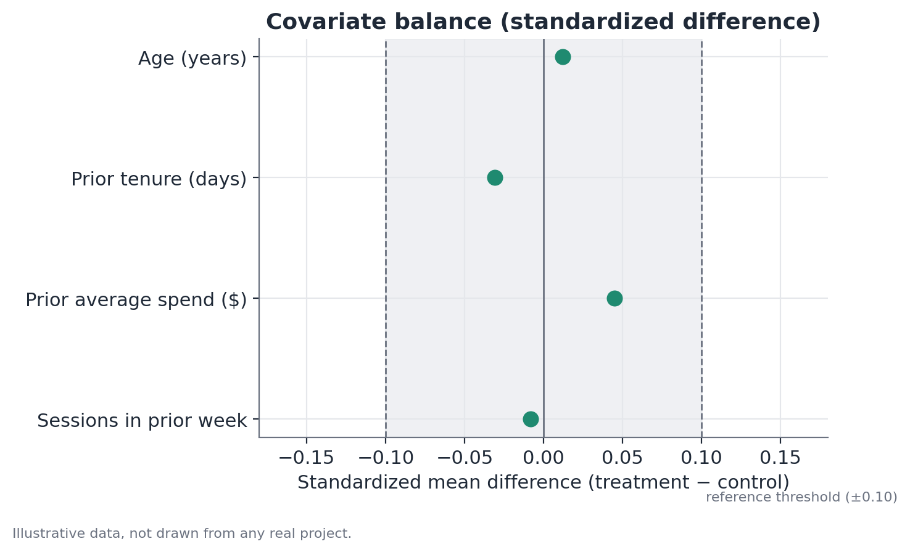
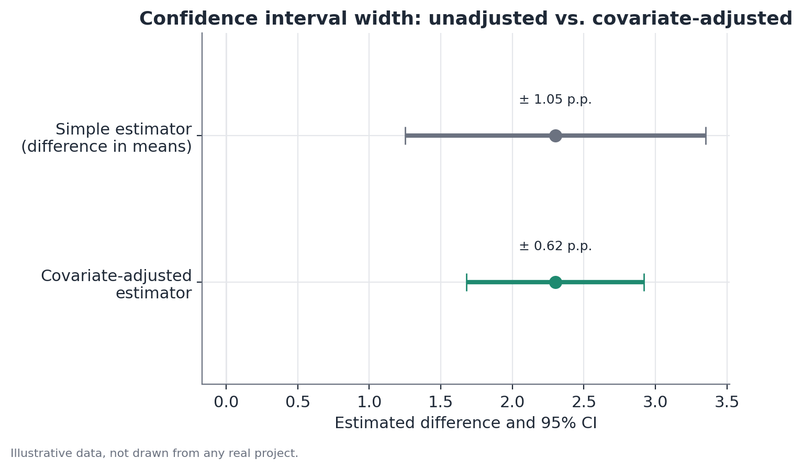

# Covariate balance and covariate adjustment

*Assumes the A/B testing fundamentals — see
[A/B testing fundamentals](./ab-testing.md).*

## Concept

This topic covers two related but conceptually distinct tools, both built on
covariates measured before an experiment starts.

**Covariate balance** is a randomization-validity check: it compares the
distribution of pre-experiment characteristics between the treatment and
control groups. Since assignment is random, those characteristics — which
have no causal relationship with the treatment, having been measured before
it even existed — should be distributed similarly across groups, up to
sampling variation. A systematic imbalance is evidence against the premise
that randomization worked as planned.

**Covariate adjustment** (which includes post-stratification and estimators
like CUPED) is a variance-reduction technique: it uses pre-experiment
covariates correlated with the metric of interest to explain part of the
between-unit variation that has nothing to do with the treatment, making the
effect estimate more precise — without changing what it estimates. It's
important not to conflate the two: balance is a diagnostic check done
(ideally) before looking at results; adjustment is an estimation technique
applied when computing the effect. Successful randomization doesn't need
adjustment to be valid; adjustment is about precision, not about fixing a
problem.

## Mathematical formulation

### Standardized mean difference (balance)

For a continuous covariate $X$, with means $\bar{x}_C$ and $\bar{x}_T$ and
standard deviations $s_C$ and $s_T$ in the control and treatment groups:

$$
SMD = \frac{\bar{x}_T - \bar{x}_C}{\sqrt{\dfrac{s_C^2 + s_T^2}{2}}}
$$

The denominator is the pooled standard deviation, which makes the SMD
independent of the covariate's original scale and comparable across
different covariates. A commonly cited reference threshold in the
causal-inference literature is $|SMD| < 0.1$ for acceptable balance, though
that value is a practical convention, not a statistically derived bound.

For a binary covariate with proportions $\hat{p}_C$ and $\hat{p}_T$:

$$
SMD = \frac{\hat{p}_T - \hat{p}_C}{\sqrt{\dfrac{\hat{p}_C(1-\hat{p}_C) + \hat{p}_T(1-\hat{p}_T)}{2}}}
$$

### Covariate-adjusted estimator (regression)

The adjusted effect is obtained by including the pre-experiment covariate
$Z$ (mean-centered, for interpretability) in a linear model:

$$
Y_i = \alpha + \tau \cdot D_i + \beta \cdot (Z_i - \bar{Z}) + \varepsilon_i
$$

where $D_i$ is the treatment indicator (1 if treatment, 0 if control),
$\tau$ is the adjusted treatment effect, and $\beta$ captures the
relationship between the covariate and the outcome. Since $D_i$ is
(approximately) independent of $Z_i$ by construction of randomization,
$\hat{\tau}$ estimates the same average effect as the simple difference in
means — but with a residual variance $\varepsilon_i$ smaller than the total
variance of $Y_i$, which shrinks $\hat{\tau}$'s standard error in proportion
to how much $Z$ explains of $Y$.

### CUPED (residual variance)

An equivalent form, popular in product experimentation, adjusts the metric
directly:

$$
Y_i^{CUPED} = Y_i - \theta \cdot (Z_i - \bar{Z}), \qquad
\theta = \frac{\text{Cov}(Y, Z)}{\text{Var}(Z)}
$$

The relative variance reduction achieved is approximately:

$$
\frac{\text{Var}(Y^{CUPED})}{\text{Var}(Y)} \approx 1 - \rho^2
$$

where $\rho$ is the correlation between the covariate $Z$ and the metric
$Y$. The more correlated the pre-experiment covariate is with the metric,
the bigger the precision gain.

## Assumptions

- **Covariates used must be strictly pre-treatment** — measured before the
  experiment started. Using a post-treatment covariate (for example, number
  of sessions *during* the experiment) introduces bias, because it may
  already have been affected by the treatment itself.
- **The choice of adjustment covariates should be specified before looking
  at results**, to avoid the bias of picking, after the fact, whichever
  covariate "improves" the desired outcome.
- **Balance is necessary, but not sufficient, for causal validity** — it
  checks observed covariates; nothing guarantees balance on unmeasured
  factors, although randomization balances those too in expectation.
- **The adjustment model should be reasonably well specified** — a highly
  non-linear relationship between the covariate and the metric, forced into
  a linear adjustment, may not capture all the available precision gain
  (though it rarely introduces bias, given that $D$ is random).

## Hypotheses

For the per-covariate balance test, the usual hypothesis test (a t-test or
proportions test on the covariate, analogous to the effect test) is:

$$
H_0: \mu_{Z,C} = \mu_{Z,T} \qquad H_1: \mu_{Z,C} \neq \mu_{Z,T}
$$

where $\mu_{Z,C}$ and $\mu_{Z,T}$ are the population means of covariate $Z$
in each group. In practice, many teams prefer to report the SMD directly
rather than a p-value — when the number of tested covariates is large, a
p-value alone has a high false-positive rate (by chance, some covariates
will "come up significant"), while the SMD gives a magnitude measure that's
comparable across covariates.

Covariate adjustment doesn't have a hypothesis of its own to test — it
modifies the estimate and standard error of the treatment-effect test, whose
hypothesis remains the one from the A/B testing fundamentals document
($H_0: \tau = 0$).

## Interpretation

A small SMD across all observed covariates is evidence that randomization
produced comparable groups along those dimensions — it reinforces, but does
not alone prove, that the subsequent effect test will have a valid causal
reading. A large SMD on a single covariate, among many tested, can just be
expected sampling variation (with $k$ covariates tested at 5% significance,
about $0.05k$ "imbalances" are expected by chance alone). The pattern worth
noticing is: several covariates imbalanced simultaneously, or a business-
critical covariate strongly imbalanced, warrant investigation — possibly
with a complementary Sample Ratio Mismatch test.

On adjustment: the point estimate of the effect, with and without
adjustment, should be very close when randomization worked (the covariate
is, in expectation, uncorrelated with the treatment). A large shift in the
point estimate when adding the adjustment covariate is itself a warning
sign about imbalance — not the expected behavior of a well-behaved variance
adjustment.

## Limitations

- Balance on observed covariates does not imply balance on unobserved
  covariates — it's evidence in favor of randomization, never complete
  proof.
- The precision gain from covariate adjustment depends entirely on how
  predictive the covariate is of the metric; weakly correlated covariates
  bring negligible gain, even when statistically valid to use.
- Choosing the adjustment covariate after seeing that it "improves" the
  result (indirect p-hacking) invalidates the interpretation of the
  resulting p-value, even though the point estimate remains unbiased.
- In designs with few units (for instance, few treated geographic regions),
  both SMD and regression adjustment can be unstable — inference methods
  more robust to small samples (randomization inference, wild-cluster
  bootstrap) become more relevant in that regime.

## Example

A subscription app tests a new pricing policy, randomizing 8,000 users to
control and 8,000 to treatment. Before looking at any results, the team
checks the balance of four pre-experiment covariates:

| Covariate | Control | Treatment | SMD |
|---|---|---|---|
| Age (years) | 34.2 | 34.3 | 0.012 |
| Prior tenure (days) | 210 | 204 | -0.031 |
| Prior average spend ($) | 42.10 | 42.80 | 0.045 |
| Sessions in prior week | 5.4 | 5.3 | -0.008 |

All four covariates have $|SMD| < 0.1$ — acceptable balance, reinforcing
that randomization worked.

The team then estimates the pricing policy's effect on revenue for the
experiment month, comparing two estimators: the simple difference in means
and an adjusted estimator using prior average spend as a covariate (which
has a correlation of roughly 0.55 with the experiment-month revenue).

| Estimator | Estimated effect | 95% CI |
|---|---|---|
| Simple difference in means | +2.3 pp | ±1.05 pp |
| Adjusted for prior spend | +2.3 pp | ±0.62 pp |

The point estimate of the effect doesn't change — as expected, since the
groups were balanced — but the confidence interval is substantially
narrower with adjustment, allowing a more precise conclusion about the
effect's magnitude without increasing the sample size.
