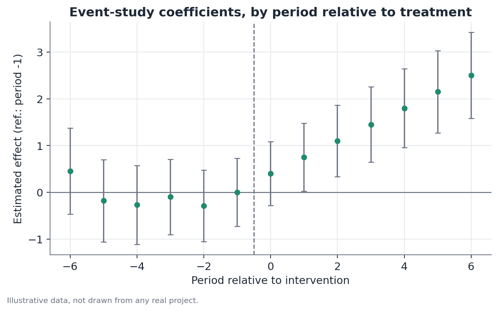

# Difference-in-Differences (DiD): Cohort Design, Event-Study, Placebo, and Parallel Trends

## Concept

Difference-in-differences (DiD) is a causal-inference design for
observational data, applicable when an intervention (law, policy, event)
affects a specific group at a known moment, while another comparable group
remains unaffected. The central idea is to use the unaffected group to
estimate what would have happened to the affected group **absent** the
intervention — the counterfactual — and attribute the gap between the
observed outcome and that counterfactual to the intervention's effect.

The design's strength comes from comparing **changes**, not levels. This
automatically wipes out any fixed difference between the groups that already
existed before the intervention (say, one group already earning more than
the other for unrelated historical reasons), and any shock that affects both
groups equally at the same time (a nationwide recession, for instance). What
remains, under the method's central assumption, is the intervention's
specific effect on the affected group.

This document covers four components of the same design, treated together
because they rarely appear in isolation in practice: the basic 2x2 DiD
design, the extension to **exposure cohorts**, the extension to
**event-study**, and the **placebo and parallel-trends** tests that support
(or fail to support) the design's validity.

## Mathematical formulation

### Basic 2x2 DiD

With two groups (treated $T$, control $C$) and two periods (pre $t=0$, post
$t=1$), the standard regression specification is:

$$y_{it} = \alpha + \beta \cdot \text{Treated}_i + \gamma \cdot \text{Post}_t + \delta \cdot (\text{Treated}_i \times \text{Post}_t) + \varepsilon_{it}$$

Where:

- $y_{it}$ is the outcome of interest for unit $i$ in period $t$;
- $\text{Treated}_i$ is a (0/1) indicator of belonging to the affected
  group;
- $\text{Post}_t$ is a (0/1) indicator of the period being after the
  intervention;
- $\alpha$ is the control group's average level in the pre period;
- $\beta$ captures the fixed difference between groups that already existed
  before the intervention;
- $\gamma$ captures the change common to both groups between the two
  periods (the background trend);
- $\delta$, the interaction coefficient, is the **DiD estimate**: the
  additional change specific to the treated group, beyond the common trend —
  the quantity of interest.

Equivalently, without regression:

$$\hat{\delta} = \left(\bar{y}_{T,\text{post}} - \bar{y}_{T,\text{pre}}\right) - \left(\bar{y}_{C,\text{post}} - \bar{y}_{C,\text{pre}}\right)$$

the difference of the two mean differences, which gives the method its name.

### Exposure cohort design

When an intervention affects people differently depending on when they were
born, entered some system, or were exposed, the cohort design replaces the
binary $\text{Treated}_i$ indicator with a set of cohort indicators
$c \in \{1, \dots, C\}$, each defined by a birth or entry window relative to
the intervention's cutoff date:

$$y_{ic} = \alpha + \sum_{c \neq c_0} \theta_c \cdot \mathbb{1}[\text{cohort}_i = c] + \mathbf{X}_i'\boldsymbol\beta + \varepsilon_i$$

Where $c_0$ is the reference cohort (typically the one closest to the cutoff
date, on the unexposed side), $\theta_c$ is the estimated effect for cohort
$c$ relative to the reference cohort, and $\mathbf{X}_i$ are observable
controls (age, region, etc.) that should not, in theory, vary systematically
across cohorts near the cutoff date — if they do, that's a sign of a design
problem (see Limitations).

### Event-study

The event-study generalizes the basic DiD to multiple periods, estimating a
separate effect for each period relative to the event date, instead of a
single aggregate coefficient:

$$y_{it} = \alpha_i + \lambda_t + \sum_{k \neq -1} \delta_k \cdot \mathbb{1}[t - t_i^* = k] \cdot \text{Treated}_i + \varepsilon_{it}$$

Where:

- $\alpha_i$ are unit fixed effects (control for fixed characteristics of
  each unit over time);
- $\lambda_t$ are period fixed effects (control for shocks common to all
  units at each moment);
- $k = t - t_i^*$ is time relative to the event (negative before, positive
  after, zero at the event period);
- period $k = -1$ (immediately before the event) is typically omitted as the
  reference — every $\delta_k$ is interpreted relative to that period;
- $\delta_k$, for $k < 0$, should be statistically indistinguishable from
  zero if the parallel-trends assumption is reasonable — these coefficients
  are themselves the visual/statistical test of parallel trends;
- $\delta_k$, for $k \geq 0$, traces the effect's trajectory over time since
  the event — revealing whether the effect is immediate, gradual, or grows
  and then stabilizes.

### Parallel trends test

There is no single, definitive test for parallel trends — standard practice
combines:

1. **Visual inspection** of the group-level mean series in the pre-event
   period.
2. A **formal joint test** that all $\delta_k$ coefficients for $k < -1$ in
   the event-study are simultaneously equal to zero (a joint F- or
   Wald-test), against the hypothesis that at least one differs from zero.
3. When applicable, a test for a **differential linear trend** in the
   pre-period: estimating whether the treated group's pre-event trend slope
   is statistically different from the control group's slope.

### Placebo test

A placebo test repeats the same design (2x2, cohort, or event-study) using a
fake "event" date, placed entirely within a period known to have had no real
policy change, or applying the treatment to a group known not to have been
affected. The statistic of interest is the estimated $\delta$ (or $\delta_k$)
coefficient under this fake assignment — under a valid design, it should be
statistically indistinguishable from zero.

## Assumptions

- **Parallel trends**: absent the intervention, the treated group would have
  followed, on average, the same trajectory as the control group. This is
  the method's central and strongest assumption — not directly observable
  for the post-event period (that's exactly the missing counterfactual), but
  partially assessable in the pre-event period.
- **No anticipation**: units do not change behavior before the event's
  official date because they already know it's coming. When anticipation is
  present (for instance, firms that adjust hiring before a law takes effect,
  knowing it's on the way), the "pre-event" period is already contaminated,
  and the event-study will often show a small nonzero effect even at
  $k = -2$ or $k = -3$.
- **SUTVA (Stable Unit Treatment Value Assumption)**: one unit's treatment
  does not affect other units' outcomes (no spillover/contamination between
  treatment and control). When the control group is indirectly affected by
  the intervention (say, a general-equilibrium effect that spreads to
  sectors not directly regulated), the estimated DiD effect is biased.
- **Stable group composition over time**: in designs using repeated
  cross-sectional data (not a panel of the same individuals), who belongs to
  each group in each period should be reasonably stable — if the treated
  group's composition changes systematically around the event (say,
  selective migration into or out of the affected group), the comparison of
  means no longer reflects the treatment effect alone.
- **No other concurrent shocks specific to the treated group**: no other
  event besides the intervention of interest should affect the treated group
  specifically (and not the control group) in the same time window.

## Hypotheses

For the coefficient of interest $\delta$ (aggregate DiD effect) or each
$\delta_k$ (event-study effect by period):

- $H_0$: $\delta = 0$ (or $\delta_k = 0$) — no effect from the intervention.
- $H_1$: $\delta \neq 0$ (or $\delta_k \neq 0$) — there is an effect.
- Test statistic: $t = \hat\delta / \widehat{SE}(\hat\delta)$, where the
  standard error should, in practice, be robust to heteroscedasticity and,
  when there are multiple observations per unit over time, clustered at the
  unit level — ignoring this clustering structure typically understates the
  true standard error and artificially inflates significance.
- Confidence interval: $\hat\delta \pm z_{1-\alpha/2} \cdot \widehat{SE}(\hat\delta)$.
- For the joint parallel-trends test: $H_0$: all $\delta_k = 0$ for
  $k < -1$; joint F- or Wald-test statistic.

## Interpretation

### A well-executed DiD gives a stronger causal reading than before/after — but it's still conditional

A simple before-and-after comparison for a single group confounds the
intervention's effect with anything else that changed over time. DiD removes
the trend common to both groups, better isolating the effect specific to the
treated group. That's a real improvement in causal credibility — but the
result is still conditional on the parallel-trends assumption being valid.
DiD is not a substitute for a randomized experiment; it's an approximation,
whose quality depends entirely on how reasonable the central assumption is
in the specific context.

### "Parallel trends holding up" reflects insufficient power, not proof

This is the most important — and most frequently misunderstood —
interpretive point: when the joint pre-period parallel-trends test **fails
to reject** the hypothesis that all $\delta_k$ ($k < -1$) are zero, this is
often read as "the parallel-trends assumption was confirmed." That reading
is statistically incorrect. Failing to reject $H_0$ only means the data
doesn't provide enough evidence **against** the assumption — which can
happen both because the assumption is genuinely reasonable, and because the
test has low statistical power (few pre-event periods, small sample, noisy
metric). A low-power test fails to reject almost anything. The correct way
to phrase this is: "the pre-event data does not contradict the
parallel-trends assumption" — never "the assumption was confirmed" or
"proven."

### Distinguishing association from causation

The coefficient $\delta$ is, technically, always an estimate of association
conditional on a specific design. It earns a causal reading to the extent
that the assumptions above (especially parallel trends and no anticipation)
are plausible in context. The robustness of that reading increases when:
(a) placebo tests show no spurious effect; (b) the event-study shows a
pattern of flat pre-trends followed by a visible shift starting at the event
period; and (c) the result is stable across different specifications of the
control group and analysis window. None of these points, alone or combined,
constitutes definitive proof — they constitute cumulative evidence.

## Limitations

- **Sensitivity to the choice of control group.** Different control groups
  (all "reasonable" at first glance) can produce substantially different
  effect estimates. It's good practice to report robustness of the result
  to more than one control-group definition.
- **Staggered adoption with heterogeneous effects.** When different units
  are treated at different times (staggered policy adoption, for instance)
  and the treatment effect varies over time or across units, the classic
  two-way fixed-effects specification (unit + period) can produce biased
  estimates, including the wrong sign, because already-treated units end up
  serving as an implicit "control" for units treated later. More recent
  estimators designed specifically for this scenario (Callaway-Sant'Anna,
  Sun-Abraham, among others) avoid this problem.
- **Placebo tests do not cover every threat to validity.** A "clean" placebo
  (no spurious effect at a fake date) increases confidence in the design,
  but does not rule out, for instance, a concurrent shock that specifically
  affected the treated group at the real event date.
- **Limited statistical power is common and underappreciated.** With few
  groups (few regions, few sectors) or short series, even a real effect of
  meaningful magnitude may go undetected — the absence of significance
  should not automatically be read as "there is no effect."
- **Inadequate standard errors are a common mistake.** Ignoring the temporal
  clustering structure within the same unit (not using cluster-robust
  standard errors) is one of the most frequent ways significance gets
  artificially inflated in DiD applications.

## Example

Consider a hypothetical study of a subsidy policy for vocational training
courses, implemented in a set of municipalities starting in a specific year,
while comparable neighboring municipalities did not receive the subsidy.

### Basic 2x2 design

The completion rate for technical courses (%) in both groups of
municipalities, in the year immediately before and immediately after the
subsidy's introduction:

| | Pre-subsidy | Post-subsidy | Change |
|---|---|---|---|
| Subsidized municipalities | 40% | 61% | +21 p.p. |
| Non-subsidized municipalities | 40% | 47% | +7 p.p. |

DiD estimate: $\hat\delta = 21 - 7 = 14$ percentage points attributable to
the subsidy, above the trend already shared by both groups.

### Cohort design

Suppose the subsidy, in practice, only applied to people who entered the
technical-education system from a cutoff date onward. Comparing entry
cohorts one year before and one year after the cutoff, controlling for age
and region, the estimated effect for the cohort immediately after the
cutoff is +9 percentage points in the completion rate, relative to the
cohort immediately before — somewhat smaller than the aggregate 2x2
estimate, which is expected, since the cohort design better isolates who was
actually exposed to the subsidy from the start of their course.

### Event-study

Extending the analysis to five years before and five years after the
subsidy's introduction, the $\delta_k$ coefficients relative to the
immediately preceding year ($k=-1$) show: in years $k = -5$ through $k = -2$,
small coefficients (between -1 and +1.5 percentage points) that are
statistically indistinguishable from zero — consistent with (not the same as
"proof of") parallel trends in the pre-period. From $k = 0$ onward, the
coefficients rise progressively: +6 p.p. in the event year, +11 p.p. one
year later, +14 p.p. two years later, stabilizing near that level — a
growing-then-stabilizing effect pattern, more informative than the single
aggregate number from the 2x2 design.

### Placebo test

Repeating the same 2x2 design, but using as a "fake" event date a year three
years before the real subsidy introduction (a period in which no policy
change occurred), the placebo "effect" estimate is +0.8 percentage points,
with a p-value of 0.71 — not significant, as expected under a valid design.
This result reinforces (without definitively proving) the credibility of the
main estimate.

```python
import pandas as pd
import statsmodels.formula.api as smf

# basic 2x2 design
model_2x2 = smf.ols(
    "completion_rate ~ subsidy * post", data=data
).fit(cov_type="cluster", cov_kwds={"groups": data["municipality"]})
print(model_2x2.params["subsidy:post"])

# event-study: build time-relative-to-event indicators,
# omitting k = -1 as the reference
data["relative_time"] = data["year"] - data["event_year"]
dummies = pd.get_dummies(data["relative_time"], prefix="k").drop(columns=["k_-1"])
data_es = pd.concat([data, dummies], axis=1)
terms = " + ".join([f"subsidy:{c}" for c in dummies.columns])
model_es = smf.ols(
    f"completion_rate ~ C(municipality) + C(year) + {terms}", data=data_es
).fit(cov_type="cluster", cov_kwds={"groups": data_es["municipality"]})
```


