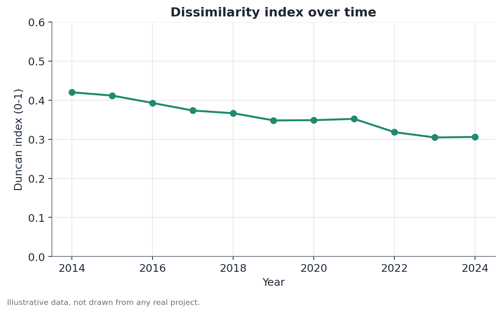

# Duncan Dissimilarity Index

## Concept

The Duncan dissimilarity index (Duncan & Duncan, 1955) quantifies how much
two percentage distributions — for two population groups spread across the
same set of categories — differ from each other. It's the classical
segregation measure: occupational, residential, educational, or any other
discrete categorization where it makes sense to ask "do the two groups occupy
the same categories, in the same proportions?"

The core intuition is geometric: if you draw the two distributions as
overlapping bars, the index measures the non-overlapping area, divided by
two. Equivalently, it's the minimum fraction of one group that would need to
be reallocated across categories for the two distributions to match exactly.

The index belongs to a broader family of segregation measures (alongside the
isolation index, the exposure index, and more recent multigroup segregation
indices), but it remains the most widely used because of its simple
calculation and direct interpretation.

## Mathematical formulation

Let two populations, A and B, be distributed across a set of $K$ mutually
exclusive categories. For each category $i = 1, \dots, K$, define:

- $a_i$ = the share of population A in category $i$ (sums to 1 across all
  categories)
- $b_i$ = the share of population B in category $i$ (sums to 1 across all
  categories)

The dissimilarity index is:

$$D = \frac{1}{2} \sum_{i=1}^{K} \left| a_i - b_i \right|$$

Where:

- $|a_i - b_i|$ is the absolute share difference in category $i$;
- the sum accumulates this difference across all $K$ categories;
- the $\frac{1}{2}$ factor normalizes the index to the $[0, 1]$ range —
  without it, the sum of absolute differences would range from 0 to 2,
  because every point of "excess" for A in one category corresponds to a
  point of "deficit" for A (excess for B) in another, counted twice across
  the sum.

$D = 0$ occurs when $a_i = b_i$ for every category $i$ — the two
distributions are identical. $D = 1$ occurs when, for every category where
$a_i > 0$, $b_i = 0$ holds and vice versa — the two populations never share a
category.

An equivalent reading, useful in practice: $D$ is also the maximum, over any
subset of categories $S$, of the difference between the share of A and the
share of B contained in $S$:

$$D = \max_{S \subseteq \{1,\dots,K\}} \left| \sum_{i \in S} a_i - \sum_{i \in S} b_i \right|$$

This alternative formulation clarifies the "minimum fraction to reallocate"
interpretation: $D$ is exactly the share of one group that is "in excess" in
the worst possible subset of categories.

## Assumptions

The Duncan index is not a hypothesis test — it's a descriptive statistic —
but using it correctly depends on a few conditions:

- **Mutually exclusive, collectively exhaustive categories**: every
  observation belongs to exactly one category. Overlapping categories break
  the index's logic.
- **Stable classification across the groups compared**: comparing indices
  computed with different categorization schemes (say, a 6-category
  occupational classification versus a 20-category one) is not valid — $D$
  tends to rise mechanically with the number of categories, simply because
  there are more opportunities for a difference to show up.
- **Sufficient sample within each category, for each group**: with few
  observations, the shares $a_i$ and $b_i$ are estimated with considerable
  noise, and the index inherits that instability. A bootstrap confidence
  interval (resampling individuals within each group, recomputing $D$ on
  each resample) is the most direct way to quantify this uncertainty, since
  the exact sampling distribution of $D$ has no simple closed form.
- **Independence within the sampling design**: if the data come from a
  complex design (stratified, clustered, with sampling weights), the shares
  $a_i$ and $b_i$ should be computed using the correct weights — ignoring
  the sampling design produces biased shares (and therefore a biased $D$).

## Hypotheses

The index itself does not come with a formal hypothesis test — it is
possible, however, to informally test whether $D$ is "larger than expected
by chance" by comparing it to the distribution of $D$ obtained by randomly
shuffling category assignment between individuals from the two groups (a
permutation test). In that case:

- $H_0$: the category an individual occupies does not depend on which group
  they belong to (under $H_0$, the two populations would be samples from the
  same categorical distribution).
- $H_1$: there is an association between group and category.
- Test statistic: the observed $D$ itself.
- p-value: the fraction of permutations in which the simulated $D$ is at
  least as large as the observed $D$.

In practice, with large samples (like national household surveys), the
permutation test will almost always reject $H_0$ even for small values of
$D$ — which reinforces that the relevant question isn't "is segregation
statistically detectable?" but "how much segregation is there, and is it
large enough to matter in practice?"

## Interpretation

$D$ answers a purely descriptive question: **how unequal is the distribution
of two groups across categories**. It does not tell you:

- **Why** that distribution exists. A high $D$ is consistent with access
  barriers, real and unobserved differences in qualifications between the
  groups, distinct voluntary preferences, accumulated historical
  discrimination, or any combination of these causes — the index does not
  separate one explanation from another.
- **Whether segregation is rising or falling in a causal sense.** A drop in
  $D$ over time is consistent with genuine integration, but it can also
  reflect changes in the category classification itself or in the
  composition of the workforce.
- **Which group is better off.** $D$ has no sign — it measures distance, not
  direction. To know which group is concentrated in the better-paid or
  higher-prestige categories, you need to look directly at the table of
  category shares, not just the aggregate index.

A recommended practice is to always report $D$ alongside the table of
category shares (or, at minimum, highlight the categories that contribute
most to the difference) — the index alone compresses too much information
to carry a complete narrative on its own.

## Limitations

- **Sensitivity to category granularity.** As mentioned, $D$ tends to grow
  mechanically with the number of categories. Comparisons across studies or
  countries are only valid if the category classification is equivalent.
- **Does not incorporate ordering or distance between categories.** Two
  "close" categories (say, two adjacent salary bands) count the same as two
  "distant" categories (the lowest and the highest band). When ordering
  matters, alternative measures (such as vertical segregation indices, or a
  Theil decomposition applied by category) can be more informative.
- **Not simply decomposable across subgroups or over time**, the way the
  Theil index is for inequality — comparing $D$ across subpopulations or
  years requires recomputing the index for each cut, and there is no direct
  way to attribute the total change to specific factors.
- **Estimation under complex sampling weights requires care.** Standard
  errors for $D$ under complex sampling designs have no simple closed form;
  bootstrap or replicate-weight methods (repeated jackknife, balanced
  repeated replication) are the standard approaches.

## Example

Consider a hypothetical study comparing the distribution of technology
professionals at a mid-sized company, split by gender, across six seniority
levels: Intern, Junior, Mid-level, Senior, Staff, and Technical Lead.

Suppose the following observed shares:

| Level | % Group A | % Group B |
|---|---|---|
| Intern | 8% | 14% |
| Junior | 22% | 30% |
| Mid-level | 30% | 28% |
| Senior | 24% | 18% |
| Staff | 11% | 7% |
| Technical Lead | 5% | 3% |

Computing the absolute differences by level: 6, 8, 2, 6, 4, 2. The sum is 28.
Dividing by two, $D = 14$, or 0.14 on a 0-to-1 scale.

Interpretation: about 14% of one group would need to change seniority level
for the two distributions to coincide. Looking at the table, it's clear that
most of this difference comes from the entry end (Intern and Junior, where
Group B is overrepresented) and the top end (Senior and above, where Group A
is overrepresented) — a pattern consistent with a "narrowing pipeline"
hypothesis for career progression, but one the index alone does not confirm
or explain. Investigating whether this pattern is causal (say, tied to a
specific promotion barrier) would require a complementary design — such as a
survival analysis of time-to-promotion, controlling for tenure and
performance ratings — which is outside the scope of the dissimilarity index.

A simple permutation test, randomly shuffling seniority-level assignment 500
times between employees of the two groups (holding group sizes fixed), would
in this hypothetical example produce a very low p-value — confirming that
this observed distribution would be rare under the hypothesis that gender
and level are independent, but, as always, that does not substitute for an
investigation of causes.

```python
import numpy as np
import pandas as pd

levels = ["intern", "junior", "mid", "senior", "staff", "lead"]
share_a = np.array([0.08, 0.22, 0.30, 0.24, 0.11, 0.05])
share_b = np.array([0.14, 0.30, 0.28, 0.18, 0.07, 0.03])

D = 0.5 * np.sum(np.abs(share_a - share_b))
print(f"Duncan index: {D:.3f}")

# permutation test (sketch): shuffle level assignment
# among simulated individuals from both groups, recompute D,
# compare against the observed D to get an empirical p-value.
```


