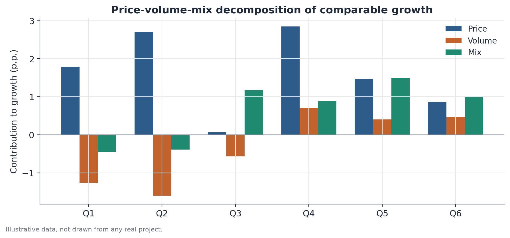

# Growth decomposition: total, comparable, and price-volume-mix

## Concept

Growth decomposition is an accounting-analytical technique (not a statistical model with inferential uncertainty) that rewrites the change in an aggregate metric — typically revenue — as the sum of mutually exclusive, exhaustive components, each answering a well-defined partial causal question: "how much of the growth came from X, holding everything else constant?"

The decomposition happens in two chained levels:

**Level 1 — Total vs. comparable.** Split the units of analysis (stores, regions, product lines, customer accounts) into two populations: those present in both compared periods ("comparable," *like-for-like*) and those that only exist in the more recent period (new openings, market entry, new SKUs). Total growth is always the sum of comparable-unit growth plus the revenue brought in by new units.

**Level 2 — Price, volume, and mix, within the comparable base.** Within the comparable population, the revenue change is rewritten as average price times quantity sold, aggregated by item or category. Change in that product can come from three sources: the unit price of each item changed (**price effect**); total quantity sold changed while the mix of items stayed the same (**volume effect**); or the composition of items sold changed — for example, higher-ticket items gaining share (**mix effect**).

The underlying logic is the same as any accounting decomposition (structural decomposition analysis, shift-share analysis): hold every factor but one fixed, measure that factor's marginal effect, repeat for the rest, and ensure the sum reconciles exactly to the observed total — with no unexplained residual, except where the chosen calculation convention deliberately assigns interaction terms to the mix component.

## Mathematical formulation

Let $R_t = \sum_i p_{i,t} \, q_{i,t}$ be revenue in period $t$, summed over items or categories $i$, where $p_{i,t}$ is the average price of item $i$ in period $t$ and $q_{i,t}$ is the quantity sold.

**Total vs. comparable split.** Let $C$ be the set of comparable units (present in both periods $t-1$ and $t$) and $N$ the set of new units (present only in $t$). Then:

$$
\underbrace{R_t - R_{t-1}}_{\text{total growth}} \;=\; \underbrace{\Big(\sum_{i \in C} p_{i,t} q_{i,t} - \sum_{i \in C} p_{i,t-1} q_{i,t-1}\Big)}_{\text{comparable growth } \Delta R_C} \;+\; \underbrace{\sum_{i \in N} p_{i,t} q_{i,t}}_{\text{revenue from new units}}
$$

There is no separately signed "discontinued units" term in this formulation because, by convention, they are implicitly captured inside $\Delta R_C$ when $q_{i,t}=0$ for items dropped within the comparable set itself; in practice, discontinuations are often treated as an explicit fourth category when relevant.

**Price-volume-mix decomposition, inside $\Delta R_C$.** Using the sequential substitution method (one of the most common conventions, equivalent to a modified Laspeyres index):

$$
\text{Volume Effect} = \Big(\sum_{i \in C} q_{i,t}\Big) - \Big(\sum_{i \in C} q_{i,t-1}\Big) \;\times\; \bar p_{t-1}
$$

$$
\text{Price Effect} = \big(\bar p_t - \bar p_{t-1}\big) \;\times\; \Big(\sum_{i \in C} q_{i,t}\Big)
$$

$$
\text{Mix Effect} = \Delta R_C - \text{Volume Effect} - \text{Price Effect}
$$

where $\bar p_t = R_{C,t} / \sum_{i\in C} q_{i,t}$ is the quantity-weighted average price of period $t$ in the comparable population. The volume effect isolates what would have happened to revenue if only total quantity had changed, at the prior period's average price. The price effect isolates what would have happened if only average price had changed, applied to the current period's quantity. The mix effect is defined as a residual: the part of the revenue change explained by neither average price nor total volume — i.e., a shift in the composition of items sold, including higher-ticket items gaining share.

This is not the only possible convention: alternative methods (e.g., symmetric decomposition, or computing each effect at the midpoint between the two periods) distribute the price×volume interaction differently across the three components. The total, however, is invariant to the convention chosen.

## Assumptions

- **Consistent granularity.** Price-volume-mix decomposition requires item/SKU/category-level data — it cannot be computed on aggregate revenue without a matching quantity; without separate unit price and quantity, only total-vs-comparable can be computed.
- **Stable definition of "comparable."** Classifying a unit as comparable depends on a time-cutoff rule (e.g., a store open for 12+ full months) applied consistently across periods — changing the rule midway through a historical series breaks comparability between quarters.
- **No structural change in the unit of measurement.** If the quantity unit changes (e.g., the business switches to selling larger packs), the computed volume effect mixes real volume with packaging change — the unit needs to be normalized before decomposing.
- **Stable composition within each item.** The mix effect assumes "item $i$" means the same thing in both periods; if a SKU is redefined (new recipe, new size) partway through, the decomposition will attribute the product's characteristic change to the wrong component.

## Hypotheses

This method is accounting-based, not inferential — there is no null hypothesis, test statistic, or confidence interval built into the decomposition itself. The components (price, volume, mix, new units) are algebraic identities computed from observed data, not estimates with sampling error.

That said, it is common — and recommended — to pair the decomposition with inference when applicable: for example, testing whether the volume effect is significantly different from zero across several units (stores, regions) using a t-test or a random-effects model over the distribution of per-unit volume effects, especially when the goal is to generalize the conclusion beyond the observed set of stores.

## Interpretation

The decomposition lets you state precisely where each dollar of growth came from — not why it happened. A negative volume effect says fewer units were sold at the same comparable stores; it does not say whether that was caused by customer churn, a new competitor, stockouts, or a deliberate decision to cut back on promotions. The decomposition is diagnostic, not causal — it points the investigation toward the right question (why did volume fall?), but it does not answer it.

It's also important not to confuse a high percentage growth with a meaningful absolute one: a +2 percentage-point mix effect on a small base can represent fewer dollars than a +0.5 percentage-point volume effect on a large base. Always report absolute values alongside percentages.

## Limitations

- **Sensitivity to the calculation convention.** As shown in the mathematical formulation, the exact value of each component (especially mix) depends on the convention chosen for handling the price×volume interaction. Reports using different conventions are not directly comparable component by component, even when the totals reconcile.
- **Mix as an "error-catching" residual.** Because it is computed as a residual, the mix effect absorbs any measurement error in price or quantity (e.g., discounts not captured correctly, misclassified returns). An unusually large mix effect is often a sign of a data-quality problem, not a genuine change in sales composition.
- **Does not capture causality or a true counterfactual.** "What would have happened if only price had changed" is an accounting question — it assumes quantity sold would have stayed the same regardless of the price change, which ignores price elasticity of demand. Under stricter scrutiny, the price and volume components are interdependent in practice, even though they are computed as if independent.
- **The definition of "comparable" is a choice, not a given fact.** Different comparability windows produce different comparable-growth figures from the same underlying raw data.

## Example

Consider a hypothetical coffee-shop chain with three stores open for over a year (A, B, C) and one new store opened during the period (D), selling two products: coffee (low ticket, high volume) and a coffee+pastry combo (higher ticket, lower volume).

| Store | Comparable | Prior-year revenue | Current-year revenue | Prior-year units | Current-year units |
|---|---|---|---|---|---|
| A | Yes | $12.0M | $12.8M | 2,400 | 2,280 |
| B | Yes | $15.0M | $14.1M | 3,000 | 2,820 |
| C | Yes | $18.0M | $19.7M | 3,600 | 3,760 |
| D | No | — | $3.6M | — | 720 |

**Step 1 — total vs. comparable.** Total revenue: $45.0M → $50.2M, a $5.2M increase. Revenue from new stores (D): $3.6M. Comparable growth: $5.2M − $3.6M = **$1.6M**.

**Step 2 — comparable average price.** Total comparable quantity: 9,000 units (prior year) → 8,860 units (current year). Average price: $45.0M / 9,000 = $5,000/unit (prior year) → $46.6M / 8,860 ≈ $5,259/unit (current year).

**Step 3 — effects.**
- Volume effect: (8,860 − 9,000) × $5,000 = −$0.70M
- Price effect: ($5,259 − $5,000) × 8,860 ≈ +$2.29M
- Mix effect: $1.6M − (−$0.70M) − $2.29M ≈ −$0.01M (rounding; close to zero in this simplified example)

**Reading:** comparable growth of $1.6M is positive only because of a strong price effect (+$2.29M), which more than offsets a real volume decline (−$0.70M) at comparable stores. A near-zero mix effect indicates the split between coffee and combo did not change meaningfully. This pattern — price offsetting volume — is exactly the kind of signal a headline "+11.6% total growth" figure would hide on its own, and it justifies an investigation into price elasticity and possible traffic loss at existing stores.

