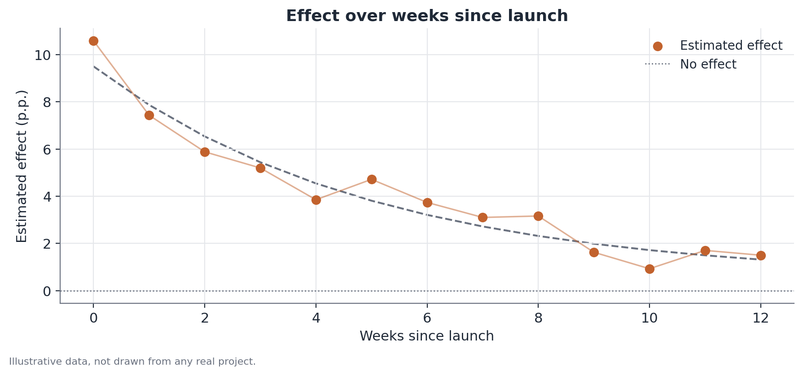

# Heterogeneity testing and novelty-effect decay

## Concept

An experiment summarized in a single average-effect estimate answers only
"is the effect, on average, different from zero?" Two additional questions,
often relevant in practice, fall outside that single number:

- **Effect heterogeneity (interaction):** is the treatment effect constant
  across subgroups of the population, or does it vary systematically with
  some observable characteristic (loyalty tier, acquisition channel, device
  type, region)? This is a question about variation **across units**,
  measured at a given point in time.
- **Novelty-effect decay:** does the effect of a change stay stable over
  time since launch, or does part of it reflect a transient curiosity
  reaction (a "novelty effect," in the broad sense of the Hawthorne
  literature) that fades once the change stops being new? This is a question
  about variation **over time**, measured within the same group.

The two questions are conceptually distinct and should be tested separately,
even though they often show up together in practice: an effect can be
homogeneous across subgroups and still decay; it can be heterogeneous and
stable; it can be both at once, or neither.

## Mathematical formulation

### Interaction test (heterogeneity)

Let $Y_i$ be the outcome of interest for unit $i$, $T_i \in \{0,1\}$ the
treatment indicator, and $S_i$ a subgroup indicator (for simplicity, binary:
$S_i = 1$ for the subgroup of interest, $S_i = 0$ for the reference
subgroup). The interaction model is:

$$
Y_i = \beta_0 + \beta_1 T_i + \beta_2 S_i + \beta_3 (T_i \times S_i) + \varepsilon_i
$$

where:

- $\beta_1$ is the treatment effect in the reference subgroup ($S_i = 0$);
- $\beta_2$ captures the baseline-level difference between subgroups,
  independent of treatment;
- $\beta_3$ is the **interaction coefficient** — the difference in treatment
  effect between the subgroup of interest and the reference subgroup. It is
  the central parameter of the heterogeneity test;
- $\varepsilon_i$ is the error term, subject to the usual care around
  heteroskedasticity and, when relevant, within-cluster correlation (see the
  document on cluster-robust standard errors).

The heterogeneity test is the standard hypothesis test on $\beta_3$:
$H_0: \beta_3 = 0$ against $H_1: \beta_3 \neq 0$, using the statistic
$t = \hat\beta_3 / \widehat{SE}(\hat\beta_3)$.

With more than two subgroups, this generalizes to a categorical variable
$S_i$ with $K$ categories, producing $K-1$ interaction terms (one per
category, against the reference category), and the joint heterogeneity test
becomes an F-test on all $K-1$ interaction coefficients simultaneously:

$$
H_0: \beta_3^{(1)} = \beta_3^{(2)} = \dots = \beta_3^{(K-1)} = 0
$$

### Novelty-effect decay

Let $w = 1, \dots, W$ index the time window (for example, week) since
launch. For each window, estimate the treatment effect $\hat\tau_w$
separately, with its standard error, using only the observations from that
window:

$$
Y_{i,w} = \alpha_w + \tau_w T_i + \varepsilon_{i,w}, \quad w = 1, \dots, W
$$

The object of interest becomes the sequence $\{\hat\tau_1, \hat\tau_2,
\dots, \hat\tau_W\}$. A direct way to test decay is to regress that sequence
of estimates on $w$:

$$
\hat\tau_w = \gamma_0 + \gamma_1 w + u_w
$$

with $\gamma_1 < 0$ and statistically significant as evidence of decay. A
more robust alternative, when the number of windows allows it, is to
estimate a single model directly with a treatment × continuous-time
interaction, analogous to the interaction term above, treating time since
launch as the subgroup variable.

## Assumptions

- **Subgroups defined before looking at the effect data.** The interaction
  test presumes the compared subgroups were defined by a reasonable
  criterion and, ideally, specified before running the experiment — not
  chosen after trawling through which cuts "look like" they have a larger
  effect.
- **Correctly specified errors.** As in any regression, valid inference on
  $\beta_3$ depends on standard errors suited to the data's dependence
  structure (for example, robust to heteroskedasticity, or clustered when
  observations are not independent within a group).
- **Stable composition over time (decay).** Comparing $\hat\tau_w$ across
  windows assumes the population composition in each window is comparable —
  if very different users enter the experiment in different weeks (for
  example, because of an acquisition campaign), part of the observed
  variation in $\hat\tau_w$ may reflect a composition shift, not genuine
  decay of the effect on the same type of user.
- **Sufficient sample per subgroup and per window.** Splitting the data into
  subgroups or time windows shrinks the sample size in each cell, inflating
  standard errors — a heterogeneity test without enough statistical power
  simply fails to detect real differences.

## Hypotheses

**Interaction test:**

- $H_0$: $\beta_3 = 0$ — the treatment effect is equal across the compared
  subgroups.
- $H_1$: $\beta_3 \neq 0$ — the effect differs across subgroups.
- Test statistic: $t = \hat\beta_3 / \widehat{SE}(\hat\beta_3)$, compared to
  the t distribution (or normal, in large samples) under $H_0$.
- Conventional significance level: 5%, but see the limitations section on
  multiple comparisons when several subgroups are tested.

**Decay test:**

- $H_0$: $\gamma_1 = 0$ — there is no downward trend in the effect across
  time windows.
- $H_1$: $\gamma_1 < 0$ (one-sided test, if the question is specifically
  about decay) or $\gamma_1 \neq 0$ (two-sided test, if any pattern change
  matters).
- A 95% confidence interval for $\hat\tau_w$ in each window lets you see
  directly whether the trajectory of estimates is consistent with a constant
  effect (all bands overlap) or a systematic decline.

## Interpretation

A significant interaction coefficient says the effect **differs** across the
tested subgroups — it does not automatically say which subgroup is "better"
in absolute terms, nor why the difference exists. A larger effect in one
subgroup could reflect genuinely greater sensitivity to the change, or
simply a lower baseline with more room to improve.

Detecting novelty decay does not mean the product "doesn't work" — it means
the long-run effect magnitude is smaller than the initial measurement
suggested. Ideally, the launch decision should rely on the stabilized effect
(later windows), not the peak effect (earliest windows), when the goal is to
understand the sustainable gain.

Neither analysis, on its own, establishes any additional causal claim beyond
what the original experiment's randomization already guarantees — they
merely decompose an already-identified average causal effect into how it is
distributed across groups and over time.

## Limitations

- **Multiple comparisons.** Testing heterogeneity across several subgroups
  simultaneously (by tier, channel, device, region, and so on) inflates the
  false-positive rate. Testing 10 independent subgroups at 5% significance,
  the probability of at least one "significant" result by pure chance, even
  with no real heterogeneity, exceeds 40%. Corrections such as Bonferroni,
  or requiring replication in a follow-up experiment, mitigate this risk. A
  subgroup defined *a priori*, with a clear theoretical rationale, is always
  more trustworthy than one discovered by exploring the data after the
  fact.
- **Reduced statistical power in small subgroups.** Splitting the sample
  increases the standard error of each subgroup estimate — a lack of
  significance in a small subgroup may simply reflect insufficient sample,
  not the absence of an effect.
- **Confounding composition with genuine decay.** Changes in the population
  composition across weeks (seasonality, acquisition campaigns, calendar
  effects) can produce a trajectory that looks like decay without the
  effect, for the same user, actually having fallen.
- **Time windows too short to conclude stabilization.** Observing decay in
  the first few weeks does not guarantee the effect goes to zero — it may
  stabilize at a smaller positive level. Extrapolating the trend beyond the
  observed period is speculative.

## Example

Consider a brokerage app testing a new portfolio-summary screen, aiming to
increase weekly logins. The average estimated effect, across the full base,
is +6.0% relative to control, with a standard error of 1.2 (statistically
significant).

**Heterogeneity by investor profile.** Splitting by account tenure:

| Subgroup | Estimated effect | Standard error |
|---|---|---|
| Accounts under 6 months | +11.4% | 2.0 |
| Accounts 6 months or older | +2.1% | 1.4 |

The difference between the two effects is 9.3 percentage points. The
standard error of the difference, combining the two standard errors under
independence, $\sqrt{2.0^2 + 1.4^2} \approx 2.44$, gives a statistic
$t \approx 3.8$ — well above the usual significance threshold. There is
solid evidence of heterogeneity: new accounts respond much more strongly to
the change than established ones, a plausible pattern, since new users are
still forming usage habits.

**Novelty decay.** Looking at the aggregate effect week by week since
launch:

| Week | Estimated effect |
|---|---|
| 1 | +12.8% |
| 2 | +9.4% |
| 4 | +6.7% |
| 8 | +3.9% |
| 12 | +3.5% |

The trajectory declines consistently through week 8 and then stabilizes near
3.5%. The correct reading is not "the change doesn't work" — it is that the
initial peak effect (nearly 13%) included a temporary curiosity component,
and the real sustainable gain, relevant for long-run projections, is closer
to 3.5%.

Combining both analyses: the better-informed product decision is not "roll
out to everyone with the +6% average effect," but something like "prioritize
new accounts in the rollout, and project the long-run gain using the
stabilized level of roughly +3.5% to +4%, not the initial peak."
