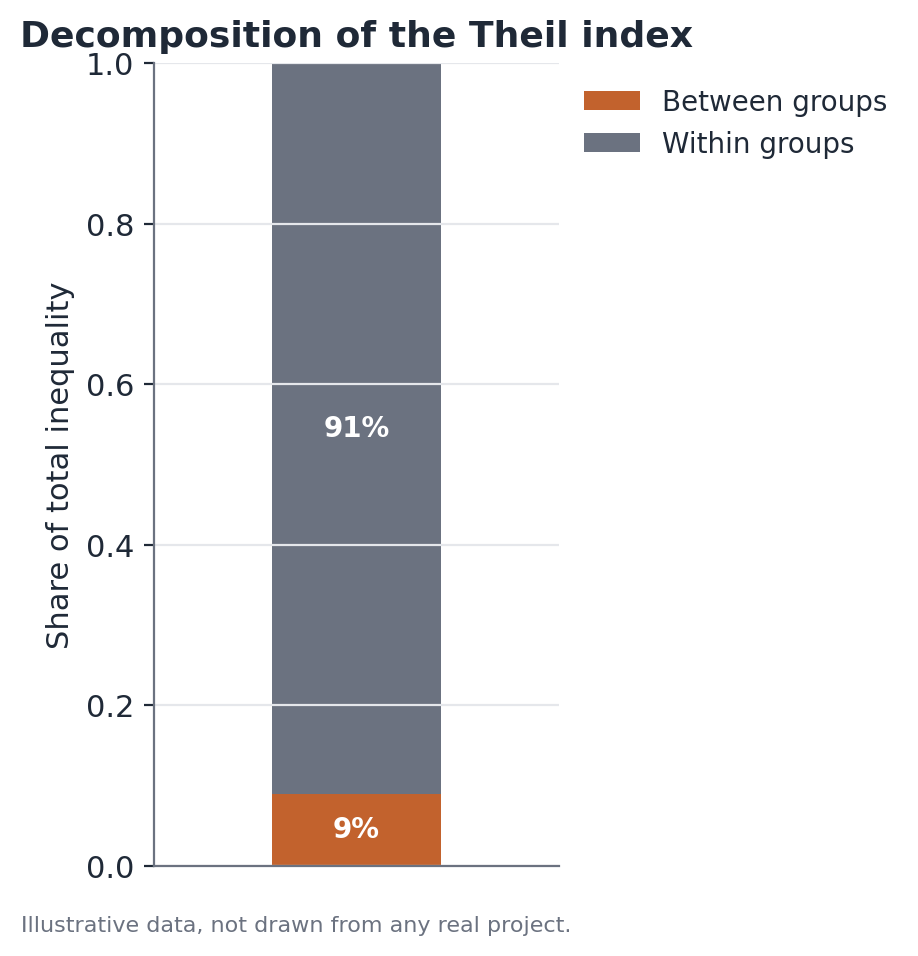
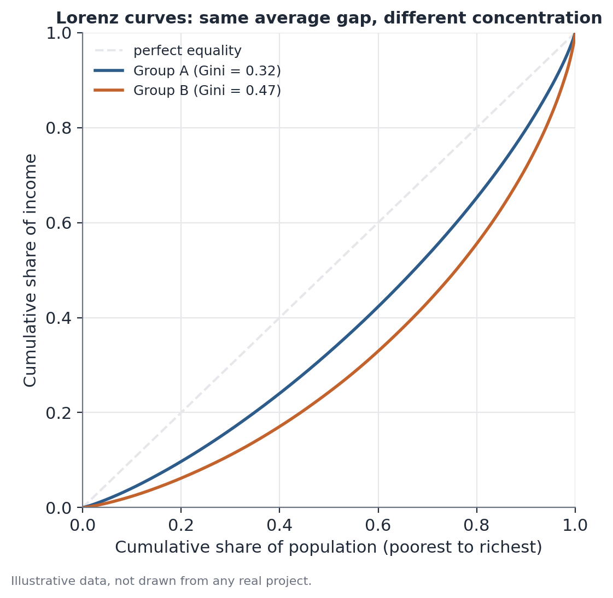

# Inequality decomposition (Theil, Gini, weighted quantiles)

## Concept

Measuring income inequality with a single number (like the mean or the
median) hides the entire shape of the distribution. This section covers
three complementary tools for characterizing inequality more completely:
the Theil index (with its property of exact decomposability into
"between-group" and "within-group" components), the Gini index (a widely
used concentration measure based on the Lorenz curve), and weighted
quantiles (estimates of distribution cutoff points — like "what defines the
richest 10%" — that account for a survey's sampling design).

The question these tools answer, together, is: where does observed
inequality come from, and how does it compare across different slices of the
population?

## Mathematical formulation

**Theil index (T index, entropy-based).** For an income variable $y_i > 0$
with mean $\bar{y}$, computed over $n$ observations:

$$
T = \frac{1}{n} \sum_{i=1}^{n} \frac{y_i}{\bar{y}} \ln\left(\frac{y_i}{\bar{y}}\right)
$$

$T = 0$ corresponds to perfect equality (everyone has the same income);
higher values indicate greater inequality. Unlike the Gini index, Theil has
no fixed upper bound of 1.

**Exact between/within decomposition.** Splitting the population into $G$
groups, each with income share $s_g$ and internal Theil $T_g$:

$$
T = \underbrace{\sum_{g=1}^{G} s_g \ln\left(\frac{\bar{y}}{\bar{y}_g}\right)}_{T_{\text{between}}} +
\underbrace{\sum_{g=1}^{G} s_g T_g}_{T_{\text{within}}}
$$

where $\bar{y}_g$ is group $g$'s average income. $T_{\text{between}}$ is the
value Theil would take if every person received their group's average
income (capturing only the difference between group means); $T_{\text{within}}$
is the weighted average of the Theil indices computed within each group,
weighted by each group's income share. The sum of the two equals exactly
the total Theil index — there's no residual term, which is the central
property that makes Theil especially useful for this kind of decomposition
(the Gini index, by comparison, only decomposes additively under special
conditions, generally leaving an extra residual overlap term between
groups).

**Gini index.** For an ordered sample $y_{(1)} \leq y_{(2)} \leq \dots \leq
y_{(n)}$:

$$
G = \frac{2\sum_{i=1}^{n} i \cdot y_{(i)} - (n+1)\sum_{i=1}^{n} y_{(i)}}{n\sum_{i=1}^{n} y_{(i)}}
$$

Geometrically, $G$ is twice the area between the Lorenz curve (which shows
the cumulative income share held by the poorest $p\%$) and the line of
perfect equality (the 45° diagonal). $G = 0$ is perfect equality; $G \to 1$
is extreme concentration.

**Weighted quantiles.** Given a set of sampling weights $w_i$ (reflecting
how many units of the population each sample observation represents, given
the sampling design), the $q$-th order quantile is the value $Q_q$ such that
the sum of weights of observations with $y_i \leq Q_q$, divided by the total
sum of weights, equals $q$. Ignoring the weights and computing a simple
sample quantile produces a biased estimate whenever the selection
probability isn't constant across observations.

## Assumptions

1. **Strictly positive values** (Theil): the T index formula requires
   $y_i > 0$ for every observation — zero or negative incomes require
   special handling (exclusion with an explicit methodological note, say, or
   using a Theil variant less sensitive to it, like the L index / mean
   logarithmic deviation).
2. **Mutually exclusive and exhaustive groups**: the Theil between/within
   decomposition assumes every observation belongs to exactly one group —
   overlapping categorizations break the exact decomposition.
3. **Representativeness of the sampling weights**: weighted quantiles and
   indices computed from survey data depend on the quality of the design
   weights (and, where applicable, post-stratification) — poorly calibrated
   weights produce biased estimates regardless of the formula used.
4. **Stability in small subgroups**: when decomposing across many groups at
   once (crossing region and race, say), some subgroups may have few
   observations, making that subgroup's $T_g$ unstable — it's worth
   reporting each subgroup's sample size.

## Hypotheses

Inequality indices like Theil and Gini don't traditionally have a single,
universally accepted hypothesis test the way a difference in means does —
but comparisons between indices (is Group A's Gini larger than Group B's?,
say) can and should be accompanied by uncertainty measures:

- Standard errors for Gini and Theil are typically obtained via bootstrap
  (resampling the data with replacement, respecting the sampling design
  where applicable, and recomputing the index at each resample).
- $H_0$: the two indices (Group A's Gini and Group B's Gini, say) are equal
  — tested by comparing the observed difference against the bootstrap
  distribution of the difference.
- For the Theil decomposition, the "between-groups" component can have its
  own confidence interval via bootstrap, but by construction it's always
  non-negative — it's worth reporting both its value in absolute Theil
  units and its share of the total.

## Interpretation

The Theil between/within decomposition contextualizes — but doesn't replace
— a direct comparison of means between groups. It's entirely possible, and
common, for a small fraction of total inequality (below 10%, say) to come
from the difference between broad groups like race or gender, even when that
difference in means is large and highly statistically significant (see
Welch's t-test and Oaxaca-Blinder). The two things aren't in competition: the
"between-groups" share speaks to the total variance of income in the
population; the average gap between groups speaks to the typical positional
difference between them. Both readings are valid and should be presented
together, not one in place of the other.

On the Gini index: comparing Gini across groups requires similar care. A
group can have a lower Gini simply because its income distribution is more
compressed near the bottom — that is, almost everyone in that group earns
relatively similar, low amounts. That isn't "more equality" in the positive
sense; it's compression within a low-income range. A lower Gini shouldn't be
read, on its own, as a "better situation" without also looking at that
group's income level (its mean or median).

## Limitations

- The Theil index, despite being exactly decomposable between and within
  groups, is sensitive to how the groups are defined — carving up the
  population differently (two broad groups vs. ten specific subgroups)
  changes the fraction attributed to "between groups."
- Neither index, on its own, says why inequality within a group is high —
  that requires further investigation (decomposition by other variables, or
  RIF decomposition across the distribution, say).
- Comparisons of Gini or Theil over time can be affected by changes in
  survey coverage, the definition of the income variable, or inflation
  adjustments — it's worth ensuring methodological comparability before
  interpreting a change as a real change in inequality.
- Weighted quantiles in small subgroups (low sample-observation counts, even
  if the population weight is large) carry more uncertainty — always check
  the sample size behind a reported quantile.

## Example

Consider a hypothetical scenario: a household survey measures income across
two regions of a country, North Region and South Region, with the following
aggregate data (invented):

- North Region: average income = 3,200, share of total income = 35%,
  internal Theil = 0.28.
- South Region: average income = 5,100, share of total income = 65%,
  internal Theil = 0.33.

**Step 1 — between-groups Theil.** Using the decomposition formula, with the
overall average income $\bar{y}$ (a weighted average by each region's income
share, coming out to about 4,430):

$$
T_{\text{between}} = 0.35 \ln\left(\frac{4,430}{3,200}\right) + 0.65 \ln\left(\frac{4,430}{5,100}\right) \approx 0.35 \times 0.325 - 0.65 \times 0.140 \approx 0.022
$$

**Step 2 — within-groups Theil:**

$$
T_{\text{within}} = 0.35 \times 0.28 + 0.65 \times 0.33 = 0.098 + 0.215 = 0.313
$$

**Step 3 — total Theil:**

$$
T = T_{\text{between}} + T_{\text{within}} = 0.022 + 0.313 = 0.335
$$

**Interpretation:** the "between-regions" share accounts for about
0.022 / 0.335 ≈ 6.6% of total inequality — even with an income difference of
nearly 60% between the two regions (3,200 vs. 5,100). The vast majority of
inequality (93.4%) sits within each region, reflecting that, within the
North Region and the South Region separately, there's already substantial
variation between low and high earners. That doesn't make the regional
difference unimportant — it's substantial and measurable — but it
contextualizes its relative weight within the country's overall inequality
picture.

The figure below illustrates this kind of decomposition, with the
"between-groups" share typically small relative to the "within-groups"
share:

The second figure shows hypothetical Lorenz curves for two groups with
different Ginis — illustrating that a lower Gini corresponds to a curve
closer to the perfect-equality diagonal, but that, on its own, says nothing
about each group's income level:

