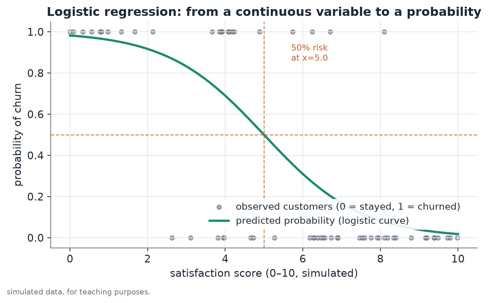
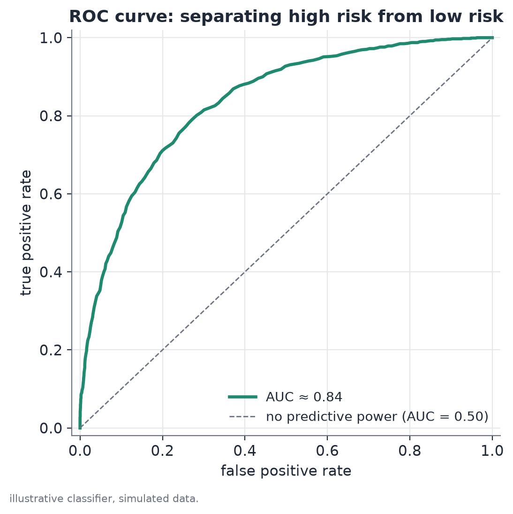

# Logistic regression

## Concept

Logistic regression is a generalized linear model (GLM) designed for binary response variables: an outcome that takes only two values, typically coded 0 (didn't happen) and 1 (happened). It's the natural model when the variable of interest violates the central assumption of an ordinary linear regression applied directly to a 0/1 outcome: a line fit by least squares can predict values outside the $[0,1]$ interval, which don't correspond to any valid probability, and the model's errors don't have constant variance (structural heteroskedasticity, a direct consequence of the outcome being binary).

The central idea is to model, not the probability $p$ directly, but its **logit** — the log odds, $\log\big(p/(1-p)\big)$ — as a linear combination of the explanatory variables. The logit can take any real value; the logistic function that converts it back into a probability guarantees the result always stays in the $(0,1)$ interval, regardless of the coefficients or the variables.

## Mathematical formulation

**Response variable.** $Y_i \in \{0, 1\}$ for each observation $i$, with $Y_i \sim \text{Bernoulli}(p_i)$, where $p_i = P(Y_i=1 \mid x_i)$.

**Logit-linear model.** The logit of the probability is modeled as a linear combination of the explanatory variables:

$$
\text{logit}(p_i) = \log\left(\frac{p_i}{1-p_i}\right) = \beta_0 + \beta_1 x_{1i} + \beta_2 x_{2i} + \dots + \beta_k x_{ki}
$$

Solving for $p_i$ gives the logistic (sigmoid) function:

$$
p_i = \frac{1}{1 + e^{-(\beta_0 + \beta_1 x_{1i} + \dots + \beta_k x_{ki})}}
$$

**Multiplicative interpretation of the coefficient (odds ratio).** Consider two observations identical except for $x_1$, with $x_1=a+1$ in the first and $x_1=a$ in the second. The odds ratio between the two is

$$
\frac{\text{odds}_i \mid x_1=a+1}{\text{odds}_i \mid x_1=a} = \frac{p/(1-p) \mid x_1=a+1}{p/(1-p) \mid x_1=a} = e^{\beta_1}
$$

where $\text{odds} = p/(1-p)$. All other terms cancel out because they're identical across the two observations — that's why $e^{\beta_1}$ is read as the **odds ratio**: how many times the odds of the outcome get multiplied when $x_1$ increases by one unit, holding everything else constant. Note that an odds ratio is not the same as a probability ratio ($p_1/p_0$) — the two coincide only approximately when $p$ is small.

**Estimation.** Coefficients are estimated by maximum likelihood. The likelihood function, for $n$ independent observations, is

$$
L(\beta) = \prod_{i=1}^n p_i^{y_i}(1-p_i)^{1-y_i}
$$

and the log-likelihood,

$$
\ell(\beta) = \sum_{i=1}^n \Big[y_i \log(p_i) + (1-y_i)\log(1-p_i)\Big]
$$

There's no closed form for the vector $\hat\beta$ that maximizes $\ell$; estimation uses iterative numerical methods (typically Newton-Raphson or iteratively reweighted least squares, IRLS), which converge to the maximum because $\ell(\beta)$ is concave in the standard logistic case.

## Assumptions

- **Independent observations** (conditional on the explanatory variables). When several observations come from the same unit over time (the same individual, the same team across different rounds of a season), this assumption is violated — maximum-likelihood standard errors come out too small, inflating apparent statistical significance. The usual fix is to cluster standard errors by unit or to validate with splits that respect the group structure (holding out a whole unit, not an isolated observation).
- **Correct logit-linear functional form**: the effect of the variables is assumed to be linear on the logit scale, not the probability scale. The relationship between a continuous variable and the logit may not actually be linear (it could, say, have a U shape); in that case, polynomial terms or splines on the variable help capture the nonlinearity.
- **No severe multicollinearity** among explanatory variables: when two variables are strongly correlated with each other, individual coefficients become unstable (large standard errors) even if the model, as a whole, predicts well.
- **Separation and quasi-separation**: when a combination of explanatory variables predicts the outcome nearly perfectly (say, every observation with $x$ above some value has $y=1$ and every one below has $y=0$), the likelihood has no well-defined finite maximum — the estimation algorithm doesn't converge stably, and the coefficients (especially their standard errors) come out artificially large. This tends to show up precisely when a variable is highly informative; it isn't a sign of a model error, but it does call for reporting confidence intervals with that caveat.

## Hypotheses

For each coefficient $\beta_j$, the usual test is:

- $H_0: \beta_j = 0$ (variable $x_j$ has no effect on the logit of the outcome probability, controlling for the other variables)
- $H_1: \beta_j \neq 0$

The test statistic (Wald test) is $z = \hat\beta_j / \mathrm{SE}(\hat\beta_j)$, compared against a standard normal distribution. A 95% confidence interval for $\beta_j$ is $\hat\beta_j \pm 1.96 \times \mathrm{SE}(\hat\beta_j)$; exponentiating the bounds gives the confidence interval for the odds ratio $e^{\beta_j}$. Under quasi-separation, the likelihood-ratio test (comparing the full model to one without $x_j$, via $-2[\ell_{\text{restricted}} - \ell_{\text{full}}] \sim \chi^2_1$) tends to be more stable than the Wald test.

## Interpretation

The exponentiated coefficient (odds ratio) says how much the odds of the outcome change multiplicatively per unit change in the explanatory variable, controlling for the other variables in the model. As with Poisson regression, this is a statement about conditional association within the specified model, not an automatic causal claim — in observational data, omitted factors correlated with both $x_j$ and the outcome can bias the estimate.

The model's quality as a **classifier** is a separate question from the significance of its coefficients, and should be assessed independently:

- **AUC (area under the ROC curve)**: the probability that the model assigns a higher predicted probability to a randomly chosen positive observation than to a randomly chosen negative one. Equivalent to the normalized Mann-Whitney/Wilcoxon statistic. AUC = 0.5 corresponds to a model with no discriminative power (equivalent to random classification); AUC = 1.0, perfect separation between the two classes.
- **Brier score**: $\frac{1}{n}\sum_i (\hat p_i - y_i)^2$, the mean squared error between predicted probability and the observed outcome (0 or 1). It measures discrimination and calibration together — unlike AUC, which only measures the relative ranking of predicted probabilities, not whether they're correctly calibrated in absolute terms.
- **Out-of-sample validation**: as with any predictive model, in-sample performance on the training data tends to overstate performance on new data. With small panels and group structure (e.g., several observations per season), validating by holding out one whole unit at a time (leave-one-group-out) is preferable to a simple random split, which can leak information from the same unit between train and test.

## Limitations

- **Quasi-separation on highly predictive variables**: paradoxically, the better the explanatory variable separates the classes, the higher the risk of instability in estimating the coefficient and its standard error — this should be reported as a caveat, without discarding the direction of the effect.
- **A single regressor can have good AUC and still ignore relevant information**: a one-variable logistic regression measures how much that variable, alone, already separates the classes — it doesn't rule out other variables improving the prediction if included.
- **Odds ratio isn't relative risk**: for common outcomes (base probability far from zero), the odds ratio overstates the corresponding probability ratio — this distinction should be made explicit when communicating results to non-technical audiences, to avoid the wrong reading of "the odds doubled" as "the probability doubled."
- **Extrapolation outside the observed range**: as with any fitted model, predicting the probability for variable combinations far from the training data is risky, even though the logistic curve always returns a number between 0 and 1.

## Example

Consider a fictional example of predicting subscription cancellation from a satisfaction score (0 to 10), fit on a synthetic customer base.

A single-regressor model, fit on simulated data, estimates:

- Satisfaction coefficient: $\hat\beta = -0.69$, standard error $= 0.10$
- Wald statistic: $z = -0.69/0.10 = -6.90$, p-value $< 0.001$
- 95% confidence interval for $\beta$: $[-0.89,\, -0.49]$

Exponentiating the coefficient and the interval bounds: estimated odds ratio $e^{-0.69}\approx 0.50$, with an approximate 95% CI of $[e^{-0.89}, e^{-0.49}] \approx [0.41,\, 0.61]$.

**Reading:** each extra point of satisfaction is associated with an estimated 50% reduction in the odds of cancelling (95% CI: reduction between 39% and 59%), a statistically significant effect ($p<0.001$). The cutoff where predicted probability equals 50% sits at $x = -\hat\beta_0/\hat\beta$; validated out of sample, the model reaches an AUC of roughly 0.82 in this example — well above 0.50 (random), indicating the satisfaction score alone already discriminates reasonably well between who cancels and who stays.

