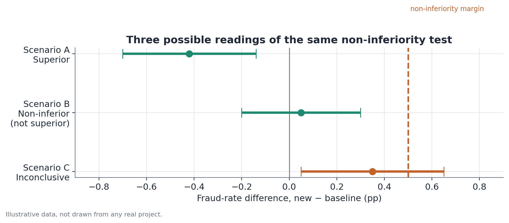

# Non-inferiority testing

*Assumes the A/B testing fundamentals — see
[A/B testing fundamentals](./ab-testing.md).*

## Concept

A non-inferiority test evaluates whether a treatment metric is not worse
than the control metric by more than a pre-defined margin $\delta$ — rather
than testing whether the two are equal. It's the appropriate test for
guardrail metrics: indicators that must not deteriorate beyond an acceptable
limit, even when the experiment's main goal is something else (for
instance, gaining speed, cutting cost, or improving a different business
metric).

The key difference from a conventional two-sided test isn't statistical
mechanics — it's how the hypotheses are logically framed. A standard test
splits the space of possibilities into "no difference" (null) and "some
difference, in either direction" (alternative). A non-inferiority test
splits the space asymmetrically: the null hypothesis becomes precisely
"deterioration exceeded the margin," and the alternative is "deterioration
did not exceed the margin." That flip in which statement carries the burden
of proof is what makes non-inferiority testing structurally different, not
just a rewording of the same test.

## Mathematical formulation

Let $\Delta = \mu_T - \mu_C$ be the true (population) difference between
treatment and control on a metric where higher values are worse (e.g., a
fraud rate). Let $\delta > 0$ be the non-inferiority margin, defined so that
a deterioration of up to $\delta$ is considered acceptable.

The hypotheses are:

$$
H_0: \Delta \geq \delta \qquad H_1: \Delta < \delta
$$

Note the asymmetry: $H_0$ states the metric got worse by at least the margin
(the "bad" scenario is the null); $H_1$ states any deterioration, if
present, is smaller than the margin. This is the structural opposite of a
superiority test, where the null hypothesis is "no effect" and the
alternative is "there's an effect."

The test statistic follows the same logic as a standard effect test, but
compared against $\delta$ instead of zero:

$$
z = \frac{\hat{\Delta} - \delta}{SE(\hat{\Delta})}
$$

$H_0$ is rejected (concluding non-inferiority) when $z < -z_{1-\alpha}$,
which is, more intuitively, equivalent to checking whether the upper bound
of a one-sided $(1-\alpha)$ confidence interval for $\Delta$ falls below
$\delta$:

$$
\hat{\Delta} + z_{1-\alpha} \cdot SE(\hat{\Delta}) < \delta
$$

In practice, this check is commonly reported using the upper bound of a
two-sided $(1-2\alpha)$ confidence interval, which is numerically equivalent
to the one-sided $(1-\alpha)$ upper bound — for example, a two-sided 90% CI
yields the same upper bound as a one-sided 95% CI.

## Assumptions

- **The margin $\delta$ is set before looking at the experiment's data**, as
  a business decision — it is not estimated or optimized from the
  experiment's own data. Setting the margin after seeing the result
  invalidates the test's interpretation.
- **The direction of "worse" is clearly defined** for the metric at hand.
  For metrics where higher values are bad (fraud, errors, latency), the
  margin caps how much the metric can rise; for metrics where lower values
  are bad (satisfaction, retention), the framing flips and the margin caps
  how much it can fall.
- **The same assumptions as a standard effect test apply** — valid
  randomization, independence between units, a sample large enough for the
  normal approximation of the standard error to be reasonable (or use of
  exact/bootstrap methods when it isn't).
- **The design has enough statistical power for the test to be
  informative** — with a small sample and a tight margin, the test can be
  structurally incapable of concluding non-inferiority even when the true
  effect is favorable, simply for lack of precision.

## Hypotheses

As detailed above:

$$
H_0: \Delta \geq \delta \qquad H_1: \Delta < \delta
$$

The significance level $\alpha$ (typically 0.05, one-sided) represents the
tolerated error rate of concluding non-inferiority when the metric actually
got worse than the margin. Unlike a two-sided test, there is only one
relevant direction of error here — there's no symmetric concern about a
"false positive for improvement," because improvement isn't what's being
tested.

## Interpretation

Concluding non-inferiority is a specific statistical statement: there is
evidence, at the chosen confidence level, that the true deterioration does
not exceed $\delta$. It is not a claim of equivalence (that would require an
equivalence test, with margins on both sides) nor a claim of zero cost — the
point estimate can indicate a small deterioration, just one that's within
what's tolerable.

An inconclusive result — when the confidence interval's upper bound crosses
$\delta$ — should not be read as "the metric got much worse." It only means
the data don't provide enough evidence to rule that possibility out. The
most common cause of inconclusiveness is insufficient statistical power: a
small sample, a highly variable metric, or a margin set too tight relative
to the precision the design can deliver. Before reporting an inconclusive
result as final, it's worth checking whether the design had adequate power
for the chosen margin — a calculation that mirrors the sample-size
calculation for standard effect tests, but using $\delta$ as the reference
"minimum effect."

## Limitations

- The margin is a business choice, and different choices of margin can lead
  to different conclusions on exactly the same data — the test doesn't
  validate the chosen margin, it only tests against it.
- Non-inferiority concluded in a single experiment, with a specific sample
  and context, doesn't guarantee the metric will stay within the margin
  indefinitely — shifts in user composition, scale, or context can change
  the metric's real behavior over time.
- Testing multiple guardrail metrics at once, each with its own
  non-inferiority test, runs into the same multiple-comparisons issue as any
  battery of tests — worth accounting for when interpreting "all guardrails
  passed."
- A non-inferiority test does not replace an effect test on the primary
  metric; the two answer different questions and are usually used together,
  one for the intended gain, the other for the risk being monitored.

## Example

A payments company tests a new fraud-detection model, significantly faster
than the current one but potentially slightly less precise. Before the
experiment, the risk team sets the non-inferiority margin at a 0.5
percentage-point increase in fraud rate — a threshold above which the speed
gain wouldn't offset the risk taken on.

The experiment runs with 12,000 transactions in each arm:

| | Control (current model) | Treatment (new model) |
|---|---|---|
| Transactions | 12,000 | 12,000 |
| Fraud cases | 252 | 242 |
| Rate | 2.10% | 2.02% |

The observed difference is $\hat{\Delta} = 2.02\% - 2.10\% = -0.08$
percentage points (the new model had slightly lower fraud). The standard
error of the difference, computed the same way as in a standard effect test,
yields a 95% confidence interval of roughly $[-0.34, +0.18]$ percentage
points.

Since the interval's upper bound (+0.18 pp) sits below the 0.5 pp margin,
non-inferiority is concluded with 95% confidence: there's statistical
evidence the new model doesn't push fraud beyond what's tolerable.

To illustrate how the same logic would apply to other possible outcomes of
the same experiment, consider three hypothetical scenarios for the CI of the
difference, all against the same 0.5 pp margin:

- **Scenario A (superior)**: CI of $[-0.70, -0.14]$ — entirely below zero.
  The new model isn't just non-inferior, it shows evidence of a real
  improvement.
- **Scenario B (non-inferior, not superior)**: CI of $[-0.20, +0.30]$ —
  crosses zero, but the upper bound still sits below the 0.5 margin. No
  evidence of improvement, but evidence of non-inferiority.
- **Scenario C (inconclusive)**: CI of $[+0.05, +0.65]$ — the upper bound
  exceeds the margin. Non-inferiority cannot be confidently concluded; the
  observed deterioration may or may not exceed what's tolerable.

Note that only Scenario C leads to a decision to hold off without further
investigation — Scenarios A and B, despite having quite different point
estimates and interval shapes, lead to the same practical decision to
approve the launch from the guardrail metric's point of view.
