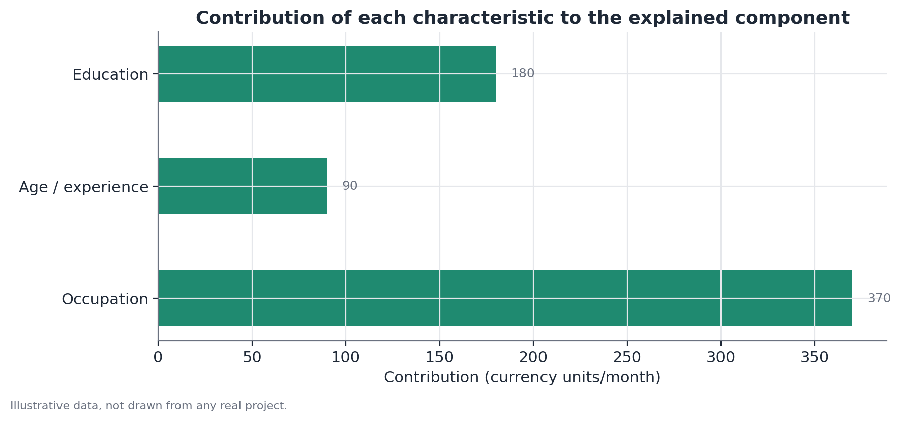

# Oaxaca-Blinder decomposition

## Concept

The Oaxaca-Blinder decomposition is a regression-based accounting technique
that splits the observed difference in average outcomes (typically wage or
income) between two groups into two parts: one attributable to differences
in the groups' average observable characteristics (the explained component)
and one that remains even after adjusting for those characteristics (the
unexplained component). It was proposed independently by Ronald Oaxaca and
Alan Blinder in 1973, in the context of wage differences between demographic
groups.

The central intuition is counterfactual: the method asks "what would Group
B's average outcome be if it had Group A's distribution of characteristics,
but kept being paid according to its own structure of returns?" The answer
to that hypothetical question is what allows separating "compositional
difference" from "difference in returns to the same characteristics."

## Mathematical formulation

For each group $g \in \{A, B\}$, fit a linear model:

$$
Y_g = X_g \beta_g + \varepsilon_g
$$

where $Y_g$ is the outcome variable (wage, say), $X_g$ is the matrix of
observable characteristics (including an intercept), $\beta_g$ is the vector
of coefficients estimated separately for group $g$, and $\varepsilon_g$ is
the error term.

The total difference in means is:

$$
\bar{Y}_A - \bar{Y}_B = \bar{X}_A \hat\beta_A - \bar{X}_B \hat\beta_B
$$

The classic two-term decomposition (the "twofold" form) rewrites this by
adding and subtracting a counterfactual term $\bar{X}_B \hat\beta_A$:

$$
\bar{Y}_A - \bar{Y}_B = \underbrace{(\bar{X}_A - \bar{X}_B)\hat\beta_A}_{\text{explained}} +
\underbrace{\bar{X}_B(\hat\beta_A - \hat\beta_B)}_{\text{unexplained}}
$$

- The **explained component** is the difference in average characteristics
  ($\bar{X}_A - \bar{X}_B$) weighted by Group A's returns ($\hat\beta_A$) —
  how much of the gap would come purely from compositional differences, if
  both groups were paid according to Group A's structure.
- The **unexplained component** is the difference in coefficients
  ($\hat\beta_A - \hat\beta_B$) weighted by Group B's average characteristic
  — how much of the gap comes from different returns to the same
  characteristics.

This formulation uses $\hat\beta_A$ as the reference structure (the "Group A
perspective" variant). An equivalent symmetric formulation exists using
$\hat\beta_B$, and formulations using a weighted combination of both (Reimers'
or Cotton's proposals, for instance) avoid the arbitrariness of picking one
group as the reference — the choice can moderately shift the split between
the two components, especially when the two coefficient sets differ a lot.

## Assumptions

1. **Correct specification of the outcome model**: the linear-in-$X_g$ model
   must reasonably capture the relationship between characteristics and
   outcome within each group. Important nonlinearities not captured (say,
   diminishing returns to experience) bias the decomposition.
2. **No relevant omitted-variable bias**: any characteristic that affects
   the outcome and is correlated with both the group and the other included
   variables, but wasn't measured, gets absorbed into the unexplained
   component — artificially inflating it.
3. **Support comparability**: the decomposition presupposes real overlap in
   the distribution of characteristics between the groups. When one group
   has almost no observations at certain combinations of characteristics
   present in the other group, the counterfactual ends up depending on model
   extrapolation outside the observed data — a form of instability worth
   checking (by comparing the distributions of $X$ across groups, say).
4. **No reverse causality between the outcome and the characteristics**: if
   the characteristic itself is partly determined by the outcome (occupation
   chosen in response to wage expectations, say), the interpretation of
   "how much X explains" gets trickier.

## Hypotheses

The decomposition itself isn't a single hypothesis test — it's a descriptive
technique. But each component can (and should) have its own standard error
and significance test, usually obtained via the delta method or bootstrap:

- $H_0$ for the explained component: the explained share of the difference
  equals zero.
- $H_0$ for the unexplained component: the unexplained share equals zero.
- Standard errors: since the decomposition involves products of estimated
  quantities ($\bar{X}$ and $\hat\beta$), analytically deriving the standard
  error of each component isn't trivial — bootstrapping (resampling both
  groups and recomputing the entire decomposition at each resample) is the
  more robust approach and the one most widely used in practice.

## Interpretation

The explained component has a relatively straightforward reading: it's the
part of the gap that can be attributed to observable compositional
differences between the groups, given the reference structure of returns
chosen.

The unexplained component demands much more caution. It's common — and
problematic — to describe it directly as "discrimination." That
interpretation is only valid under the strong assumption that every
characteristic relevant to determining the outcome was measured and included
in the model. In practice, that's almost never true: unobserved skill,
network quality, differences in salary negotiation, bias in hiring and
promotion processes, and many other omitted variables can sit inside the
unexplained component alongside any genuine discrimination effect. The
unexplained component is better read as an approximate upper bound on what
can be attributed to factors the model doesn't capture — including, but not
limited to, discrimination.

Moreover, the method doesn't establish causality in the characteristics
themselves: saying "education explains X units of the gap" doesn't mean
raising one group's education would necessarily close that part of the gap —
it assumes a constant general equilibrium and ignores market-composition
effects that could shift alongside it.

## Limitations

- **Sensitivity to specification**: adding or removing control variables can
  substantially shift the split between explained and unexplained — it's
  important to report how the result changes across different
  specifications (a robustness check).
- **Only decomposes the mean**: to understand whether the gap changes across
  the distribution (larger at the tails, say), a mean decomposition isn't
  enough — see RIF decomposition, which extends this logic to other points
  of the distribution.
- **Ambiguity in the choice of reference group**: different conventions
  (Group A reference, Group B reference, combined reference) produce
  numerically different results even from the same data — always report
  which convention was used.
- **Doesn't correct for selection**: if who ends up in the sample (who's
  employed, say) is itself the result of a selective process related to the
  group, the decomposition inherits that selection bias.

## Example

Consider a hypothetical scenario: an organization wants to understand the
difference in average monthly salary between two departments, Department A
and Department B, controlling for years of experience.

Aggregate data (invented):

- Department A: average wage = 5,800, average experience = 8 years.
- Department B: average wage = 4,620, average experience = 5 years.
- Fitted model for Department A: wage = 3,800 + 250 × experience.
- Fitted model for Department B: wage = 3,570 + 210 × experience.

**Step 1 — total gap:**

$$
5,800 - 4,620 = 1,180
$$

**Step 2 — explained component** (using Department A's return structure as
the reference):

$$
(\bar{X}_A - \bar{X}_B)\hat\beta_{\text{exp}, A} = (8 - 5) \times 250 = 750
$$

**Step 3 — unexplained component:**

$$
1,180 - 750 = 430
$$

This can be verified with the coefficient-level formulation: the difference
in intercepts (3,800 − 3,570 = 230) plus the difference in slope applied to
Department B's average experience ((250 − 210) × 5 = 200) sums to 430 —
consistent with the coefficient-level decomposition.

**Interpretation:** roughly 64% of the wage gap (750 of 1,180) can be
attributed to the difference in average experience between the departments,
given that both were paid according to Department A's structure. The
remaining 36% reflects both a difference in intercept and a difference in
slope (return per year of experience) between the two departments —
something that can't be attributed to experience itself, but also shouldn't
be automatically labeled discrimination without further investigation into
other potentially omitted variables (role type within the department, say).

The figure below breaks down the contribution of different hypothetical
characteristics to the explained component, in a scenario with more than one
control variable:

