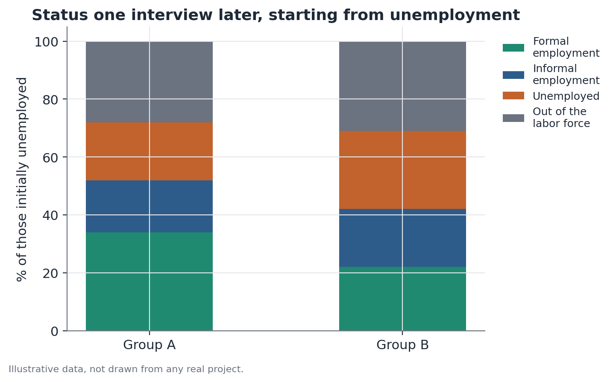

# Rotating Panel Transition Analysis

## Concept

A rotating panel is a sampling design used in several continuous household
surveys, in which a fraction of the sample is replaced at each interview
round, while another fraction stays on for a limited number of consecutive
rounds before also being replaced. This design combines two advantages: it
allows representative cross-sectional estimates at each individual round
(the full sample remains representative of the population at each moment),
while also allowing a fraction of the same individuals to be tracked across
a few consecutive rounds — enough to study individual transitions between
states.

Transition analysis exploits that second advantage: instead of comparing
aggregate estimates from two different moments — which mixes real
individual state change with mere turnover of who's in the sample — it
matches records for the same person across consecutive interviews and
builds a transition matrix, which directly describes the conditional
probability of moving (or staying) in a given state from one period to the
next.

## Mathematical formulation

Let $S = \{s_1, s_2, \dots, s_K\}$ be the set of possible states (for
example, $\{$formal employment, informal employment, unemployed, out of the
labor force$\}$). For an individual $i$ successfully matched between the
interview at period $t$ and the interview at period $t+h$ (where $h$ is the
interval between interviews, typically one quarter), let $S_{i,t}$ and
$S_{i,t+h}$ be the states observed at each moment.

The **transition matrix** for a group $g$ is defined by its entries:

$$P_{jk}^{(g)} = \Pr(S_{t+h} = s_k \mid S_t = s_j, \, \text{group} = g) \approx \frac{\sum_{i \in g} \mathbb{1}[S_{i,t} = s_j] \cdot \mathbb{1}[S_{i,t+h} = s_k]}{\sum_{i \in g} \mathbb{1}[S_{i,t} = s_j]}$$

Where:

- $P_{jk}^{(g)}$ is the estimated transition probability from state $s_j$ to
  state $s_k$, within group $g$, between the two interview moments;
- the numerator counts how many individuals in group $g$ were in state
  $s_j$ at $t$ and state $s_k$ at $t+h$;
- the denominator counts the total individuals in group $g$ who were in
  state $s_j$ at $t$ (and could be matched through $t+h$).

Each row $j$ of the matrix $P^{(g)}$ sums to 1, since every individual who
was in state $s_j$ ends up in some state $s_k$ (including $s_k = s_j$, i.e.,
remaining in the same state).

When sampling weights are available (essential in complex household
surveys), the correct estimate weights each individual by their
longitudinal sampling weight — which, in general, differs from the
cross-sectional weight of each individual round, and needs to be computed or
provided specifically for panel-analysis use.

Comparisons across groups typically focus on one specific cell of interest,
for example $P_{\text{unemployed}, \text{employed}}^{(A)}$ versus
$P_{\text{unemployed}, \text{employed}}^{(B)}$, tested as a difference of two
proportions:

$$z = \frac{\hat{P}^{(A)} - \hat{P}^{(B)}}{\sqrt{\hat{P}(1-\hat{P})\left(\frac{1}{n_A} + \frac{1}{n_B}\right)}}, \quad \hat{P} = \frac{x_A + x_B}{n_A + n_B}$$

where $x_g$ is the number of transitions of interest in group $g$, $n_g$ is
the total individuals in group $g$ who started from the initial state, and
$\hat{P}$ is the pooled proportion under the null hypothesis that the two
rates are equal.

## Assumptions

- **Correct matching between interviews.** The validity of the whole
  analysis hinges on correctly identifying that the same individual — not a
  different person who moved into the same household — is being compared
  across the two moments. Most surveys provide a household identifier plus
  a within-household resident position, and correct matching also requires
  confirming stable demographic characteristics (sex, and age within a
  tolerance consistent with the interview interval).
- **Sample attrition not systematically different across groups.** If the
  matching (or sample-retention) success rate differs across the groups
  being compared — for example, if one group has higher residential
  mobility and is therefore systematically harder to track — the matched
  sample stops being representative of its source population differently
  for each group, introducing selection bias into the comparison.
- **Well-defined, mutually exclusive destination states.** Ambiguities in
  state classification (say, precisely defining what counts as "out of the
  labor force" versus "unemployed" under active job-search criteria) need
  to be handled consistently at both moments of the comparison.
- **Comparable interval between interviews across individuals.** If the
  interval $h$ varies (some people matched a quarter apart, others two
  quarters apart), transition rates are not directly comparable without
  adjustment, since transitions have more time to occur over longer
  intervals.

## Hypotheses

To compare a specific transition rate between two groups $A$ and $B$:

- $H_0$: $P^{(A)} = P^{(B)}$ — the transition probability is equal in both
  groups.
- $H_1$: $P^{(A)} \neq P^{(B)}$ (or one-sided, if there's an expected
  direction a priori).
- Test statistic: $z$, as defined above (two-proportion test).
- Conventional significance level: $\alpha = 0.05$.
- When multiple destination states are being compared simultaneously (the
  entire transition matrix, not just one cell), a chi-squared homogeneity
  test between the two matrices is more appropriate than separate
  cell-by-cell tests, which don't correct for multiple comparisons.

## Interpretation

The transition matrix describes mobility **observed among the matched
individuals**, not necessarily the entire population. Three interpretive
points deserve attention:

- **Composition versus real mobility.** A stable aggregate rate over time
  can hide either high individual turnover (many people flowing in and out
  of a state in an offsetting pattern) or low turnover (the same people
  staying put). Only transition analysis distinguishes these two scenarios
  — a crucial difference for policy decisions, since the appropriate
  interventions differ between them.
- **Representativeness of the matched subsample.** If matching succeeds in,
  say, 85% of eligible cases, the results directly describe that 85% —
  extrapolating to the unmatched 15% requires the additional assumption
  that matching fails randomly with respect to the very state being
  studied, which is rarely guaranteed (people who move households, for
  instance, may be systematically more likely to also be changing
  employment status).
- **Transitions do not imply causation.** A higher unemployment-exit rate in
  one group is an observed mobility difference, not an explanation of why
  that mobility is higher — compositional factors (age, education, region,
  prior occupation type) may explain part or all of the difference, and
  isolating them would require additional analysis (say, a proportional-
  hazards model adjusting for covariates).

## Limitations

- **A rotating panel is not a full longitudinal panel.** The distinction is
  fundamental: in a longitudinal panel, the same (or a fixed) sample is
  followed for years. In a rotating panel, each individual is observed only
  during the window they're in the sample (typically a few consecutive
  rounds) before being replaced — transition analyses are only possible
  within that limited window, and most of a rotating-panel survey's data,
  outside that overlap window, is effectively repeated cross-section: each
  round is representative of the population, but individuals interviewed in
  non-overlapping rounds are not the same people.
- **Matching can fail non-randomly.** Beyond household moves, matching can
  fail due to recording errors, changes in household composition (birth,
  death, separation), or refusal in subsequent interviews — each of these
  mechanisms can correlate with the very state being studied, creating
  differential attrition bias across groups.
- **Few overlapping rounds limit the analysis horizon.** If the panel
  design allows tracking each individual for, say, at most five
  interviews, transitions can only be measured within that window —
  longer-term trends require chaining several panel cohorts together, a
  more complex approach subject to more sources of noise.
- **State-classification errors accumulate across two measurements.**
  Because the analysis depends on correctly classifying the state at two
  moments (not one), any measurement error or classification ambiguity at
  either moment contaminates the estimated transition.

## Example

Consider a hypothetical study of labor-market mobility for two groups of
workers, A and B, using a household survey with a rotating panel design in
which each household is interviewed for up to four consecutive quarters.

Out of a total of 500 unemployed people in Group A at the first interview,
420 (84%) could be matched to an interview one quarter later. Out of Group
B's 480 unemployed people, 390 (81%) were matched. The matching rates are
similar, which reduces (but does not eliminate) concern about differential
attrition.

Within the matched sample, the one-quarter transition matrix is:

**Group A** (starting from unemployed, n=420):

| Destination | % |
|---|---|
| Formal employment | 14.0% |
| Informal employment | 7.9% |
| Unemployed | 55.7% |
| Out of the labor force | 22.4% |

**Group B** (starting from unemployed, n=390):

| Destination | % |
|---|---|
| Formal employment | 9.2% |
| Informal employment | 8.5% |
| Unemployed | 58.7% |
| Out of the labor force | 23.6% |

The formal-employment transition rate is 14.0% for Group A versus 9.2% for
Group B — a 4.8-percentage-point difference. The two-proportion test for
this specific difference gives $z \approx 2.17$, corresponding to a p-value
of approximately 0.030 — statistically significant at the conventional 5%
level.

Careful interpretation: this difference describes the experience of the
individuals successfully matched in each group — 84% and 81% of the
original samples, respectively. If, for instance, people in Group B who
moved households (and therefore went unmatched) have systematically
different employment outcomes than those who stayed in the same household,
the estimated 9.2% rate may not correctly represent Group B as a whole. The
4.8-percentage-point difference also does not, on its own, isolate why the
transition is faster in Group A — observable characteristics like average
education and prior occupation type would need to be controlled for
separately to move that question forward.

```python
import pandas as pd
import numpy as np
from statsmodels.stats.proportion import proportions_ztest

# matched_data: one row per successfully matched individual
# columns: group, state_t0, state_t1

def transition_matrix(df, group):
    sub = df[df["group"] == group]
    return pd.crosstab(sub["state_t0"], sub["state_t1"], normalize="index") * 100

matrix_a = transition_matrix(matched_data, "A")
matrix_b = transition_matrix(matched_data, "B")

unemp_a = matched_data[(matched_data["group"] == "A") & (matched_data["state_t0"] == "unemployed")]
unemp_b = matched_data[(matched_data["group"] == "B") & (matched_data["state_t0"] == "unemployed")]

x = [(unemp_a["state_t1"] == "formal_employment").sum(),
     (unemp_b["state_t1"] == "formal_employment").sum()]
n = [len(unemp_a), len(unemp_b)]
stat, p_value = proportions_ztest(x, n)
print(stat, p_value)
```


