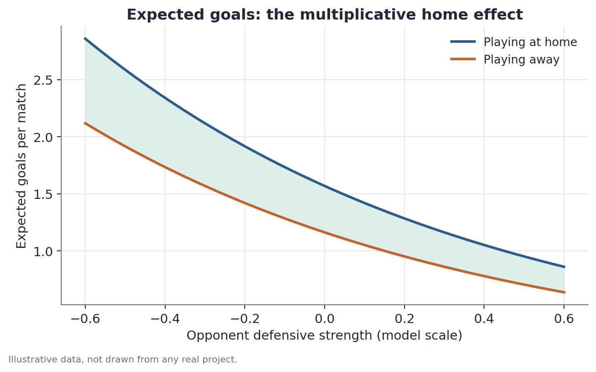

# Poisson regression with fixed effects

## Concept

Poisson regression is a generalized linear model (GLM) built for response variables that are event counts: non-negative integers representing how many times something happened in a fixed interval (a match, an hour, a month). It's the natural choice when the variable of interest violates the two core assumptions of an ordinary linear regression: (1) counts cannot be negative, yet a least-squares fitted line can predict negative values with no restriction; and (2) the distribution of counts is typically right-skewed, with probability mass concentrated at low values (0, 1, 2) and a long tail — very different from the symmetry of a normal distribution.

The central idea is to model the **logarithm** of the expected event rate, $\log(\lambda)$, as a linear combination of the explanatory variables — not the rate itself. This logarithmic "link function" guarantees that once the transformation is undone (by exponentiating), the resulting prediction $\lambda$ is always positive, regardless of the coefficient or variable values.

Fixed effects per unit (individual, team, store, period) add a dummy variable for each unit, letting each one have its own intercept — its own baseline event rate — before the effect of the variable of interest is estimated. This is fundamentally different from simply including the unit as an "average level" control: the fixed effect absorbs every unobserved but time-constant characteristic of that unit (a historically more attacking team, a store in a busier neighborhood), better isolating the effect of the variable of interest (playing at home, it being a Friday) from structural differences between units.

## Mathematical formulation

**Poisson distribution.** A count variable $Y$ follows a Poisson distribution with parameter $\lambda > 0$ if

$$
P(Y = y) = \frac{e^{-\lambda}\lambda^y}{y!}, \quad y = 0, 1, 2, \dots
$$

where $\lambda = E[Y] = \mathrm{Var}(Y)$ — mean and variance are equal (equidispersion), a property specific to this distribution that becomes a testable assumption of the model.

**Log-linear model.** For observation $i$ (say, team $t$ in match $m$), the expected rate is

$$
\lambda_i = \exp\big(\beta_0 + \beta_1 x_{1i} + \beta_2 x_{2i} + \dots + \beta_k x_{ki} + \alpha_{u(i)}\big)
$$

where:
- $x_{1i}, \dots, x_{ki}$ are the explanatory variables (attacking strength, opponent defensive strength, home-field indicator);
- $\beta_1, \dots, \beta_k$ are the coefficients to be estimated, on the log scale;
- $\alpha_{u(i)}$ is the fixed effect of the unit $u$ that observation $i$ belongs to (the team, for instance) — it acts as that unit's own intercept;
- $\beta_0$ is the overall intercept (absorbed in practice by the $\alpha_u$ terms when full per-unit fixed effects are included).

Equivalently, on the log scale:

$$
\log(\lambda_i) = \beta_0 + \beta_1 x_{1i} + \dots + \beta_k x_{ki} + \alpha_{u(i)}
$$

That's where the name comes from: "log-linear" — linear on the log-mean scale, not on the original scale.

**Multiplicative interpretation of the coefficient.** Consider two observations identical except for variable $x_1$ (say, home field: $x_1=1$ vs. $x_1=0$). The ratio of expected rates is

$$
\frac{\lambda_i \,|\, x_1=1}{\lambda_i \,|\, x_1=0} = \frac{\exp(\beta_0 + \beta_1 \cdot 1 + \dots)}{\exp(\beta_0 + \beta_1 \cdot 0 + \dots)} = e^{\beta_1}
$$

Every other term cancels because it's identical across the two observations — which is why $e^{\beta_1}$ is interpreted as a **multiplicative factor**: how many times the expected rate changes when $x_1$ increases by one unit, holding everything else constant.

**Estimation.** Coefficients are estimated by maximum likelihood. The model's log-likelihood, over $n$ observations, is

$$
\ell(\beta, \alpha) = \sum_{i=1}^n \Big[y_i \log(\lambda_i) - \lambda_i - \log(y_i!)\Big]
$$

There is no closed-form solution for the coefficient vector that maximizes $\ell$; estimation relies on iterative numerical methods (typically Newton-Raphson or variants of iteratively reweighted least squares, IRLS).

## Assumptions

- **Equidispersion** ($\mathrm{Var}(Y) = E[Y] = \lambda$): the assumption most often violated in practice. When observed variance clearly exceeds the mean — **overdispersion** — the maximum-likelihood standard errors from a plain Poisson model are biased downward, producing inflated test statistics and artificially small p-values. Diagnostic: compare the model's deviance (or Pearson chi-square) statistic to its residual degrees of freedom — a ratio well above 1 suggests overdispersion.
- **Conditional independence of events**: given the vector of explanatory variables and fixed effects, counts must be independent across observations. Time series with strong dependence (a win boosting the odds of scoring in the following match through a confidence effect) violate this.
- **Correct log-linear functional form**: assumes the effect of the variables is multiplicative on the original scale, not additive. If the true relationship takes another shape (e.g., saturation at high values of the explanatory variable), the misspecified model can produce biased predictions at the extremes.
- **Fixed effects require enough within-unit variation**: if a unit (team) never plays both home and away within the sample (a rare but illustrative case), that unit's fixed effect absorbs all its variation and the coefficient of interest cannot be identified from it.

## Hypotheses

For each coefficient $\beta_j$, the usual test is:

- $H_0: \beta_j = 0$ (variable $x_j$ has no effect on the expected event rate, controlling for the others)
- $H_1: \beta_j \neq 0$

The test statistic (Wald test) is $z = \hat\beta_j / \mathrm{SE}(\hat\beta_j)$, compared against a standard normal distribution. A 95% confidence interval for $\beta_j$ is $\hat\beta_j \pm 1.96 \times \mathrm{SE}(\hat\beta_j)$; exponentiating the bounds gives the confidence interval for the multiplicative factor $e^{\beta_j}$. When the model suffers from overdispersion, it's advisable to recompute standard errors robustly (sandwich estimator) or refit using a negative binomial model before interpreting these tests.

## Interpretation

The exponentiated coefficient tells you how much the expected event rate changes multiplicatively per unit change in the explanatory variable, controlling for the other variables and fixed effects included. That is a statement about conditional association within the specified model — not an automatic causal claim. In an observational setting (like estimating the home-field effect from historical match data, with no controlled experiment), the coefficient reflects the estimated association given the included set of controls; if relevant factors are omitted and correlate with both the variable of interest and the event rate, the estimate can be biased.

Statistical significance (a $\beta_j$ distinguishable from zero) is not the same as practical relevance: a multiplicative factor of 1.02 (a 2% increase) can be statistically significant in a large sample without being operationally meaningful.

## Limitations

- **Overdispersion is common and is not automatically flagged by the model fit** — it must be checked explicitly. Ignoring it leads to artificially narrow confidence intervals and significance conclusions that don't hold up.
- **Excess zeros** (more zero-count observations than Poisson predicts) is another common form of misspecification, distinct from general overdispersion, which may call for specific models (zero-inflated Poisson).
- **Per-unit fixed effects with many categories and few observations per category** (the incidental parameters problem) can produce unstable estimates, especially combined with low counts.
- **The multiplicative interpretation assumes the effect of $x_j$ is constant on the log scale across the observed range of values** — extrapolating predictions to variable combinations far outside the training data's observed range is risky.

## Example

Consider a hypothetical example from a generic sports league with five teams (A through E), where the goal is to estimate the effect of playing at home on goals scored, controlling for team fixed effects.

A simplified model, fit on synthetic data from a hypothetical season, estimates:

- Home-field coefficient: $\hat\beta_{\text{home}} = 0.300$, standard error $= 0.085$
- Wald statistic: $z = 0.300/0.085 \approx 3.53$, p-value $< 0.001$
- 95% confidence interval for $\beta_{\text{home}}$: $[0.133,\, 0.467]$

Exponentiating the coefficient and the interval bounds: estimated multiplicative factor $e^{0.300}\approx 1.35$, with an approximate 95% CI of $[e^{0.133}, e^{0.467}] \approx [1.14,\, 1.60]$.

**Reading:** controlling for each team's relative strength (via the per-team fixed effect), playing at home is associated with an estimated 35% increase in expected goals scored (95% CI: an increase between 14% and 60%), a statistically significant effect ($p<0.001$). This is a statement about association within this hypothetical season's observed data — generalizing to other seasons or competitions would require refitting the model on data from that context, and checking whether the equidispersion assumption holds before trusting the reported confidence intervals.

