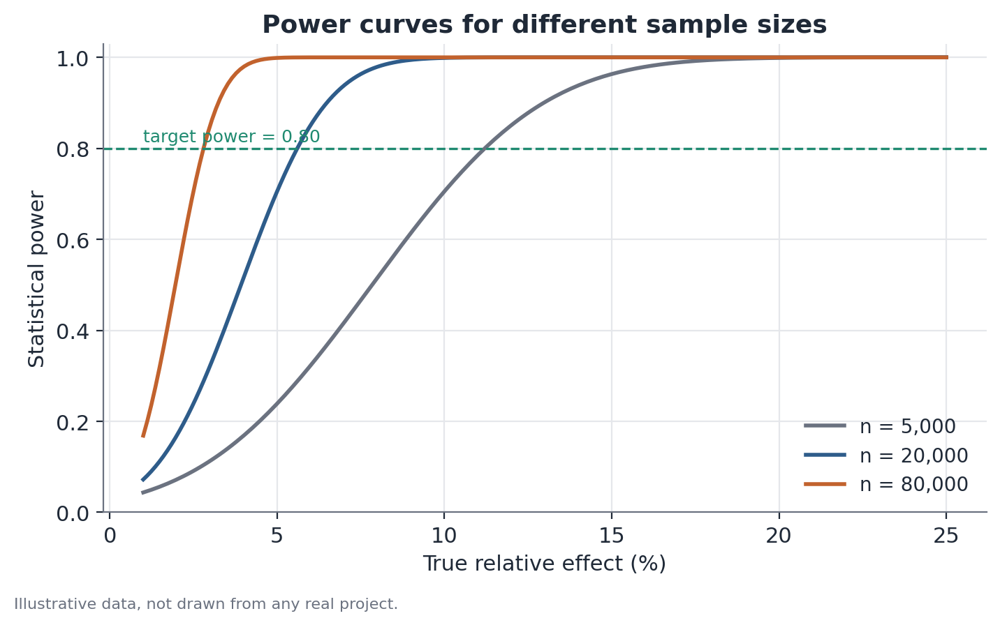

# Statistical power and minimum detectable effect (MDE)

## Concept

Statistical power and minimum detectable effect (MDE) are two faces of the
same mathematical relationship between four quantities in a hypothesis test:
sample size, the metric's variance, the significance level, and power. Given
any three, the fourth is determined.

A test's **power** is the probability of correctly rejecting the null
hypothesis when it is in fact false — that is, the probability of detecting a
true effect of a given size, given the experiment's design. It is the
complement of the Type II error rate (β): power = 1 − β.

The **MDE** flips the question: instead of fixing a hypothetical effect and
asking what the power is, it fixes the desired power (conventionally 80%) and
asks what the smallest true effect is that the design can detect with that
probability. In practice, computing the MDE before running an experiment is
the most direct way to answer "does this design have any chance of working?"
before spending time and resources on it.

The core usefulness of the concept is avoiding two symmetric mistakes: (1)
running an underpowered experiment that never had the strength to detect the
effect that actually matters for the business decision, producing a
"non-significant" result that means "no power to see it," not "no effect";
and (2) over-powering an experiment beyond what's needed, consuming traffic
and time that could go toward other tests.

## Mathematical formulation

For a comparison of two proportions (the most common case in product
experiments), with equal sample sizes in each arm, the relationship between
the four quantities can be written, under a normal approximation, as:

```
MDE = (z_(1-α/2) + z_(1-β)) · sqrt(2 · p · (1 - p) / n)
```

where:

- `MDE` is the minimum detectable effect, in percentage points (the relative
  version is `MDE / p`).
- `z_(1-α/2)` is the standard normal quantile corresponding to the chosen
  two-sided significance level — for example, 1.96 for α = 0.05.
- `z_(1-β)` is the standard normal quantile corresponding to the desired
  power — for example, 0.84 for 80% power.
- `p` is the expected baseline conversion rate (or proportion) in the control
  group.
- `n` is the sample size per group.

For a continuous metric (say, usage time, purchase value), the equivalent
form uses the metric's standard deviation (`σ`) instead of the `p(1-p)` term:

```
MDE = (z_(1-α/2) + z_(1-β)) · σ · sqrt(2 / n)
```

Solving for `n` gives the sample size required for a target MDE:

```
n = 2 · σ² · (z_(1-α/2) + z_(1-β))² / MDE²
```

The structurally important point in these equations is that `n` depends on
`1/MDE²`: to cut the MDE in half, the sample needs to quadruple — hence the
diminishing returns of throwing more traffic at an experiment.



## Assumptions

- **Normal approximation to the distribution of the mean/proportion
  difference**: valid for reasonably large samples via the central limit
  theorem; for very small samples or highly skewed metrics, the normal
  approximation degrades and exact forms (for example, based on the binomial
  distribution) are preferable.
- **Correctly estimated variance**: the MDE calculation depends on a prior
  estimate of the metric's variance (or baseline conversion rate). If that
  estimate comes from an atypical period or a small sample, the computed MDE
  inherits that error.
- **Independent observations**: the standard calculation assumes each
  experimental unit contributes independently. When there's cluster
  structure (say, the same store generating multiple observations over
  time), the effective variance is larger than the simple formula suggests,
  and the true MDE is larger than the one computed without that adjustment.
- **Allocation and significance level fixed in advance**: the calculation
  assumes a single significance check at the end of the experiment, with a
  fixed α. If the experiment is monitored repeatedly and stopped as soon as a
  "significant" result appears, the effective false-positive rate rises above
  the nominal α — a separate but related problem, handled by sequential
  testing methods.

## Hypotheses

Power and MDE aren't, by themselves, a hypothesis test — they're properties
of a planned hypothesis test. The underlying test is typically:

- **H0**: there is no difference between the treatment and control group on
  the metric of interest (the difference in means or proportions equals
  zero).
- **H1**: there is a nonzero difference.
- **Significance level (α)**: the accepted probability of incorrectly
  rejecting H0 (Type I error), typically 5%.
- **Target power (1 − β)**: the desired probability of correctly rejecting
  H0, given that an effect of size equal to the MDE truly exists, typically
  80%.

The MDE is the smallest true effect for which this probability of correct
rejection reaches the target power, given the assumed `n`, `α`, and variance.

## Interpretation

The MDE computed before an experiment is a property of the **design**, not a
forecast of the true effect. Common misinterpretations include treating a 3%
MDE as "we expect a 3% effect" (wrong — it's the detection floor, not a
forecast) or concluding, at the end of a non-significant experiment, that
"there's no effect" without checking whether the design ever had the power to
detect an effect of the size that would matter for the decision.

Recomputing power mid-experiment is useful and legitimate when the available
sample size changes for reasons external to the test's own result — for
example, a business deadline shortens the experiment window, or observed
traffic came in below plan. In that case, the MDE (or the power for a
specific effect) is recalculated using the `n` actually reached, and the
change is reported transparently: "the original design was set to detect
effects of X%; with the reduced available sample, the detection floor rose to
Y%." This is different from — and legitimate, unlike — repeatedly checking
the experiment's own p-value and deciding to stop as soon as it crosses 0.05,
which inflates the false-positive rate.

## Limitations

- The calculation depends on a variance estimate that's only known precisely
  after data is collected — beforehand, it relies on an approximation (from
  similar historical data, a pilot, or a conservative range), which carries
  its own uncertainty.
- MDE and power assume a single two-sided test at the end of the experiment;
  tests with multiple secondary metrics, multiple subgroup cuts, or
  continuous p-value monitoring aren't covered by the simple calculation
  without additional adjustment (correction for multiple comparisons, or
  sequential methods).
- A design with adequate power for the primary metric may have essentially no
  power for secondary metrics with much higher variance or a much lower
  baseline rate — it's worth computing the MDE separately for every metric
  that matters to the decision.
- High power doesn't imply that a detected effect will be relevant to the
  business — a very small MDE can detect effects that are statistically
  significant but practically irrelevant. The MDE should be compared against
  the smallest effect worth acting on, not just computed and set aside.

## Example

A hypothetical streaming service wants to test whether a new content
recommendation algorithm increases average daily usage time, currently at 42
minutes, with a historical standard deviation of 35 minutes (the metric is
fairly noisy, since it mixes occasional users with very engaged ones).

The product team estimates, based on prior recommendation-change tests, that
a realistic gain would fall between 2 and 4 minutes per day. Before
committing the experiment to four weeks of traffic, the MDE is calculated for
different durations:

| Duration | n per group (approx.) | MDE (minutes) |
|---|---|---|
| 1 week | 8,000 | 2.2 |
| 2 weeks | 16,000 | 1.5 |
| 4 weeks | 32,000 | 1.1 |

With just one week, the 2.2-minute MDE would already cover the lower end of
the expected effect (2 minutes) — but with a thin margin, making the result
sensitive to noise. The team opts for two weeks, with an MDE of 1.5 minutes,
comfortably below the smallest effect they consider relevant.

Midway through the experiment, a technical issue cuts eligible traffic by 40%
over three days. By the end of the planned two weeks, the effective `n` per
group came in at 11,200, not 16,000. Recalculating the MDE with the actual
`n`:

```
effective_MDE = (1.96 + 0.84) · 35 · sqrt(2 / 11,200) ≈ 1.85 minutes
```

The effective MDE (1.85 min) is still below the minimum relevant effect
(2 minutes), so the experiment, even reduced, retains enough power for the
decision that matters — but the team logs this change in the experiment's
documentation instead of silently assuming the original design (with
n=16,000) still held.

## Code example

```python
import numpy as np
from statsmodels.stats.power import TTestIndPower

analysis = TTestIndPower()

sigma = 35.0          # historical standard deviation of the metric, minutes
alpha = 0.05
target_power = 0.80

# MDE (in minutes) for different sample sizes per group
for n in [8_000, 16_000, 32_000, 11_200]:
    effect_size = analysis.solve_power(nobs1=n, alpha=alpha, power=target_power)
    mde_minutes = effect_size * sigma
    print(f"n={n:>6}: MDE ≈ {mde_minutes:.2f} min")
```

The `effect_size` returned by `statsmodels` is standardized (units of
standard deviation); multiplying by `sigma` converts it back to the metric's
original unit — minutes, in this example.
