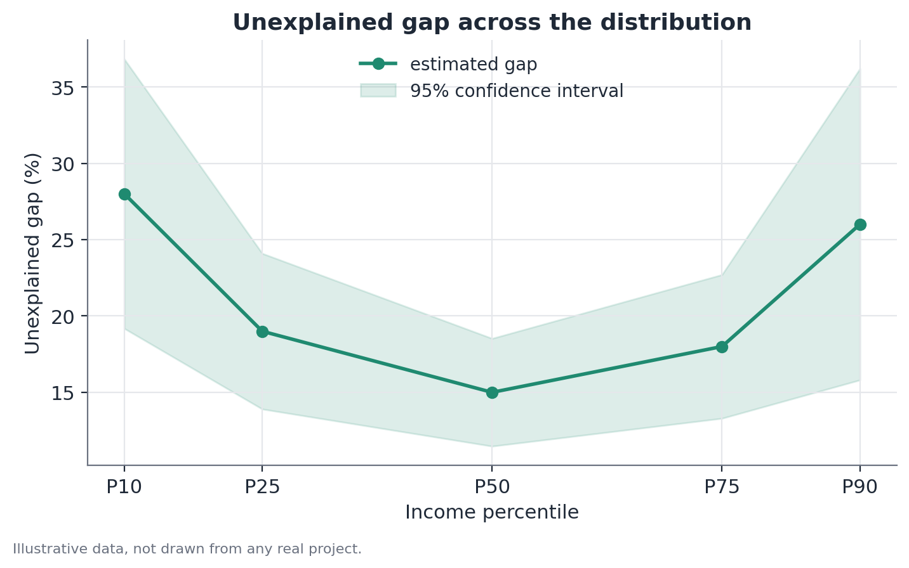
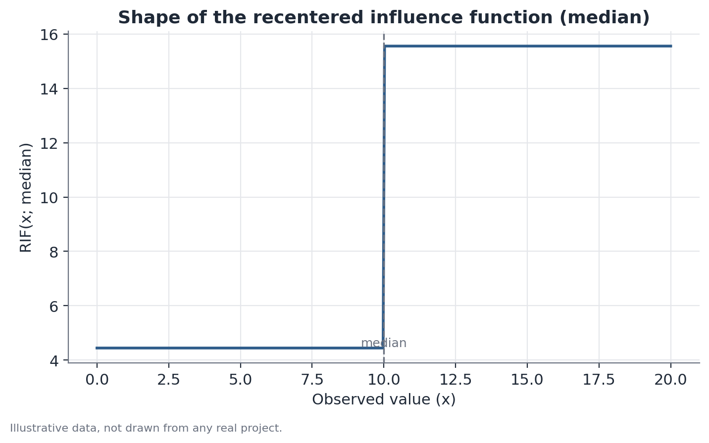

# RIF (Recentered Influence Function) decomposition

## Concept

RIF decomposition, proposed by Firpo, Fortin and Lemieux (2009), generalizes
Oaxaca-Blinder decomposition to distributional statistics beyond the mean —
quantiles, the Gini index, the variance, or any other functional of the
distribution that can be written as the expectation of its recentered
influence function.

Before formalizing this, it's worth understanding what an influence function
is. In robust statistics, the influence function of an estimator $\nu(F)$ (a
functional applied to the variable's distribution $F$) measures, in a
mathematically precise way, how much the value of $\nu$ would change if the
distribution $F$ were slightly perturbed by an extra unit of probability mass
concentrated at a single point $y$. Formally:

$$
IF(y; \nu, F) = \lim_{\epsilon \to 0} \frac{\nu\big((1-\epsilon)F + \epsilon \delta_y\big) - \nu(F)}{\epsilon}
$$

where $\delta_y$ is a degenerate distribution putting all its mass on $y$.
Intuitively, the influence function answers: "if I added one more observation
at value $y$, with infinitesimal weight, how much would that pull $\nu$ up or
down?" — points with high influence are those whose presence or absence most
affects the statistic.

The **recentered** influence function (RIF) is defined as:

$$
RIF(y; \nu, F) = \nu(F) + IF(y; \nu, F)
$$

The key property — and the reason the method works — is that the expectation
of the RIF over the distribution recovers exactly the original functional:

$$
\mathbb{E}[RIF(Y; \nu, F)] = \nu(F)
$$

This means $\nu(F)$ (the median, a percentile, the Gini index) can be
treated, for regression purposes, as if it were the mean of a transformed
variable — the RIF evaluated at each observation. That equivalence is what
lets you reuse the entire regression-and-decomposition machinery from
Oaxaca-Blinder, now applied to $RIF(y)$ instead of $y$ directly.

It's worth stating clearly: RIF decomposition **is not the same method** as
Oaxaca-Blinder — it's an extension that uses Oaxaca-Blinder as an internal
step, after transforming the data via the RIF. Oaxaca-Blinder decomposes
means directly; RIF decomposes any distributional statistic that can be
expressed as the expectation of an influence function, using the same
counterfactual logic underneath.

## Mathematical formulation

**RIF for a quantile.** For the $q$-th order quantile (0.5 for the median,
say), with value $Q_q$ and density $f_Y(Q_q)$ of the variable $Y$ evaluated
at $Q_q$:

$$
RIF(y; Q_q) = Q_q + \frac{q - \mathbb{1}\{y \leq Q_q\}}{f_Y(Q_q)}
$$

Here, $\mathbb{1}\{y \leq Q_q\}$ is an indicator equal to 1 if the
observation falls below the quantile and 0 otherwise. Observations just
below the quantile receive an RIF value slightly above $Q_q$; observations
just above receive a value slightly below — the density in the denominator
controls the magnitude of that adjustment (the lower the density there, the
more sensitive the quantile is to change, and the larger the magnitude of
the RIF).

**Regression and decomposition.** Once $RIF_i = RIF(y_i; \nu)$ is computed
for every observation $i$ in each group, fit:

$$
RIF_i = X_i \gamma_g + u_i, \quad g \in \{A, B\}
$$

and apply the Oaxaca-Blinder decomposition exactly as in the mean version,
but using $\gamma_g$ in place of $\beta_g$:

$$
\nu_A - \nu_B \approx \underbrace{(\bar{X}_A - \bar{X}_B)\hat\gamma_A}_{\text{explained, at point }\nu} +
\underbrace{\bar{X}_B(\hat\gamma_A - \hat\gamma_B)}_{\text{unexplained, at point }\nu}
$$

The approximation sign is there because this is a first-order approximation
(via the influence function) — valid locally, not an exact decomposition the
way the mean case is.

## Assumptions

1. **Consistent density estimation**: for quantiles, the RIF's denominator
   depends on the density $f_Y$ evaluated at the quantile, which needs to be
   estimated (typically via a kernel). The choice of kernel bandwidth
   affects the estimate, especially in regions with sparse data.
2. **All Oaxaca-Blinder assumptions apply** to the regression-and-
   decomposition step on the transformed variable: correct specification, no
   relevant omitted-variable bias, and real overlap in characteristics
   between the groups.
3. **Validity of the linear approximation**: RIF decomposition is
   fundamentally a first-order approximation — exact for small shifts in the
   distribution, but it can lose precision for comparisons with very large
   differences between groups. This matters particularly when interpreting
   changes over long stretches of time, not just between two groups at a
   single moment.

## Hypotheses

As with Oaxaca-Blinder, each component of the decomposition (explained and
unexplained, at each chosen point of the distribution) can be tested
individually:

- $H_0$: the component equals zero at that specific point of the
  distribution.
- Standard errors: the two-step process (estimating the RIF, then estimating
  the regression) introduces additional uncertainty that needs to be
  propagated correctly — bootstrap (resampling the original data and
  redoing both steps at each resample, including re-estimating the density)
  is the standard approach, since closed-form analytical formulas for the
  standard error are complex.
- When reporting several points of the distribution at once (a gap profile
  by percentile, say), the multiple comparison across points deserves the
  same caution as any multiple-testing situation — a single "significant"
  point standing out among several non-significant ones warrants careful
  interpretation.

## Interpretation

RIF decomposition allows a much richer reading than the mean alone: it shows
whether a gap between groups is uniform across the distribution or
concentrated in certain regions — a "sticky floor" pattern (larger gap at
the bottom) indicates that even among lower earners in both groups, the
disparity is large; a "glass ceiling" pattern (larger gap at the top)
indicates the disparity grows specifically among those at the top of the
income distribution, typical of barriers to reaching higher positions.

The same Oaxaca-Blinder caveats about causality and omitted-variable bias
apply, point by point: the unexplained component at any percentile can't be
automatically attributed to discrimination. Moreover, each point has its own
margin of error, usually wider at the tails of the distribution — a gap
profile that looks dramatically different between two adjacent percentiles
may actually fall within their combined margin of error.

## Limitations

- **Less precise estimates at the tails**: the density $f_Y$ tends to be
  lower at the extremes of the distribution (fewer observations there),
  which inflates the RIF formula's denominator and, consequently, the
  variance of the estimate.
- **First-order approximation**: for very large differences between groups,
  or for reweightings far from the observed distribution, the RIF's linear
  approximation may not capture nonlinear shifts in the statistic of
  interest well. Full reweighting methods (like DiNardo-Fortin-Lemieux) are
  alternatives that avoid this approximation, at the cost of greater
  computational complexity.
- **Choice of percentile grid**: reporting a limited number of points (P10,
  P25, P50, P75, P90, say) may miss even more extreme behavior (P1, P99) —
  the choice of grid should reflect the research question, not convenience.
- **Inherits all of Oaxaca-Blinder's causal limitations**, point by point:
  it's an accounting decomposition, not a causal inference method.

## Example

Consider a hypothetical scenario: an annual wage survey collects income data
from two regions, North Region and South Region, along with years of
education. An Oaxaca-Blinder decomposition at the mean shows an unexplained
gap of 15%. RIF decomposition is applied at five percentiles to investigate
whether that gap is uniform:

| Percentile | Total gap | Explained gap | Unexplained gap |
|------------|-----------|----------------|-------------------|
| P10        | 34%       | 6 p.p.         | 28%               |
| P25        | 27%       | 8 p.p.         | 19%               |
| P50        | 22%       | 7 p.p.         | 15%               |
| P75        | 25%       | 7 p.p.         | 18%               |
| P90        | 33%       | 7 p.p.         | 26%               |

The explained component (attributable to the education difference between
the regions) stays fairly stable, between 6 and 8 percentage points, across
the distribution. The unexplained component, however, follows a U-shaped
pattern: 28% at P10, dropping to 15% at P50, and climbing back to 26% at P90.
This suggests the education difference explains a similar slice of the gap
at every income level, but what's left over — the unexplained part — is
considerably larger both among lower earners and higher earners, and smaller
in the middle of the distribution.

A result like this is editorially meaningful: reporting only the mean figure
(15%) would hide that the experience of people at the bottom or top of the
income distribution is quite different from the experience of people in the
middle.

The following figure illustrates the shape of the recentered influence
function itself for the median — the characteristic "step" around the
median value, which explains why observations just below and just above the
median receive opposite weights in the regression:

