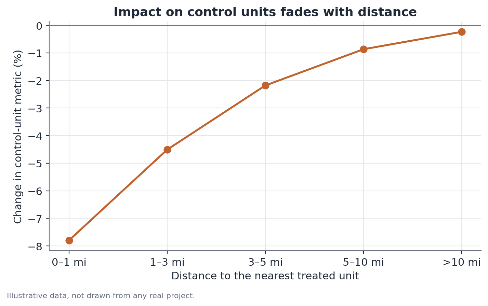

# Spatial spillover and cannibalization analysis

## Concept

In experiments with geographically located units — stores, delivery zones,
service areas — one of the most frequently violated, and least checked,
assumptions is **unit isolation** (SUTVA, the stable unit treatment value
assumption): the idea that a control unit's outcome depends only on it not
having been treated, not on what's happening at treated units nearby.

When treated and control units compete for the same audience — the same
delivery radius, the same commercial neighborhood — that assumption fails
through a specific mechanism called **spatial spillover**, of which
**cannibalization** is the most common case in business contexts: part of
the activity that shows up as "gain" at the treated unit is actually
displaced activity from a neighboring control unit, not new activity. When
this happens and goes undetected, the experiment's estimated effect
systematically overstates the true net gain, because the control unit used
as a reference was also affected by the treatment — just in the opposite
direction.

Spatial spillover analysis uses the experimental design's own geography as a
diagnostic instrument: by comparing the effect estimated against controls at
different distances from the nearest treated unit, it becomes possible to
separate, at least approximately, how much of the apparent effect is
displacement versus net creation.

## Mathematical formulation

Let `Y_i` be the metric of interest (sales, orders, revenue) for unit `i`,
measured before (`Y_i^pre`) and after (`Y_i^post`) treatment begins, and let
`d_i` be the distance between control unit `i` and the nearest treated unit.

Define two control subgroups using a distance threshold `τ`:

```
Nearby control:  C_near = { i : treated_i = 0, d_i ≤ τ }
Distant control: C_far  = { i : treated_i = 0, d_i > τ }
```

The estimated effect against each group, in a simple
difference-in-differences form, is:

```
δ_near = ( ȳ_T^post − ȳ_T^pre ) − ( ȳ_near^post − ȳ_near^pre )
δ_far  = ( ȳ_T^post − ȳ_T^pre ) − ( ȳ_far^post − ȳ_far^pre )
```

where `ȳ_T`, `ȳ_near`, and `ȳ_far` are the metric's averages in the treated
group, the nearby control, and the distant control, respectively.

The gap between the two estimated effects is a direct indicator of spillover
contamination:

```
Cannibalization indicator = δ_near − δ_far
```

A positive, meaningful value indicates that the nearby control is, on
average, performing worse than the distant control during the treatment
period — consistent with the hypothesis that it's losing activity to the
treated units. Formally, under the assumption that the distant control is
free of contamination, `δ_far` is the estimator of the treatment's **true
net effect**, and `δ_near − δ_far` estimates the size of the displacement
effect absorbed by the nearby control.

A continuous extension of the same logic models the effect on control units
as a function of distance `d_i` to the nearest treated unit — typically with
smooth decay, for example via local (kernel) regression or a simple
parametric specification such as:

```
Δy_i = β₀ + β₁ · exp(−d_i / λ) + ε_i
```

where `Δy_i` is the percentage change in the metric at control unit `i`, `λ`
is a scale parameter capturing how fast the effect decays with distance, and
`β₁` measures the magnitude of the spillover effect in the limit `d_i → 0`.



## Assumptions

- **The distant control is genuinely free of contamination**: this is the
  central identifying assumption. If the true competition radius is larger
  than the assumed "distant" threshold `τ`, even that group carries some
  bias, and the cannibalization indicator understates true contamination.
- **Which units were treated wasn't correlated with local characteristics
  that also affect the metric's trend** (for example, preferentially
  treating stores in already-growing neighborhoods) — otherwise, the
  comparison against any control, nearby or distant, is confounded by that
  local characteristic, not just by spillover.
- **Stable market boundaries during the experiment**: the analysis assumes
  the spatial competition pattern (who competes with whom) doesn't shift
  substantially during the experiment window.
- **Distance as a reasonable proxy for competition**: straight-line
  geographic distance (or travel time) needs to be a reasonable proxy for
  actual customer overlap — in digital contexts, "distance" may need
  redefining (for example, coverage-area overlap, or user-base similarity)
  rather than strictly geographic.

## Hypotheses

When formalized as a hypothesis test on the cannibalization indicator:

- **H0**: δ_near = δ_far (no systematic difference between the effect
  measured against nearby control and against distant control — no evidence
  of spillover).
- **H1**: δ_near ≠ δ_far (a systematic difference exists, consistent with
  spatial contamination).

The test can be run via a difference-in-differences model with an
interaction term between treatment, period, and a "nearby control"
indicator, or via permutation inference when the number of treated and
control units is small — common in this type of design, since geographic
experiments rarely have dozens of treated units.

## Interpretation

The analysis's central result isn't "is there or isn't there
cannibalization" in a binary sense, but **how much** of the apparent effect
is displacement. A cannibalization indicator of, say, 4 percentage points
against a total apparent effect of 17% means roughly a quarter of the
"gain" measured against the nearby control is actually that control's
loss — the true net effect sits closer to 13%.

It's important not to interpret a smaller net effect as "the change didn't
work." Demand shifting between units of the same business can be a desirable
outcome (for example, migrating customers to a more profitable channel) or
an undesirable one (an expansion that in practice just reallocates existing
revenue), depending entirely on the strategic goal behind the tested change.
Spillover analysis doesn't decide that — it just separates the two
components so the decision can be made with that information.

## Limitations

- The choice of distance threshold `τ` is arbitrary to some degree, and
  results can be sensitive to it — it's worth reporting the cannibalization
  indicator for more than one threshold, or using the continuous version
  (decay with distance) when the data allows.
- With few treated and control units, the estimates of `δ_near` and `δ_far`
  carry considerable uncertainty, and the gap between them inherits that
  uncertainty — a "positive" cannibalization indicator over small samples
  may not be distinguishable from zero.
- The method assumes the only relevant form of contamination is geographic.
  Other forms of spillover (for example, the same customer buying through
  different channels of the same company, or social-network effects between
  customers) aren't captured by physical distance and require different
  designs.
- Even when the distant control is well chosen, it estimates the net effect
  **aggregated over the observed region** — it says nothing about whether
  growth is sustainable outside that region, which is a limitation of
  extrapolating any local pilot result to a national rollout.

## Example

A hypothetical gym chain tests a new membership promotion in 10 locations
across a metro area, measuring monthly new sign-ups.

Control group definitions: 18 locations within 4 km of some treated location
(nearby control) and 22 locations more than 15 km from any treated location
(distant control), all in the same city.

Aggregated data (average monthly sign-ups per location):

| Group | Before | After | Change |
|---|---|---|---|
| Treated | 42 | 58 | +38.1% |
| Nearby control | 40 | 36 | −10.0% |
| Distant control | 41 | 43 | +4.9% |

Effect estimated against nearby control: 38.1% − (−10.0%) = **48.1
percentage points**.

Effect estimated against distant control: 38.1% − 4.9% = **33.2 percentage
points**.

Cannibalization indicator: 48.1 − 33.2 = **14.9 percentage points**.

Interpretation: of the roughly 48 percentage points of apparent "advantage"
the promotion shows when compared to neighboring locations, about 15 points
reflect members who switched from nearby gyms, not net market growth. The
true net effect, closer to 33 percentage points, is the relevant number for
deciding whether the promotion, rolled out chain-wide (where there would no
longer be any "untreated neighboring locations" to cannibalize), would
generate comparable growth — a hypothesis that would need separate testing,
since cannibalization disappears once every location is treated
simultaneously, but true market growth may or may not hold at the same
magnitude.

## Code example

```python
import numpy as np
import pandas as pd
from scipy import stats

rng = np.random.default_rng(11)

# illustrative data: 10 treated, 18 nearby control, 22 distant control locations
n_treated, n_near, n_far = 10, 18, 22

signups = pd.concat([
    pd.DataFrame({
        "group": "treated",
        "before": rng.normal(42, 4, n_treated),
        "after": rng.normal(58, 5, n_treated),
    }),
    pd.DataFrame({
        "group": "nearby_control",
        "before": rng.normal(40, 4, n_near),
        "after": rng.normal(36, 4, n_near),
    }),
    pd.DataFrame({
        "group": "distant_control",
        "before": rng.normal(41, 4, n_far),
        "after": rng.normal(43, 4, n_far),
    }),
])

def pct_change(df):
    return (df["after"].mean() / df["before"].mean() - 1) * 100

change_treated = pct_change(signups[signups.group == "treated"])
change_near = pct_change(signups[signups.group == "nearby_control"])
change_far = pct_change(signups[signups.group == "distant_control"])

effect_near = change_treated - change_near
effect_far = change_treated - change_far
cannibalization_indicator = effect_near - effect_far

print(f"Effect vs. nearby control:   {effect_near:.1f} pp")
print(f"Effect vs. distant control:  {effect_far:.1f} pp")
print(f"Cannibalization indicator:   {cannibalization_indicator:.1f} pp")
```
