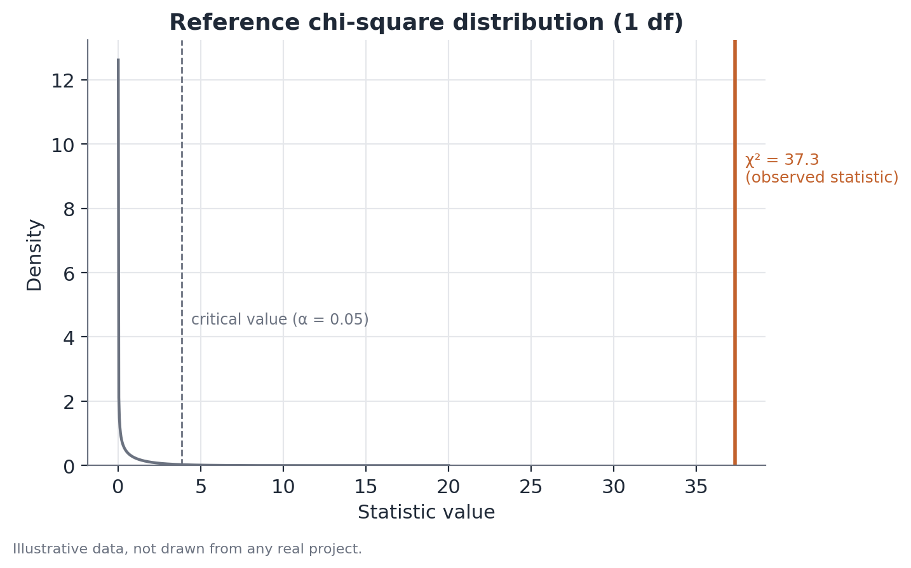

# Sample Ratio Mismatch (SRM) test

*Assumes the A/B testing fundamentals (randomization, groups, primary
metric, hypothesis testing) — see
[A/B testing fundamentals](./ab-testing.md). This document covers
specifically the allocation-integrity check that must precede any effect
reading.*

## Concept

A Sample Ratio Mismatch (SRM) test checks whether the observed proportion of
units in each experiment arm is compatible with the proportion planned at
assignment. At its core, it's a goodness-of-fit test: observed counts are
compared against expected counts under the design's nominal split (50/50,
90/10, or any other), using a chi-square test — or, equivalently for two
groups, an exact binomial test.

The reason it exists as a separate check, rather than being folded into the
effect test, is that it answers a logically prior question: "is the
comparison I'm about to make even valid?" A successful effect test means
nothing if the groups being compared weren't formed the way the analysis
assumes.

## Mathematical formulation

Let there be $k$ experiment arms, with planned proportions
$\pi_1, \pi_2, \ldots, \pi_k$ (summing to 1) and observed counts
$o_1, o_2, \ldots, o_k$, with total $N = \sum_i o_i$. The expected count in
each arm under the planned proportion is:

$$
e_i = \pi_i \cdot N
$$

The chi-square goodness-of-fit statistic is:

$$
\chi^2 = \sum_{i=1}^{k} \frac{(o_i - e_i)^2}{e_i}
$$

Under $H_0$ (the real proportion matches the plan), $\chi^2$ approximately
follows a chi-square distribution with $k-1$ degrees of freedom. For two
arms ($k=2$), this reduces to 1 degree of freedom, and the test is
equivalent to a two-sided binomial test comparing $o_1/N$ against $\pi_1$:

$$
z = \frac{\hat{p}_1 - \pi_1}{\sqrt{\pi_1(1-\pi_1)/N}}, \qquad z^2 = \chi^2 \text{ (1 df)}
$$

where $\hat{p}_1 = o_1/N$ is the observed proportion in the first arm.

## Assumptions

- **The planned proportion is known and fixed** — it must be set explicitly
  before the experiment, not inferred after the fact.
- **The counts are independent of each other** — each unit contributes to
  exactly one arm, with no double counting or units shared across arms.
- **The chi-square test assumes reasonably large expected counts** (a common
  rule of thumb: a minimum expected count of 5 per cell) for the asymptotic
  approximation to be reliable; with very small counts, an exact binomial
  test is preferable.
- **The check should cover the full eligible population**, not a sample
  filtered after assignment — filtering before checking can mask exactly
  the kind of differential loss the test is meant to detect.

## Hypotheses

$$
H_0: \pi_i = \pi_i^{planned} \text{ for all } i
\qquad
H_1: \pi_i \neq \pi_i^{planned} \text{ for at least one } i
$$

The significance level used in practice is typically stricter than the
standard 0.05 used for effect tests — values like $\alpha = 0.001$ are
common, reflecting an asymmetry of costs: a false positive here (declaring
an SRM when there isn't one) costs an investigation; a false negative
(missing a real SRM) contaminates every subsequent reading of the
experiment.

## Interpretation

A significant SRM is evidence that the assignment mechanism, or the
counting process, isn't producing the intended proportion — it is not, on
its own, a diagnosis of the cause. The most common causes include:

- latency differences between the tested versions, causing one to drop more
  events to timeouts before logging;
- bot, fraud, or traffic-quality filters applied asymmetrically across arms;
- bugs in the user-to-group hashing/assignment code itself;
- instrumentation issues that log one arm incompletely.

The practical implication of a detected SRM is direct: any effect estimated
in the experiment is not interpretable until the cause is identified and
fixed (or until the experiment is rerun). This holds even if the effect
looks "reasonable" or matches the team's prior expectation — an SRM
undermines the fundamental premise of comparability between groups, which is
exactly what gives the effect test its causal reading.

## Limitations

- The test detects deviation in the aggregate proportion; it does not
  guarantee the absence of SRM within specific subgroups (by platform,
  region, acquisition channel) — an SRM can be "hidden" in the overall
  aggregate when deviations in opposite directions cancel out across
  segments.
- It doesn't locate the cause — it only flags that a problem exists.
  Follow-up investigation (comparing assignment logs, per-segment drop
  rates, load timing) is a separate manual step.
- An SRM can be intermittent, present only during part of the experiment's
  run; looking at the observed proportion over time, rather than only the
  cumulative total at the end, helps identify that.
- With few arms and a very small sample, the chi-square approximation can be
  unreliable — in those cases, an exact binomial test (or Fisher's exact
  test, for more than two arms) is more appropriate.

## Example

A subscription app plans to test a new onboarding screen for 50% of new
users, keeping the other 50% on the current screen. After two weeks, the
team logs the following counts:

| Arm | Planned | Observed |
|---|---|---|
| Control (current screen) | 50% | 10,432 |
| Treatment (new screen) | 50% | 9,568 |
| Total | 100% | 20,000 |

Under $H_0$, the expected count in each arm is $e = 0.5 \times 20{,}000 = 10{,}000$. The chi-square statistic:

$$
\chi^2 = \frac{(10{,}432 - 10{,}000)^2}{10{,}000} + \frac{(9{,}568 - 10{,}000)^2}{10{,}000}
= \frac{186{,}624}{10{,}000} + \frac{186{,}624}{10{,}000} \approx 37.3
$$

With 1 degree of freedom and $\chi^2 \approx 37.3$, the p-value is
extremely small — many orders of magnitude below the commonly used 0.001
threshold. The team pauses any effect reading and investigates. They find
that the new screen loads a heavier visual component, and users on slow
connections are being marked "not eligible" more often in the treatment arm
due to a loading timeout in the experiment's instrumentation — a
differential sample loss that produces exactly the observed pattern. After
fixing the timeout, the experiment is restarted from scratch, and only then
is the effect reading treated as reliable.
