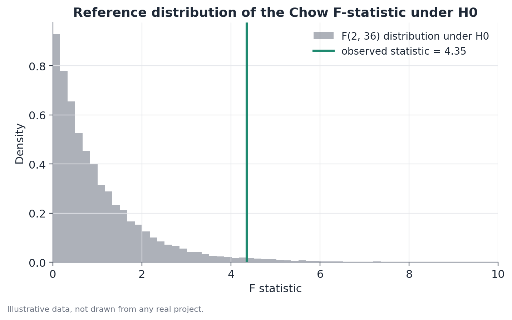

# Structural Break Test (Chow-Type)

## Concept

The Chow test (Chow, 1960) checks whether a statistical model — typically a
linear regression — has stable coefficients across an entire time series, or
whether those coefficients change at a specific point, known a priori. It's
the canonical tool for answering "did something structurally different
happen starting from this known date?", in contrast with methods that detect
multiple breaks at unknown dates (such as Bai-Perron), which solve a broader
and more data-demanding problem.

The logic is that of a nested F-test: a "restricted" model, which imposes the
same coefficients before and after the cutoff date, is compared to an
"unrestricted" model, which allows different coefficients in each of the two
periods. If the unrestricted model reduces the fitting error by more than
would be expected purely from the mechanical gain of having more free
parameters, that's evidence against the stability hypothesis.

## Mathematical formulation

Consider the linear regression model:

$$y_t = \beta_0 + \beta_1 x_t + \varepsilon_t, \quad t = 1, \dots, n$$

Where $y_t$ is the variable of interest at time $t$, $x_t$ are the
explanatory variables, $\beta_0$ and $\beta_1$ are the coefficients to
estimate, and $\varepsilon_t$ is the random error.

Let $t^*$ be the a priori known break point, splitting the sample into two
subperiods of sizes $n_1$ (before $t^*$) and $n_2$ (from $t^*$ onward), with
$n_1 + n_2 = n$.

Define:

- $RSS_p$ — the residual sum of squares of the model fitted to the
  **entire** sample (the restricted model, which assumes equal coefficients
  in both periods).
- $RSS_1$ — the residual sum of squares of the model fitted to the first
  subperiod only.
- $RSS_2$ — the residual sum of squares of the model fitted to the second
  subperiod only.
- $k$ — the number of parameters estimated in each regression (here,
  $k = 2$: intercept and slope).

The Chow test statistic is:

$$F = \frac{\left(RSS_p - (RSS_1 + RSS_2)\right) / k}{\left(RSS_1 + RSS_2\right) / (n - 2k)}$$

Where:

- the numerator measures how much the error dropped by allowing different
  coefficients in the two periods, adjusted by the additional degrees of
  freedom used ($k$);
- the denominator is the average residual error of the unrestricted model,
  adjusted by the remaining degrees of freedom ($n - 2k$).

Under the null hypothesis of coefficient stability, $F$ approximately follows
an $F(k, \, n - 2k)$ distribution.

## Assumptions

- **The break date is known before looking at the data.** This is the most
  important assumption, and the one most often violated in practice. If the
  date is chosen by visually inspecting the series (looking for where it
  "seems" to have changed), the resulting p-value no longer carries the
  standard interpretation — the correct procedure in that case is different
  (unknown-break tests, such as Andrews' supF, or multiple-break methods).
- **Homoscedastic, non-autocorrelated errors within each subperiod**, the
  standard condition for ordinary least-squares regression. When this
  assumption fails — common in economic time series — the standard errors
  underlying the F-test can be wrong; robust forms of the test (using
  heteroscedasticity- and autocorrelation-consistent standard errors, such
  as Newey-West) are preferable in those cases.
- **A minimum sample size in each subperiod.** With $n_1$ or $n_2$ small
  relative to $k$, the estimate in each segment becomes unstable and the
  test loses power — the ability to detect a real break that does exist
  drops proportionally.
- **Correct functional form of the model in each period.** The test compares
  the stability of a specific model's coefficients (say, linear); if the
  true relationship changes in a nonlinear way the linear model doesn't
  capture, the test may fail to detect a real change, or detect a change
  that's actually just a specification problem.

## Hypotheses

- $H_0$: the coefficients $\beta_0$ and $\beta_1$ are the same before and
  after $t^*$ — there is no structural break at the tested date.
- $H_1$: at least one coefficient differs between the two periods.
- Test statistic: $F$, as defined above.
- Reference distribution under $H_0$: $F(k, \, n - 2k)$.
- Conventional significance level: $\alpha = 0.05$, though context (sample
  size, number of tests run) should inform this choice.
- Decision rule: reject $H_0$ (evidence of a break) when the p-value
  associated with $F$ is below $\alpha$.

## Interpretation

Rejecting $H_0$ is evidence that the data-generating process changed pattern
at the tested date — not necessarily that the tested date **caused** the
change. The Chow test evaluates temporal coincidence with statistical
precision, but causal attribution requires more:

- **Isolating concurrent events.** If another relevant event occurred close
  to the same date (a simultaneous currency crisis alongside a regulatory
  change, for instance), the test cannot distinguish which of the two — or
  whether both combined — produced the observed change.
- **Distinguishing a level shift from a slope shift.** A break can show up
  as a discrete jump in the series' level (the intercept changes, the slope
  stays the same), as a change in the growth rate (the slope changes), or as
  both at once. The test's specification (which coefficients are left free
  before/after) determines what kind of change can be detected — it's
  always worth reporting not just significance, but the magnitude and
  direction of the change in each coefficient.
- **Statistical significance is not the same as practical magnitude.** With
  large samples, small changes with no practical relevance can produce very
  low p-values. Reporting the estimated size of the change — not just the
  p-value — is essential for an honest interpretation.

## Limitations

- **This is not a method for detecting unknown breaks.** The Chow test
  assumes $t^*$ is given externally. Applying it repeatedly, testing several
  candidate dates and reporting only the most significant one, seriously
  inflates the false-positive rate (it's effectively an uncorrected
  multiple-comparisons problem) — for that use case, the correct procedure
  is a method designed for unknown break-point search.
- **Does not control for concurrent events in the same time window.** A
  significant result is compatible with multiple simultaneous causal
  explanations; the test alone does not separate one from another.
- **Sensitive to model specification.** A poorly specified functional form
  can produce a "spurious" break (the linear model fits both periods poorly
  in different ways, even without a real change in the process) or mask a
  real one.
- **Limited power with little data in either subperiod.** A break near the
  beginning or end of the series is particularly hard to detect with
  confidence.

## Example

Consider a hypothetical study on the participation rate of a specific
demographic group in a professional training program, measured monthly over
40 months. A new incentive policy, with a known start date, took effect in
month 25.

Before the policy (months 1-24), the participation rate grows at an
estimated average pace of 0.15 percentage points per month. After the policy
(months 25-40), the estimated pace rises to 0.55 percentage points per
month, and the series' average level also rises noticeably.

Fitting the three models:

- Restricted model (the entire series, a single trend coefficient):
  $RSS_p = 210.4$
- First-subperiod model: $RSS_1 = 62.1$
- Second-subperiod model: $RSS_2 = 58.7$

With $k = 2$ and $n = 40$:

$$F = \frac{(210.4 - (62.1 + 58.7)) / 2}{(62.1 + 58.7) / (40 - 4)} = \frac{44.8}{3.36} \approx 4.35$$

Comparing against the $F(2, 36)$ distribution, this statistic corresponds to
a p-value of approximately 0.021 — below 0.05. $H_0$ is rejected: there is
statistical evidence that the series' pattern changed in month 25.

Careful interpretation: this result is consistent with the incentive policy
having changed the series' pattern, but it does not prove it on its own. If,
say, a mass-media awareness campaign also started around month 25,
coincidentally or not, the Chow test on its own cannot separate the effect of
one from the other — that separation would require an additional design,
such as comparing the same series across regions that received the policy
but not the campaign, and vice versa.

```python
import numpy as np
import statsmodels.api as sm
from scipy import stats

def chow_test(y, x, break_index):
    X = sm.add_constant(x)
    rss_p = sm.OLS(y, X).fit().ssr

    X1 = sm.add_constant(x[:break_index])
    X2 = sm.add_constant(x[break_index:])
    rss1 = sm.OLS(y[:break_index], X1).fit().ssr
    rss2 = sm.OLS(y[break_index:], X2).fit().ssr

    k = X.shape[1]
    n = len(y)
    f_stat = ((rss_p - (rss1 + rss2)) / k) / ((rss1 + rss2) / (n - 2 * k))
    p_value = 1 - stats.f.cdf(f_stat, k, n - 2 * k)
    return f_stat, p_value
```


