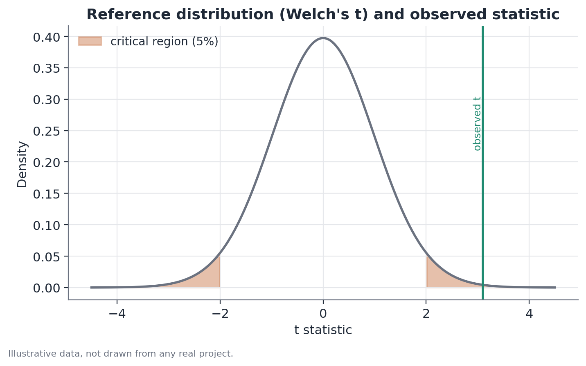

# Welch's t-test

## Concept

Welch's t-test evaluates whether the means of two independent populations
are statistically different, based on two random samples, without assuming
the two populations share the same variance. It's a generalization of
Student's two-sample t-test that resolves the so-called Behrens-Fisher
problem: how to test for a difference in means between two normal
populations with possibly different, unknown variances.

The core statistical intuition is this: uncertainty about a sample mean
depends on two things — how much variability exists within the group, and
how many observations were used to estimate that mean. When the two groups
have different variances and different sample sizes, the correct way to
combine that uncertainty for testing the difference of means isn't symmetric
between the groups — and that's exactly what Welch models, without forcing
an equal-variance assumption that's rarely justifiable a priori.

## Mathematical formulation

Let there be two independent samples:

- Group 1: $n_1$ observations, sample mean $\bar{x}_1$, sample variance
  $s_1^2$.
- Group 2: $n_2$ observations, sample mean $\bar{x}_2$, sample variance
  $s_2^2$.

Welch's test statistic is:

$$
t = \frac{\bar{x}_1 - \bar{x}_2}{\sqrt{\dfrac{s_1^2}{n_1} + \dfrac{s_2^2}{n_2}}}
$$

The numerator is the observed difference between the sample means. The
denominator is the standard error of that difference, computed by summing
the variance of each sample mean ($s_i^2/n_i$) separately — without pooling
the two variances into a single combined variance, the way Student's test
does.

The degrees of freedom aren't $n_1 + n_2 - 2$, as in Student's test. Instead,
the Welch-Satterthwaite approximation is used:

$$
\nu \approx \frac{\left(\dfrac{s_1^2}{n_1} + \dfrac{s_2^2}{n_2}\right)^2}
{\dfrac{(s_1^2/n_1)^2}{n_1 - 1} + \dfrac{(s_2^2/n_2)^2}{n_2 - 1}}
$$

What matters here isn't memorizing the formula but understanding the idea:
$\nu$ is an *effective* number of degrees of freedom, typically non-integer,
that weights how much each group contributes to the total uncertainty in the
standard error. A small group with high variance "pulls" $\nu$ down —
reducing the test's confidence — in a way that's more faithful to reality
than the simple degrees-of-freedom count used by Student's test.

## Assumptions

1. **Independence**: observations within each group, and between the two
   groups, are independent of one another. When there's dependence structure
   (several observations from the same sampling unit, or repeated
   measurements on the same person, say), the assumption is violated and the
   computed standard error understates the true uncertainty — cluster-robust
   standard-error methods are more appropriate in that case.
2. **Approximate normality, or a large sample**: the test assumes the sample
   means are approximately normally distributed. That holds exactly if the
   underlying data are normal, and approximately for large samples, by the
   Central Limit Theorem, even when the underlying data aren't normal. With
   small samples and heavily skewed data, the approximation can break down —
   it's worth inspecting the data's distribution or considering
   non-parametric alternatives (like the Mann-Whitney test) in those cases.
3. **Does not require equal variances** — that's precisely the assumption
   Welch relaxes relative to Student's t-test. There's no need to test for
   equal variances before choosing Welch: since Welch reduces to Student's
   test when the variances really are equal (with only a small efficiency
   loss in that case), it's safe to use Welch by default, even when it isn't
   known whether the variances are equal.

## Hypotheses

- $H_0$: $\mu_1 = \mu_2$ (the population means are equal).
- $H_1$: $\mu_1 \neq \mu_2$ (two-tailed test, the most common case), or
  $\mu_1 > \mu_2$ / $\mu_1 < \mu_2$ for one-tailed tests, when there's a
  specific direction of interest defined before looking at the data.
- Significance level ($\alpha$): typically 0.05, but should be chosen
  according to context — for higher-stakes decisions or with multiple
  simultaneous comparisons, a more conservative $\alpha$ (0.01, say) is more
  appropriate.
- Test statistic: $t$, computed as above, compared against a Student's t
  distribution with $\nu$ degrees of freedom.
- P-value: the probability of observing a t statistic as extreme or more
  extreme than the one observed, assuming $H_0$ is true.
- Confidence interval: a 95% CI for the difference $\mu_1 - \mu_2$ is given
  by $(\bar{x}_1 - \bar{x}_2) \pm t_{\nu, 0.975} \cdot \text{SE}$, where SE is
  the standard error of the difference (the denominator of the t statistic)
  and $t_{\nu, 0.975}$ is the appropriate quantile of the reference
  distribution.

## Interpretation

Rejecting $H_0$ with a low p-value is statistical evidence that the
population means differ — it isn't proof, and it says nothing about why the
difference exists. A t-test (Welch or Student) measures the association
between belonging to a group and the average value of a variable; it doesn't
isolate why that association exists, unless the groups were defined by
controlled random assignment (as in an experiment).

It's essential to distinguish statistical significance from practical
relevance. With very large samples, differences in means that are
practically irrelevant can still be statistically significant. With small
samples, large differences may fail to reach significance simply for lack of
statistical power. Always report the effect size (the difference in means
itself, in its original unit, and ideally a confidence interval too)
alongside the p-value.

## Limitations

- The test compares only means — two distributions can have equal means and
  completely different shapes (variance, skew). If the question is about the
  entire distribution, not just the mean, methods that look at other points
  of the distribution (like quantile decompositions) are more informative.
- Multiple testing: running Welch repeatedly across many subgroups or many
  time periods without correction increases the chance of finding a
  "significant" difference purely by chance. In analyses with many
  simultaneous comparisons, it's worth considering a correction (Bonferroni
  or false-discovery-rate control, for instance).
- Extremely small samples (fewer than about 10 observations per group, say)
  make the Welch-Satterthwaite approximation less reliable — in that regime,
  exact or permutation-based methods are preferable.
- The test alone doesn't handle panel data or correlated time series — each
  application of the test assumes fresh, independent samples.

## Example

Consider a hypothetical scenario: an operations team wants to know whether
average handling time (in minutes) differs between two branches of a support
network, Branch A and Branch B, which have different call volumes and
internal processes.

Data (invented):

- Branch A: $n_1 = 40$, $\bar{x}_1 = 8.1$ min, $s_1 = 1.3$ min.
- Branch B: $n_2 = 95$, $\bar{x}_2 = 9.6$ min, $s_2 = 3.4$ min.

**Step 1 — standard error of the difference:**

$$
\text{SE} = \sqrt{\frac{1.3^2}{40} + \frac{3.4^2}{95}} = \sqrt{0.0423 + 0.1217} \approx 0.405
$$

**Step 2 — t statistic:**

$$
t = \frac{9.6 - 8.1}{0.405} \approx \frac{1.5}{0.405} \approx 3.10
$$

**Step 3 — effective degrees of freedom** (applying Welch-Satterthwaite to
the same numbers): this yields $\nu \approx 61.4$ — a non-integer number,
pulled down relative to $n_1 + n_2 - 2 = 133$ because Branch B, despite
having more observations, also has much higher variability, which reduces
the effective confidence in the comparison.

**Step 4 — p-value:** comparing $t \approx 3.10$ against $\nu \approx 61.4$
degrees of freedom yields a two-tailed p-value well below 0.01 — strong
evidence that the observed difference isn't just sampling noise.

**Step 5 — confidence interval:** the 95% CI for the difference in means
comes out to roughly 0.7 to 2.3 minutes — Branch B likely has a longer
average handling time, and the interval gives a sense of how large that
difference probably is, not just that it exists.

The figure below shows the reference distribution (the t distribution with
Welch's degrees of freedom) and where the observed statistic falls relative
to the 5% critical region:

