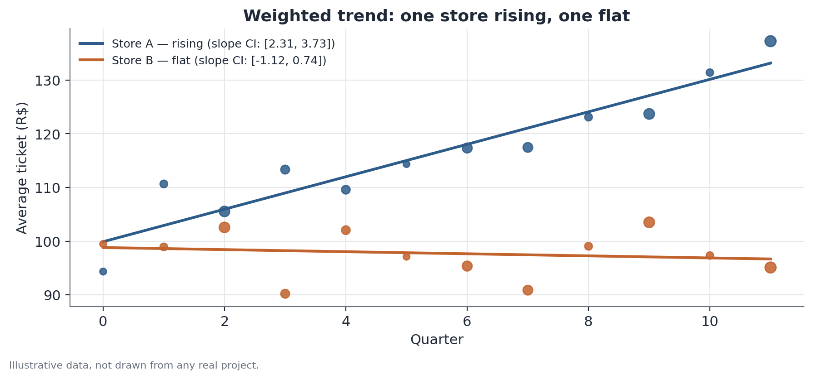
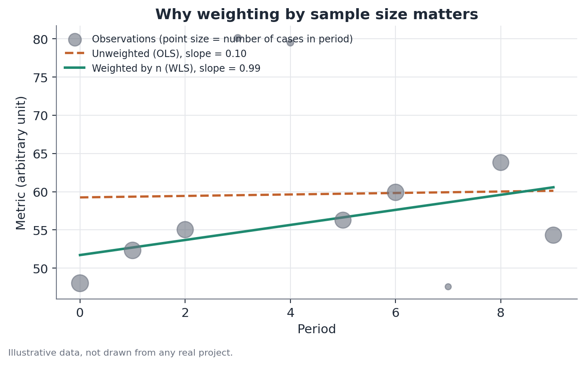

# Weighted least squares trend with confidence-interval classification

## Concept

Weighted least squares (WLS) is an extension of ordinary linear regression (OLS) that allows different weights to be assigned to each observation when fitting a line. In the context of trend analysis over time, the most common use is weighting each period by the number of observations (sample size) that back the measured metric in that period — explicitly acknowledging that a point calculated from 400 cases is a more precise estimate (has lower variance) than one calculated from 20 cases, and should therefore carry more influence over the fitted line.

The statistical motivation is known heteroscedasticity: when the measurement error variance of each point is not constant, but is approximately proportional to the inverse of that point's sample size (a direct consequence of the law of large numbers — the variance of a sample mean is $\sigma^2/n$), OLS still produces unbiased estimates of the slope coefficient, but it stops being the minimum-variance estimator (it's no longer BLUE — *Best Linear Unbiased Estimator*, per the generalized Gauss-Markov theorem). WLS, using weights proportional to $n$, restores that efficiency property.

The second part of the method — **trend classification** — converts the estimated slope and its confidence interval into a categorical label (rising / falling / stable) using a simple, deterministic rule: the position of the confidence interval relative to zero. Formally, this rule is equivalent to a two-sided hypothesis test on the slope coefficient at a significance level corresponding to the chosen confidence interval.

## Mathematical formulation

**Model.** For a unit (store, player, region) with observations across $T$ periods, the weighted linear trend model is

$$
y_t = \alpha + \beta t + \varepsilon_t, \qquad t = 1, \dots, T
$$

where $y_t$ is the observed metric in period $t$, $\alpha$ is the intercept, $\beta$ is the slope (the quantity of interest — the trend), and $\varepsilon_t$ is the error term, with $\mathrm{Var}(\varepsilon_t) = \sigma^2/w_t$, where $w_t$ is period $t$'s weight — typically $w_t = n_t$, the number of observations underlying $y_t$.

**WLS estimator.** The coefficients that minimize the weighted sum of squared residuals,

$$
\hat\alpha, \hat\beta = \arg\min_{\alpha,\beta} \sum_{t=1}^T w_t \big(y_t - \alpha - \beta t\big)^2
$$

have a closed-form solution analogous to OLS, but with means and products weighted:

$$
\hat\beta = \frac{\sum_t w_t (t - \bar t_w)(y_t - \bar y_w)}{\sum_t w_t (t - \bar t_w)^2}, \qquad \hat\alpha = \bar y_w - \hat\beta \, \bar t_w
$$

where $\bar t_w = \dfrac{\sum_t w_t t}{\sum_t w_t}$ and $\bar y_w = \dfrac{\sum_t w_t y_t}{\sum_t w_t}$ are the weighted means of $t$ and $y$.

**Standard error of the slope.** Under the assumption that the weights correctly capture the variance structure, the standard error of $\hat\beta$ is

$$
\mathrm{SE}(\hat\beta) = \sqrt{\dfrac{\hat\sigma^2}{\sum_t w_t (t-\bar t_w)^2}}, \qquad
\hat\sigma^2 = \dfrac{\sum_t w_t \big(y_t - \hat\alpha - \hat\beta t\big)^2}{T - 2}
$$

with $T-2$ degrees of freedom (two estimated parameters: $\alpha$ and $\beta$).

**Confidence interval and classification.** The $(1-\alpha_{\text{sig}})\times 100\%$ confidence interval for $\beta$ is

$$
\hat\beta \pm t^*_{T-2,\, 1-\alpha_{\text{sig}}/2} \times \mathrm{SE}(\hat\beta)
$$

where $t^*$ is the critical value of the Student's t-distribution with $T-2$ degrees of freedom. The classification rule is:

$$
\text{Trend} =
\begin{cases}
\text{rising} & \text{if the CI's lower bound} > 0 \\
\text{falling} & \text{if the CI's upper bound} < 0 \\
\text{stable} & \text{if the CI contains zero}
\end{cases}
$$

This rule is mathematically equivalent to rejecting (or not) $H_0: \beta=0$ in favor of $H_1: \beta \neq 0$ at significance level $\alpha_{\text{sig}}$, and then using the sign of $\hat\beta$ when $H_0$ is rejected to decide between "rising" and "falling."

## Assumptions

- **Weights correctly reflect each point's relative precision.** Using $n_t$ (observation count) as the weight assumes the variance of $y_t$ is approximately proportional to $1/n_t$ — valid when $y_t$ is itself an average or proportion computed over $n_t$ cases with individual variance reasonably constant across periods. If within-period individual variability also changes over time, the ideal weights are not simply $n_t$.
- **Linearity.** The underlying trend is modeled as a straight line; trends with meaningful curvature (acceleration, deceleration, unremoved seasonality) are poorly captured by this simple model, and the rising/falling/stable classification may not reflect the series' actual behavior.
- **Errors uncorrelated across periods, conditional on the weights.** If residual temporal autocorrelation is present (for example, a good quarter tends to be followed by another good quarter, beyond what the linear trend already captures), standard WLS standard errors underestimate the true uncertainty — in that case, autocorrelation-robust standard errors (Newey-West) are more appropriate.
- **No structural outliers unrelated to the trend.** A single period with an extreme value (even if based on many observations, and therefore carrying high weight) can distort the estimated slope more than is reasonable; it's worth inspecting visually before blindly trusting the automatic classification.

## Hypotheses

- $H_0: \beta = 0$ — there is no linear trend (the metric does not vary systematically over time, given the weighted precision of the available data).
- $H_1: \beta \neq 0$ — a linear trend exists (positive or negative).

Typical significance level used: 5% (corresponding to a 95% CI), though the level chosen is an editorial/operational decision — a more permissive level (10%) classifies more series as having a defined trend (fewer "stable"), at the cost of more false positives; a stricter level (1%) does the opposite.

## Interpretation

The slope $\hat\beta$ quantifies the estimated average change in the metric per unit of time (per quarter, for example), under the linearity assumption. The rising/falling/stable classification is a simplified operational translation of that slope and its uncertainty — not a statement about the cause of the trend. A statistically confirmed upward trend doesn't say why the metric is rising (a mix shift, seasonality, a deliberate action, an external factor); it only says the statistical evidence is sufficient to distinguish the slope from zero, given the available data volume.

It's important to communicate "stable" correctly: it means insufficient evidence for a defined trend, not proof that the metric truly did not change. Short series (few periods) or ones with little data per period tend to produce more "stable" classifications simply from lack of statistical power, even when a real underlying trend exists.

## Limitations

- **Sensitivity to the chosen confidence level.** Different CI choices (90%, 95%, 99%) produce different classifications for the same data, especially for series whose slope sits near the significance boundary — it's worth reporting the slope and its full CI, not just the categorical label.
- **Limited statistical power with few periods.** With small $T$ (three, four points), the confidence interval tends to be wide even with high weights, making it hard to distinguish a real, small trend from noise.
- **A linear model may not fit non-linear patterns.** A metric that rises and then flattens out (an S-curve) might be classified as "rising" overall even though it has already leveled off in the most recent periods — worth supplementing with visual inspection or a local trend model (e.g., local regression, splines) when the pattern looks suspicious.
- **Multiple testing.** Classifying many units simultaneously (hundreds of stores, say) at a 5% significance level each generates, by chance alone, an expected number of spurious "rising" or "falling" classifications — if the goal is to flag genuinely unusual units, it's worth considering a multiple-comparisons correction.

## Example

Consider two hypothetical stores from a retail chain, each with twelve quarters of average-ticket data, with transaction counts (the weight) varying substantially across quarters — a common situation when some quarters coincide with high-volume promotional dates and others are slow periods.

**Store A** — average ticket rising consistently, with a high sample weight in most quarters. WLS fit:
- $\hat\beta = 2.40$ (dollars per quarter)
- $\mathrm{SE}(\hat\beta) = 0.58$
- $t^*_{10, 0.975} \approx 2.23$
- 95% CI: $2.40 \pm 2.23 \times 0.58 = [1.11,\, 3.69]$

Since the lower bound (1.11) exceeds zero, Store A is classified as **rising**.

**Store B** — average ticket bouncing around with no clear pattern, with several low-weight quarters. WLS fit:
- $\hat\beta = 0.05$
- $\mathrm{SE}(\hat\beta) = 0.56$
- 95% CI: $0.05 \pm 2.23 \times 0.56 = [-1.20,\, 1.30]$

Since the interval contains zero, Store B is classified as **stable** — even though the point estimate is technically positive, there isn't enough statistical evidence, given the observed pattern of sample precision, to distinguish it from zero.

**Contrast with unweighted OLS.** If Store B's same data were fit without weighting (plain OLS), the few low-volume quarters — which happen to show more extreme values — would carry equal weight to the high-volume quarters, potentially producing a quite different estimated slope (and a standard error that doesn't correctly reflect the points' unequal precision). This is exactly the kind of distortion that weighting by sample size exists to correct.

