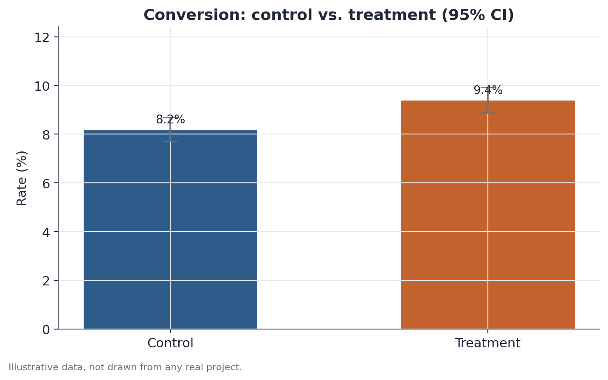

# A/B testing fundamentals

## 1. What problem does this solve?

A product team changes something — a button's copy, the order of two signup
steps, a new recommendation algorithm — and wants to know whether it actually
improves the metric that matters, or whether any change observed after launch
is just day-to-day noise. Comparing "before" and "after" doesn't settle this
on its own, because plenty of things besides the change under test also move
over time (seasonality, a marketing push, a holiday). An A/B test settles it
by comparing two versions at the same time, in groups of users formed by
random assignment.

## 2. Intuition

If you randomly split a large group of users into two, the two subgroups tend
to look alike on everything — age, device, purchase habits, how good a day
they're having — except for the one thing you deliberately made different
between them: which version of the product each one saw. If the average
outcome then differs between the groups, the simplest explanation is the
change itself, not some pre-existing difference between the users. That
logic — simultaneous comparison with random assignment — is what makes an A/B
test a more trustworthy read than comparing two different time periods.

## 3. Plain explanation

After the experiment runs long enough, you compute the difference between the
treatment group's average metric (or proportion) and the control group's.
That observed difference is almost never exactly zero, even when the change
has no real effect at all — there's always sampling variation. The hypothesis
test asks: is this difference large enough, given the group sizes and the
metric's variability, that it's implausible to explain by chance alone? The
95% confidence interval around the difference shows the range of plausible
values for the true effect, not just a single number.



## 4. A simple conceptual example

Picture a site testing a new "checkout" button color. Half of visitors,
chosen at random, see the usual blue button; the other half see a new green
one. After two weeks, you compare the conversion rate between the two groups.
Because the split was random, any consistent difference large enough between
the groups is likely to come from the button color — not from one group
happening, by coincidence, to contain more people already inclined to buy.

## 5. How it works, broadly

1. Before running the experiment, define a primary metric (say, conversion
   rate) and the sample size needed.
2. Randomly assign each eligible user to control or treatment, usually in a
   fixed split (50/50 is common, but not required).
3. Run the experiment for a pre-defined period, without repeatedly peeking at
   the result and making decisions along the way.
4. Compute the difference between the two groups' means (or proportions),
   the standard error of that difference, and from there the test
   statistic, the p-value, and the 95% confidence interval.
5. Before trusting the result, check whether randomization actually worked
   as planned — this is where complementary checks such as a Sample Ratio
   Mismatch test and a covariate balance check come in.

## 6. What the result means

A low p-value (typically below 0.05) indicates a difference this large would
be unusual if the change truly had no effect — evidence in favor of a real
effect. The confidence interval shows the plausible magnitude of that
effect: a narrow interval sitting away from zero suggests a real, fairly
well-estimated effect; a wide interval, even one that excludes zero, means
the exact size of the effect is still uncertain.

## 7. How to interpret it

Statistical significance is not the same as practical importance: a 0.1
percentage-point effect can be statistically significant with a large enough
sample, yet irrelevant to the business decision. And "not significant" is
not the same as "no effect" — it can simply mean the experiment lacked
enough sample to detect an effect of the size that actually exists. Always
read the effect size and its confidence interval alongside the p-value,
never the p-value on its own.

## 8. When it's useful

Whenever it's possible to randomize who receives each version of a product,
process, or message, and there is a clear primary metric to judge the
outcome by — typical of interface tests, recommendation algorithms, pricing
policies, or signup flows. These fundamentals — effect size, standard error,
95% CI, hypothesis testing — are the starting point for nearly every more
advanced experiment reading, including randomization-integrity checks,
covariate adjustment, and non-inferiority testing.

## 9. Important caveats

- Validity depends on randomization actually having worked — never assume
  that without checking (see Sample Ratio Mismatch).
- Repeatedly peeking at results while the experiment runs and stopping as
  soon as it "turns significant" inflates the false-positive rate; fix the
  sample size and the run period before starting.
- Testing many secondary metrics at once raises the odds of finding
  something "significant" by chance; treat secondary findings as hypotheses
  for the next experiment, not as conclusions.
- A statistically significant win on one metric can come paired with a loss
  on another, guardrail metric — that's exactly what non-inferiority testing
  exists to check.

## 10. A small worked example

A site tests a new checkout button against the current one, with 12,000
visitors in each group. The control group converts at 8.2%; the treatment
group converts at 9.4% — a difference of 1.2 percentage points, or roughly a
15% relative lift. The standard error of the difference, computed from each
group's size and the variability of a conversion rate, yields a z-statistic
of about 3.0 and a p-value below 0.01. The 95% confidence interval for the
difference runs roughly from 0.4 to 2.0 percentage points — entirely above
zero, reinforcing that the gain is unlikely to be sampling noise alone.

## 11. Simple code example

```python
import numpy as np
from statsmodels.stats.proportion import proportions_ztest, confint_proportions_2indep

conversions = np.array([984, 1128])   # illustrative: control, treatment
visitors = np.array([12000, 12000])   # illustrative

statistic, p_value = proportions_ztest(conversions, visitors)
ci_low, ci_high = confint_proportions_2indep(
    conversions[1], visitors[1], conversions[0], visitors[0], method="wald"
)

print(f"z = {statistic:.2f}, p-value = {p_value:.4f}")
print(f"95% CI for the difference: [{ci_low:.4f}, {ci_high:.4f}]")
```

The two-proportion test collapses, into a single statistic, whether the
observed gap between the two groups' conversion rates is too large to be
explained by sampling variation alone.
