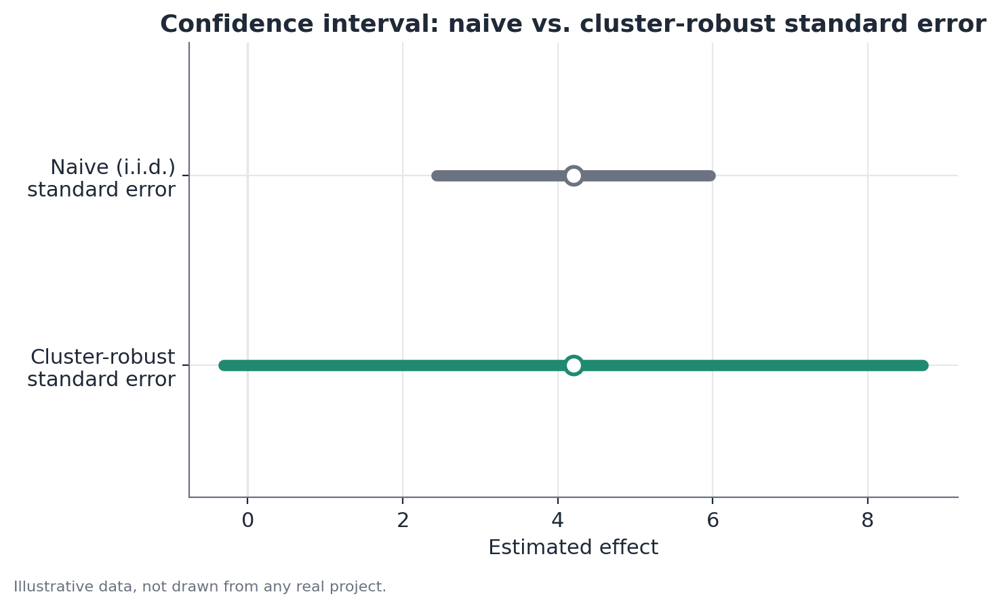

# Cluster-robust standard errors

## 1. What problem does this solve?

The standard way of computing a standard error assumes every observation in
the sample carries new, independent information. But what happens when many
observations come from the same group — the same store, the same classroom,
the same region — and resemble each other for reasons that have nothing to
do with the variable you are testing? Treating those observations as
independent makes the standard error look smaller than it really is, and can
lead to calling something "significant" when it isn't.

## 2. Intuition

Picture measuring customer satisfaction across 20 stores, with 50 responses
per store — 1,000 observations in total. If each store has its own service
culture, manager, location, and clientele, responses from the same store
tend to look alike because of those shared factors, not just coincidence.
In practice, you don't have 1,000 independent pieces of information — you
have something closer to 20 "blocks" of information, each made of correlated
responses. Computing the standard error as if these were 1,000 independent
observations overstates how precise the estimate really is.

## 3. Simple explanation

Each new observation within the same cluster carries less additional
information than an observation from a different cluster, because part of
what it shows was already predictable from the other observations in that
same group. The cluster-robust standard error recognizes this internal
correlation and adjusts the calculation to reflect the effective number of
"independent units of information" — which sits much closer to the number
of clusters than to the total number of observations.

## 4. Easy conceptual example

A gym chain tests a new training program in 8 locations (treatment) against
another 8 locations (control), with about 40 members per location. Members
at the same location share the same instructor, the same peak hours, the
same neighborhood — factors that affect the outcome regardless of the
program being tested. A standard error that ignores this treats the 640
members as 640 independent sources of evidence; in practice, the real
evidence is much closer to coming from 16 locations.

## 5. How it works, broadly

Instead of assuming model errors are independent across all observations,
the cluster-robust standard error allows errors to be correlated within
each cluster (without requiring a specific form for that correlation) and
only assumes independence **between** different clusters. The
variance-covariance matrix of the coefficients is recomputed by summing
contributions cluster by cluster, rather than observation by observation —
which typically produces a larger (more conservative, more honest) standard
error than the naive calculation.

## 6. What the result means

The point estimate of the effect does not change — only the standard error
around it. A confidence interval computed with cluster-robust standard
errors is wider, reflecting more faithfully the real uncertainty of the
estimate, given that the effective amount of independent information is
smaller than the raw row count in the dataset.

## 7. How to interpret it

If a result was "significant" under the naive standard error and stops being
significant under the cluster-robust one, that is not a flaw of the method —
it is the correction showing that the original confidence was artificially
inflated. The stronger the within-cluster correlation and the more uneven
the cluster sizes, the larger this gap tends to be.

## 8. When it is useful

Whenever the unit of randomization or data collection differs from the unit
of analysis — for example, an experiment randomized by store but analyzed at
the customer level, a household survey where several people in the same
household respond, or data organized by geographic region across multiple
time periods.

## 9. Important caveats

With **few clusters** (a common rule of thumb: fewer than 30-40), even the
cluster-robust standard error can be unstable and biased downward — the
asymptotic correction it relies on needs enough clusters to work well. In
that setting, alternative methods such as randomization inference or
wild-cluster bootstrap are usually preferable (see the corresponding
documents).

## 10. A small numerical example

In a simple model with 1,000 observations across 20 clusters, suppose the
estimated coefficient of interest is 5.0. The naive standard error (treating
the 1,000 observations as independent) is 0.45, giving a t-statistic ≈
11.1 — strongly significant. Recomputing it as a cluster-robust standard
error, accounting for the correlation within each of the 20 stores, the
standard error rises to 1.60, giving t ≈ 3.1 — still significant, but with a
much more realistic confidence margin.

## 11. Simple code example

```python
import statsmodels.formula.api as smf

model = smf.ols("satisfaction ~ treatment", data=df).fit(
    cov_type="cluster",
    cov_kwds={"groups": df["store_id"]},
)
print(model.summary())
```


