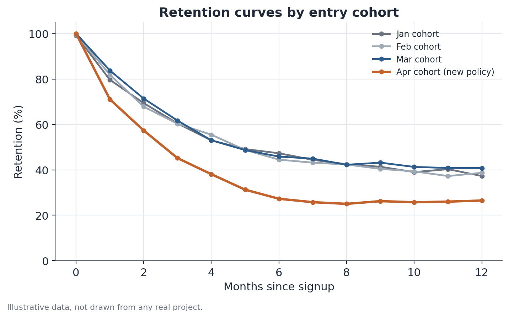

# Cohort and retention decomposition

## 1. What problem does this solve?

A product's overall retention rate dropped this quarter. It's tempting to
look for a single cause — a price change, a technical issue, a new
competitor — but that aggregate drop can come from very different places:
maybe customers who joined recently are churning faster than usual, maybe
every customer, old and new alike, is leaving a bit more, or maybe no
individual is behaving any differently at all, and the drop is purely a
composition effect — more new customers joining, and new customers
naturally retain worse than older ones in their first few months. Each of
these causes calls for a completely different response.

## 2. Intuition

A single "retention rate," tracked month over month, blends together people
who joined at very different times — and each of those people sits at a
different point in their own lifecycle as a customer. A **cohort** is the
group of customers who joined during the same period (say, everyone who
subscribed in January). Instead of looking at one aggregate retention curve,
you look at one curve per cohort, aligned by time since joining (month 0,
month 1, month 2…) rather than by calendar date. That separates two things
the aggregate metric mixes together: how a specific cohort behaves over its
own lifetime, and how the mix of recent versus older cohorts in the total
customer base shifts in a given month.

## 3. Plain-language explanation

A retention curve is built for each entry cohort: the share of the original
cohort still active in each subsequent month since joining. Different
cohorts can have similar curves (a sign that customer behavior is stable
over time) or different ones (a sign that something changed for whoever
joined during a specific period — a product change, an acquisition campaign
that brought in a less engaged audience, a technical issue that
disproportionately hit people mid-onboarding). Comparing these curves side
by side makes it possible to tell whether an aggregate drop comes from one
specific cohort, from every cohort equally, or from a shift in the base's
composition.



## 4. Easy conceptual example

Picture a subscription app that notices a drop in average month-3 retention
(the fraction of subscribers still active three months after subscribing).
Looking at aggregate retention alone, it seems like "customers are leaving
more." But breaking it down by entry cohort makes it clear that the January,
February, and March cohorts have curves nearly identical to prior months —
only the April cohort, which coincides with a change in the billing process,
shows a visible drop in month-3 retention. The cause isn't general; it's
specific to one cohort and one identifiable event.

## 5. How it works, broadly

1. Group customers by the date (month, week) they joined — that's the
   cohort.
2. For each cohort, compute the share still active in each period since
   joining (month 0 = 100%, month 1 = retained fraction, and so on).
3. Plot the curves for all relevant cohorts, aligned by time since joining,
   not calendar date.
4. Compare visually and numerically: are recent cohorts worse than older
   ones at the same point in the curve? If so, something specific to recent
   cohorts is happening.
5. Separate out the composition effect: even with no individual cohort
   getting worse, if the current base has a larger share of recent cohorts
   (which sit at a lifecycle stage with naturally lower retention), the
   aggregate metric drops purely because of that mix shift.

## 6. What the result means

If a specific cohort has visibly worse retention than earlier cohorts at the
same point in time since joining, that points to a localized cause —
something that happened specifically to whoever joined during that period.
If every cohort, including older ones, shows a drop starting from a certain
calendar month, that points to an event that hit everyone at once,
regardless of when they joined. If each cohort's individual curve is stable,
yet the aggregate metric still dropped, the explanation lies in
composition — the base's mix changed, not its behavior.

## 7. How to interpret it

It's important not to jump straight to "cohort X got worse, so something
broke specifically for them" without checking whether the gap is large
enough to not just be sampling noise — smaller cohorts (say, a month with few
sign-ups) naturally produce more unstable curves. It's also worth checking
whether the cohort's composition changed (for example, a different
acquisition channel bringing in a different audience), since that can
explain the gap without anything having "broken" in the product — just the
incoming audience shifted.

## 8. When it's useful

Whenever an aggregate retention, churn, or tenure metric moves unexpectedly
and the cause isn't obvious. It's especially useful for telling apart a
product or operations problem (which typically shows up as a localized drop
in one specific cohort, coinciding with a known change) from a structural
composition effect (which doesn't call for a point fix, but rather an
understanding of why the customer mix is shifting).

## 9. Important caveats

- Very small cohorts produce unstable curves — be careful comparing cohorts
  of very different sizes without accounting for that.
- Retention measured in fixed calendar windows (not aligned to time since
  joining) mixes cohorts at different lifecycle stages and hides the very
  phenomenon cohort decomposition is meant to reveal.
- A "worse" cohort can reflect a shift in acquisition source, not a product
  problem — it's worth cross-referencing acquisition-channel data before
  concluding on a cause.
- Comparisons between cohorts are observational, not experimental — even
  when a specific cohort worsens right after a known change, the timing
  coincidence suggests, but doesn't prove, causation; other factors that
  also shifted during that period could be behind the difference.

## 10. A small worked example

A hypothetical streaming service tracks month-3 retention (the share of
subscribers still active three months after subscribing) for four monthly
entry cohorts:

| Cohort | Month-3 retention |
|---|---|
| January | 39% |
| February | 38% |
| March | 40% |
| April | 26% |

Aggregate retention across the whole base, looked at for the current month
alone, dropped from 38% to 34% versus the prior quarter. Breaking it down by
cohort makes it clear that January, February, and March sit within the
historical range (38–40%) — only the April cohort, 12 to 14 percentage
points below the others, is dragging the aggregate average down. The
investigation then focuses on what was different for whoever subscribed in
April — in this hypothetical case, a change to the card-billing process that
coincided exactly with that month.

## 11. Simple code example

```python
import pandas as pd
import numpy as np

# illustrative data: one row per subscriber, entry cohort and month-3 status
rng = np.random.default_rng(5)

cohorts = ["2026-01", "2026-02", "2026-03", "2026-04"]
base_retention = {"2026-01": 0.39, "2026-02": 0.38, "2026-03": 0.40, "2026-04": 0.26}

records = []
for cohort in cohorts:
    n = rng.integers(800, 1200)
    active_month3 = rng.binomial(n, base_retention[cohort])
    records.append({"cohort": cohort, "subscribers": n, "active_month3": active_month3})

summary = pd.DataFrame(records)
summary["retention_month3"] = summary["active_month3"] / summary["subscribers"]

historical_avg = summary.loc[summary["cohort"] != "2026-04", "retention_month3"].mean()
print(summary[["cohort", "retention_month3"]])
print(f"\nHistorical average (excluding April): {historical_avg:.1%}")
print(f"April cohort retention: {summary.loc[summary.cohort == '2026-04', 'retention_month3'].iloc[0]:.1%}")
```
