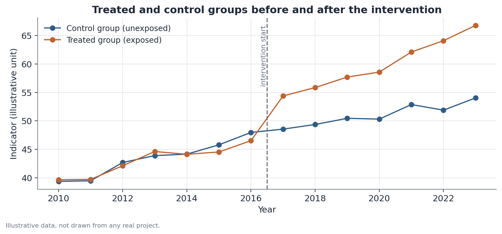

# Difference-in-Differences (DiD)

## 1. What problem does this solve?

A policy, a law, or an event affected a specific group, while a similar group
was left out. How do you know whether the change observed in the affected
group after the event is the result of the event itself, rather than just
the continuation of a trend that was already happening anyway? The
difference-in-differences (DiD) design uses the unaffected group as a
reference to answer that question with a reading closer to causal than a
simple before-and-after comparison.

## 2. Intuition

Comparing only the affected group before and after the event is misleading,
because plenty of things change over time for reasons that have nothing to
do with the event. The fix is to compare the **change** in the affected
group with the **change** in the unaffected group, over the same period. If
the two groups had been following similar trajectories before the event, the
difference between these two changes can be attributed, more safely, to the
event itself.

## 3. Plain explanation

The name "difference in differences" comes exactly from that: you first
compute the difference (change) within each group, then compute the
difference between those two differences. This basic design can be extended
in several ways: comparing **cohorts** defined by when they were born or
entered some system (cohort design), tracking the effect **period by
period** relative to the event (event-study), and testing whether the result
holds up under **fake dates** (placebo) — an essential verification step,
not an optional detail.

## 4. Simple conceptual example

Picture a city that introduced a new free public-transit program for
students, while a similar neighboring city introduced nothing. Before the
program, school attendance in both cities had been rising at a similar pace.
After the program, attendance in the city that adopted it rose noticeably
faster than in the neighboring city. The difference between these two
changes is the estimated effect of the program.

## 5. How it works, broadly

1. Clearly define the treated group (affected by the event), the control
   group (unaffected), and the timing of the event.
2. Check the **parallel trends** assumption: were the two groups following
   similar trajectories before the event? This is done by comparing the
   pre-intervention periods, both visually and statistically.
3. Estimate the difference in average changes between the two groups, from
   the pre- to the post-event period.
4. When several periods of data are available, an **event-study** estimates
   the effect separately for each period relative to the event, instead of a
   single aggregate number — this reveals whether the effect appears
   abruptly, grows over time, or was already present before the event
   (which would weaken the parallel trends assumption).
5. Run **placebo** tests: apply the same design to a fake date, with no real
   policy change, and check whether an "effect" shows up anyway. If it does,
   that's a warning sign about the design.



## 6. What the result means

The estimated effect is the difference between the treated group's change
and the control group's change, over the same period. With good pre-event
parallel trends and no effect showing up in the placebo tests, this
difference carries a reasonably defensible causal reading — stronger than
comparing it against a simple single-group before-and-after series.

## 7. How to interpret it

DiD gives a **stronger** causal reading than comparing before and after for a
single group, but it still **depends** on the parallel-trends assumption —
that is, on the idea that, absent the event, the two groups would have kept
following similar trajectories. That assumption is not directly testable for
the post-event period (that's precisely what we don't observe); what can be
tested is whether it held during the pre-event period. "Parallel trends
holding up in the pre-period" is not proof that the assumption is true — it's
only evidence that the data doesn't contradict it, which is a considerably
weaker reading.

## 8. When it's useful

It's useful whenever there's a policy or event with a clearly affected group
and a clearly unaffected one, with data available before and after. In the
Hub-Racial-Brasil project, this design is used to explore whether a law —
such as a racial quota policy — had a causal effect, comparing cohorts born
before and after a cutoff date, or sectors affected and unaffected by the law
over time.

## 9. Important caveats

- "Finding no effect" is not the same as "there is no effect" — a design
  with few groups, few periods, or a very noisy metric may simply lack the
  statistical power to detect a real effect.
- The choice of control group matters a great deal: a group that's poorly
  comparable to the treated group weakens the parallel-trends assumption.
- Always report placebo results alongside the headline effect — reporting
  only the favorable result is a common (and misleading) way to present DiD.

## 10. A small worked example

Before the event, the treated group's indicator rises from 40 to 47 (a
change of +7); the control group rises from 40 to 46 (a change of +6) — very
similar trends. After the event, the treated group rises from 47 to 68 (a
change of +21); the control group rises from 46 to 53 (a change of +7). The
DiD estimate is (21 − 7) = 14 units of effect attributable to the event,
above what was already expected from the trend common to both groups.

## 11. Simple code example

```python
import pandas as pd
import statsmodels.formula.api as smf

# panel_data: columns [unit, period, treated, post, outcome]
# treated: 1 if belongs to the treated group, 0 otherwise
# post: 1 if period is after the event, 0 otherwise
model = smf.ols("outcome ~ treated * post", data=panel_data).fit(
    cov_type="cluster", cov_kwds={"groups": panel_data["unit"]}
)
print(model.params["treated:post"])  # DiD effect estimate
print(model.pvalues["treated:post"])
```
