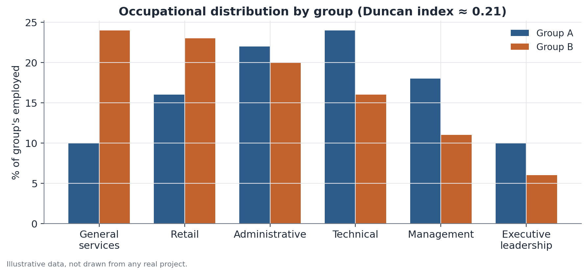

# Duncan Dissimilarity Index

## 1. What problem does this solve?

Do two groups work across the same occupational categories, or is one group
concentrated in certain roles while the other dominates different ones? A
table with the percentage breakdown of each group across categories is hard
to read at a glance — it's not obvious how unequal that split really is. The
Duncan dissimilarity index (also called a segregation index) compresses that
comparison into a single number between 0 and 1.

## 2. Intuition

Picture physically reshuffling people from two groups across a set of
categories, with the goal of making the two percentage distributions
identical. The Duncan index essentially measures **what fraction of one
group would need to switch categories** for that to happen. If no
reallocation is needed, the two groups are already distributed the same way.
If nearly everyone in one group would need to move, the two groups are
almost completely segregated from each other.

## 3. Plain explanation

For each category (say, each occupation), compute the share of Group A in
that category and the share of Group B in the same category. Subtract one
from the other, drop the sign (take the absolute value), and sum these
differences across all categories. Divide by two. The result is the Duncan
index: 0 means identical distributions across categories; 1 means complete
segregation — no category is shared by both groups.

## 4. Simple conceptual example

Suppose two sales teams, A and B, are spread across four branches. If in
every branch the share of A matches the share of B, the index is 0 — no
segregation by branch. If instead A is entirely at the North branch and B is
entirely at the South branch, the index is 1 — complete segregation. In
practice the value almost always lands somewhere in between.

## 5. How it works, broadly

1. Define the categories that matter (occupation, branch, neighborhood —
   whatever fits the question).
2. Within each group, compute the share of people in each category — not the
   raw count, since the two groups may differ in overall size.
3. For each category, compute the absolute difference between the two
   shares.
4. Sum all the differences and divide by two.

Dividing by two avoids double-counting the same "distance" — without it, the
index would range from 0 to 2, not 0 to 1.



## 6. What the result means

An index of 0.25, for instance, means that roughly 25% of one group would
need to change categories to make the two distributions match. There is no
universal threshold for "high" or "low" — the value only becomes meaningful
when compared to another context (another country, another period, another
pair of groups).

## 7. How to interpret it

The index describes **how unequal the distribution across categories is**,
not **why** it is unequal. A high value is consistent with several different
stories: real differences in qualifications between the groups, barriers to
entry into certain categories, voluntary career choices, or some combination
of all of these. The index alone does not separate these explanations.

## 8. When it's useful

It's the standard tool for measuring occupational, residential, or
educational segregation between demographic groups — race, gender, region.
In the Hub-Racial-Brasil project, an index of this kind measures how unevenly
two racial groups are spread across occupational categories, complementing
income-gap analyses: part of a wage gap can be tied to one group being
concentrated in lower-paying occupations.

## 9. Important caveats

- The index depends directly on how the categories were defined. Grouping
  occupations more coarsely or more finely changes the result — only compare
  indices computed with the same classification.
- Categories with few observations make the share estimate unstable,
  artificially inflating or deflating the index.
- The index has no sign — it does not say which group comes out "ahead," it
  only measures the distance between the two distributions.

## 10. A small worked example

| Category | % of Group A | % of Group B | Absolute difference |
|---|---|---|---|
| Operations | 15% | 30% | 15 |
| Administrative | 25% | 25% | 0 |
| Technical | 30% | 25% | 5 |
| Management | 30% | 20% | 10 |

Sum of absolute differences: 15 + 0 + 5 + 10 = 30. Dividing by two: Duncan
index = 15, or 0.15 on a 0-to-1 scale. That means 15% of one group would need
to switch categories to equalize the two distributions — moderate
segregation, concentrated mostly in the operations and management
categories.

## 11. Simple code example

```python
import numpy as np
import pandas as pd

# each group's share by category (each column should sum to 1)
data = pd.DataFrame({
    "category": ["operations", "administrative", "technical", "management"],
    "group_a": [0.15, 0.25, 0.30, 0.30],
    "group_b": [0.30, 0.25, 0.25, 0.20],
})

duncan_index = 0.5 * np.sum(np.abs(data["group_a"] - data["group_b"]))
print(f"Dissimilarity index: {duncan_index:.3f}")
```
