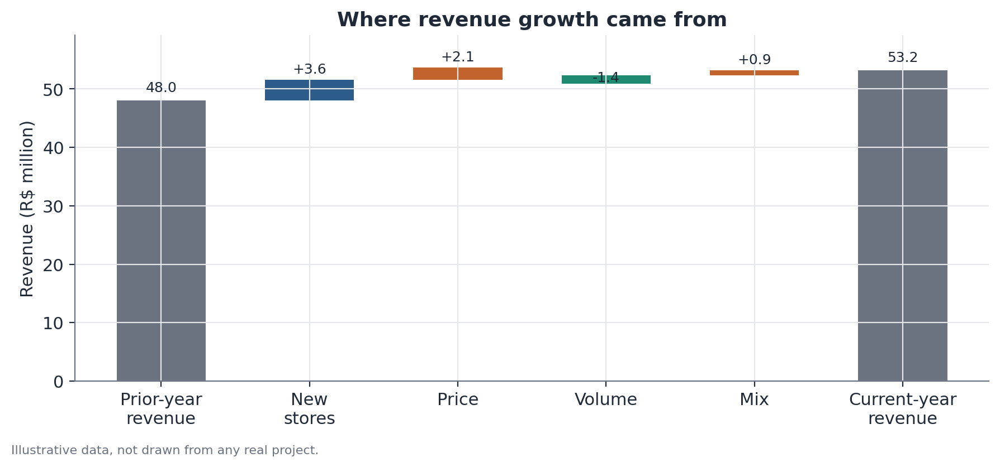

# Growth decomposition (total, comparable, and price-volume-mix)

## 1. What problem does this solve?

A retail chain closes the quarter with revenue up 12% year over year. Leadership is pleased — until someone asks: "did that growth come from selling more to the same customers, or simply from the eight new stores we opened?" And within what already existed: "did we sell more units, or did we just raise prices?" Without separating these pieces, one aggregate growth number can hide either a healthy business or one that's masking falling volume with price increases.

## 2. Intuition

Total growth is a sum of fundamentally different things: new stores that didn't exist in the prior period, and existing stores that were there in both periods. Lumping them together is like comparing the weight gain of someone who started lifting weights with that of a family that just had a baby — the second number grows for a completely different reason than the first.

## 3. Plain explanation

The method splits growth into two sequential questions:

**Question 1 — where did the growth come from?** Split total revenue into "comparable" units (present in both periods, also called *like-for-like*) and new units (openings, geographic expansion). Only comparable growth tells you whether the pre-existing business is actually doing better.

**Question 2 — within comparable growth, what changed?** Decompose it into three effects: **price** (the same items got more or less expensive), **volume** (more or fewer units sold), and **mix** (what customers bought shifted — for example, more high-ticket items in the basket).

## 4. Simple conceptual example

Picture a coffee shop that sold one type of coffee at $5. The next month it sells the exact same number of cups, but now charges $5.50. Revenue went up purely from a **price** effect — no change in volume or mix. Now suppose instead it kept the price the same but sold more cups: that's a **volume** effect. And if it started selling more of a pricier combo (coffee + pastry) instead of coffee alone, that's a **mix** effect — the composition of sales shifted even though price and per-unit volume didn't move on their own.

## 5. How it works, broadly

1. Classify each unit (store, region, channel) as "comparable" — present in both periods — or "new."
2. Compute total growth as the revenue difference between the two periods.
3. Isolate the share coming from new units (revenue from units that only exist in the most recent period).
4. What remains is comparable growth — only among units present in both periods.
5. Within comparable growth, decompose the revenue change into a price effect (holding mix and unit volume fixed, varying only average price), a volume effect (holding price and mix fixed, varying quantity), and a mix effect (the residual, capturing the shift in what's being sold).

Each component answers "how much growth would there have been if only this factor had changed, holding the others constant?" — which is why the three effects sum exactly to total comparable growth.

## 6. What the result means

A positive total growth number can conceal a comparable base that's flat or even shrinking, offset by geographic expansion. And positive comparable growth might come mostly from price (raising the question: how much longer can price increases be passed through before volume suffers?) or from real volume (a more robust signal of demand).

## 7. How to interpret it

Rising volume is usually the healthiest signal — it points to genuine demand growth. Price rising on its own, without volume keeping pace, may reflect passed-through inflation or pricing power, but it isn't by itself evidence of more customers or more consumption. A positive mix effect might reflect successful upselling, or simply a shift in market demand unrelated to internal strategy — worth investigating the cause before celebrating.

## 8. When it's useful

Whenever a reported growth figure blends structurally different sources: expansion versus the existing business, price versus quantity. This is the logic behind "comparable sales" (*same-store sales*, *like-for-like*) reporting used in retail, franchise networks, and product-portfolio reviews — this exact kind of decomposition is commonly used in that context to separate how much of additional revenue came from opening new locations versus selling more at existing ones.

## 9. Important caveats

- The price-volume-mix split depends on the order in which effects are computed when price and volume move together — different calculation conventions produce slightly different numbers for each individual component, even though the total always sums correctly.
- "Comparable" needs a consistent time-window definition (e.g., a store must have been open for at least 12 full months) — changing that criterion changes the numbers.
- Mix often ends up acting as a residual that absorbs measurement error from the other two effects; always sanity-check whether the mix figure is plausible given the business context.

## 10. A small worked example

A hypothetical chain had $48 million in revenue the prior year and $53.2 million in the current year — total growth of $5.2 million (+10.8%). Of that, $3.6 million came from stores opened during the period. Comparable growth was therefore $1.6 million. Breaking that down: price contributed +$2.1 million, volume contributed −$1.4 million (fewer units sold at existing stores), and mix contributed +$0.9 million. In other words, comparable growth only stayed positive because price and mix offset a real drop in volume — a warning sign the headline +10.8% figure alone did not reveal.



## 11. Simple code example

```python
import pandas as pd

# revenue by store, two periods, with units sold
df = pd.DataFrame({
    "store": ["A", "B", "C", "D"],
    "comparable": [True, True, True, False],  # D is a new store
    "revenue_prior": [12.0, 15.0, 18.0, 0.0],
    "revenue_current": [12.8, 14.1, 19.7, 3.6],
    "units_prior": [2400, 3000, 3600, 0],
    "units_current": [2280, 2820, 3760, 720],
})

comp = df[df["comparable"]]

revenue_prior_total = df["revenue_prior"].sum()
revenue_current_total = df["revenue_current"].sum()
total_growth = revenue_current_total - revenue_prior_total

new_store_growth = df.loc[~df["comparable"], "revenue_current"].sum()
comparable_growth = (
    comp["revenue_current"].sum() - comp["revenue_prior"].sum()
)

price_prior = comp["revenue_prior"].sum() / comp["units_prior"].sum()
price_current = comp["revenue_current"].sum() / comp["units_current"].sum()

volume_effect = (comp["units_current"].sum() - comp["units_prior"].sum()) * price_prior
price_effect = (price_current - price_prior) * comp["units_current"].sum()
mix_effect = comparable_growth - volume_effect - price_effect

print(f"Total growth: {total_growth:.2f}")
print(f"  New stores: {new_store_growth:.2f}")
print(f"  Comparable: {comparable_growth:.2f}")
print(f"    Price: {price_effect:.2f} | Volume: {volume_effect:.2f} | Mix: {mix_effect:.2f}")
```
