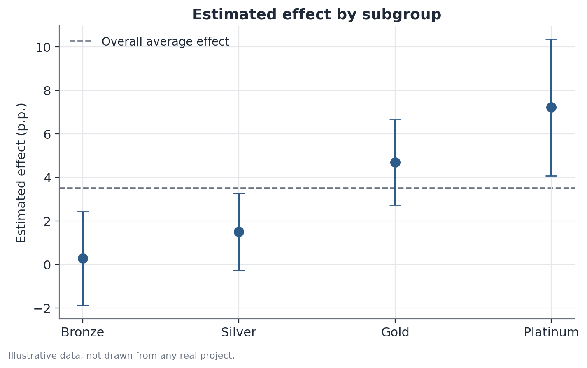

# Heterogeneity testing and novelty-effect decay

## 1. What problem does this solve?

An experiment shows a positive average effect. But is that effect the same
for everyone, or is one subgroup driving the whole result while others feel
nothing? And does the effect measured in week one still hold in week eight,
or was it just curiosity around something new that faded once the novelty
wore off?

These are two different questions that get conflated often: **effect
heterogeneity** asks whether the effect differs across groups at a given
point in time. **Novelty-effect decay** asks whether the effect changes over
time, within the same group. This document covers both, because they tend to
show up together when reading an experiment's results.

## 2. Intuition

An overall average can hide very different stories. An average effect of
+3% conversion could mean +12% for new customers and +0% for existing ones —
or it could mean +3% spread evenly across everyone. Without testing this
formally, both situations look identical in the headline number, but they
call for completely different product decisions.

The same logic applies over time: a +5% effect measured only in week one may
just reflect genuine curiosity about something new on the screen — a
"novelty effect" — that dissolves once the new feature becomes routine.

## 3. Simple explanation

For heterogeneity, the formal approach is not to eyeball the effect
separately for each subgroup (that will always look different just by
chance). Instead, a statistical model includes an **interaction term** —
something like "treatment × subgroup" — and tests whether that term is
statistically different from zero. That answers: is the difference in effect
across subgroups larger than sampling variation alone would produce?

For novelty decay, the effect is estimated separately in successive time
windows since launch (week 1, week 2, week 3…) and checked for a downward
trend.

## 4. Easy conceptual example

Imagine a streaming app testing a new home-screen layout. The average effect
on daily watch time is positive. Splitting by user type, the effect is large
among subscribers with less than a month of tenure and nearly zero among
long-time subscribers — plausible, since people with established habits
react less to a visual change. Looking week by week, the effect starts high
and halves within a month — also plausible, since part of the initial
reaction is just curiosity about the new screen.

## 5. How it works, broadly

**Heterogeneity:** fit a model with the treatment effect, a subgroup
indicator, and the interaction between the two. The interaction coefficient
measures how much the effect differs between the subgroup in question and the
reference subgroup; its standard error and p-value indicate whether that
difference is statistically reliable.

**Novelty decay:** estimate the effect (and its confidence interval)
separately for each time window since launch, and look at the trajectory of
those estimates — ideally with a formal trend test rather than only visual
inspection.

## 6. What the result means

A statistically significant interaction term is evidence that the effect
genuinely differs across the tested subgroups — not just sampling noise. A
consistent decay trajectory, with the effect in the final weeks clearly
smaller than in the first, is evidence that part of the effect measured
early on was temporary.

## 7. How to interpret it

Real heterogeneity changes the launch decision: it may make sense to ship
only to the subgroup that responded, rather than to everyone. Novelty decay
changes the evaluation horizon: deciding based on week one alone can
overstate the long-run gain. The two readings are independent of each
other — an effect can be homogeneous across subgroups and still decay over
time, or heterogeneous and stable.

## 8. When it is useful

Common when reading product experiments: testing whether the effect of a
change varies by loyalty tier, acquisition channel, device type, or another
relevant cut, and whether the effect observed right after launch holds up in
the following weeks.

## 9. Important caveats

Testing many subgroups raises the chance of finding a "significant"
difference purely by chance — this is the **multiple comparisons** problem.
Testing 10 subgroups at the 5% significance level yields, by pure chance,
close to half a "significant" subgroup even with no real heterogeneity. So a
single heterogeneity finding — especially from a subgroup chosen after
looking at the data — deserves far more caution than one defined before the
experiment and confirmed consistently.

## 10. A small numerical example

An A/B test measures an effect of +4.0 percentage points in conversion for
the "new customers" group (standard error 1.1) and +0.4 points for the
"existing customers" group (standard error 0.9). The difference between the
two effects is 3.6 points, with a combined standard error of roughly 1.45 —
giving a z-statistic near 2.5, above the usual significance threshold. That
is evidence of genuine heterogeneity, not just sampling coincidence.

Separately, the effect measured week by week since launch was +8.5 points in
week 1, +5.2 in week 4, and +1.8 in week 8 — a consistent decline consistent
with a novelty effect.

## 11. Simple code example

```python
import statsmodels.formula.api as smf

# treatment: 0/1; subgroup: categorical; conversion: continuous metric
model = smf.ols("conversion ~ treatment * subgroup", data=df).fit()
print(model.summary())
# the coefficient on "treatment:subgroup[T.new]" is the interaction term

# novelty decay: effect by week since launch
weekly_effects = (
    df.groupby("weeks_since_launch")
      .apply(lambda g: smf.ols("conversion ~ treatment", data=g).fit().params["treatment"])
)
print(weekly_effects)
```


