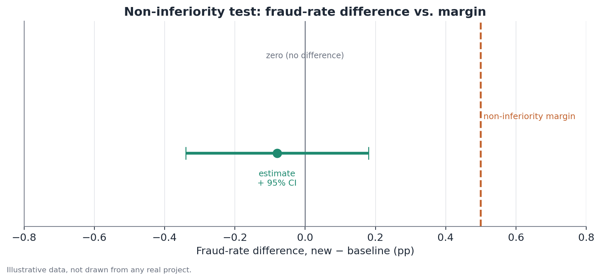

# Non-inferiority testing

*Assumes the A/B testing fundamentals — see [A/B testing fundamentals](./ab-testing.md).*

## 1. What problem does this solve?

Not every metric in an experiment is "bigger is better." Some are guardrail
metrics: things that must not get worse beyond a certain point, even if the
primary metric improves a lot — fraud rate, load time, error rate, support
complaints. The question there isn't "did this metric change?", it's more
specific: "did this metric not get worse than I can tolerate?" A standard
two-sided test, built to ask whether there's any difference at all, doesn't
answer that question well — because it treats "improved a lot" and "didn't
get much worse" the same way, when in practice only the second is what
matters for a guardrail metric.

## 2. Intuition

Think of the difference between two kinds of question. A standard test asks:
"is this metric different from that one?" — in either direction. A
non-inferiority test asks something narrower: "is this metric not worse than
that one by more than X?" — in one direction only, explicitly allowing it to
be a little worse, up to a limit defined as acceptable beforehand. That
margin X isn't a number statistics picks for you; it's a business decision,
made before the experiment, about how much of a hit on this metric is
tolerable in exchange for what's gained elsewhere.

## 3. Plain explanation

Instead of testing whether the difference is exactly zero, you test whether
the difference is smaller than the agreed non-inferiority margin — usually
by building the confidence interval for the difference and checking whether
it falls entirely below that margin (for a metric where "higher is worse,"
like a fraud rate). If the confidence interval's upper bound sits below the
margin, there's evidence of non-inferiority. If the interval crosses the
margin, there isn't enough evidence — which doesn't necessarily mean the
metric got much worse, only that the possibility can't be confidently ruled
out.



## 4. A simple conceptual example

A company launches a new fraud-detection model that's faster, but with a
small chance of being slightly less precise. The risk team decides, before
the experiment, that an increase of up to 0.5 percentage points in the fraud
rate is acceptable given the speed gain. The experiment runs, and the
observed difference in fraud rate between the new model and the current one
is small, with a confidence interval that falls entirely below 0.5
percentage points. That's evidence of non-inferiority: even without proving
the new model is exactly equal or better, there's enough confidence that it
doesn't push fraud beyond what was defined as tolerable.

## 5. How it works, broadly

1. Set the non-inferiority margin before the experiment — a business
   decision, not a statistical one, about how much of a hit is tolerable.
2. Formulate the hypotheses one-sidedly: the null hypothesis is that the
   metric got worse than the margin; the alternative is that it did not get
   worse than the margin.
3. Run the experiment as usual, collecting the observed difference and its
   confidence interval, typically at a one-sided confidence level (e.g., a
   one-sided 95%, equivalent to a two-sided 90% CI).
4. Compare the relevant bound of the confidence interval (the one that
   signals "worse") against the defined margin.
5. If that bound falls within the acceptable margin, conclude
   non-inferiority.

## 6. What the result means

Concluding non-inferiority means there's statistical evidence the metric
didn't get worse beyond the defined margin — it does not mean the metric is
equal, nor that it improved. An inconclusive result (when the confidence
interval crosses the margin) simply means the sample didn't provide enough
evidence to rule out a worse-than-margin deterioration — that's not the same
as concluding the metric actually got worse.

## 7. How to interpret it

The non-inferiority margin needs to be set before looking at the
experiment's data, and it should reflect an explicit business judgment: how
much of this metric the organization is willing to "spend" in exchange for
some other gain. There's no "statistically correct" margin — it's a choice,
and different margins lead to different conclusions about the same data.
It's also worth remembering that "non-inferior" isn't a synonym for
"costless" — even within the margin, a small, consistent deterioration can
add up over time or at scale.

## 8. When it's useful

In any experiment with a guardrail metric that has a clear tolerance limit —
safety, risk, technical performance, a minimum customer satisfaction bar.
It's commonly used alongside a traditional effect test on the primary
metric: the primary metric gets tested the usual way (is there a
difference?), while guardrail metrics get tested for non-inferiority (is
any deterioration within what's tolerable?).

## 9. Important caveats

- The margin needs to be fixed before the experiment — choosing it after
  seeing the result, to "make the test pass," invalidates the test's
  interpretation.
- A non-inferiority result is not the same as "the metric didn't change" —
  it might have gotten slightly worse, just within what was deemed
  acceptable.
- A small sample tends to produce wide confidence intervals that cross the
  margin even when the true effect is small — an inconclusive result calls
  for attention to the design's statistical power, not a hasty conclusion
  that the metric got worse.
- Check the margin's direction carefully: for metrics where "higher is
  worse" (fraud, errors), the margin caps how much the metric can rise; for
  metrics where "lower is worse" (satisfaction, retention), the logic
  flips.

## 10. A small worked example

A company tests a new fraud-detection model against the current one, with a
non-inferiority margin set at 0.5 percentage points (an increase in fraud
rate larger than that would be unacceptable). The observed fraud rate is
2.10% in the control group (current model) and 2.02% in the treatment group
(new model) — a difference of -0.08 percentage points (the new model had
slightly lower fraud). The 95% confidence interval for that difference runs
roughly from -0.34 to +0.18 percentage points. Since the interval's upper
bound (+0.18) sits well below the 0.5-percentage-point margin,
non-inferiority is concluded: there's evidence the new model doesn't push
fraud beyond what's tolerable — and in this case the central estimate even
suggests a slight improvement, though the interval doesn't support that
claim with the same confidence as non-inferiority.

## 11. Simple code example

```python
import numpy as np
from statsmodels.stats.proportion import confint_proportions_2indep

margin = 0.5  # percentage points; a business decision, not a statistical one

fraud_control = (252, 12000)     # illustrative: (cases, total)
fraud_treatment = (242, 12000)   # illustrative

ci_low, ci_high = confint_proportions_2indep(
    fraud_treatment[0], fraud_treatment[1],
    fraud_control[0], fraud_control[1],
    method="wald",
)
ci_low_pp, ci_high_pp = ci_low * 100, ci_high * 100

non_inferior = ci_high_pp < margin
print(f"95% CI: [{ci_low_pp:.2f}, {ci_high_pp:.2f}] pp | margin: {margin} pp")
print(f"Non-inferiority concluded: {non_inferior}")
```

The decision doesn't hinge on a single p-value, but on comparing the
confidence interval's upper bound directly against the margin agreed on
beforehand.
