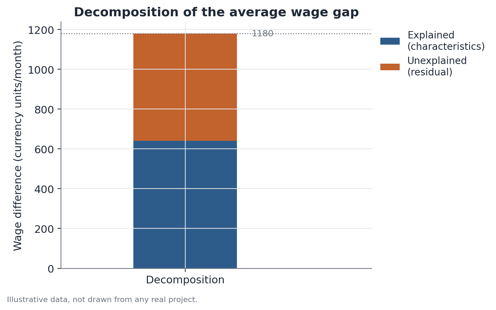

# Oaxaca-Blinder decomposition

## 1. What problem does this solve?

Two groups earn different average wages. Part of that difference might come
from the groups having, on average, different characteristics — more or
fewer years of education, say. But does that explain the whole difference,
or is something left over even after putting those characteristics on the
same footing?

## 2. Intuition

Imagine you want to compare the average wage of two groups, but you know they
also differ, on average, in education. Simply comparing average wages mixes
two things together: the education difference itself, and any difference in
how each group is paid per unit of education. Oaxaca-Blinder decomposition
separates these two sources, answering the question: "if Group B had Group
A's average education, but kept being paid according to its own wage
structure, what average wage would we expect for Group B?"

## 3. Plain-language explanation

The method fits a statistical model (typically a linear regression) relating
wages to observable characteristics, separately for each group. It then uses
these two models to simulate a counterfactual "what if" scenario, splitting
the total difference in means into two parts:

- **Explained component**: the part of the difference that comes from the
  groups having, on average, different characteristics.
- **Unexplained component**: what's left over — differences in how each
  characteristic translates into wages for each group, plus anything not
  captured by the measured characteristics.



## 4. Easy conceptual example

Picture two sales teams at a company. Team A has, on average, more years of
experience than Team B. If Team A also earns more on average, part of that
difference might simply reflect the experience gap — more experience, more
pay, equally in both teams. The decomposition separates how much of the gap
comes from that experience difference, and how much is left over even when
comparing people with the same experience across both teams.

## 5. How it works, broadly

1. Fit a separate regression model for each group, relating the outcome of
   interest (wage, say) to observable characteristics (education, age,
   occupation, etc.).
2. Compute the total difference in means between the groups.
3. Using the coefficients from one of the models (or a weighted combination
   of both, depending on the variant of the method), build the counterfactual
   scenario: what would Group B's average wage be if it had Group A's average
   characteristics, but kept its own wage structure.
4. The difference between Group A's observed wage and this counterfactual is
   the explained component; the difference between the counterfactual and
   Group B's observed wage is the unexplained component.

## 6. What the result means

The explained component shows how much of the difference in means can be
attributed to differences in average measured characteristics. The
unexplained component shows what's left over after putting those
characteristics on the same footing — it's often read as a possible signal
of discrimination or other unobserved factors, but that reading requires
much stronger assumptions than the method alone guarantees: there may be
wage-relevant characteristics that simply weren't measured, and including
them would shift how the total splits between the two parts.

## 7. How to interpret it

The method decomposes an observed difference — it doesn't prove causation or
isolate discrimination. Saying "the unexplained component is discrimination"
assumes every wage-relevant characteristic was measured and included in the
model, which is rarely true in practice (omitted-variable bias). The
unexplained component is better described as "what couldn't be attributed to
the observed characteristics" — an important difference between failing to
explain something and being certain of its cause.

## 8. When it's useful

When you want to understand the composition of a gap between groups — for
instance, comparing the average wage difference between demographic groups,
separating how much comes from compositional differences (education, age,
occupation type) and how much remains even after controlling for those
variables.

## 9. Important caveats

- **Omitted-variable bias**: if a relevant characteristic wasn't measured, it
  ends up hidden inside the unexplained component.
- **Choice of reference group**: in some variants of the method, the result
  can shift depending on which group is used as the reference for building
  the counterfactual — it's worth checking the specification used.
- **The decomposition only looks at the mean**: if the gap is very different
  at different points of the distribution (larger at the top of the income
  scale, say), a mean decomposition won't capture that — for that question,
  methods like RIF decomposition are more appropriate.
- **Causality**: the method is descriptive/accounting, not causal — it
  doesn't determine whether the differences in characteristics themselves
  have a causal origin.

## 10. A small worked example

Consider a hypothetical scenario: two teams at a company, with average
monthly wage (in fictional currency units) and average years of experience:

- Team A: average wage = 5,800, average experience = 8 years.
- Team B: average wage = 4,620, average experience = 5 years.

The total gap is 1,180. Suppose the fitted model shows that, holding Team A's
wage structure, each additional year of experience corresponds to an average
increase of about 210 units. If Team B had Team A's average experience (8
years instead of 5), its counterfactual wage would be around
4,620 + 3×210 = 5,250. That splits the total gap into:

- **Explained component** (experience difference): 5,250 − 4,620 = 630.
- **Unexplained component**: 5,800 − 5,250 = 550.

In other words, roughly half the gap comes from the average experience
difference between the teams, and the other half remains even when comparing
people with the same experience.

## 11. Simple code example

```python
import pandas as pd
import statsmodels.formula.api as smf

# illustrative person-level data
df_a = pd.DataFrame({"wage": [...], "experience": [...]})  # Team A
df_b = pd.DataFrame({"wage": [...], "experience": [...]})  # Team B

model_a = smf.ols("wage ~ experience", data=df_a).fit()
model_b = smf.ols("wage ~ experience", data=df_b).fit()

mean_exp_a = df_a["experience"].mean()
mean_exp_b = df_b["experience"].mean()

# counterfactual: Team B with Team A's average experience,
# paid according to Team B's own wage structure
counterfactual_wage = model_b.params["Intercept"] + model_b.params["experience"] * mean_exp_a

explained = counterfactual_wage - df_b["wage"].mean()
unexplained = df_a["wage"].mean() - counterfactual_wage
```

Dedicated packages (like the `oaxaca` package in R, or Python
implementations built on top of `statsmodels`) automate this calculation and
also provide standard errors for each component of the decomposition.
