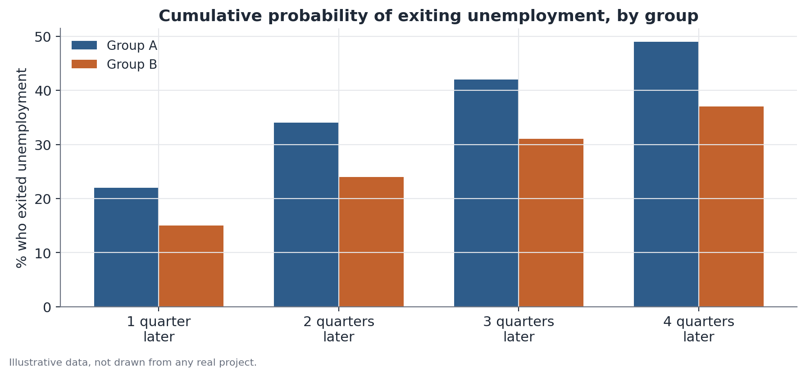

# Rotating Panel Transition Analysis

## 1. What problem does this solve?

Comparing two isolated snapshots — a group's unemployment rate this quarter
and the same group's rate next quarter — tells you nothing about what
happened to people individually. Were the same people still unemployed, or
did one wave leave unemployment while another entered, keeping the aggregate
rate looking similar? Rotating panel transition analysis answers that
question by tracking individuals across successive interviews, rather than
just comparing aggregate snapshots.

## 2. Intuition

Some household surveys interview the same household (and, to the extent
possible, the same residents) multiple times over a period — that's the
"rotating panel": part of the sample is replaced each round, but another
part stays on, making it possible to observe the same person across
consecutive interviews. This lets you ask directly: of those who were
unemployed in the first interview, what fraction were employed in the next
one? And does that fraction differ across groups?

## 3. Plain explanation

After matching records for the same person across consecutive interviews,
you build a **transition matrix**: rows represent the starting state (say,
unemployed), columns represent the following state (say, formal employment,
informal employment, unemployed, out of the labor force), and each cell
shows the share of people who made that specific transition. Comparing this
matrix across groups reveals mobility differences that comparing aggregate
rates would not capture.

## 4. Simple conceptual example

Picture two groups of subscribers to a service, both with the same aggregate
cancellation rate in a given month. In Group A, almost everyone who canceled
had already been signaling dissatisfaction for months. In Group B, the
cancellations come from recently joined customers who never actually started
using the service. The aggregate rate is the same, but the story behind it —
and the recommended action — is completely different. Tracking individual
transitions is what reveals that difference.

## 5. How it works, broadly

1. Identify, in the dataset, the records that correspond to the same person
   across consecutive interviews — typically via a household identifier
   combined with characteristics that help confirm it's the same person
   (age, sex, relationship to the household head).
2. Discard or handle separately the cases where matching fails — people who
   moved households, households with resident turnover, or inconsistent
   records.
3. For each pair of consecutive interviews, classify the person's state at
   each moment (employed, unemployed, out of the labor force, for example).
4. Build the transition matrix, separately for each group of interest.
5. Compare specific transition rates (say, the probability of exiting
   unemployment) across groups, with proper significance testing.



## 6. What the result means

A higher transition rate for one group — say, exiting unemployment more
often — indicates greater observed real mobility for that group within this
specific panel, something a comparison of aggregate rates between two
isolated snapshots could not distinguish from mere compositional turnover.

## 7. How to interpret it

The transition rate describes what happened to the people who were
successfully matched between interviews — not the whole population. If
matching fails systematically differently across groups (say, one group has
higher rates of moving households, and is therefore harder to track), the
estimated transition rates may not correctly represent the experience of the
entire group, only of the fraction that remained trackable.

## 8. When it's useful

It's the right tool whenever the question is about individual mobility —
transitions between employment and unemployment, between formal and
informal work, between income bands — and the survey used has a rotating
panel design (the same unit interviewed more than once). In the
Hub-Racial-Brasil project, this kind of analysis uses the fact that the same
person appears in a few consecutive interviews of a household survey to
track individual transitions and compare mobility rates across racial
groups.

## 9. Important caveats

- A rotating panel is **not** the same as a full longitudinal panel, in
  which the entire same sample is followed for many years — in a rotating
  panel, each person is only observed for a limited number of rounds before
  leaving the sample.
- Much of a rotating panel's data is actually repeated cross-section outside
  the window in which matching is possible — it's essential to know exactly
  which rounds allow tracking the same person.
- Matching between interviews can fail for several reasons: a household
  move, resident replacement, typos in identifiers, or plain sample
  attrition (the person can no longer be located). The matching success rate
  should always be reported.
- If the matching success rate differs between the groups being compared,
  this can introduce selection bias into the results — it's worth testing
  for this explicitly.

## 10. A small worked example

Out of 500 unemployed people in Group A in the first interview, 420 (84%)
could be matched to a second interview one quarter later; of those, 92 were
employed — a transition rate of 21.9%. Out of 480 unemployed people in
Group B, 390 (81%) were matched; of those, 59 were employed — a rate of
15.1%. The nearly 7-percentage-point gap is tested statistically (say, with
a proportions test) to check whether it's too large to be attributed to
chance.

## 11. Simple code example

```python
import pandas as pd
from statsmodels.stats.proportion import proportions_ztest

# matched_data: one row per successfully matched person,
# columns: group, state_t0, state_t1
unemployed_t0 = matched_data[matched_data["state_t0"] == "unemployed"]

transition_by_group = unemployed_t0.groupby("group")["state_t1"].apply(
    lambda s: (s == "employed").mean()
)
print(transition_by_group)

counts = unemployed_t0.groupby("group")["state_t1"].apply(
    lambda s: (s == "employed").sum()
)
totals = unemployed_t0.groupby("group").size()
statistic, p_value = proportions_ztest(counts.values, totals.values)
print(statistic, p_value)
```
