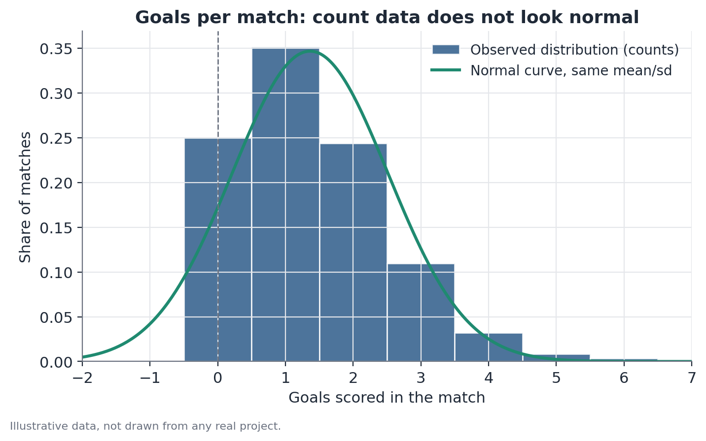

# Poisson regression with fixed effects

## 1. What problem does this solve?

An analyst wants to predict how many goals a team scores in a match, as a function of the team's attacking strength, the opponent's defensive strength, and whether the match is home or away. The problem: goal counts are counts — 0, 1, 2, 3... — and an ordinary linear regression can predict nonsensical values like "−0.4 goals," or treat a jump from 0 to 1 goal the same way as a jump from 5 to 6 goals, when in practice those jumps don't carry the same statistical weight.

## 2. Intuition

Counts of rare, discrete events — goals in a match, customers walking into a store per hour, machine failures per week — tend to follow a characteristic pattern: never negative, always whole numbers, and most values bunched near zero with a long right tail (seeing 0, 1, or 2 goals is far more common than seeing 6 or 7). A normal distribution (the symmetric bell curve) captures none of that — it allows negative values and is symmetric around the mean. The Poisson distribution was built precisely for this kind of data.

## 3. Plain explanation

Poisson regression models the expected number of events as an exponential function of the explanatory variables, guaranteeing the prediction is never negative. Instead of predicting the goal count directly, the model predicts the **logarithm** of the expected goal count as a linear combination of the variables — then converts back using the exponential. That choice (called the "log-linear form") is what guarantees the final prediction is always positive, no matter what the coefficients turn out to be.

Fixed effects per team enter the model as an "individual adjustment" for each club — a way of asking "after accounting for how much this specific team typically scores or concedes, what's left of the effect I'm actually interested in (say, playing at home)?"

## 4. Simple conceptual example

Picture comparing the average number of customers walking into two stores per hour: one downtown (high foot traffic) and one in a residential neighborhood (low foot traffic). If you want to isolate the effect of "it's Friday" on customer flow, you first need to account for the fact that the downtown store already runs at a much higher baseline than the neighborhood one — otherwise any observed difference could simply reflect which store you're looking at, not the day of the week. The per-store fixed effect makes exactly that adjustment, store by store, before estimating the "Friday" effect.

## 5. How it works, broadly

1. For each observation (a match, an hour, a period), the expected number of events is written as $\lambda = e^{(\beta_0 + \beta_1 x_1 + \beta_2 x_2 + \dots)}$ — the weighted sum of explanatory variables, exponentiated.
2. A dummy (indicator variable) is created for each unit receiving a fixed effect (each team, for instance) — this lets every team have its own "baseline level" of expected goals, without forcing all teams to be identical in the absence of the other variables.
3. The model is fit by maximum likelihood, finding the coefficients that make the observed data most probable under the assumption that the count in each observation follows a Poisson distribution with mean $\lambda$.
4. Each estimated coefficient represents that variable's effect on the log scale of the expected event count.

## 6. What the result means

A variable's coefficient, once exponentiated ($e^{\beta}$), becomes a **multiplicative factor** on the expected number of events — not an additive one. If the coefficient for "playing at home" is 0.30, then $e^{0.30} \approx 1.35$: playing at home multiplies the expected goal count by 1.35, i.e., a 35% increase, holding everything else constant.

## 7. How to interpret it

Always translate the raw (log-scale) coefficient into the multiplicative factor before communicating the result — "the coefficient was 0.30" means nothing to a non-statistician, but "playing at home increases expected goals by 35%" is immediately interpretable. Multiplicative factors above 1 indicate an increase; below 1, a decrease (for example, 0.85 means a 15% drop).

## 8. When it's useful

Whenever the response variable is an event count — not a proportion, not a continuous average. This is the type of model typically used in sports analytics to estimate how many goals a team is expected to score, combining the team's own attacking strength, the opponent's defensive strength, and the home-field effect, with per-club fixed effects isolating baseline differences between teams.

## 9. Important caveats

- Poisson assumes the variance of the count equals its mean (equidispersion). When the observed variance is clearly larger than the mean — **overdispersion** — the standard errors from a plain Poisson model come out artificially small, inflating apparent statistical significance. In those cases, alternative models (Poisson with robust standard errors, negative binomial) are more appropriate.
- Fixed effects per unit (team, store) consume degrees of freedom — with many units and few observations per unit, the model can become unstable.
- The model assumes independence between events conditional on the included variables; contexts with strong temporal dependence (a winning streak that shifts a team's confidence) violate that assumption.

## 10. A small worked example

Suppose a simplified model (without fixed effects, to illustrate the mechanics) where the expected goal count for a visiting team is $\lambda = e^{0.10}\approx 1.11$, and when playing at home, $\lambda = e^{0.10+0.30} = e^{0.40}\approx 1.49$. The ratio between the two, $1.49/1.11\approx 1.35$, confirms that the home effect multiplies the expected goal count by 1.35 — a 35% increase — without needing to compute the plain difference between 1.49 and 1.11 (which would be just 0.38 goals, a less informative reading than the multiplicative factor).



## 11. Simple code example

```python
import numpy as np
import pandas as pd
import statsmodels.api as sm
import statsmodels.formula.api as smf

# one row per team-match: goals scored, home indicator, and teams involved
df = pd.DataFrame({
    "goals": [1, 2, 0, 3, 1, 2, 0, 1, 2, 1],
    "home": [1, 0, 1, 0, 1, 0, 1, 0, 1, 0],
    "team": ["A", "A", "B", "B", "C", "C", "D", "D", "E", "E"],
})

model = smf.glm(
    formula="goals ~ home + C(team)",
    data=df,
    family=sm.families.Poisson(),
).fit()

print(model.summary())

# multiplicative factor for the home-field effect
home_coef = model.params["home"]
print(f"Multiplicative factor (home field): {np.exp(home_coef):.2f}")
```
