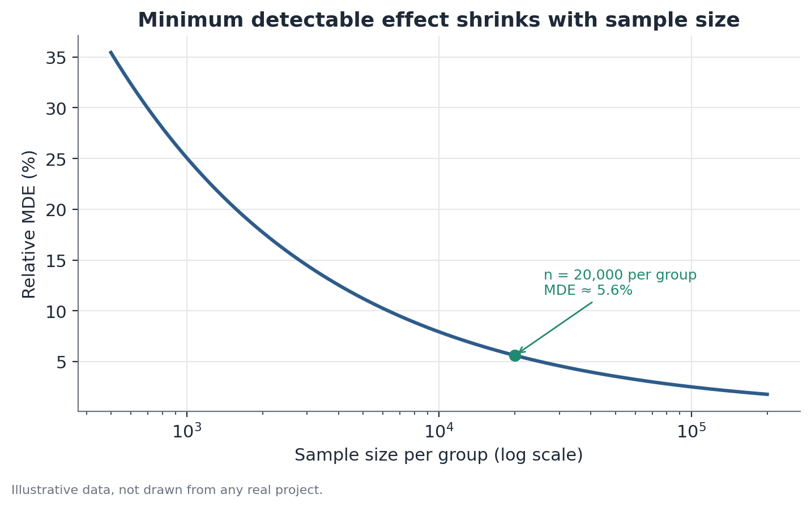

# Statistical power and minimum detectable effect (MDE)

## 1. What problem does this solve?

You're designing an experiment — testing a change in an app, a new campaign,
a new process — and need to decide on a sample size before starting. The
question rarely asked, but essential, is: **given the sample size you can
actually run, is there any real chance of detecting the effect you expect, if
it truly exists?** Running an expensive experiment for weeks only to end up
unable to conclude anything — because the design never had enough power to
begin with — is one of the most common and most avoidable wastes in product
and growth teams.

## 2. Intuition

Every statistical test has a limited capacity to see small effects. The
smaller the sample and the noisier (more variable) the metric, the blurrier
the test's vision — small effects get lost in sampling noise even when
they're real. **Statistical power** is the probability that a test detects a
true effect of a given size, given the experiment's design. The **minimum
detectable effect (MDE)** is the mirror image of the same idea: instead of
asking "what's the chance of detecting a 3% effect?", it asks "what's the
smallest effect this design can detect with reasonable confidence (typically
80%)?"

## 3. Plain-language explanation

Four ingredients determine an experiment's MDE: sample size, the metric's
variance (spread), the accepted significance level (the probability of a
false positive, usually 5%), and the desired power (usually 80%). Increasing
the sample or reducing the metric's variance lowers the MDE — the test starts
seeing progressively smaller effects. But the gain isn't linear: doubling the
sample doesn't cut the MDE in half, it divides it by roughly 1.4 (the square
root of two). That matters in practice: past a certain point, spending much
more experiment time to shrink the MDE from 3% to 2.5% may not be worth the
cost.



## 4. Easy conceptual example

Picture a subscription app testing a new signup flow. The team realistically
expects a 2-percentage-point lift in conversion. Before running the
experiment, the MDE is calculated for the traffic available over two weeks.
If the calculated MDE is 5 percentage points, the experiment simply doesn't
have the power to detect a 2-point gain, even if it truly exists — running it
as planned would burn time while learning little. The fix is to extend the
duration, increase the share of traffic exposed, or accept that only larger
effects will be detectable.

## 5. How it works, broadly

1. Define the primary metric and estimate its variance (from historical data
   whenever possible).
2. Set the significance level (usually α = 0.05) and the target power
   (usually 80%).
3. Set the available sample size (or, in the reverse direction, the minimum
   effect you want to be able to detect).
4. Use the relationship between these four quantities — sample size,
   variance, significance, and power — to solve for the missing one: the MDE
   (given the sample size) or the required sample size (given a target MDE).
5. Compare the resulting MDE against the effect size that would actually
   matter for the business. If the MDE is larger than any plausible effect,
   the design needs to change before the experiment runs — not after.

## 6. What the result means

An MDE of, say, 4% means: "this experiment design can detect, with 80%
confidence, a true effect of 4% or larger — smaller effects will likely go
unnoticed even if they exist." It's not a guarantee that the true effect is
4% — it's a property of the experiment's design, computed before any data is
collected.

## 7. How to interpret it

A high MDE isn't, by itself, a problem — the problem is a high MDE relative
to the effect that would plausibly matter. If a tested change would only be
worth shipping given an effect of at least 5%, and the calculated MDE is 2%,
the design is over-powered (fine for catching even small effects, but
possibly more expensive than needed). If the MDE is 8% and the plausible
effect is 2%, the design is under-powered — the sample needs to grow, the
metric needs to get less noisy, or the team needs to accept that only large
effects will be visible.

## 8. When it's useful

In planning any controlled experiment, before committing time and traffic to
a design that might never have had a chance of showing anything. It's also
useful mid-experiment, when the available window changes — a business
deadline forces an earlier cutoff, or traffic dropped unexpectedly.
Recalculating the MDE at that point, using the sample size actually reached,
avoids two traps: concluding "no effect" when the experiment never had the
power to detect the expected effect in the first place, or continuing to run
longer than necessary.

## 9. Important caveats

- The MDE depends on the estimated variance of the metric — if that estimate
  is poor (based on little history, or on an atypical period), the calculated
  MDE will also be off.
- Power and MDE say nothing about how likely the true effect is to be a
  given size — they only describe what the design is capable of detecting,
  should the effect exist.
- Recomputing the MDE after peeking at the experiment's own data (rather than
  beforehand, or with an independently fixed window) to decide whether it's
  "worth continuing" can introduce bias — stopping decisions need a plan set
  in advance.
- Highly skewed metrics (a few extreme values dominating the variance)
  inflate the estimated variance and, with it, the MDE — it's worth checking
  whether the metric or a transformation of it is more stable.

## 10. A small worked example

A convenience-store chain wants to test a new window display. The primary
metric is the visitor-to-buyer conversion rate, currently at 20%. With a 5%
significance level and 80% target power, a sample of 20,000 visitors per
group (treatment and control) yields a relative MDE of roughly 8% — meaning
the design can reliably detect conversion rising from 20% to about 21.6% or
more. If the team realistically expects only a 3% gain, this design isn't
powered enough: it would need a much larger sample, around 140,000 visitors
per group, to reach an MDE compatible with an effect of that size.

## 11. Simple code example

```python
from statsmodels.stats.power import NormalIndPower
from statsmodels.stats.proportion import proportion_effectsize

analysis = NormalIndPower()

# minimum detectable effect (in effect-size units) for a fixed n per group
mde_effect_size = analysis.solve_power(
    effect_size=None, nobs1=20_000, alpha=0.05, power=0.8, ratio=1.0
)

# sample size needed to detect a specific effect
target_effect_size = proportion_effectsize(0.23, 0.20)  # 20% -> 23%
n_required = analysis.solve_power(
    effect_size=target_effect_size, nobs1=None, alpha=0.05, power=0.8, ratio=1.0
)

print(f"MDE (effect size) for n=20,000: {mde_effect_size:.4f}")
print(f"Required sample per group for a 20% -> 23% effect: {n_required:.0f}")
```

The same logic works for recalculating power mid-experiment: swap `nobs1` for
the sample size actually collected so far and solve for `power` instead of
for `nobs1` or `effect_size`.
