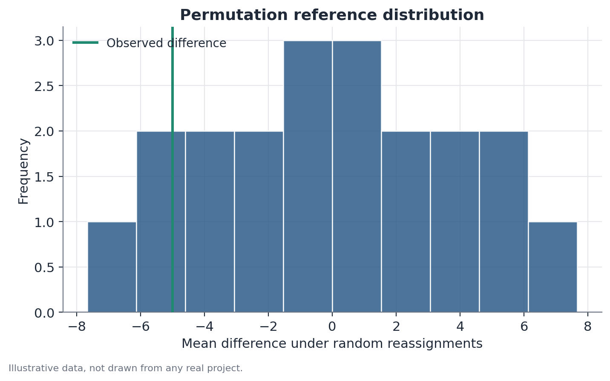

# Randomization inference (permutation test)

## 1. What problem does this solve?

Common statistical tests (the t-test, for example) rely on approximations
that work well when there are many observations. But what happens when an
experiment has few units — few stores, few cities, few classrooms — because
randomization happened at an aggregate level, not at the level of each
person? With few units, those approximations stop being reliable.
Randomization inference solves this without relying on any approximation at
all: it uses the actual randomness of the experiment's design to build the
test.

## 2. Intuition

If treatment was assigned by a lottery, there is a finite, known number of
ways that lottery could have turned out. The method's central question is:
"among all the possible ways of drawing who would be treated, what fraction
of them would produce an effect as large as (or larger than) the one I
actually observed?" If the answer is "almost none," the observed result is
unusual enough to be evidence of a real effect, not merely of the particular
draw that happened to occur.

## 3. Simple explanation

The method reshuffles, across the available units, every possible
combination (or a large sample of them) of who would be "treatment" and who
would be "control," recomputing the statistic of interest (usually the mean
difference) for each reshuffle. This generates an entire distribution of
possible outcomes under the hypothesis that treatment had no effect at all.
The p-value is the fraction of that distribution as extreme as the actually
observed result.

## 4. Easy conceptual example

Consider an experiment with only 4 stores, of which 2 will be drawn to
receive a new window display and 2 will stay as they are. There are exactly
$\binom{4}{2} = 6$ different ways to choose which 2 stores receive the
treatment. Each of those 6 ways produces a different sales difference
between "treatment" and "control." The test's reference distribution is
made up of exactly those 6 possible differences — nothing more.

## 5. How it works, broadly

1. Compute the observed statistic (for example, the mean difference between
   the treated group and the control group, under the experiment's actual
   assignment).
2. Enumerate every possible treatment/control reassignment among the same
   units (or, when the number of combinations is too large to enumerate,
   draw a large sample of reassignments, typically thousands).
3. For each reassignment, recompute the same statistic, keeping each unit's
   observed value fixed — only the treatment/control label changes.
4. The p-value is the proportion of those recomputed statistics that is as
   extreme as, or more extreme than, the statistic observed under the
   actual assignment.

## 6. What the result means

A low p-value says the experiment's actual assignment produced an unusual
result, compared to every other way the lottery could have turned out. That
is evidence the treatment had an effect — without relying on any assumption
about the shape of the data's distribution.

## 7. How to interpret it

The method's validity depends entirely on treatment assignment having
genuinely been random (or on the design allowing reassignments to be
treated as equally likely). Unlike tests that assume normality or a large
sample, here the only assumption needed is the genuine randomness of the
assignment — which makes the method especially trustworthy when that
randomness is guaranteed, and especially unsuitable when it is not.

## 8. When it is useful

Particularly useful when the number of experimental units is small — few
geographic zones, few stores, few classrooms — a common situation in
experiments randomized at the cluster level (geography, store,
organizational unit), where traditional asymptotic tests lose reliability.

## 9. Important caveats

With few units, the number of possible reassignments is also small, which
limits how fine-grained the p-value can be — with 4 stores split 2-and-2,
for example, the smallest possible p-value is 1/6 ≈ 0.167, never lower than
that, no matter how large the effect. This is a structural limit of the
method with very small samples, not an implementation flaw.

## 10. A small numerical example

Six stores take part in an experiment, three drawn for treatment and three
for control. Observed weekly sales are: 12, 15, 9, 22, 18, 11 (in thousands
of dollars), with the first three being the treatment group under the
actual assignment. The observed mean difference is
$(12+15+9)/3 - (22+18+11)/3 = 12.0 - 17.0 = -5.0$.

There are $\binom{6}{3} = 20$ possible ways to choose which 3 stores would
be treatment. Computing the mean difference for each of the 20 combinations
gives the full reference distribution. In this example, 6 of the 20
combinations produce a difference as extreme as (or more extreme than) −5.0
in absolute value — giving a two-sided p-value of 6/20 = 0.30. That is not a
significant result: among the 20 possible ways the treatment draw could have
gone, a difference this large is not particularly unusual.

## 11. Simple code example

```python
import numpy as np
from itertools import combinations

sales = np.array([12.0, 15.0, 9.0, 22.0, 18.0, 11.0])
actual_treatment = {0, 1, 2}  # indices of the 3 stores actually treated

def mean_diff(treat_idx, control_idx):
    return sales[list(treat_idx)].mean() - sales[list(control_idx)].mean()

all_units = set(range(6))
diffs = []
for combo in combinations(range(6), 3):
    combo = set(combo)
    diffs.append(mean_diff(combo, all_units - combo))

diffs = np.array(diffs)
observed = mean_diff(actual_treatment, all_units - actual_treatment)
p_value = np.mean(np.abs(diffs) >= abs(observed))
print(p_value)
```


