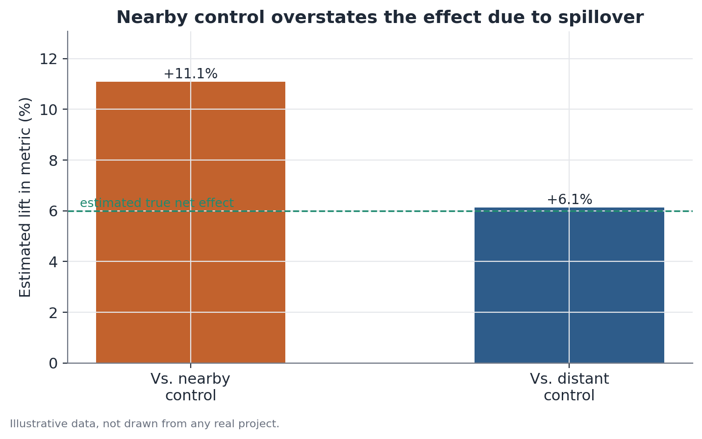

# Spatial spillover and cannibalization analysis

## 1. What problem does this solve?

You tested a change in a handful of stores, cities, or regions — a new
campaign, a new service, a price change — and measured a positive effect by
comparing those treated units to control units. But what if part of that
"effect" isn't new value creation at all, just customers who migrated from a
nearby control store to the treated one? In that case, the experiment isn't
measuring real gain — it's measuring displacement, and the nearest control
unit no longer serves as a neutral baseline, because it was affected too.

## 2. Intuition

A geographically spread-out experiment implicitly assumes control units keep
behaving "normally," with no influence at all from what's happening at the
treated units. That assumption breaks when treatment and control compete for
the same audience — the same city, the same delivery radius, the same
customer base. If a treated store pulls in customers who used to buy at a
control store a few kilometers away, that control store will sell less
during the experiment — not because nothing changed for it, but because the
treatment "stole" part of its traffic. Comparing treatment against that
contaminated control inflates the apparent effect.

## 3. Plain-language explanation

The core diagnostic logic is to compare two kinds of control: control units
**near** the treated units (which may be experiencing spillover) and control
units **far** from them (outside any plausible radius of direct
competition). If the effect estimated using nearby controls is much larger
than the effect estimated using distant controls, that gap is a signal of
cannibalization: part of the measured "gain" against the nearby control is
actually its loss, not net creation somewhere else.



## 4. Easy conceptual example

Picture a convenience-store chain testing a new loyalty program in a handful
of stores in one city. Comparing those stores against control stores in the
same neighborhood, the program appears to lift sales by 12%. Comparing the
same treated stores against control stores in distant neighborhoods, with no
treated stores nearby, the measured lift drops to 6%. The gap between 12%
and 6% suggests that much of the "gain" at the nearby stores came from
customers who simply switched stores within the same neighborhood — not from
new customers or a real increase in spending.

## 5. How it works, broadly

1. Map the location of every experimental unit (treated and control) and
   compute the distance from each control to the nearest treated unit.
2. Define distance bands — for example, controls within 3 km ("nearby,"
   possibly contaminated) and controls beyond 10 km ("distant," unlikely to
   face direct competition).
3. Estimate the treatment effect separately against each control group.
4. Compare the magnitude of the two effects. A large gap between them is
   evidence of spillover; similar effects suggest that spatial contamination,
   if it exists, is small.
5. When possible, also examine how the effect on control units varies
   continuously with distance to the nearest treated unit — genuine
   cannibalization tends to fade smoothly with distance rather than drop off
   abruptly.

## 6. What the result means

If the effect measured against nearby controls is consistently larger than
against distant controls, the "true net effect" — the one that reflects real
value creation, not just reallocation — sits closer to the distant-control
estimate. The nearby-control effect measures something different: how much
the treated unit gained at the immediate neighborhood's expense, plus
whatever it created that's genuinely new.

## 7. How to interpret it

Not all cannibalization is a problem — sometimes it's exactly expected and
acceptable (a brand may know a new product will steal sales from an older
one in the same line, and that's part of the plan). What matters is not
confusing displacement with net creation when deciding whether it's worth
rolling the change out to every unit. If the goal is market growth, the net
effect (via the distant control) is the relevant metric. If the goal is just
understanding the treated unit's relative performance against its immediate
neighborhood, the nearby-control effect also has value — but for a different
question.

## 8. When it's useful

In any experiment with geographically close units competing for the same
audience — physical stores, delivery zones, service coverage regions. It's
especially important when a positive experiment result looks "too good" and
is about to justify a large-scale rollout decision, where undetected
cannibalization inflates expected gains and can lead to overly optimistic
revenue projections.

## 9. Important caveats

- The cutoff between "nearby" and "distant" is a design choice that needs
  justification — grounded in a real competition radius (for example, the
  distance customers typically travel), not an arbitrary number.
- "Distant" controls need to genuinely sit outside any treatment influence —
  if the true competition radius is larger than assumed, even the "distant"
  controls may be partially contaminated, understating the gap between the
  two groups.
- A small or null net effect (via distant control) alongside a large effect
  via nearby control doesn't mean the change "didn't work" — it means it
  redistributed demand rather than creating new demand, which can still be a
  valuable outcome depending on the business goal.
- Small numbers of treated and control units (few stores, few regions) make
  the effect estimates unstable; in that setting, the uncertainty around the
  comparison between the two effects needs to be reported, not just the
  point estimate.

## 10. A small worked example

A store chain tests extended opening hours in 15 stores in a metro area.
Twenty control stores in the same neighborhoods sit within 3 km of some
treated store; another 25 control stores, used as the distant comparison
group, sit more than 12 km from any treated store.

- Average daily sales, treated stores: $8,400 (before) → $9,660 (after).
- Average daily sales, nearby control: $8,100 (before) → $7,930 (after) — a
  2.1% drop.
- Average daily sales, distant control: $8,050 (before) → $8,170 (after) — a
  1.5% rise.

The effect estimated against the nearby control is roughly 17.3% (because
the control fell while the treatment rose). The effect estimated against the
distant control is roughly 13.5%. The gap of about 3.8 percentage points is
consistent with some degree of cannibalization from neighboring stores —
part of the increase at treated stores came from customers who used to buy
at the nearby control stores, not purely from more overall spending in the
region.

## 11. Simple code example

```python
import numpy as np
import pandas as pd

# illustrative data: one row per store, with distance to the nearest treated store
stores = pd.DataFrame({
    "store_id": range(1, 61),
    "treated": [True] * 15 + [False] * 45,
    "distance_km": [0] * 15 + list(np.random.default_rng(1).uniform(0.5, 20, 45)),
    "sales_before": np.random.default_rng(2).normal(8100, 400, 60),
    "sales_after": np.random.default_rng(3).normal(8300, 500, 60),
})

nearby_control = stores[(~stores["treated"]) & (stores["distance_km"] < 3)]
distant_control = stores[(~stores["treated"]) & (stores["distance_km"] > 10)]
treated = stores[stores["treated"]]

def pct_change(df):
    return (df["sales_after"].mean() / df["sales_before"].mean() - 1) * 100

change_treated = pct_change(treated)
change_nearby = pct_change(nearby_control)
change_distant = pct_change(distant_control)

effect_vs_nearby = change_treated - change_nearby
effect_vs_distant = change_treated - change_distant

print(f"Effect vs. nearby control:  {effect_vs_nearby:.1f} pp")
print(f"Effect vs. distant control: {effect_vs_distant:.1f} pp")
print(f"Gap (sign of cannibalization): {effect_vs_nearby - effect_vs_distant:.1f} pp")
```
