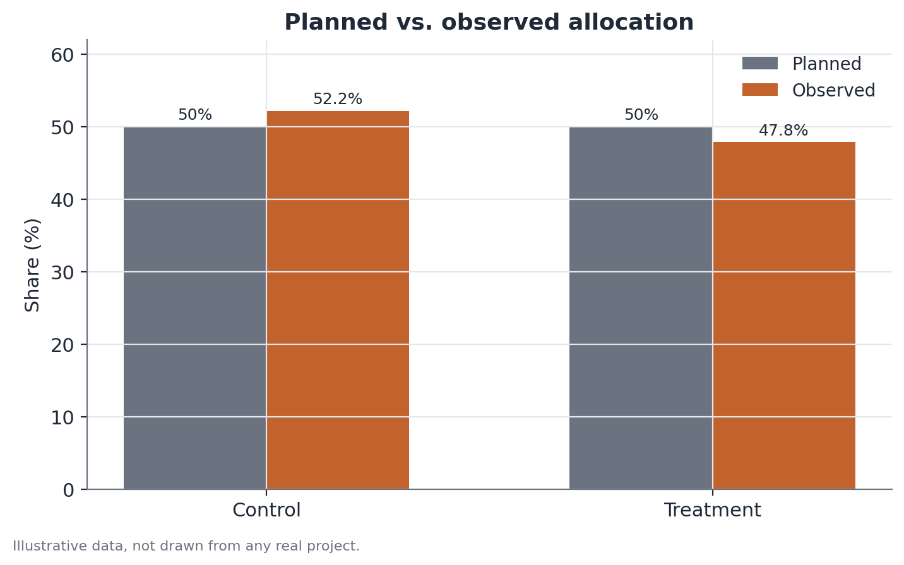

# Sample Ratio Mismatch (SRM) test

*Assumes the A/B testing fundamentals — see [A/B testing fundamentals](./ab-testing.md) for the vocabulary of randomization, groups, and primary metric used here.*

## 1. What problem does this solve?

An experiment was planned with a specific split between arms — 50/50 is the
most common, but it could be 90/10, 70/30, or any other proportion set in
advance. After running it, did that split actually come out as planned? If
the randomization system has a bug, if some type of user is being dropped
differently between groups, or if an eligibility filter interacts badly with
assignment, the real split can come out skewed — and when that happens,
nothing the experiment measures afterward can be trusted.

## 2. Intuition

If you flip a fair coin 20,000 times, you don't expect exactly 10,000 heads
and 10,000 tails — but you do expect something close to it, with a deviation
that follows a predictable pattern. A Sample Ratio Mismatch happens when the
deviation from the planned proportion is too large to be explained by that
expected chance variation. It's essentially asking: "is this coin still
fair, or is something broken with it?" — except here the coin is the
experiment's own randomization mechanism.

## 3. Plain explanation

The test compares the observed user count in each arm of the experiment
against the count you'd expect under the planned proportion, using a
chi-square test (or, equivalently for two groups, a binomial test). The
larger the gap between observed and expected, the stronger the evidence that
randomization isn't behaving as it should.



## 4. A simple conceptual example

An app plans to test a new onboarding screen for 50% of new users, keeping
the other 50% on the current screen. By the end of the experiment, the
current-screen group has 10,432 users and the new-screen group has 9,568 — a
gap of nearly 900 users. That could just be normal fluctuation, or it could
signal that, for some technical reason, users on a certain device type are
being excluded from the new group before they're even counted. The SRM test
helps decide which of the two scenarios is more plausible.

## 5. How it works, broadly

1. Define the planned allocation proportion between arms (e.g., 50%/50%).
2. Count how many users actually landed in each arm by the end of the
   experiment (or of a checkpoint period).
3. Compute the expected count in each arm by applying the planned
   proportion to the observed total.
4. Run a chi-square goodness-of-fit test comparing observed and expected
   counts, producing a p-value.
5. A very low p-value (the common threshold is much stricter than for an
   effect test — something like 0.001, because a false alarm here halts the
   entire experiment) is the warning sign.

## 6. What the result means

A non-significant SRM doesn't prove randomization is perfect — only that the
observed proportion is compatible with the planned one, within what's
expected from random variation. A significant SRM is evidence that the real
group proportions deviated from the planned ones by more than chance would
suggest — a sign that something in the assignment mechanism, or in how users
are counted, isn't working correctly.

## 7. How to interpret it

A significant SRM doesn't say, on its own, what caused the imbalance — only
that there's a problem to investigate before trusting any effect reading
from the experiment. Common causes include: bugs in the assignment code,
differences in load time between versions (causing one to "lose" more users
to timeouts), bot or traffic-quality filters applied asymmetrically, and
logging issues that record one group more completely than the other.

## 8. When it's useful

In every randomized experiment, as a routine check before interpreting any
effect result — it's the first test to run, not an optional extra. It
matters especially in experiments with many technical systems involved in
assignment (multiple platforms, multiple entry points, complex eligibility
filters), where the odds of a subtle bug breaking randomization are higher.

## 9. Important caveats

- A significant SRM invalidates any measured effect until the cause is found
  and fixed — there's no point "looking at the effect anyway" or trying to
  statistically compensate for the imbalance afterward.
- The significance threshold used is usually stricter than the standard
  0.05 (something like 0.001 or lower), because the cost of ignoring a real
  SRM is high and the check itself is cheap to run.
- No SRM in the overall allocation doesn't guarantee no SRM within specific
  subgroups (a device type, a region) — checking by segment is worthwhile
  when the suspected cause is localized.
- SRM can show up only during part of the experiment's run (e.g., a bug
  fixed midway) — looking at the proportion over time, not just the
  cumulative total, helps diagnose that.

## 10. A small worked example

An experiment was planned with a 50/50 split. By the end, the control group
has 10,432 users and the treatment group has 9,568, out of a total of
20,000. The expected value in each arm, under the planned proportion, is
10,000. The chi-square statistic is:

$$
\chi^2 = \frac{(10{,}432 - 10{,}000)^2}{10{,}000} + \frac{(9{,}568 - 10{,}000)^2}{10{,}000} \approx 37.3
$$

With 1 degree of freedom, that value corresponds to an extremely low p-value
(well below 0.001) — strong evidence that the observed proportion isn't
compatible with a random 50/50 split. Before interpreting any effect
measured in this experiment, the cause of that discrepancy needs to be
found.

## 11. Simple code example

```python
from scipy.stats import chisquare

observed = [10432, 9568]      # illustrative
planned_share = [0.5, 0.5]
total = sum(observed)
expected = [p * total for p in planned_share]

result = chisquare(f_obs=observed, f_exp=expected)
print(f"chi-square = {result.statistic:.2f}, p-value = {result.pvalue:.6f}")
```

A p-value below the strict SRM threshold (say, 0.001) is the signal to stop
and investigate before moving ahead with any effect analysis.
