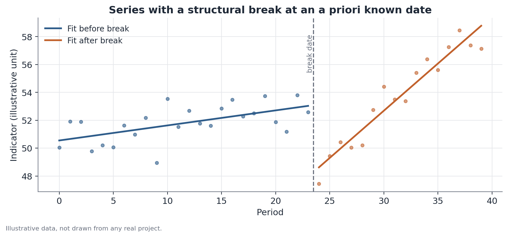

# Structural Break Test (Chow-Type)

## 1. What problem does this solve?

A series over time — a participation rate, an average price, a proportion —
appears to have changed behavior at a specific, known moment: the start of a
pandemic, a law taking effect, a documented economic crisis. Is that change
real, or could it just be normal fluctuation in the series? The structural
break test, in the tradition of the Chow test, answers this question
specifically when the date of the possible event is already known before
looking at the data.

## 2. Intuition

If nothing special had happened at that moment, the series' behavior before
and after the chosen date should keep following, roughly, the same pattern —
same trend, same relationship with other variables. The test fits a separate
model to each of the two pieces of the series (before and after the date)
and checks whether those two models are statistically different enough to
reject the idea that they come from a single, continuous process.

## 3. Plain explanation

There are three ways to fit the same type of model: one for the entire
series (ignoring the possible break), one for the period before the date,
and a separate one for the period after. If the "with break" fit (two
separate models) explains the data noticeably better than the "no break" fit
(a single model), that's evidence something actually changed at the stated
date.

## 4. Simple conceptual example

Picture a restaurant's daily order count over two years, with a known date
when the menu was completely overhauled. Before the change, orders grew
slowly and steadily. After it, they grew much faster. A structural break test
at that specific date checks whether this pattern difference is too large to
be sampling coincidence.

## 5. How it works, broadly

1. Choose the event date **before** looking at the results — the test loses
   its validity if the date is picked after observing where the series
   "looks like" it changed.
2. Fit a single model (say, a trend line) using the entire series.
3. Fit two separate models: one using only the data before the date, one
   using only the data after.
4. Compare how much the two separate models reduce the fitting error
   relative to the single model, using an F statistic.
5. A low p-value indicates the break improves the fit more than would be
   expected by chance — evidence of a structural change.



## 6. What the result means

A significant test says the series' behavior before and after the chosen
date is statistically different. That's consistent with "something relevant
happened at that moment" — but the test alone does not prove it was exactly
the event you had in mind.

## 7. How to interpret it

The result is evidence of temporal correlation with the chosen date, not
causation. If another relevant event happened close to the same date — a
currency crisis near a labor-law reform, for instance — the test alone
cannot attribute the change to one or the other. Contextual judgment, and
ideally other sources of evidence, are needed to interpret the cause.

## 8. When it's useful

It's useful whenever there is a date of interest defined ahead of time, for
reasons external to the data — a law, a policy, a historical event. In the
Hub-Racial-Brasil project, this test is used to check whether a group's
labor-market participation changed pattern at a specific, known moment, such
as the start of a crisis or the implementation of a policy.

## 9. Important caveats

- This is a test for **one** break known a priori — not a search for
  multiple breaks at unknown dates (that's a different problem, addressed by
  methods such as Bai-Perron).
- Choosing the date after already seeing where the series "looks like" it
  breaks invalidates the test — the p-value no longer carries its usual
  interpretation.
- The test assumes a specific model form (typically linear) in each piece of
  the series; if the true relationship is very different from that, the
  result can mislead.
- Short segments before or after the date reduce the test's power to detect
  a real break that does exist.

## 10. A small worked example

A 40-observation series has, before the cutoff date, an estimated slope of
0.15 per period. After the cutoff, the estimated slope rises to 0.55 per
period, and the series' average level also rises. Fitting the single model
(no break) versus the two separate models, the resulting F statistic is
4.35, with a p-value of 0.021 — below the conventional 0.05 threshold.
Conclusion: there is evidence of a pattern change at the chosen date.

## 11. Simple code example

```python
import numpy as np
import statsmodels.api as sm

# series: array with the variable of interest over time
# break_index: a priori known position where the break is tested
def chow_test(series, time, break_index):
    X_full = sm.add_constant(time)
    model_full = sm.OLS(series, X_full).fit()
    rss_full = model_full.ssr

    X1 = sm.add_constant(time[:break_index])
    X2 = sm.add_constant(time[break_index:])
    rss1 = sm.OLS(series[:break_index], X1).fit().ssr
    rss2 = sm.OLS(series[break_index:], X2).fit().ssr

    k = X_full.shape[1]
    n = len(series)
    f_stat = ((rss_full - (rss1 + rss2)) / k) / ((rss1 + rss2) / (n - 2 * k))
    return f_stat
```
