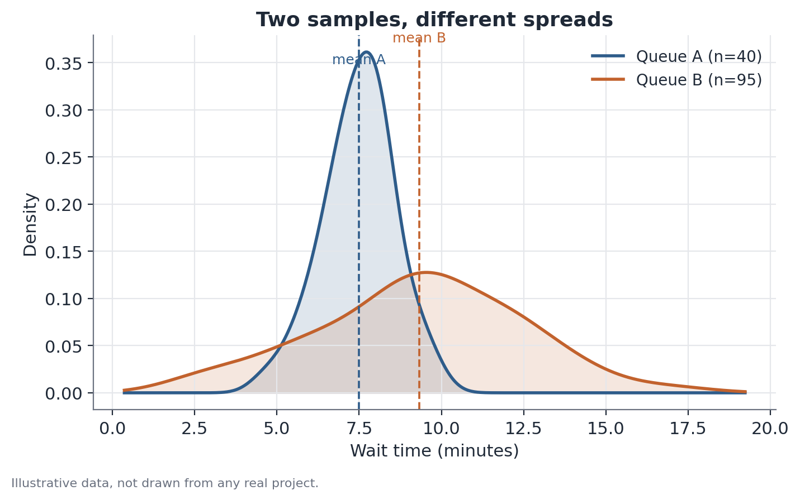

# Welch's t-test

## 1. What problem does this solve?

You have two groups and notice the average of some variable differs between
them — say, the average wait time in one queue is longer than in another. The
question that matters is: is that difference real, in the sense of reflecting
something happening in the population, or could it have arisen just from the
luck of who ended up in each sample? More specifically: can you answer that
reliably when the two groups don't have the same sample size or the same
internal variability?

## 2. Intuition

Even if two populations had exactly the same mean, random samples drawn from
them would almost never produce identical sample means — there is always
sampling noise. Welch's t-test measures how unusual the observed difference
between the means is, accounting for each sample's size and its internal
spread, without requiring that spread to be equal across the two groups.

That last part is what separates Welch from the classic Student's t-test: the
Student version assumes both populations share the same variance — a
mathematically convenient assumption, but often unrealistic. Different groups
tend to have different variability, especially when they also differ in
sample size.

## 3. Plain-language explanation

The test computes a statistic that summarizes "how many standard errors away
from zero" the observed difference sits. The larger this distance (in
absolute value), the more unusual it would be to see this difference if the
population means were actually equal. That statistic is compared against a
reference distribution (a t-distribution, with degrees of freedom computed in
a specific way) to produce a p-value.



## 4. Easy conceptual example

Picture two checkout lines at an event. Line A has few attendants, but wait
times are fairly predictable. Line B has more attendants, but wait times vary
a lot — sometimes fast, sometimes stuck for a while. Even with very different
sample sizes and variability between the two lines, Welch's test can still
compare their averages reliably.

## 5. How it works, broadly

1. Compute the mean and standard deviation of each group separately.
2. Compute the standard error of the difference between means, combining the
   two variances without assuming they're equal.
3. Divide the observed difference in means by that standard error to get the
   t statistic.
4. The degrees of freedom don't come from a simple formula the way they do
   for Student's test — they're computed in a way that weights how much
   uncertainty each group contributes (the Welch-Satterthwaite
   approximation), typically landing on a non-integer number.
5. Compare the t statistic to the reference distribution to get the p-value.

## 6. What the result means

A low p-value (typically below 0.05) indicates that a difference this size
would be rare if the population means were actually equal — that's evidence
in favor of a real difference. A high p-value doesn't prove the means are
equal; it just means the data don't carry strong evidence of a difference.

## 7. How to interpret it

The p-value measures evidence against the hypothesis of equal means, not the
size or practical importance of the difference. A small gap can be
statistically significant with a large sample, and a large gap can fail to be
significant with a small or highly variable sample. Always look at the effect
size alongside the p-value — never just one or the other.

## 8. When it's useful

When you need to compare averages between two groups that likely have
different variability — which is the rule, not the exception, in real-world
data. A common case is tracking, across many time periods, whether the
average income gap between two population groups stays statistically
significant period after period, without assuming upfront that both groups
have the same income spread.

## 9. Important caveats

- The test assumes reasonably independent observations; data with cluster
  structure (several observations from the same household or region, say)
  needs a separate adjustment to the standard error.
- With very small samples and heavily skewed distributions, the
  approximation the test relies on becomes less reliable.
- Statistical significance isn't the same as practical relevance — always
  report the size of the difference, not just the p-value.

## 10. A small worked example

Suppose two service queues, with wait times in minutes:

- Queue A: n = 40, mean = 8.1 min, standard deviation = 1.3 min.
- Queue B: n = 95, mean = 9.6 min, standard deviation = 3.4 min.

The observed difference in means is 1.5 minutes. Because Queue B has a much
larger spread, Welch's test weights that extra uncertainty when computing the
standard error of the difference, producing a t statistic of about 3.1, with
effective degrees of freedom around 61 (a non-integer number, the result of
weighting the two samples). The corresponding p-value is well below 0.01 —
strong evidence that Queue B really does have a longer average wait, not just
sampling luck.

## 11. Simple code example

```python
import numpy as np
from scipy import stats

queue_a = np.array([7.9, 8.4, 7.5, 9.0, 8.2, 7.8, 8.6, 7.7, 8.3, 8.0])  # illustrative
queue_b = np.array([9.1, 12.4, 6.8, 10.2, 9.9, 7.3, 15.0, 8.5, 9.7, 10.8])  # illustrative

result = stats.ttest_ind(queue_a, queue_b, equal_var=False)  # equal_var=False = Welch
print(f"t = {result.statistic:.2f}, p-value = {result.pvalue:.4f}")
```

The `equal_var=False` argument is what tells SciPy to use Welch instead of
the classic Student's test — a one-line difference that avoids an assumption
which, in practice, rarely holds.
