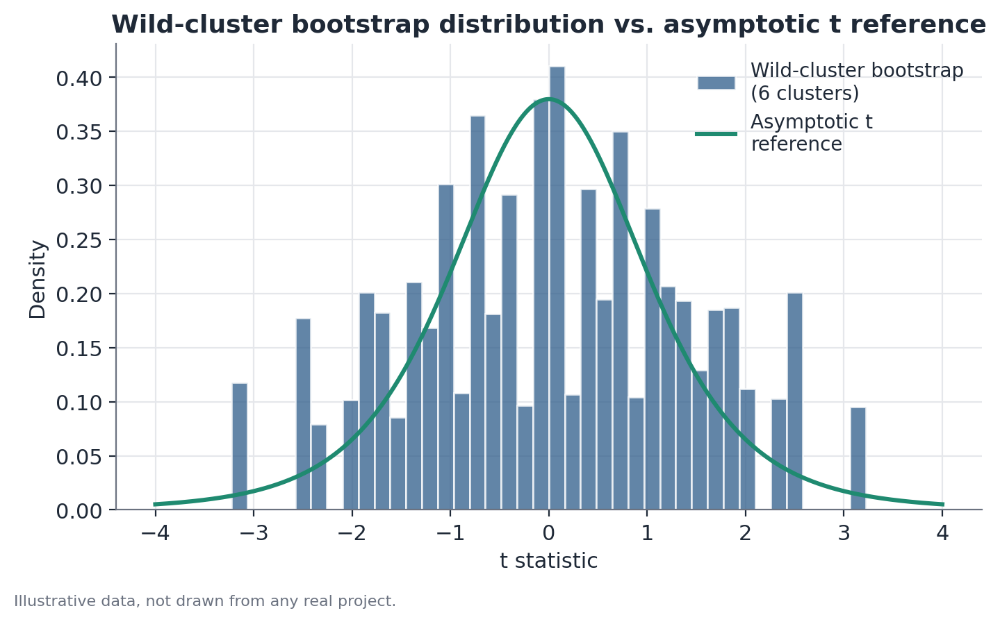

# Wild-cluster bootstrap

## 1. What problem does this solve?

Cluster-robust standard errors work well when there are many clusters, but
become unreliable when there are few — a dozen or fewer, for example. In
that setting, a hypothesis test based on that approximation can reject the
null hypothesis far more often than it should, even when it is true. The
wild-cluster bootstrap is a way of building a more reliable reference
distribution in that situation, without relying on the asymptotic
approximation that fails precisely when clusters are few.

## 2. Intuition

Instead of trusting a theoretical formula for the standard error, the
method generates many alternative, plausible versions of the data —
preserving the real dependence pattern within each cluster — and observes
how the test statistic varies across those versions. That observed
variation becomes the ruler for judging whether the real result is unusual.

## 3. Simple explanation

The wild-cluster bootstrap does not resample individual data rows, nor does
it draw entire clusters with replacement (as an ordinary cluster bootstrap
does). Instead, it takes the **residuals** from an already-fitted model,
multiplies **every residual belonging to the same cluster by the same
random number** (typically +1 or −1, drawn cluster by cluster), adds those
perturbed residuals back onto a prediction under the null hypothesis, and
refits the model. Repeating this thousands of times produces an entire
distribution of test statistics: "this is what could have happened, under
the null hypothesis."

## 4. Easy conceptual example

Imagine a chain of 6 hospitals testing a new triage protocol, with only 6
clusters (hospitals) in total — too few to trust a conventional
cluster-robust standard error. The wild-cluster bootstrap generates
thousands of alternative scenarios in which the deviations (residuals)
observed at each hospital are "flipped" or "kept" as a block, randomly,
hospital by hospital — preserving the pattern that, within a given
hospital, deviations tend to move together.

## 5. How it works, broadly

1. Fit the model under the null hypothesis (for example, treatment effect
   equal to zero) and obtain the residuals from that restricted fit.
2. For each bootstrap replicate, draw a random sign (+1 or −1) **per
   cluster** — every observation in the same cluster gets the same sign in
   that replicate.
3. Multiply each cluster's residuals by the sign drawn for that cluster,
   creating a synthetic dependent variable.
4. Refit the model to that synthetic variable and recompute the test
   statistic.
5. Repeating steps 2 through 4 many times (typically 999 or more
   replicates) builds the test statistic's reference distribution under the
   null hypothesis.

## 6. What the result means

The wild-cluster bootstrap p-value is the fraction of replicates in which
the recomputed statistic is as extreme as, or more extreme than, the
statistic observed in the real data. Unlike the conventional cluster-robust
standard error, this reference distribution is built directly from the
data, without relying on a normal approximation that only works well with
many clusters.

## 7. How to interpret it

A low p-value from the wild-cluster bootstrap is more trustworthy evidence,
with few clusters, than an equally low p-value from a conventional
cluster-robust standard error — because the method does not depend on the
asymptotic assumption that fails precisely in that setting.

## 8. When it is useful

Especially indicated when there are few clusters (a common range in the
applied literature is below 30, with extra caution below 10-15), and the
effect of interest comes from a regression model — with or without control
variables — rather than a simple comparison of means between two groups
(in that simpler case, randomization inference is also a direct
alternative).

## 9. Important caveats

The method still depends on the model being reasonably well specified — it
solves the standard-error problem under few clusters, but it does not fix a
misspecified model. With extremely few clusters (2 or 3, for example), even
the wild-cluster bootstrap runs into limitations, since the number of
possible sign combinations per cluster also becomes small.

## 10. A small numerical example

A regression model with 6 clusters produces an estimated treatment
coefficient of 4.2, with a conventional cluster-robust standard error of
1.3, giving t ≈ 3.2 — apparently significant under the usual asymptotic t
reference. Running the wild-cluster bootstrap with 999 replicates (random
signs drawn per cluster, 6 sign draws combining $2^6 = 64$ possible
patterns), the observed t-statistic of 3.2 lands at the 91st percentile of
the bootstrap distribution — corresponding to a two-sided p-value of
roughly 0.09, higher (more conservative) than the original asymptotic
p-value of about 0.003. The conclusion changes from "strongly significant"
to "suggestive, but not conclusive at 5%."

## 11. Simple code example

```python
import numpy as np
import statsmodels.formula.api as smf

def wild_cluster_bootstrap(df, formula, cluster_col, n_boot=999, seed=0):
    rng = np.random.default_rng(seed)
    restricted_model = smf.ols(formula, data=df).fit()
    residuals = restricted_model.resid
    fitted = restricted_model.fittedvalues
    clusters = df[cluster_col].unique()

    t_boot = []
    for _ in range(n_boot):
        signs = {c: rng.choice([-1, 1]) for c in clusters}
        weight = df[cluster_col].map(signs).values
        y_synthetic = fitted + residuals * weight
        df_boot = df.assign(y_synthetic=y_synthetic)
        boot_model = smf.ols(formula.replace(formula.split("~")[0].strip(), "y_synthetic"),
                              data=df_boot).fit(cov_type="cluster",
                                                 cov_kwds={"groups": df_boot[cluster_col]})
        t_boot.append(boot_model.tvalues["treatment"])
    return np.array(t_boot)
```


