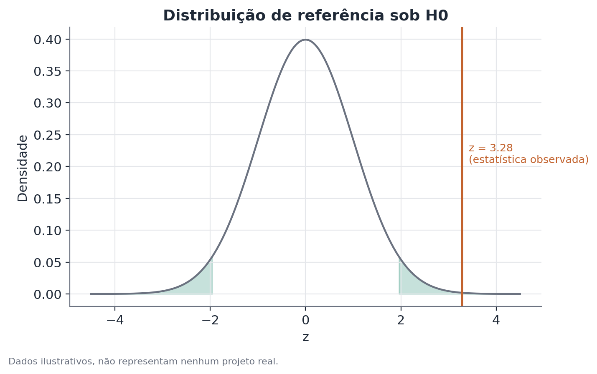

# Fundamentos de teste A/B

Este documento cobre os fundamentos estatísticos de um teste A/B — desenho
experimental, aleatorização, efeito, erro-padrão, intervalo de confiança e
teste de hipótese para médias e proporções. Os três documentos seguintes
(Sample Ratio Mismatch, balanceamento de covariáveis e teste de
não-inferioridade) pressupõem este conteúdo como pré-requisito e vão direto
ao que cada um acrescenta.

## Conceito

Um teste A/B é um experimento controlado e randomizado aplicado a um contexto
de produto ou negócio: unidades (geralmente usuários) são designadas
aleatoriamente a uma condição de controle ou de tratamento, e uma métrica
primária pré-definida é comparada entre os dois grupos ao final de um período
fixo.

A ideia central é isolar o efeito causal da mudança testada. Em uma
comparação observacional — por exemplo, "antes" versus "depois" do
lançamento, ou usuários que optaram por usar um recurso novo versus os que
não optaram — qualquer diferença encontrada pode vir de dezenas de fatores
que também mudam ao longo do tempo ou que diferem sistematicamente entre
quem escolhe e quem não escolhe algo. A aleatorização quebra esse vínculo: em
expectativa, o sorteio torna os dois grupos comparáveis em tudo, observável ou
não, exceto na condição atribuída. Isso é o que permite atribuir uma
diferença de resultado à mudança testada, com uma margem de incerteza
quantificável.

## Formulação matemática

### Diferença de médias (métrica contínua)

Sejam os grupos controle ($C$) e tratamento ($T$), com médias amostrais
$\bar{x}_C$ e $\bar{x}_T$, variâncias amostrais $s_C^2$ e $s_T^2$, e tamanhos
$n_C$ e $n_T$. O efeito estimado é:

$$
\hat{\Delta} = \bar{x}_T - \bar{x}_C
$$

O erro-padrão dessa diferença, sem assumir variâncias iguais entre os grupos
(a mesma lógica do teste t de Welch), é:

$$
SE(\hat{\Delta}) = \sqrt{\frac{s_T^2}{n_T} + \frac{s_C^2}{n_C}}
$$

A estatística de teste e o intervalo de confiança de 95% seguem como:

$$
t = \frac{\hat{\Delta}}{SE(\hat{\Delta})}, \qquad
\text{IC } 95\% = \hat{\Delta} \pm z_{0{,}975} \cdot SE(\hat{\Delta})
$$

onde $z_{0{,}975} \approx 1{,}96$ para uma aproximação normal (adequada com
amostras grandes; com amostras pequenas, usa-se o quantil da distribuição t
com os graus de liberdade de Welch-Satterthwaite).

### Diferença de proporções (métrica binária, como conversão)

Sejam $\hat{p}_C = x_C / n_C$ e $\hat{p}_T = x_T / n_T$ as taxas observadas em
cada grupo, com $x_C$ e $x_T$ conversões e $n_C$, $n_T$ tamanhos de amostra.
O efeito estimado é $\hat{\Delta} = \hat{p}_T - \hat{p}_C$. Para o teste de
hipótese, usa-se a proporção combinada (pooled) sob a hipótese nula de
igualdade:

$$
\hat{p}_{pool} = \frac{x_C + x_T}{n_C + n_T}, \qquad
SE_0 = \sqrt{\hat{p}_{pool}(1-\hat{p}_{pool})\left(\frac{1}{n_C} + \frac{1}{n_T}\right)}
$$

$$
z = \frac{\hat{p}_T - \hat{p}_C}{SE_0}
$$

Note que o erro-padrão usado no teste ($SE_0$, sob $H_0$) é diferente do
erro-padrão usado para construir o intervalo de confiança em torno do efeito
observado, que não assume proporções iguais:

$$
SE(\hat{\Delta}) = \sqrt{\frac{\hat{p}_C(1-\hat{p}_C)}{n_C} + \frac{\hat{p}_T(1-\hat{p}_T)}{n_T}}
$$

### Tamanho de amostra / poder

O tamanho de amostra necessário para detectar um efeito mínimo $\delta$ com
poder $1-\beta$ e significância $\alpha$ (teste de duas pontas) é
aproximadamente, para uma métrica de proporção:

$$
n \approx \frac{\left(z_{1-\alpha/2} + z_{1-\beta}\right)^2 \cdot \left[p_C(1-p_C) + p_T(1-p_T)\right]}{\delta^2}
$$

onde $z_{1-\alpha/2}$ e $z_{1-\beta}$ são os quantis normais correspondentes
à confiança e ao poder desejados, e $\delta = p_T - p_C$ é o efeito mínimo
que se quer conseguir detectar.

## Suposições

- **Aleatorização efetiva**: cada unidade elegível tem probabilidade de
  designação conhecida (tipicamente igual) e independente das demais. Sem
  isso, todo o argumento causal desmorona — daí a importância de checar a
  proporção observada de alocação (ver Sample Ratio Mismatch).
- **Independência entre unidades**: o resultado de uma unidade não deve
  depender de qual condição outra unidade recebeu (ausência de interferência
  ou "SUTVA" — Stable Unit Treatment Value Assumption). Em contextos com
  efeitos de rede ou de mercado compartilhado, essa suposição pode falhar.
- **Métrica bem definida e estável antes do experimento**: a métrica
  primária, sua janela de agregação e o critério de elegibilidade devem ser
  fixados antes de olhar os dados, para evitar viés de seleção retroativa.
- **Ausência de espionagem repetida (peeking) sem correção**: parar o
  experimento assim que o valor-p cruza 0,05, sem um método sequencial
  apropriado, infla a taxa de falso positivo muito acima do α nominal.

## Hipóteses

Para uma métrica contínua ou de proporção, o teste de duas pontas padrão é:

$$
H_0: \Delta = 0 \qquad H_1: \Delta \neq 0
$$

onde $\Delta$ é a diferença real (populacional) entre tratamento e controle.
O nível de significância $\alpha$ é tipicamente fixado em 0,05 antes do
experimento. Rejeita-se $H_0$ quando o valor-p é menor que $\alpha$, ou,
equivalentemente, quando o intervalo de confiança de $(1-\alpha)$ não contém
zero.

## Interpretação

Rejeitar $H_0$ é evidência de que o efeito observado não é plausivelmente
explicado só por variação amostral — não é prova de causalidade por si só;
essa leitura causal vem da aleatorização, não do teste estatístico em
isolado. O tamanho do intervalo de confiança comunica a precisão da
estimativa: dois experimentos podem ter o mesmo ponto estimado de efeito com
graus de confiança muito diferentes, dependendo do tamanho de amostra e da
variabilidade da métrica.

É essencial distinguir significância estatística de relevância prática. Um
efeito de 0,05 ponto percentual em conversão pode ser estatisticamente
significativo com milhões de usuários, mas não justificar o custo de
engenharia da mudança. Da mesma forma, "não significativo" não equivale a
"efeito nulo" — um experimento subdimensionado (poder baixo) simplesmente não
tem sensibilidade para detectar efeitos do tamanho que realmente importam;
nesse caso, o resultado correto a reportar é "não há evidência suficiente",
não "não há efeito".

## Limitações

- Um teste A/B mede o efeito médio populacional sob as condições específicas
  do experimento (período, mix de usuários, contexto de produto naquele
  momento) — generalizar o resultado para outro período ou população exige
  cautela.
- Testar muitas métricas secundárias simultaneamente sem correção para
  comparações múltiplas aumenta a chance de encontrar "efeitos" espúrios.
  Achados secundários interessantes merecem ser tratados como hipótese a
  confirmar num experimento dedicado, não como conclusão definitiva.
- O resultado agregado pode esconder heterogeneidade — o efeito pode ser
  positivo para um subgrupo e negativo para outro, cancelando-se no total
  (ver teste de heterogeneidade/interação).
- A validade de tudo depende da randomização ter funcionado como planejado;
  o teste de hipótese em si não verifica isso.

## Exemplo

Suponha um site de e-commerce testando um novo layout da página de checkout
contra o layout atual. A equipe randomiza 12.000 visitantes para cada braço
e roda o experimento por duas semanas completas, sem parar antes do previsto.

Resultado observado:

| | Controle | Tratamento |
|---|---|---|
| Visitantes | 12.000 | 12.000 |
| Conversões | 984 | 1.128 |
| Taxa | 8,20% | 9,40% |

O efeito estimado é $\hat{\Delta} = 0{,}094 - 0{,}082 = 0{,}012$ (1,2 ponto
percentual). A proporção combinada sob $H_0$ é
$\hat{p}_{pool} = (984+1128)/24000 \approx 0{,}088$, o que dá
$SE_0 \approx 0{,}00366$ e $z \approx 3{,}28$, correspondendo a um valor-p
abaixo de 0,01. O intervalo de confiança de 95% para a diferença, calculado
sem assumir proporções iguais, fica aproximadamente entre 0,4 e 2,0 pontos
percentuais — inteiramente acima de zero.

A conclusão estatística é clara: o novo layout aumentou a conversão, e o
tamanho desse aumento (entre aproximadamente 5% e 24% de aumento relativo,
dependendo de onde no intervalo o efeito real estiver) é grande o bastante
para justificar investigação de custo-benefício de lançamento. Antes de
declarar vitória, porém, a equipe checaria: (1) se a alocação observada
(12.000/12.000, ou próxima disso) bate com o planejado — um teste de SRM; e
(2) se nenhuma métrica de guardrail, como tempo de carregamento ou taxa de
erro, piorou além de uma margem aceitável — um teste de não-inferioridade.
