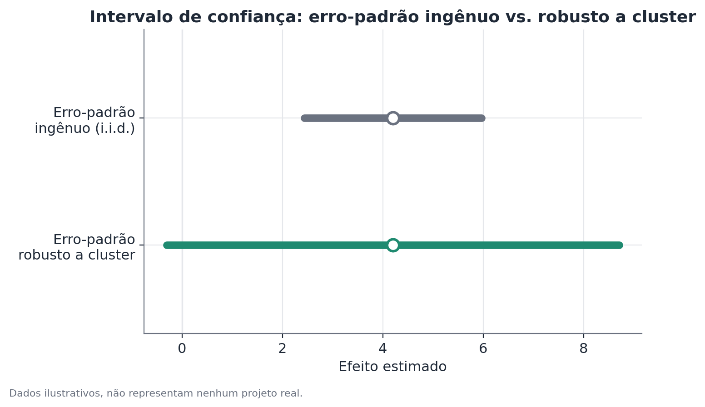

# Erros-padrão robustos a cluster

## Conceito

A inferência estatística clássica (erros-padrão de mínimos quadrados
ordinários, por exemplo) assume que os erros do modelo são independentes e
identicamente distribuídos entre observações. Essa suposição é violada
sempre que os dados têm estrutura de **agrupamento**: observações dentro do
mesmo cluster (loja, região, domicílio, turma, unidade amostral de uma
pesquisa) compartilham choques não observados em comum, o que gera
correlação intra-cluster nos erros.

Ignorar essa estrutura não enviesa o ponto estimado do coeficiente — o
estimador de mínimos quadrados continua não-viesado sob as suposições usuais
— mas enviesa **para baixo** o erro-padrão calculado, porque a fórmula padrão
conta cada observação como uma unidade totalmente independente de
informação, quando na verdade parte da variação dentro do cluster é
repetição, não novidade.

O erro-padrão robusto a cluster (também chamado de "cluster-robust
variance estimator", CRVE) corrige isso permitindo correlação arbitrária
dentro de cada cluster e exigindo independência apenas entre clusters.

## Formulação matemática

Para um modelo linear $Y_i = X_i'\beta + \varepsilon_i$, o estimador de
mínimos quadrados é $\hat\beta = (X'X)^{-1}X'Y$. A variância clássica de
$\hat\beta$ assume $\varepsilon_i$ i.i.d. com variância $\sigma^2$:

$$
\widehat{\text{Var}}(\hat\beta)_{\text{clássico}} = \hat\sigma^2 (X'X)^{-1}
$$

O estimador robusto a cluster, com $G$ clusters indexados por $g = 1,
\dots, G$, cada um com matriz de covariáveis $X_g$ e vetor de resíduos
$\hat u_g = Y_g - X_g \hat\beta$, é da forma "sanduíche":

$$
\widehat{\text{Var}}(\hat\beta)_{\text{cluster}} = (X'X)^{-1} \left( \sum_{g=1}^{G} X_g' \hat u_g \hat u_g' X_g \right) (X'X)^{-1}
$$

onde:

- $X_g' \hat u_g \hat u_g' X_g$ é a contribuição do cluster $g$ ao termo
  central — permite que os resíduos de observações do mesmo cluster estejam
  correlacionados entre si de forma arbitrária, sem impor uma estrutura
  específica de correlação;
- a soma é feita cluster por cluster, não observação por observação — é
  isso que preserva a correlação interna em vez de tratá-la como ruído
  independente;
- $(X'X)^{-1}$ nas pontas ("pão" do sanduíche) é a mesma matriz do estimador
  clássico.

É comum aplicar uma correção de graus de liberdade em amostras finitas,
multiplicando o resultado por um fator como:

$$
c = \frac{G}{G-1} \cdot \frac{n-1}{n-k}
$$

com $n$ o número total de observações, $k$ o número de parâmetros
estimados, e $G$ o número de clusters — essa correção ajuda, mas não resolve
completamente, o comportamento problemático com poucos clusters (ver
limitações).

## Suposições

- **Independência entre clusters.** A correção só é válida se clusters
  diferentes forem de fato independentes entre si — se houver dependência
  também entre clusters (por exemplo, um choque macroeconômico afetando
  todas as regiões ao mesmo tempo), o erro-padrão robusto a cluster ainda
  subestima a incerteza real.
- **Número de clusters suficientemente grande.** As propriedades
  assintóticas do estimador dependem de $G \to \infty$. Na prática, valores
  de $G$ abaixo de 30-40 tornam a aproximação normal da distribuição de
  $\hat\beta$ pouco confiável, mesmo com $n$ grande dentro de cada cluster.
- **A variável de cluster está corretamente especificada.** Agrupar no
  nível errado (por exemplo, por loja quando a verdadeira fonte de
  correlação é por região, que agrega várias lojas) subestima a correlação
  real e ainda produz erro-padrão pequeno demais.

## Hipóteses

O CRVE não introduz um novo teste de hipótese — ele é um método de cálculo
de erro-padrão, usado dentro dos testes usuais sobre coeficientes de
regressão:

- $H_0$: $\beta_j = 0$ (o coeficiente de interesse é nulo na população)
- $H_1$: $\beta_j \neq 0$
- Estatística de teste: $t = \hat\beta_j / \widehat{SE}_{\text{cluster}}(\hat\beta_j)$,
  comparada à distribuição t com $G - 1$ graus de liberdade (uma escolha
  comum e conservadora, já que a variação efetiva de informação está mais
  próxima do número de clusters do que do número de observações).
- Intervalo de confiança de 95%: $\hat\beta_j \pm t_{0{,}975, \, G-1} \cdot \widehat{SE}_{\text{cluster}}(\hat\beta_j)$.

## Interpretação

O ponto estimado do efeito não muda ao trocar o erro-padrão clássico pelo
robusto a cluster — só a incerteza em volta dele muda. Um efeito que deixa
de ser significativo sob erro-padrão robusto a cluster não é "menos real" —
a estimativa continua sendo a melhor disponível; apenas a confiança
declarada nela estava inflada antes da correção.

Vale reforçar: o erro-padrão robusto a cluster corrige a inferência, não a
identificação causal. Se o desenho do estudo tem outros problemas (variável
omitida, seleção, ausência de randomização), o erro-padrão robusto a
cluster não resolve nada disso — ele só garante que, dado o ponto estimado,
a margem de erro declarada é mais fiel à estrutura de dependência dos dados.

## Limitações

- **Poucos clusters.** Esta é a limitação mais citada na literatura
  aplicada. Com poucos clusters (regra prática comum: abaixo de 30-40), o
  CRVE tende a subestimar a variância verdadeira, mesmo com a correção de
  graus de liberdade, e a distribuição da estatística de teste se afasta da
  aproximação t assumida. Nesse cenário, dois caminhos alternativos, cobertos
  em documentos próprios neste repositório, costumam funcionar melhor:
  **inferência por randomização**, quando o número de reatribuições
  possíveis do tratamento é pequeno o suficiente para enumerar (ou
  amostrar) diretamente; e **bootstrap wild-cluster**, que reamostra
  resíduos multiplicados por sinais aleatórios por cluster e tende a ter
  melhor comportamento em amostras finitas com poucos clusters do que o
  CRVE assintótico. Em geral: CRVE é a opção padrão e mais simples quando há
  clusters suficientes (dezenas ou mais); com poucos clusters, prefira wild-
  cluster bootstrap como alternativa mais acessível computacionalmente, ou
  inferência por randomização quando a estrutura do desenho permitir
  enumerar as reatribuições possíveis de forma natural.
- **Clusters muito desiguais em tamanho.** Um cluster muito maior que os
  demais pode dominar a soma da fórmula sanduíche, tornando a estimativa de
  variância instável.
- **Escolha do nível de cluster.** Agrupar em um nível "fino" demais
  (subestimando a correlação real) invalida a correção tanto quanto ignorar
  o agrupamento por completo. Na dúvida, o nível de cluster deveria
  corresponder ao nível em que o tratamento (ou a fonte de dependência) de
  fato varia.

## Exemplo

Uma rede de cafeterias testa um novo layout de balcão em 24 unidades
(12 tratamento, 12 controle), medindo o tempo médio de fila por cliente, com
cerca de 150 observações de clientes por unidade — 3.600 observações no
total.

Um modelo simples de comparação de médias, ignorando a estrutura de cluster,
estima um efeito de −1,8 minuto no tempo de fila, com erro-padrão de 0,25
(tratando as 3.600 observações como independentes), dando t ≈ −7,2 —
fortemente significativo.

Ao recalcular o erro-padrão como robusto a cluster, agrupando por unidade
(24 clusters), o erro-padrão sobe para 0,68 — quase três vezes maior — dando
t ≈ −2,65. Ainda significativo ao nível de 5%, mas com uma margem de
confiança substancialmente mais realista: o intervalo de 95% passa de
aproximadamente [−2,3; −1,3] para [−3,2; −0,4].

A razão da diferença: clientes da mesma unidade compartilham o mesmo
barista, o mesmo fluxo de horário de pico e a mesma disposição física da
fila — fatores que fazem os tempos de fila dentro da mesma unidade se
parecerem entre si por motivos que nada têm a ver com o novo layout. A
informação real disponível está muito mais próxima de vir de 24 unidades do
que de 3.600 clientes independentes.

Com apenas 24 clusters, ainda dentro de uma faixa razoável para o CRVE
funcionar bem, mas próxima do limite em que valeria a pena confirmar o
resultado com wild-cluster bootstrap como checagem de robustez adicional.
