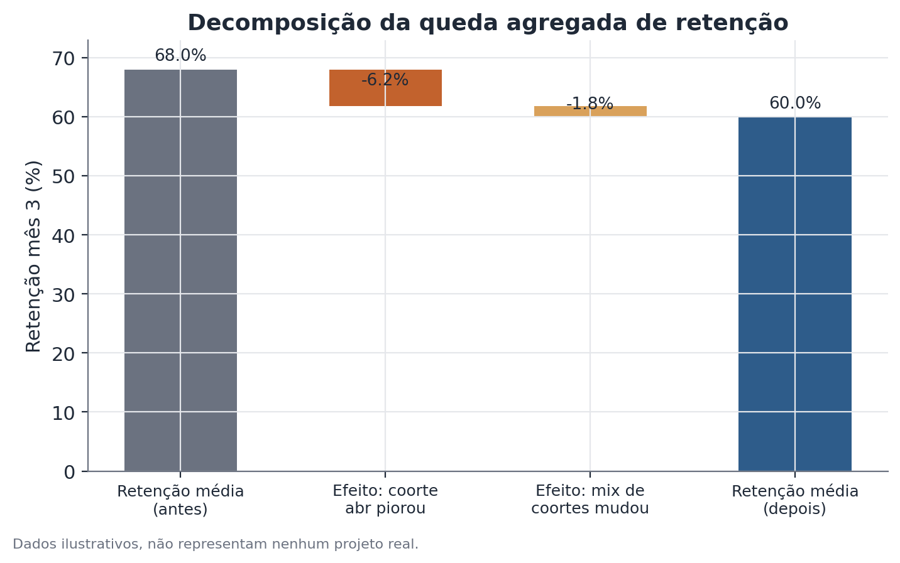

# Decomposição de coorte e retenção

## Conceito

Uma métrica agregada de retenção — calculada sobre toda a base de clientes
num dado mês — confunde dois eixos de variação que precisam ser separados
para uma leitura correta: a **dinâmica ao longo do ciclo de vida** (como a
retenção de um grupo de clientes evolui à medida que o tempo passa desde que
eles entraram) e a **dinâmica de composição** (como a proporção de clientes
em diferentes fases do ciclo de vida muda ao longo do calendário, à medida
que a empresa cresce ou desacelera aquisição).

A decomposição de coorte resolve essa confusão reorganizando os dados em
torno do tempo desde a entrada (*tenure*), em vez do tempo de calendário. Uma
**coorte** é o conjunto de clientes que entraram no sistema durante o mesmo
período de referência (um mês, uma semana). A **curva de retenção de uma
coorte** é a sequência de frações da coorte original ainda ativas em cada
período subsequente. Comparando curvas de coortes diferentes, alinhadas por
tenure, é possível atribuir uma mudança na métrica agregada a três fontes
possíveis, não mutuamente exclusivas: deterioração específica de uma ou mais
coortes recentes, deterioração generalizada (um evento de calendário que
afeta todas as coortes simultaneamente, independente de sua idade), ou
mudança na composição da base (mais peso relativo de coortes jovens, que
naturalmente retêm pior nos primeiros meses do que coortes maduras).

## Formulação matemática

Seja `N_c` o tamanho inicial da coorte `c` (número de clientes que entraram
no período `c`), e seja `A_{c,t}` o número de clientes dessa coorte ainda
ativos `t` períodos depois da entrada. A curva de retenção da coorte é:

```
R_c(t) = A_{c,t} / N_c
```

com `R_c(0) = 1` por definição.

A retenção agregada observada no período de calendário `T`, considerando
todas as coortes que já existiam até `T`, é uma média ponderada das curvas
individuais, avaliada em diferentes pontos de tenure:

```
R_agregada(T) = Σ_c [ N_c · R_c(T − c) ] / Σ_c N_c
```

onde a soma é sobre todas as coortes `c ≤ T`, e `T − c` é o tenure da coorte
`c` no momento `T` (quanto tempo se passou desde sua entrada).

Essa fórmula deixa explícito o mecanismo de confusão: `R_agregada(T)` muda de
um período de calendário para o outro tanto porque as curvas individuais
`R_c(·)` mudam (efeito de comportamento), quanto porque os pesos relativos
`N_c` das coortes recentes versus antigas mudam (efeito de composição), sem
que nenhuma curva individual precise mudar.

Uma decomposição simples da variação da retenção agregada entre dois
momentos (`T₀` e `T₁`) pode ser aproximada separando os dois efeitos:

```
ΔR_agregada ≈ Efeito de comportamento + Efeito de composição

Efeito de comportamento = Σ_c w_c(T₀) · [ R_c(T₁ − c) − R_c(T₀ − c) ]
Efeito de composição    = Σ_c [ w_c(T₁) − w_c(T₀) ] · R_c(T₁ − c)
```

onde `w_c(T)` é o peso da coorte `c` na base total em `T` (`N_c` dividido
pelo total de clientes ativos considerados em `T`). O primeiro termo isola
quanto da mudança vem de as curvas de retenção terem realmente mudado; o
segundo isola quanto vem apenas da mudança na composição de coortes que
compõem a base.



## Suposições

- **Tenure comparável entre coortes**: a decomposição assume que "mês 3
  desde a entrada" significa a mesma coisa para todas as coortes — ou seja,
  que o produto/serviço e o processo de onboarding não mudaram de forma que
  torne a comparação de tenure inválida entre coortes muito distantes no
  tempo.
- **Definição consistente de "ativo"**: a métrica de atividade que define
  `A_{c,t}` (assinatura ativa, login no período, compra no período) precisa
  ser aplicada de forma idêntica a todas as coortes; uma mudança na própria
  definição operacional de "ativo" no meio do período analisado contamina a
  comparação.
- **Tamanho de coorte suficiente para estabilidade estatística**: coortes
  pequenas produzem curvas de retenção com variância amostral alta,
  especialmente em tenures avançados, onde restam poucos clientes da coorte
  original.
- **Ausência de censura diferencial**: coortes mais recentes têm, por
  definição, menos períodos observados (não é possível saber a retenção no
  mês 6 de uma coorte que entrou há 3 meses) — comparações que ignoram essa
  censura, comparando pontos de tenure não observados para coortes recentes,
  produzem conclusões inválidas.

## Hipóteses

A decomposição de coorte é primariamente descritiva/exploratória, mas pode
ser formalizada como teste de hipótese ao comparar a curva de uma coorte
específica contra a curva média histórica:

- **H0**: a curva de retenção da coorte `c` em um tenure `t` específico não
  difere da retenção média histórica de coortes comparáveis no mesmo tenure
  (`R_c(t) = R̄(t)`).
- **H1**: `R_c(t) ≠ R̄(t)` — a coorte em questão retém de forma
  significativamente diferente do padrão histórico.

O teste pode ser conduzido como uma comparação de duas proporções (a coorte
em questão vs. a média histórica ponderada, ou vs. a coorte imediatamente
anterior), com um teste z de proporções ou um teste exato, dependendo do
tamanho da coorte.

## Interpretação

O resultado da decomposição direciona, de forma direta, o tipo de
investigação subsequente. Um efeito de comportamento concentrado numa
coorte específica direciona a investigação para o que foi diferente para
quem entrou naquele período — uma mudança de produto, uma alteração no
processo de cobrança, uma campanha de aquisição com público diferente. Um
efeito de comportamento distribuído por todas as coortes ao mesmo tempo, a
partir de um marco de calendário específico, direciona a investigação para
um evento que afetou a base inteira simultaneamente, independente de tenure —
uma mudança de preço geral, um problema técnico amplo, uma mudança
regulatória. Um efeito de composição dominante, sem mudança relevante nas
curvas individuais, direciona a atenção para a estratégia de aquisição — por
que a base está mais jovem em média — em vez de para um problema de retenção
propriamente dito.

É importante não interpretar uma coincidência temporal entre uma coorte
pior e uma mudança conhecida como prova de causalidade — a decomposição
identifica onde procurar, não confirma a causa. Confirmar a causa
tipicamente exige informação adicional (por exemplo, uma mudança testada
via experimento controlado, ou uma comparação com um grupo não afetado pela
mudança suspeita).

## Limitações

- A decomposição não controla por fatores de confusão dentro de uma coorte —
  se uma coorte específica também difere em composição demográfica ou de
  canal de aquisição em relação às demais, parte do "efeito de coorte" pode
  na verdade ser um efeito dessas outras variáveis, não do momento de
  entrada em si.
- Coortes recentes têm, inerentemente, menos pontos de tenure observados —
  qualquer comparação precisa restringir-se aos tenures efetivamente
  observados em todas as coortes comparadas, ou reconhecer explicitamente a
  incerteza maior nas coortes mais novas.
- A decomposição em efeito de comportamento e efeito de composição, como
  apresentada, é uma aproximação de primeira ordem — quando as mudanças em
  ambos os componentes são grandes, existe um termo de interação residual
  que a decomposição simples não atribui explicitamente a nenhum dos dois
  efeitos.
- A análise é observacional. Mesmo identificando com precisão que uma coorte
  específica piorou, e mesmo havendo uma mudança de produto coincidente,
  outros fatores concorrentes no mesmo período (sazonalidade, condições de
  mercado, ações de concorrentes) podem ser explicações alternativas que a
  decomposição de coorte, por si só, não descarta.

## Exemplo

Uma rede fictícia de academias com modelo de assinatura mensal observa que a
retenção agregada do mês 3 caiu de 58% no trimestre anterior para 52% no
trimestre atual. A equipe decompõe a retenção por coorte de entrada (mês em
que o cliente assinou):

| Coorte | Tamanho da coorte | Retenção mês 3 |
|---|---|---|
| Coorte T-3 (mais antiga) | 1.240 | 59% |
| Coorte T-2 | 1.310 | 57% |
| Coorte T-1 | 1.180 | 58% |
| Coorte T (mais recente, período da queda) | 1.850 | 41% |

Duas coisas chamam atenção: primeiro, a coorte T tem retenção
significativamente mais baixa (41% contra uma média histórica de
aproximadamente 58% nas três coortes anteriores) — um efeito de
comportamento concentrado nessa coorte. Segundo, a coorte T também é
consideravelmente maior que as anteriores (1.850 contra uma média de cerca
de 1.240 nas coortes anteriores) — o que significa que ela tem peso maior na
média agregada do trimestre atual, amplificando o impacto da sua retenção
mais baixa sobre a métrica geral (um efeito de composição adicional, ainda
que secundário ao efeito de comportamento neste caso).

Investigando o que mudou especificamente para a coorte T, a equipe encontra
que ela coincide com uma campanha de aquisição agressiva com desconto de
primeiro mês, que trouxe um público historicamente menos propenso a
continuar após o período promocional — uma explicação plausível tanto para
a retenção mais baixa quanto para o tamanho maior da coorte.

## Exemplo de código

```python
import pandas as pd
import numpy as np

rng = np.random.default_rng(23)

coortes = pd.DataFrame({
    "coorte": ["T-3", "T-2", "T-1", "T"],
    "tamanho": [1240, 1310, 1180, 1850],
    "retencao_mes3": [0.59, 0.57, 0.58, 0.41],
})

# retenção agregada ponderada pelo tamanho da coorte
retencao_agregada = np.average(coortes["retencao_mes3"], weights=coortes["tamanho"])
print(f"Retenção agregada do trimestre: {retencao_agregada:.1%}")

# contrafactual: qual seria a retenção agregada se a coorte T tivesse a
# retenção média das coortes anteriores, mantendo o mesmo tamanho (isola o
# efeito de comportamento da coorte T)
retencao_media_historica = coortes.loc[coortes.coorte != "T", "retencao_mes3"].mean()
coortes_contrafactual = coortes.copy()
coortes_contrafactual.loc[coortes_contrafactual.coorte == "T", "retencao_mes3"] = retencao_media_historica
retencao_contrafactual = np.average(
    coortes_contrafactual["retencao_mes3"], weights=coortes_contrafactual["tamanho"]
)

efeito_comportamento_coorte_T = retencao_contrafactual - retencao_agregada
print(f"Retenção agregada se a coorte T tivesse retenção histórica: {retencao_contrafactual:.1%}")
print(f"Efeito atribuível à queda de comportamento da coorte T: {efeito_comportamento_coorte_T:.1%} pp")
```
