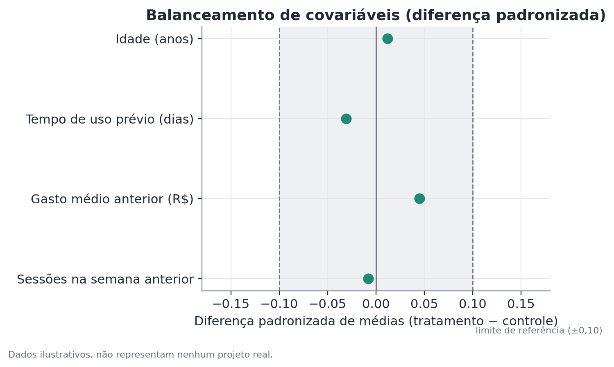
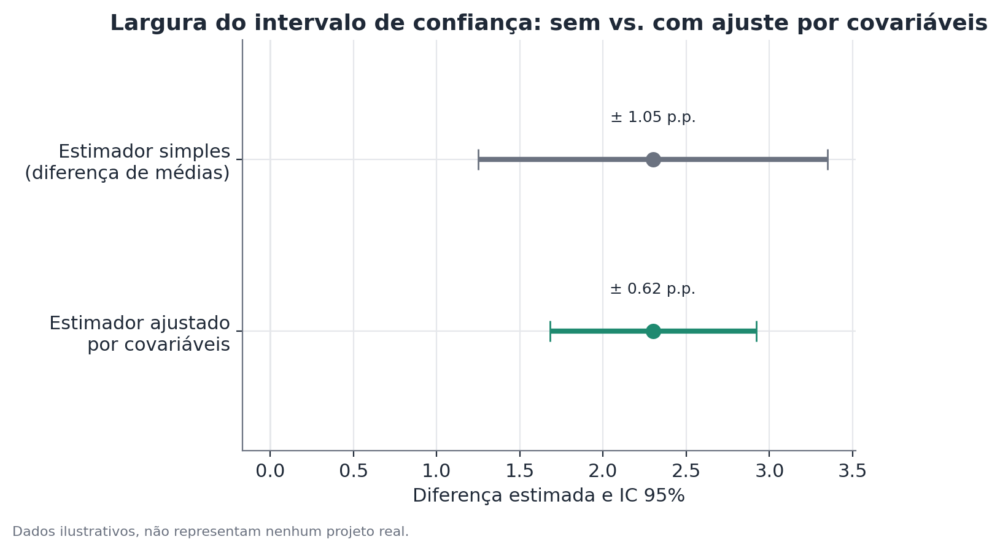

# Balanceamento de covariáveis e ajuste por covariáveis

*Pressupõe os fundamentos de teste A/B — veja
[Fundamentos de teste A/B](./ab-testing.md).*

## Conceito

Este tópico cobre duas ferramentas relacionadas, mas conceitualmente
distintas, ambas construídas sobre covariáveis medidas antes do início de um
experimento.

**Balanceamento de covariáveis** é uma checagem de validade da randomização:
compara-se a distribuição de características pré-experimento entre os grupos
de tratamento e controle. Como a atribuição é aleatória, essas
características — que não têm nenhuma relação causal com o tratamento, por
terem sido medidas antes de ele existir — deveriam estar distribuídas de
forma semelhante entre os grupos, a menos de variação amostral. Um
desbalanceamento sistemático é evidência contra a premissa de que a
randomização funcionou como planejado.

**Ajuste por covariáveis** (que inclui pós-estratificação e estimadores como
CUPED) é uma técnica de redução de variância: usa covariáveis pré-
experimento correlacionadas com a métrica de interesse para explicar parte
da variação entre unidades que não tem relação com o tratamento, deixando a
estimativa do efeito mais precisa — sem mudar o que ela estima. É importante
não confundir os dois: balanceamento é uma checagem de diagnóstico feita
(idealmente) antes de olhar resultados; ajuste é uma técnica de estimação
aplicada ao calcular o efeito. Uma randomização bem-sucedida não precisa de
ajuste para ser válida; o ajuste é sobre precisão, não sobre correção de um
problema.

## Formulação matemática

### Diferença padronizada de médias (balanceamento)

Para uma covariável contínua $X$, com médias $\bar{x}_C$ e $\bar{x}_T$ e
desvios-padrão $s_C$ e $s_T$ nos grupos controle e tratamento:

$$
SMD = \frac{\bar{x}_T - \bar{x}_C}{\sqrt{\dfrac{s_C^2 + s_T^2}{2}}}
$$

O denominador é o desvio-padrão combinado (pooled), o que torna o SMD
independente da escala original da covariável e comparável entre
covariáveis diferentes. Um limite de referência comumente citado na
literatura de causal inference é $|SMD| < 0{,}1$ para balanceamento
aceitável, embora esse valor seja uma convenção prática, não um limite
derivado estatisticamente.

Para uma covariável binária com proporções $\hat{p}_C$ e $\hat{p}_T$:

$$
SMD = \frac{\hat{p}_T - \hat{p}_C}{\sqrt{\dfrac{\hat{p}_C(1-\hat{p}_C) + \hat{p}_T(1-\hat{p}_T)}{2}}}
$$

### Estimador ajustado por covariáveis (regressão)

O efeito ajustado é obtido incluindo a covariável pré-experimento $Z$ (já
centralizada em sua média, por conveniência de interpretação) num modelo
linear:

$$
Y_i = \alpha + \tau \cdot D_i + \beta \cdot (Z_i - \bar{Z}) + \varepsilon_i
$$

onde $D_i$ é o indicador de tratamento (1 se tratamento, 0 se controle),
$\tau$ é o efeito ajustado do tratamento, e $\beta$ captura a relação entre a
covariável e o resultado. Como $D_i$ é (aproximadamente) independente de
$Z_i$ por construção da randomização, $\hat{\tau}$ estima o mesmo efeito
médio que a diferença simples de médias — mas com variância residual
$\varepsilon_i$ menor do que a variância total de $Y_i$, o que reduz o
erro-padrão de $\hat{\tau}$ na proporção de quanto $Z$ explica de $Y$.

### CUPED (variância residual)

Uma forma equivalente, popular em experimentação de produto, usa uma
métrica ajustada diretamente:

$$
Y_i^{CUPED} = Y_i - \theta \cdot (Z_i - \bar{Z}), \qquad
\theta = \frac{\text{Cov}(Y, Z)}{\text{Var}(Z)}
$$

A redução relativa de variância obtida é aproximadamente:

$$
\frac{\text{Var}(Y^{CUPED})}{\text{Var}(Y)} \approx 1 - \rho^2
$$

onde $\rho$ é a correlação entre a covariável $Z$ e a métrica $Y$. Quanto
mais correlacionada a covariável pré-experimento com a métrica, maior o
ganho de precisão.

## Suposições

- **Covariáveis usadas devem ser estritamente pré-tratamento** — medidas
  antes do início do experimento. Usar uma covariável pós-tratamento (por
  exemplo, número de sessões *durante* o experimento) introduz viés, porque
  ela já pode ter sido afetada pelo próprio tratamento.
- **A escolha das covariáveis de ajuste deve ser especificada antes de olhar
  os resultados**, para evitar o viés de escolher, a posteriori, a
  covariável que "melhora" o resultado desejado.
- **Balanceamento é necessário, mas não suficiente, para validade causal** —
  ele checa covariáveis observadas; nada garante balanceamento em fatores
  não medidos, embora a aleatorização em expectativa também os balanceie.
- **O modelo de ajuste deve ser razoavelmente bem especificado** — uma
  relação muito não linear entre covariável e métrica, forçada num ajuste
  linear, pode não capturar todo o ganho de precisão disponível (embora
  raramente introduza viés, dado que $D$ é aleatório).

## Hipóteses

Para o teste de balanceamento por covariável, o teste de hipótese usual
(um teste t ou de proporções sobre a covariável, análogo ao teste de efeito)
é:

$$
H_0: \mu_{Z,C} = \mu_{Z,T} \qquad H_1: \mu_{Z,C} \neq \mu_{Z,T}
$$

onde $\mu_{Z,C}$ e $\mu_{Z,T}$ são as médias populacionais da covariável $Z$
em cada grupo. Na prática, muitas equipes preferem reportar o SMD diretamente
em vez de um valor-p — quando o número de covariáveis testadas é grande, um
valor-p sozinho tem taxa de falso positivo alta (por acaso, algumas
covariáveis vão "dar significativo"), enquanto o SMD dá uma medida de
magnitude comparável entre covariáveis.

O ajuste por covariáveis não tem, ele mesmo, uma hipótese própria a testar —
ele modifica a estimativa e o erro-padrão do teste de efeito do tratamento,
cuja hipótese continua sendo a do documento de fundamentos de teste A/B
($H_0: \tau = 0$).

## Interpretação

Um SMD pequeno em todas as covariáveis observadas é evidência de que a
randomização produziu grupos comparáveis nessas dimensões — reforça, mas não
prova sozinho, que o teste de efeito subsequente terá leitura causal válida.
Um SMD grande numa covariável isolada, entre muitas testadas, pode ser
apenas variação amostral esperada (com $k$ covariáveis testadas a 5% de
significância, espera-se cerca de $0{,}05k$ "desbalanceamentos" por acaso).
O padrão relevante é: várias covariáveis desbalanceadas simultaneamente, ou
uma covariável central para o negócio fortemente desbalanceada, merecem
investigação — possivelmente com um teste de Sample Ratio Mismatch
complementar.

Sobre o ajuste: a estimativa pontual do efeito, com e sem ajuste, deveria
ser muito próxima quando a randomização funcionou (a covariável é, em
expectativa, não correlacionada com o tratamento). Uma mudança grande na
estimativa pontual ao adicionar a covariável de ajuste é, ela mesma, um
sinal de alerta sobre desbalanceamento — não o comportamento esperado de um
ajuste de variância bem-comportado.

## Limitações

- Balanceamento em covariáveis observadas não implica balanceamento em
  covariáveis não observadas — é evidência a favor da randomização, nunca
  prova completa.
- O ganho de precisão do ajuste por covariáveis depende inteiramente de
  quão preditiva a covariável é da métrica; covariáveis fracamente
  correlacionadas trazem ganho desprezível, mesmo que estatisticamente
  válidas de usar.
- Escolher a covariável de ajuste depois de ver que ela "melhora" o
  resultado (p-hacking indireto) invalida a interpretação do valor-p
  resultante, mesmo que a estimativa pontual continue não-viesada.
- Em desenhos com poucas unidades (por exemplo, poucas regiões geográficas
  tratadas), tanto SMD quanto ajuste por regressão podem ser instáveis —
  métodos de inferência mais robustos a amostras pequenas (inferência por
  randomização, bootstrap wild-cluster) tornam-se mais relevantes nesse
  regime.

## Exemplo

Um aplicativo de assinatura testa uma nova política de preço, randomizando
8.000 usuários para controle e 8.000 para tratamento. Antes de olhar
qualquer resultado, a equipe checa o balanceamento de quatro covariáveis
pré-experimento:

| Covariável | Controle | Tratamento | SMD |
|---|---|---|---|
| Idade (anos) | 34,2 | 34,3 | 0,012 |
| Tempo de uso prévio (dias) | 210 | 204 | -0,031 |
| Gasto médio anterior (R$) | 42,10 | 42,80 | 0,045 |
| Sessões na semana anterior | 5,4 | 5,3 | -0,008 |

Todas as quatro covariáveis têm $|SMD| < 0{,}1$ — balanceamento aceitável,
reforçando que a randomização funcionou.

Em seguida, a equipe estima o efeito da nova política sobre a receita do mês
do experimento, comparando dois estimadores: a diferença simples de médias e
um estimador ajustado usando o gasto médio anterior como covariável (que tem
correlação de aproximadamente 0,55 com a receita do mês do experimento).

| Estimador | Efeito estimado | IC 95% |
|---|---|---|
| Diferença simples de médias | +2,3 p.p. | ±1,05 p.p. |
| Ajustado por gasto anterior | +2,3 p.p. | ±0,62 p.p. |

O ponto estimado do efeito não muda — como esperado, já que os grupos eram
balanceados —, mas o intervalo de confiança fica substancialmente mais
estreito com o ajuste, permitindo uma conclusão mais precisa sobre a
magnitude do efeito sem aumentar o tamanho da amostra.
