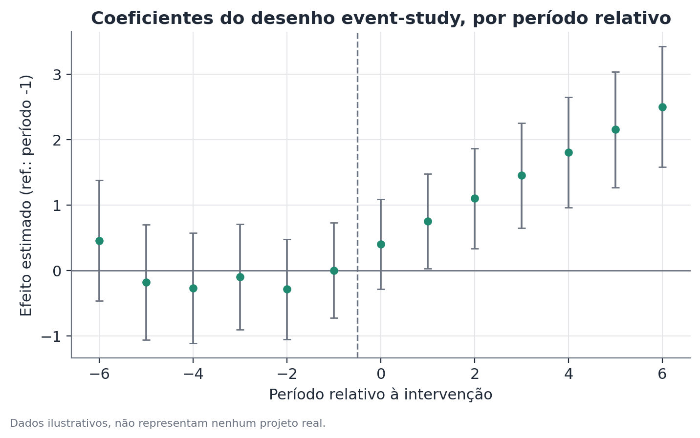

# Diferenças-em-diferenças (DiD): desenho por coorte, event-study, placebo e tendências paralelas

## Conceito

Diferenças-em-diferenças (DiD) é um desenho de inferência causal para dados
observacionais, aplicável quando uma intervenção (lei, política, evento)
afeta um grupo específico em um momento conhecido, enquanto outro grupo
comparável permanece não afetado. A ideia central é usar o grupo não afetado
para estimar o que teria acontecido com o grupo afetado **na ausência** da
intervenção — o chamado contrafactual — e atribuir a diferença entre o
resultado observado e esse contrafactual ao efeito da intervenção.

A força do desenho vem de comparar **mudanças**, não níveis. Isso elimina
automaticamente qualquer diferença fixa entre os grupos que já existisse
antes da intervenção (por exemplo, um grupo já ganhar mais que o outro por
razões históricas não relacionadas ao evento), e qualquer choque que afete
igualmente os dois grupos ao mesmo tempo (uma recessão nacional, por
exemplo). O que sobra, sob a suposição central do método, é o efeito
específico da intervenção sobre o grupo afetado.

Este documento cobre quatro componentes do mesmo desenho, tratados juntos
porque raramente aparecem isolados na prática: o desenho DiD básico (2x2), a
extensão para **coortes de exposição**, a extensão para **event-study**, e os
testes de **placebo e tendências paralelas** que sustentam (ou não) a
validade do desenho.

## Formulação matemática

### DiD básico (2x2)

Com dois grupos (tratado $T$, controle $C$) e dois períodos (pré $t=0$, pós
$t=1$), a especificação de regressão padrão é:

$$y_{it} = \alpha + \beta \cdot \text{Tratado}_i + \gamma \cdot \text{Pós}_t + \delta \cdot (\text{Tratado}_i \times \text{Pós}_t) + \varepsilon_{it}$$

Onde:

- $y_{it}$ é o resultado de interesse para a unidade $i$ no período $t$;
- $\text{Tratado}_i$ é um indicador (0/1) de pertencer ao grupo afetado;
- $\text{Pós}_t$ é um indicador (0/1) de o período ser posterior à
  intervenção;
- $\alpha$ é o nível médio do grupo de controle no período pré;
- $\beta$ captura a diferença fixa entre os grupos já existente antes da
  intervenção;
- $\gamma$ captura a mudança comum a ambos os grupos entre os dois períodos
  (tendência de fundo);
- $\delta$, o coeficiente de interação, é a **estimativa DiD**: a mudança
  adicional específica do grupo tratado, além da tendência comum — a
  quantidade de interesse.

Equivalentemente, sem regressão:

$$\hat{\delta} = \left(\bar{y}_{T,\text{pós}} - \bar{y}_{T,\text{pré}}\right) - \left(\bar{y}_{C,\text{pós}} - \bar{y}_{C,\text{pré}}\right)$$

a diferença das duas diferenças de médias, o que dá nome ao método.

### Desenho por coorte de exposição

Quando a intervenção afeta pessoas de forma diferente dependendo de quando
nasceram, entraram em algum sistema, ou foram expostas, o desenho por coorte
substitui o indicador binário $\text{Tratado}_i$ por um conjunto de
indicadores de coorte $c \in \{1, \dots, C\}$, cada uma definida por uma
janela de nascimento ou entrada em relação à data de corte da intervenção:

$$y_{ic} = \alpha + \sum_{c \neq c_0} \theta_c \cdot \mathbb{1}[\text{coorte}_i = c] + \mathbf{X}_i'\boldsymbol\beta + \varepsilon_i$$

Onde $c_0$ é a coorte de referência (tipicamente a mais próxima da data de
corte, do lado não exposto), $\theta_c$ é o efeito estimado para a coorte
$c$ relativo à coorte de referência, e $\mathbf{X}_i$ são controles
observáveis (idade, região, etc.) que não deveriam, em teoria, variar de
forma sistemática entre coortes vizinhas à data de corte — se variarem, isso
é sinal de um problema de desenho (ver Limitações).

### Event-study

O event-study generaliza o DiD básico para múltiplos períodos, estimando um
efeito separado para cada período relativo à data do evento, em vez de um
único coeficiente agregado:

$$y_{it} = \alpha_i + \lambda_t + \sum_{k \neq -1} \delta_k \cdot \mathbb{1}[t - t_i^* = k] \cdot \text{Tratado}_i + \varepsilon_{it}$$

Onde:

- $\alpha_i$ são efeitos fixos de unidade (controlam por características
  fixas de cada unidade ao longo do tempo);
- $\lambda_t$ são efeitos fixos de período (controlam por choques comuns a
  todas as unidades em cada momento);
- $k = t - t_i^*$ é o tempo relativo ao evento (negativo antes, positivo
  depois, zero no período do evento);
- o período $k = -1$ (imediatamente antes do evento) é normalmente omitido
  como referência — todos os $\delta_k$ são interpretados em relação a esse
  período;
- $\delta_k$, para $k < 0$, deveria ser estatisticamente indistinguível de
  zero se a suposição de tendências paralelas for razoável — esses
  coeficientes são o próprio teste visual/estatístico de tendências
  paralelas;
- $\delta_k$, para $k \geq 0$, traça a trajetória do efeito ao longo do
  tempo desde o evento — revelando se o efeito é imediato, gradual, ou
  cresce e depois se estabiliza.

### Teste de tendências paralelas

Não existe um teste único e definitivo de tendências paralelas — a prática
padrão combina:

1. **Inspeção visual** da série de médias por grupo no período pré-evento.
2. **Teste conjunto formal** de que todos os coeficientes $\delta_k$ para
   $k < -1$ no event-study são simultaneamente iguais a zero (um teste F ou
   de Wald conjunto), contra a hipótese de que pelo menos um difere de zero.
3. Quando aplicável, um teste de **tendência linear diferencial** no
   pré-período: estimar se a inclinação da tendência do grupo tratado, no
   período pré-evento, é estatisticamente diferente da inclinação do grupo
   de controle.

### Teste de placebo

Um teste de placebo repete o mesmo desenho (2x2, coorte, ou event-study)
usando uma data falsa de "evento", situada inteiramente dentro do período em
que se sabe que não houve mudança real de política, ou aplicando o
tratamento a um grupo que se sabe não ter sido afetado. A estatística de
interesse é o coeficiente $\delta$ (ou $\delta_k$) estimado sob essa
atribuição falsa — sob um desenho válido, ele deveria ser estatisticamente
indistinguível de zero.

## Suposições

- **Tendências paralelas**: na ausência da intervenção, o grupo tratado
  teria seguido, em média, a mesma trajetória que o grupo de controle. Esta
  é a suposição central e a mais forte do método — não observável
  diretamente para o período pós-evento (é justamente o contrafactual que
  falta), mas parcialmente avaliável no período pré-evento.
- **Nenhuma antecipação (no anticipation)**: as unidades não mudam de
  comportamento antes da data oficial do evento em razão de já saberem que
  ele vai acontecer. Quando há antecipação (por exemplo, empresas que mudam
  contratações antes de uma lei entrar em vigor, sabendo que ela está a
  caminho), o período "pré-evento" já está contaminado, e o event-study
  costuma mostrar um pequeno efeito não nulo mesmo em $k = -2$ ou $k = -3$.
- **SUTVA (Stable Unit Treatment Value Assumption)**: o tratamento de uma
  unidade não afeta o resultado de outras unidades (ausência de
  transbordamento/contaminação entre tratamento e controle). Quando o grupo
  de controle é afetado indiretamente pela intervenção (por exemplo, um
  efeito de equilíbrio geral que se espalha para setores não diretamente
  regulados), o efeito DiD estimado é enviesado.
- **Composição estável dos grupos ao longo do tempo**: em desenhos com dados
  de corte transversal repetido (não painel de indivíduos), a composição de
  quem está em cada grupo em cada período deve ser razoavelmente estável —
  se a composição do grupo tratado muda sistematicamente ao redor do evento
  (por exemplo, migração seletiva para dentro ou fora do grupo afetado), a
  comparação de médias deixa de refletir apenas o efeito do tratamento.
- **Ausência de outros choques concorrentes específicos ao grupo tratado**:
  nenhum outro evento, além da intervenção de interesse, deveria afetar
  especificamente o grupo tratado (e não o de controle) na mesma janela de
  tempo.

## Hipóteses

Para o coeficiente de interesse $\delta$ (efeito DiD agregado) ou cada
$\delta_k$ (efeito por período no event-study):

- $H_0$: $\delta = 0$ (ou $\delta_k = 0$) — não há efeito da intervenção.
- $H_1$: $\delta \neq 0$ (ou $\delta_k \neq 0$) — há efeito.
- Estatística de teste: $t = \hat\delta / \widehat{SE}(\hat\delta)$, onde o
  erro-padrão deve, na prática, ser robusto a heterocedasticidade e,
  quando há múltiplas observações por unidade ao longo do tempo, agrupado
  (cluster) no nível da unidade — ignorar essa estrutura de agrupamento
  costuma subestimar o erro-padrão verdadeiro e inflar falsamente a
  significância.
- Intervalo de confiança: $\hat\delta \pm z_{1-\alpha/2} \cdot \widehat{SE}(\hat\delta)$.
- Para o teste conjunto de tendências paralelas: $H_0$: todos os
  $\delta_k = 0$ para $k < -1$; estatística de teste F ou Wald conjunta.

## Interpretação

### DiD bem executado dá leitura causal mais forte que antes/depois — mas ainda condicional

Uma comparação simples de antes e depois de um único grupo confunde o efeito
da intervenção com qualquer outra coisa que tenha mudado ao longo do tempo.
O DiD remove a tendência comum aos dois grupos, isolando melhor o efeito
específico do grupo tratado. Isso é uma melhora real na credibilidade causal
— mas o resultado continua sendo condicional à suposição de tendências
paralelas ser válida. DiD não é um substituto para um experimento
randomizado; é uma aproximação, cuja qualidade depende inteiramente de quão
razoável é a suposição central no contexto específico.

### "Tendências paralelas sustentadas" é uma leitura de poder insuficiente, não uma prova

Este é o ponto de interpretação mais importante, e o mais frequentemente
mal compreendido: quando o teste conjunto de tendências paralelas no
pré-período **não rejeita** a hipótese de que todos os $\delta_k$ ($k < -1$)
são zero, isso é frequentemente lido como "a suposição de tendências
paralelas foi confirmada". Essa leitura é estatisticamente incorreta.
Não rejeitar $H_0$ significa apenas que os dados não fornecem evidência
suficiente **contra** a suposição — o que pode acontecer tanto porque a
suposição é de fato razoável, quanto porque o teste tem pouco poder
estatístico (poucos períodos pré-evento, amostra pequena, métrica ruidosa).
Um teste com pouco poder "não rejeita" quase qualquer coisa. A forma correta
de reportar isso é: "os dados pré-evento não contradizem a suposição de
tendências paralelas" — nunca "a suposição foi confirmada" ou "provada".

### Distinção entre associação e causalidade

O coeficiente $\delta$ é, tecnicamente, sempre uma estimativa de associação
condicional a um desenho específico. Ele ganha uma leitura causal na medida
em que as suposições acima (especialmente tendências paralelas e ausência de
antecipação) são plausíveis no contexto. A robustez dessa leitura aumenta
quando: (a) os testes de placebo não mostram efeito espúrio; (b) o event-
study mostra um padrão de pré-tendências planas seguido de uma mudança
visível a partir do período do evento; e (c) o resultado é estável a
diferentes especificações do grupo de controle e do período de análise.
Nenhum desses pontos, isoladamente ou em conjunto, constitui prova
definitiva — constitui evidência cumulativa.

## Limitações

- **Sensibilidade à escolha do grupo de controle.** Grupos de controle
  diferentes (mas todos "razoáveis" à primeira vista) podem gerar
  estimativas de efeito substancialmente diferentes. É boa prática reportar
  a robustez do resultado a mais de uma definição de controle.
- **Comparações escalonadas (staggered) com efeitos heterogêneos.** Quando
  diferentes unidades são tratadas em momentos diferentes (adoção
  escalonada de uma política, por exemplo) e o efeito do tratamento varia ao
  longo do tempo ou entre unidades, a especificação de efeitos fixos
  bidirecionais clássica (unidade + período) pode produzir estimativas
  enviesadas, inclusive de sinal errado, por usar unidades já tratadas como
  "controle" implícito de unidades tratadas mais tarde. Estimadores mais
  recentes desenhados especificamente para esse cenário (Callaway-Sant'Anna,
  Sun-Abraham, entre outros) evitam esse problema.
- **Testes de placebo não cobrem todas as ameaças à validade.** Um placebo
  "limpo" (sem efeito espúrio em data falsa) aumenta a confiança no desenho,
  mas não descarta, por exemplo, um choque concorrente que afetou
  especificamente o grupo tratado na data real do evento.
- **Poder estatístico limitado é comum e subestimado.** Com poucos grupos
  (poucas regiões, poucos setores) ou séries curtas, mesmo um efeito real e
  de magnitude relevante pode não ser detectado — a ausência de significância
  não deve ser lida automaticamente como "não há efeito".
- **Erros-padrão inadequados são um erro comum.** Ignorar a estrutura de
  agrupamento temporal dentro da mesma unidade (não usar erros-padrão
  robustos a cluster) é uma das formas mais frequentes de inflar
  artificialmente a significância estatística em aplicações de DiD.

## Exemplo

Considere um estudo hipotético sobre uma política de subsídio a cursos de
qualificação profissional, implementada em um conjunto de municípios a
partir de um ano específico, enquanto municípios vizinhos e comparáveis não
receberam o subsídio.

### Desenho 2x2 básico

A taxa de conclusão de cursos técnicos (%) nos dois grupos de municípios, no
ano imediatamente anterior e no ano imediatamente posterior à introdução do
subsídio:

| | Pré-subsídio | Pós-subsídio | Mudança |
|---|---|---|---|
| Municípios com subsídio | 40% | 61% | +21 p.p. |
| Municípios sem subsídio | 40% | 47% | +7 p.p. |

Estimativa DiD: $\hat\delta = 21 - 7 = 14$ pontos percentuais atribuíveis ao
subsídio, além da tendência já compartilhada pelos dois grupos.

### Desenho por coorte

Suponha que o subsídio, na prática, só valeu para pessoas que ingressaram no
sistema de ensino técnico a partir de uma data de corte. Comparando coortes
de ingresso um ano antes e um ano depois da data de corte, controlando por
idade e região, o efeito estimado para a coorte imediatamente posterior à
data de corte é de +9 pontos percentuais na taxa de conclusão, relativo à
coorte imediatamente anterior — um pouco menor que a estimativa 2x2 agregada,
o que é esperado, já que o desenho por coorte isola melhor quem foi de fato
exposto ao subsídio desde o início do curso.

### Event-study

Estendendo a análise para cinco anos antes e cinco anos depois da
introdução do subsídio, os coeficientes $\delta_k$ relativos ao ano anterior
imediato ($k=-1$) mostram: nos anos $k = -5$ a $k = -2$, coeficientes
pequenos (entre -1 e +1,5 pontos percentuais) e estatisticamente não
distinguíveis de zero — consistente (não idêntico a "prova de") com
tendências paralelas no pré-período. A partir de $k = 0$, os coeficientes
sobem progressivamente: +6 p.p. no ano do evento, +11 p.p. um ano depois,
+14 p.p. dois anos depois, estabilizando perto desse patamar — um padrão de
efeito que cresce e depois se estabiliza, mais informativo do que o único
número agregado do desenho 2x2.

### Teste de placebo

Repetindo o mesmo desenho 2x2, mas usando como "data falsa" de evento um ano
três anos antes da introdução real do subsídio (período em que nenhuma
mudança de política ocorreu), a estimativa de "efeito" placebo é de +0,8
pontos percentuais, com valor-p de 0,71 — não significativo, como esperado
sob um desenho válido. Esse resultado reforça (sem provar definitivamente) a
credibilidade da estimativa principal.

```python
import pandas as pd
import statsmodels.formula.api as smf

# desenho 2x2
modelo_2x2 = smf.ols(
    "taxa_conclusao ~ subsidio * pos", data=dados
).fit(cov_type="cluster", cov_kwds={"groups": dados["municipio"]})
print(modelo_2x2.params["subsidio:pos"])

# event-study: cria indicadores de tempo relativo ao evento,
# omitindo k = -1 como referência
dados["tempo_relativo"] = dados["ano"] - dados["ano_evento"]
dummies = pd.get_dummies(dados["tempo_relativo"], prefix="k").drop(columns=["k_-1"])
dados_es = pd.concat([dados, dummies], axis=1)
termos = " + ".join([f"subsidio:{c}" for c in dummies.columns])
modelo_es = smf.ols(
    f"taxa_conclusao ~ C(municipio) + C(ano) + {termos}", data=dados_es
).fit(cov_type="cluster", cov_kwds={"groups": dados_es["municipio"]})
```


