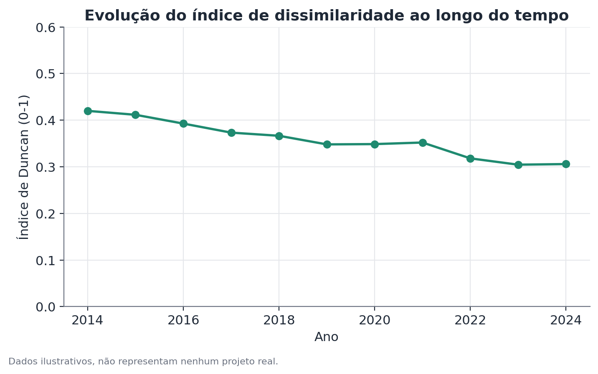

# Índice de dissimilaridade de Duncan

## Conceito

O índice de dissimilaridade de Duncan (Duncan & Duncan, 1955) quantifica o
quanto duas distribuições percentuais — de dois grupos populacionais sobre um
mesmo conjunto de categorias — diferem entre si. É a métrica clássica de
segregação: ocupacional, residencial, educacional, ou de qualquer outra
categorização discreta em que faça sentido perguntar "os dois grupos ocupam
as mesmas categorias, nas mesmas proporções?".

A intuição central é geométrica: se você desenhar as duas distribuições como
barras sobrepostas, o índice mede a área de não sobreposição, dividida por
dois. Equivalentemente, é a fração mínima de um dos grupos que precisaria ser
realocada entre categorias para que as duas distribuições coincidissem
exatamente.

O índice pertence a uma família mais ampla de medidas de segregação (junto
com o índice de isolamento, o índice de exposição e variantes mais recentes
como o índice de segregação multigrupo), mas segue sendo o mais usado por sua
simplicidade de cálculo e interpretação direta.

## Formulação matemática

Sejam duas populações, A e B, distribuídas sobre um conjunto de $K$
categorias mutuamente exclusivas. Para cada categoria $i = 1, \dots, K$,
defina:

- $a_i$ = proporção da população A que está na categoria $i$ (soma sobre
  todas as categorias = 1)
- $b_i$ = proporção da população B que está na categoria $i$ (soma sobre
  todas as categorias = 1)

O índice de dissimilaridade é:

$$D = \frac{1}{2} \sum_{i=1}^{K} \left| a_i - b_i \right|$$

Onde:

- $|a_i - b_i|$ é a diferença absoluta de proporção na categoria $i$;
- o somatório acumula essa diferença em todas as $K$ categorias;
- o fator $\frac{1}{2}$ normaliza o índice para o intervalo $[0, 1]$ — sem
  ele, a soma das diferenças absolutas variaria entre 0 e 2, porque cada
  ponto de "excesso" de A em uma categoria corresponde a um ponto de
  "déficit" de A (excesso de B) em outra, contado duas vezes ao longo do
  somatório.

$D = 0$ ocorre quando $a_i = b_i$ para toda categoria $i$ — as duas
distribuições são idênticas. $D = 1$ ocorre quando, para toda categoria em
que $a_i > 0$, tem-se $b_i = 0$ e vice-versa — as duas populações nunca
ocupam a mesma categoria.

Uma leitura equivalente e útil na prática: $D$ é também o valor máximo, sobre
qualquer subconjunto de categorias $S$, da diferença entre a fração de A e a
fração de B contida em $S$:

$$D = \max_{S \subseteq \{1,\dots,K\}} \left| \sum_{i \in S} a_i - \sum_{i \in S} b_i \right|$$

Essa formulação alternativa esclarece a interpretação de "fração mínima a
realocar": $D$ é exatamente a fração de um dos grupos que está "em excesso"
no pior subconjunto de categorias possível.

## Suposições

O índice de Duncan não é um teste de hipótese — é uma estatística descritiva
— mas seu uso correto depende de algumas condições:

- **Categorias mutuamente exclusivas e coletivamente exaustivas**: cada
  observação pertence a exatamente uma categoria. Categorias sobrepostas
  quebram a lógica do índice.
- **Classificação estável entre os grupos comparados**: comparar índices
  calculados com esquemas de categorização diferentes (por exemplo, uma
  classificação ocupacional com 6 categorias versus outra com 20) não é
  válido — o valor de $D$ tende a aumentar com o número de categorias,
  simplesmente porque há mais oportunidades de diferença.
- **Amostra suficiente em cada categoria dentro de cada grupo**: com poucas
  observações, as proporções $a_i$ e $b_i$ são estimadas com ruído
  considerável, e o índice herda essa instabilidade. Um intervalo de
  confiança por bootstrap (reamostrando indivíduos dentro de cada grupo,
  recomputando $D$ em cada reamostra) é a forma mais direta de quantificar
  essa incerteza, já que a distribuição exata de $D$ sob amostragem não tem
  forma fechada simples.
- **Independência dentro do desenho amostral**: se os dados vierem de um
  desenho complexo (estratificado, por conglomerados, com pesos amostrais),
  as proporções $a_i$ e $b_i$ devem ser calculadas usando os pesos
  corretos — ignorar o desenho amostral produz proporções (e, portanto, um
  $D$) enviesados.

## Hipóteses

O índice em si não vem acompanhado de um teste de hipótese formal — é
possível, no entanto, testar informalmente se $D$ é "maior do que o
esperado por acaso" comparando-o à distribuição de $D$ obtida ao
embaralhar aleatoriamente a atribuição de categoria entre indivíduos dos
dois grupos (um teste de permutação). Nesse caso:

- $H_0$: a categoria ocupada por um indivíduo não depende do grupo a que ele
  pertence (as duas populações seriam, sob $H_0$, amostras da mesma
  distribuição categórica).
- $H_1$: existe associação entre grupo e categoria.
- Estatística de teste: o próprio $D$ observado.
- Valor-p: fração das permutações em que o $D$ simulado é maior ou igual ao
  $D$ observado.

Na prática, com amostras grandes (como pesquisas domiciliares nacionais), o
teste de permutação quase sempre rejeita $H_0$ mesmo para valores de $D$
pequenos — o que reforça que a pergunta relevante não é "existe segregação
estatisticamente detectável?", mas "o quanto de segregação existe, e isso é
grande o bastante para importar na prática?".

## Interpretação

$D$ responde a uma pergunta puramente descritiva: **quão desigual é a
distribuição de dois grupos entre categorias**. Ele não diz:

- **Por que** essa distribuição existe. Um $D$ alto é compatível com
  barreiras de acesso, diferenças reais e não observadas de qualificação
  entre os grupos, preferências voluntárias distintas, discriminação
  histórica acumulada, ou qualquer combinação dessas causas — o índice não
  separa uma explicação da outra.
- **Se a segregação está aumentando ou diminuindo em um sentido causal.**
  Uma queda de $D$ ao longo do tempo é consistente com integração real, mas
  também pode refletir mudanças na própria classificação de categorias ou
  na composição da força de trabalho.
- **Qual grupo está em vantagem.** $D$ não tem sinal — ele mede distância,
  não direção. Para saber qual grupo está concentrado nas categorias mais
  bem remuneradas ou mais prestigiadas, é preciso olhar a tabela de
  proporções por categoria diretamente, não só o índice agregado.

Uma prática recomendada é sempre reportar $D$ junto com a tabela de
proporções por categoria (ou, no mínimo, destacar as categorias que mais
contribuem para a diferença) — o índice sozinho comprime informação
demais para sustentar uma narrativa completa.

## Limitações

- **Sensibilidade à granularidade das categorias.** Como mencionado, $D$
  tende a crescer artificialmente com o número de categorias. Comparações
  entre estudos ou países só são válidas se a classificação categórica for
  equivalente.
- **Não incorpora ordenação ou distância entre categorias.** Duas categorias
  "próximas" (por exemplo, dois níveis salariais adjacentes) contam da mesma
  forma que duas categorias "distantes" (o nível mais baixo e o mais alto).
  Quando a ordenação importa, medidas alternativas (como índices de
  segregação vertical, ou a própria decomposição de Theil aplicada por
  categoria) podem ser mais informativas.
- **Não é decomponível de forma simples entre subgrupos ou ao longo do
  tempo** como o índice de Theil é para desigualdade — comparar $D$ entre
  subpopulações ou anos exige recalcular o índice em cada corte, e não há
  uma forma direta de atribuir a mudança total a fatores específicos.
- **Estimação com pesos amostrais complexos exige cuidado.** Erros-padrão
  de $D$ sob desenhos amostrais complexos não têm fórmula fechada simples;
  bootstrap ou réplicas de peso replicado (jackknife repetido, replicação
  balanceada) são as abordagens padrão.

## Exemplo

Considere um estudo hipotético comparando a distribuição de profissionais de
tecnologia em uma empresa de médio porte, divididos por gênero, entre seis
níveis de senioridade: Estagiário, Júnior, Pleno, Sênior, Staff e Liderança
técnica.

Suponha as seguintes proporções observadas:

| Nível | % Grupo A | % Grupo B |
|---|---|---|
| Estagiário | 8% | 14% |
| Júnior | 22% | 30% |
| Pleno | 30% | 28% |
| Sênior | 24% | 18% |
| Staff | 11% | 7% |
| Liderança técnica | 5% | 3% |

Calculando as diferenças absolutas por nível: 6, 8, 2, 6, 4, 2. A soma é 28.
Dividindo por dois, $D = 14$, ou 0,14 em escala de 0 a 1.

Interpretação: cerca de 14% de um dos grupos precisaria mudar de nível de
senioridade para que as duas distribuições coincidissem. Olhando a tabela,
fica claro que a maior parte dessa diferença vem da ponta inicial (Estagiário
e Júnior, onde o Grupo B está sobrerrepresentado) e da ponta superior (Sênior
em diante, onde o Grupo A está sobrerrepresentado) — um padrão consistente
com uma hipótese de "afunilamento" na progressão de carreira, mas que o
índice sozinho não confirma nem explica. Para investigar se esse padrão é
causal (por exemplo, ligado a uma barreira específica de promoção), seria
necessário um desenho complementar — como uma análise de sobrevivência do
tempo até a promoção, controlando por tempo de casa e avaliação de
desempenho — que está fora do escopo do índice de dissimilaridade.

Um teste de permutação simples, embaralhando aleatoriamente 500 vezes a
atribuição de nível de senioridade entre os funcionários dos dois grupos
(mantendo os tamanhos de grupo fixos), nesse exemplo hipotético produziria um
valor-p muito baixo — confirmando que essa distribuição observada seria rara
sob a hipótese de que gênero e nível são independentes, mas, como sempre,
isso não substitui uma investigação das causas.

```python
import numpy as np
import pandas as pd

niveis = ["estagiario", "junior", "pleno", "senior", "staff", "lideranca"]
prop_a = np.array([0.08, 0.22, 0.30, 0.24, 0.11, 0.05])
prop_b = np.array([0.14, 0.30, 0.28, 0.18, 0.07, 0.03])

D = 0.5 * np.sum(np.abs(prop_a - prop_b))
print(f"Índice de Duncan: {D:.3f}")

# teste de permutação (esboço): embaralha atribuição de nível
# entre indivíduos simulados dos dois grupos, recomputa D, compara
# com o D observado para obter um valor-p empírico.
```


