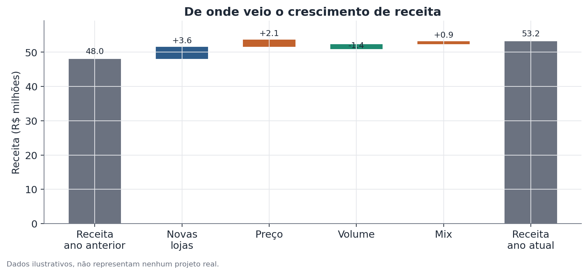
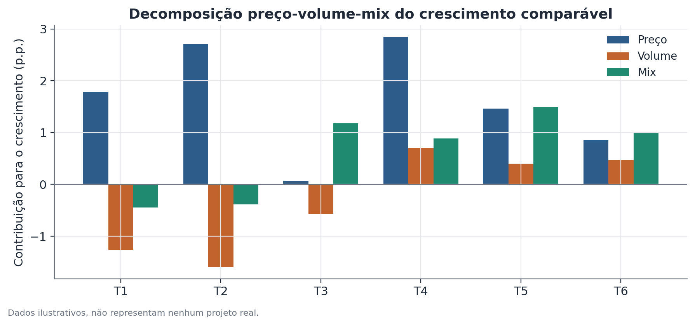

# Decomposição de crescimento: total, comparável e preço-volume-mix

## Conceito

Decomposição de crescimento é uma técnica contábil-analítica (não um modelo estatístico com incerteza inferencial) que reescreve a variação de uma métrica agregada — tipicamente receita — como a soma de componentes mutuamente exclusivos e exaustivos, cada um respondendo a uma pergunta causal parcial e bem definida: "quanto do crescimento veio de X, mantendo tudo o mais constante?"

A decomposição acontece em dois níveis encadeados:

**Nível 1 — Total vs. comparável.** Separa unidades de análise (lojas, regiões, linhas de produto, contas de cliente) em duas populações: as que existiam em ambos os períodos comparados ("comparáveis", *like-for-like*) e as que só existem no período mais recente (novas aberturas, entrada em novo mercado, novos SKUs). O crescimento total é sempre a soma do crescimento das unidades comparáveis com a receita trazida pelas unidades novas.

**Nível 2 — Preço, volume e mix, dentro do comparável.** Dentro da população comparável, a variação de receita é reescrita como o produto de preço médio por quantidade vendida, agregado por item ou categoria. Variação nesse produto pode vir de três fontes: o preço unitário de cada item mudou (**efeito preço**); a quantidade total vendida mudou, mantida a composição de itens (**efeito volume**); ou a composição de itens vendidos mudou — por exemplo, mais participação de itens de ticket mais alto (**efeito mix**).

A lógica subjacente é a mesma de qualquer decomposição contábil (structural decomposition analysis, análise shift-share): fixar todos os fatores menos um, medir o efeito marginal desse fator, repetir para os demais, e garantir que a soma feche exatamente com o total observado — sem resíduo não explicado, exceto quando a convenção de cálculo escolhida deliberadamente atribui interações ao componente de mix.

## Formulação matemática

Seja $R_t = \sum_i p_{i,t} \, q_{i,t}$ a receita no período $t$, somada sobre itens ou categorias $i$, onde $p_{i,t}$ é o preço médio do item $i$ no período $t$ e $q_{i,t}$ é a quantidade vendida.

**Separação total vs. comparável.** Seja $C$ o conjunto de unidades comparáveis (presentes em ambos os períodos $t-1$ e $t$) e $N$ o conjunto de unidades novas (presentes só em $t$). Então:

$$
\underbrace{R_t - R_{t-1}}_{\text{crescimento total}} \;=\; \underbrace{\Big(\sum_{i \in C} p_{i,t} q_{i,t} - \sum_{i \in C} p_{i,t-1} q_{i,t-1}\Big)}_{\text{crescimento comparável } \Delta R_C} \;+\; \underbrace{\sum_{i \in N} p_{i,t} q_{i,t}}_{\text{receita de unidades novas}}
$$

Não há termo de "unidades que saíram" com sinal separado nesta formulação porque, por convenção, elas entram implicitamente em $\Delta R_C$ quando $q_{i,t}=0$ para itens descontinuados dentro do próprio conjunto comparável; em aplicações reais costuma-se tratar descontinuações como uma quarta categoria explícita quando relevante.

**Decomposição preço-volume-mix, dentro de $\Delta R_C$.** Usando o método de substituição sequencial (uma das convenções mais comuns, equivalente a um índice de Laspeyres modificado):

$$
\text{Efeito Volume} = \Big(\sum_{i \in C} q_{i,t}\Big) - \Big(\sum_{i \in C} q_{i,t-1}\Big) \;\times\; \bar p_{t-1}
$$

$$
\text{Efeito Preço} = \big(\bar p_t - \bar p_{t-1}\big) \;\times\; \Big(\sum_{i \in C} q_{i,t}\Big)
$$

$$
\text{Efeito Mix} = \Delta R_C - \text{Efeito Volume} - \text{Efeito Preço}
$$

onde $\bar p_t = R_{C,t} / \sum_{i\in C} q_{i,t}$ é o preço médio ponderado do período $t$ na população comparável. O efeito volume isola o que teria acontecido com a receita se só a quantidade total tivesse mudado, ao preço médio do período anterior. O efeito preço isola o que teria acontecido se só o preço médio tivesse mudado, aplicado à quantidade do período atual. O efeito mix é definido como resíduo: a parte da variação de receita que não é explicada nem por preço médio nem por volume total — ou seja, mudança na composição de itens vendidos, incluindo itens de ticket mais alto ganhando participação.

Essa não é a única convenção possível: métodos alternativos (por exemplo, decomposição simétrica, ou calcular cada efeito no ponto médio entre os dois períodos) distribuem a interação preço×volume de forma diferente entre os três componentes. A soma total, porém, é invariante à convenção escolhida.

## Suposições

- **Granularidade consistente.** A decomposição de preço-volume-mix exige dados no nível de item/SKU/categoria — calculá-la sobre receita agregada sem quantidade correspondente não é possível; sem preço unitário e quantidade separados, só é possível calcular o total vs. comparável.
- **Definição estável de "comparável".** A classificação de uma unidade como comparável depende de uma regra de corte temporal (ex.: loja aberta há 12+ meses completos) aplicada de forma consistente entre períodos — mudar a regra no meio de uma série histórica quebra a comparabilidade entre trimestres.
- **Ausência de mudanças estruturais na unidade de medida.** Se a unidade de quantidade muda (ex.: passa a vender em pacotes maiores), o efeito volume calculado mistura volume real com mudança de embalagem — é preciso normalizar a unidade antes de decompor.
- **Composição estável dentro de cada item.** O efeito mix pressupõe que "item $i$" significa a mesma coisa nos dois períodos; se um SKU for redefinido (nova receita, novo tamanho) no meio do caminho, a decomposição vai atribuir a mudança de característica do produto ao componente errado.

## Hipóteses

Este método é contábil, não inferencial — não há hipótese nula, estatística de teste ou intervalo de confiança embutido na decomposição em si. Os componentes (preço, volume, mix, novas unidades) são identidades algébricas calculadas a partir de dados observados, não estimativas com erro amostral.

Dito isso, é comum — e recomendado — complementar a decomposição com inferência quando aplicável: por exemplo, testar se o efeito volume é significativamente diferente de zero ao longo de várias unidades (lojas, regiões) usando um teste t ou um modelo de efeitos aleatórios sobre a distribuição de efeitos-volume por unidade, especialmente quando o objetivo é generalizar a conclusão além do conjunto observado de lojas.

## Interpretação

A decomposição permite afirmar, com precisão, de onde veio cada real de crescimento — não por que isso aconteceu. Um efeito volume negativo diz que menos unidades foram vendidas às mesmas lojas comparáveis; não diz se isso foi causado por perda de clientes, por um concorrente novo, por ruptura de estoque, ou por uma decisão deliberada de reduzir promoções. A decomposição é diagnóstica, não causal — ela direciona a investigação (por que o volume caiu?), mas não a substitui.

É importante também não confundir crescimento percentual alto com crescimento absoluto relevante: um efeito mix de +2 pontos percentuais em uma base pequena pode representar menos reais que um efeito volume de +0,5 ponto percentual em uma base grande. Sempre reportar os valores absolutos junto dos percentuais.

## Limitações

- **Sensibilidade à convenção de cálculo.** Como mostrado na formulação matemática, o valor exato de cada componente (especialmente mix) depende da convenção escolhida para lidar com a interação preço×volume. Comparações entre relatórios que usam convenções diferentes não são diretamente comparáveis componente a componente, mesmo que o total bata.
- **Mix como resíduo "capturador de erro".** Por ser calculado como resíduo, o efeito mix absorve qualquer erro de mensuração em preço ou quantidade (ex.: descontos não capturados corretamente, devoluções mal classificadas). Um efeito mix anormalmente grande é, com frequência, sinal de problema de qualidade de dados, não de mudança real de composição de vendas.
- **Não captura causalidade nem contrafactual verdadeiro.** "O que teria acontecido se só o preço tivesse mudado" é uma pergunta contábil — assume que a quantidade vendida seria a mesma independentemente da mudança de preço, o que ignora elasticidade-preço da demanda. Numa leitura mais rigorosa, os componentes preço e volume são interdependentes na prática, mesmo sendo calculados como se fossem independentes.
- **Definição de "comparável" é uma escolha, não um fato dado.** Diferentes janelas de comparabilidade produzem números de crescimento comparável diferentes para o mesmo conjunto de dados brutos.

## Exemplo

Considere uma rede fictícia de cafeterias com três lojas existentes há mais de um ano (A, B, C) e uma loja nova aberta no período (D), vendendo dois produtos: café (ticket baixo, alto volume) e combo café+bolo (ticket alto, volume menor).

| Loja | Comparável | Receita ano anterior | Receita ano atual | Unid. ano anterior | Unid. ano atual |
|---|---|---|---|---|---|
| A | Sim | R$12,0 mi | R$12,8 mi | 2.400 | 2.280 |
| B | Sim | R$15,0 mi | R$14,1 mi | 3.000 | 2.820 |
| C | Sim | R$18,0 mi | R$19,7 mi | 3.600 | 3.760 |
| D | Não | — | R$3,6 mi | — | 720 |

**Passo 1 — total vs. comparável.** Receita total: R$45,0 mi → R$50,2 mi, crescimento de R$5,2 mi. Receita das lojas novas (D): R$3,6 mi. Crescimento comparável: R$5,2 mi − R$3,6 mi = **R$1,6 mi**.

**Passo 2 — preço médio comparável.** Quantidade comparável total: 9.000 unidades (ano anterior) → 8.860 unidades (ano atual). Preço médio: R$45,0 mi / 9.000 = R$5.000/unidade (ano anterior) → R$46,6 mi / 8.860 ≈ R$5.259/unidade (ano atual).

**Passo 3 — efeitos.**
- Efeito volume: (8.860 − 9.000) × R$5.000 = −R$0,70 mi
- Efeito preço: (R$5.259 − R$5.000) × 8.860 ≈ +R$2,29 mi
- Efeito mix: R$1,6 mi − (−R$0,70 mi) − R$2,29 mi ≈ −R$0,01 mi (arredondamento; próximo de zero neste exemplo simplificado)

**Leitura:** o crescimento comparável de R$1,6 mi só é positivo por causa de um forte efeito preço (+R$2,29 mi), que mais que compensa uma queda real de volume (−R$0,70 mi) nas lojas comparáveis. O efeito mix próximo de zero indica que a composição entre café e combo não mudou de forma relevante. Esse padrão — preço compensando volume — é exatamente o tipo de sinal que a métrica agregada de "+11,6% de crescimento total" esconderia sozinha, e que justifica uma investigação sobre elasticidade de preço e possível perda de tráfego nas lojas existentes.

