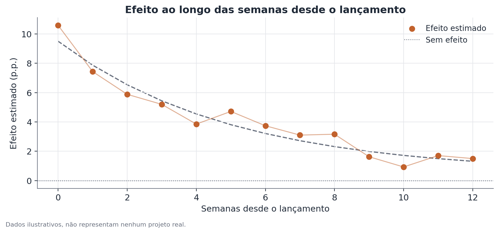

# Teste de heterogeneidade de efeito e decaimento de novidade

## Conceito

Um resultado experimental resumido numa única estimativa de efeito médio
responde apenas "o efeito, em média, é diferente de zero?". Duas perguntas
adicionais, frequentemente relevantes na prática, ficam de fora dessa
pergunta única:

- **Heterogeneidade de efeito (interação):** o efeito do tratamento é
  constante entre subgrupos da população, ou varia sistematicamente conforme
  alguma característica observável (camada de fidelidade, canal de aquisição,
  tipo de dispositivo, região)? Essa é uma pergunta sobre variação **entre
  unidades**, medida num mesmo corte temporal.
- **Decaimento de efeito de novidade:** o efeito de uma mudança se mantém
  estável ao longo do tempo desde o lançamento, ou parte dele reflete reação
  transitória de curiosidade ("efeito novidade" ou "efeito Hawthorne" em
  sentido amplo) que se dissipa conforme a mudança deixa de ser nova? Essa é
  uma pergunta sobre variação **ao longo do tempo**, medida dentro do mesmo
  grupo.

As duas perguntas são conceitualmente distintas e devem ser testadas
separadamente, ainda que apareçam juntas na prática: um efeito pode ser
homogêneo entre subgrupos e ainda assim decair; pode ser heterogêneo e
estável; pode ser as duas coisas ao mesmo tempo, ou nenhuma.

## Formulação matemática

### Teste de interação (heterogeneidade)

Seja $Y_i$ a métrica de interesse da unidade $i$, $T_i \in \{0,1\}$ o
indicador de tratamento, e $S_i$ um indicador de subgrupo (por simplicidade,
binário: $S_i = 1$ para o subgrupo de interesse, $S_i = 0$ para o subgrupo de
referência). O modelo de interação é:

$$
Y_i = \beta_0 + \beta_1 T_i + \beta_2 S_i + \beta_3 (T_i \times S_i) + \varepsilon_i
$$

onde:

- $\beta_1$ é o efeito do tratamento no subgrupo de referência ($S_i = 0$);
- $\beta_2$ captura a diferença de nível basal entre subgrupos, independente
  do tratamento;
- $\beta_3$ é o **coeficiente de interação** — a diferença no efeito do
  tratamento entre o subgrupo de interesse e o subgrupo de referência. É o
  parâmetro central do teste de heterogeneidade;
- $\varepsilon_i$ é o erro aleatório, com os cuidados usuais de
  heterocedasticidade e, quando relevante, correlação intra-cluster (ver o
  documento sobre erros-padrão robustos a cluster).

O teste de heterogeneidade é o teste de hipótese usual sobre $\beta_3$:
$H_0: \beta_3 = 0$ contra $H_1: \beta_3 \neq 0$, usando a estatística
$t = \hat\beta_3 / \widehat{SE}(\hat\beta_3)$.

Com mais de dois subgrupos, generaliza-se para uma variável categórica $S_i$
com $K$ categorias, gerando $K-1$ termos de interação (um por categoria,
contra a categoria de referência), e o teste conjunto de heterogeneidade é um
teste F sobre todos os $K-1$ coeficientes de interação simultaneamente:

$$
H_0: \beta_3^{(1)} = \beta_3^{(2)} = \dots = \beta_3^{(K-1)} = 0
$$

### Decaimento de efeito de novidade

Seja $w = 1, \dots, W$ a janela de tempo (por exemplo, semana) desde o
lançamento. Para cada janela, estima-se separadamente o efeito do tratamento
$\hat\tau_w$ com seu erro-padrão, usando apenas as observações daquela
janela:

$$
Y_{i,w} = \alpha_w + \tau_w T_i + \varepsilon_{i,w}, \quad w = 1, \dots, W
$$

O objeto de interesse passa a ser a sequência $\{\hat\tau_1, \hat\tau_2,
\dots, \hat\tau_W\}$. Uma forma direta de testar decaimento é regredir essa
sequência de estimativas sobre $w$:

$$
\hat\tau_w = \gamma_0 + \gamma_1 w + u_w
$$

com $\gamma_1 < 0$ e estatisticamente significativo como evidência de
decaimento. Uma alternativa mais robusta, quando o número de janelas permite,
é estimar diretamente um modelo único com interação tratamento × tempo
contínuo, análogo ao termo de interação da seção anterior, tratando o tempo
desde o lançamento como a variável de subgrupo.

## Suposições

- **Definição do subgrupo antes de ver os dados de efeito.** O teste de
  interação pressupõe que os subgrupos comparados foram definidos por um
  critério razoável e, idealmente, especificado antes de rodar o experimento
  — não escolhidos depois de vasculhar quais cortes "parecem" ter efeito
  maior.
- **Erros bem especificados.** Como em qualquer regressão, inferência válida
  sobre $\beta_3$ depende de erros-padrão adequados à estrutura de
  dependência dos dados (por exemplo, robustos a heterocedasticidade, ou a
  cluster quando as observações não são independentes dentro de um grupo).
- **Estabilidade da composição ao longo do tempo (decaimento).** Comparar
  $\hat\tau_w$ entre janelas pressupõe que a composição da população em cada
  janela é comparável — se usuários muito diferentes entram no experimento em
  semanas diferentes (por exemplo, por causa de uma campanha de aquisição),
  parte da variação observada em $\hat\tau_w$ pode refletir mudança de
  composição, não decaimento genuíno do efeito sobre o mesmo tipo de usuário.
- **Amostra suficiente por subgrupo e por janela.** Cortar os dados em
  subgrupos ou janelas de tempo reduz o tamanho de amostra em cada célula,
  inflando os erros-padrão — um teste de heterogeneidade sem poder estatístico
  suficiente simplesmente não detecta diferenças reais.

## Hipóteses

**Teste de interação:**

- $H_0$: $\beta_3 = 0$ — o efeito do tratamento é igual entre os subgrupos
  comparados.
- $H_1$: $\beta_3 \neq 0$ — o efeito difere entre os subgrupos.
- Estatística de teste: $t = \hat\beta_3 / \widehat{SE}(\hat\beta_3)$,
  comparada à distribuição t (ou normal, em amostras grandes) sob $H_0$.
- Nível de significância convencional: 5%, mas ver a seção de limitações
  sobre comparações múltiplas quando vários subgrupos são testados.

**Teste de decaimento:**

- $H_0$: $\gamma_1 = 0$ — não há tendência de queda no efeito ao longo das
  janelas de tempo.
- $H_1$: $\gamma_1 < 0$ (teste unilateral, se a pergunta é especificamente
  sobre decaimento) ou $\gamma_1 \neq 0$ (teste bilateral, se qualquer
  mudança de padrão interessa).
- Intervalo de confiança de 95% para $\hat\tau_w$ em cada janela permite
  visualizar diretamente se a trajetória das estimativas é compatível com
  efeito constante (todas as faixas se sobrepõem) ou com queda sistemática.

## Interpretação

Um coeficiente de interação significativo diz que o efeito **difere** entre
os subgrupos testados — não diz automaticamente qual subgrupo é "melhor" em
termos absolutos, nem por que a diferença existe. Um efeito maior em um
subgrupo pode refletir maior sensibilidade real à mudança, ou simplesmente
uma linha de base mais baixa com mais espaço para melhorar.

Decaimento de novidade detectado não significa que o produto "não funciona"
— significa que a magnitude do efeito de longo prazo é menor do que a
medição inicial sugeria. A decisão de lançamento deve, idealmente, se basear
no efeito estabilizado (últimas janelas), não no efeito de pico (primeiras
janelas), quando o objetivo é entender o ganho sustentável.

Nenhuma das duas análises, por si só, estabelece causalidade adicional além
da já garantida pela randomização do experimento original — elas apenas
decompõem um efeito causal médio já identificado em como ele se distribui
entre grupos e ao longo do tempo.

## Limitações

- **Comparações múltiplas.** Testar heterogeneidade em vários subgrupos
  simultaneamente (por camada, canal, dispositivo, região, e assim por
  diante) infla a taxa de falsos positivos. Testando 10 subgrupos
  independentes a 5% de significância, a probabilidade de pelo menos um
  resultado "significativo" por puro acaso, mesmo sem heterogeneidade real,
  ultrapassa 40%. Correções como Bonferroni, ou a exigência de replicação em
  um experimento subsequente, mitigam esse risco. Um subgrupo definido *a
  priori*, com justificativa teórica clara, é sempre mais confiável que um
  subgrupo descoberto explorando os dados depois do fato.
- **Poder estatístico reduzido em subgrupos pequenos.** Cortar a amostra
  aumenta o erro-padrão de cada estimativa de subgrupo — a ausência de
  significância num subgrupo pequeno pode simplesmente refletir amostra
  insuficiente, não ausência de efeito.
- **Confusão entre composição e decaimento genuíno.** Mudanças na
  composição da população ao longo das semanas (sazonalidade, campanhas de
  aquisição, efeitos de calendário) podem produzir uma trajetória que parece
  decaimento sem que o efeito, para um mesmo usuário, tenha realmente caído.
- **Janelas de tempo curtas demais para concluir estabilização.** Observar
  decaimento nas primeiras semanas não garante que o efeito vá a zero — pode
  estabilizar num patamar positivo menor. Extrapolar a tendência para além do
  período observado é especulativo.

## Exemplo

Suponha um aplicativo de corretora que testa uma nova tela de resumo de
carteira, com o objetivo de aumentar o número de logins semanais. O efeito
médio estimado, agregando toda a base, é de +6,0% em relação ao controle,
com erro-padrão de 1,2 (estatisticamente significativo).

**Heterogeneidade por perfil de investidor.** Separando por tempo de conta:

| Subgrupo | Efeito estimado | Erro-padrão |
|---|---|---|
| Contas com menos de 6 meses | +11,4% | 2,0 |
| Contas com 6 meses ou mais | +2,1% | 1,4 |

A diferença entre os dois efeitos é de 9,3 pontos percentuais. O erro-padrão
da diferença, combinando os dois erros-padrão sob independência,
$\sqrt{2{,}0^2 + 1{,}4^2} \approx 2{,}44$, resulta em uma estatística
$t \approx 3{,}8$ — bem acima do limiar de significância usual. Há evidência
sólida de heterogeneidade: contas novas respondem muito mais à mudança do que
contas estabelecidas, um padrão plausível, já que usuários novos ainda estão
formando hábitos de uso.

**Decaimento de novidade.** Olhando o efeito agregado semana a semana desde o
lançamento:

| Semana | Efeito estimado |
|---|---|
| 1 | +12,8% |
| 2 | +9,4% |
| 4 | +6,7% |
| 8 | +3,9% |
| 12 | +3,5% |

A trajetória cai de forma consistente até a semana 8 e depois se estabiliza
perto de 3,5%. A leitura correta não é "a mudança não funciona" — é que o
efeito de pico inicial (quase 13%) incluía uma parcela de curiosidade
temporária, e o ganho sustentável real, relevante para projeções de longo
prazo, está mais próximo de 3,5%.

Combinando as duas análises: a decisão de produto mais informada não é
"lançar para todos com o efeito médio de +6%", mas algo como "lançar
priorizando contas novas, e projetar o ganho de longo prazo usando o patamar
estabilizado de aproximadamente +3,5% a +4%, não o pico inicial".
