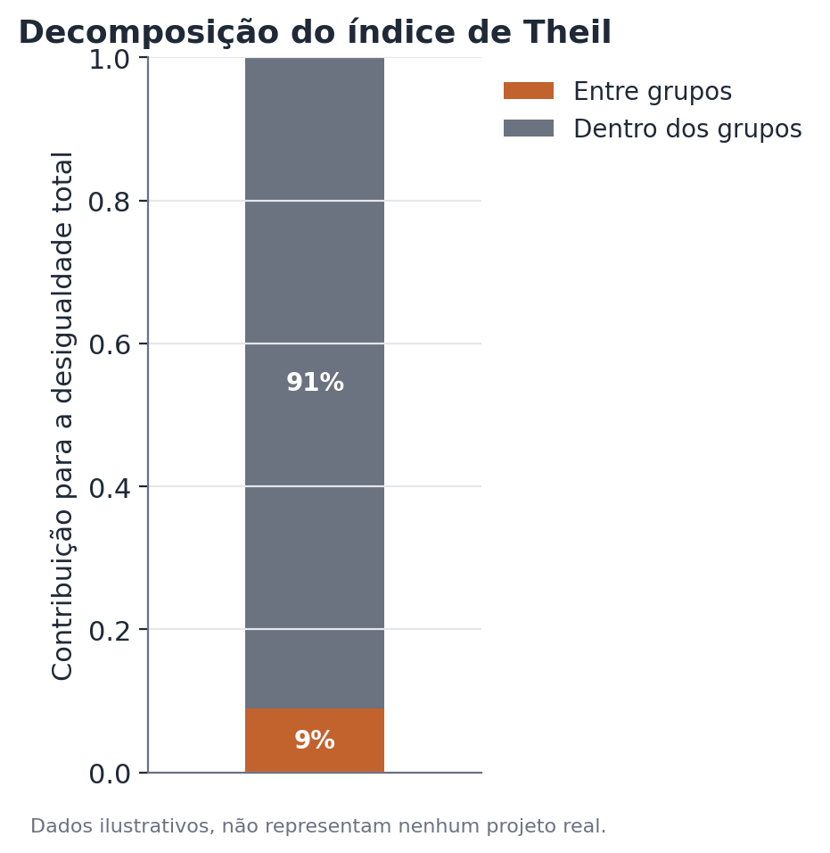
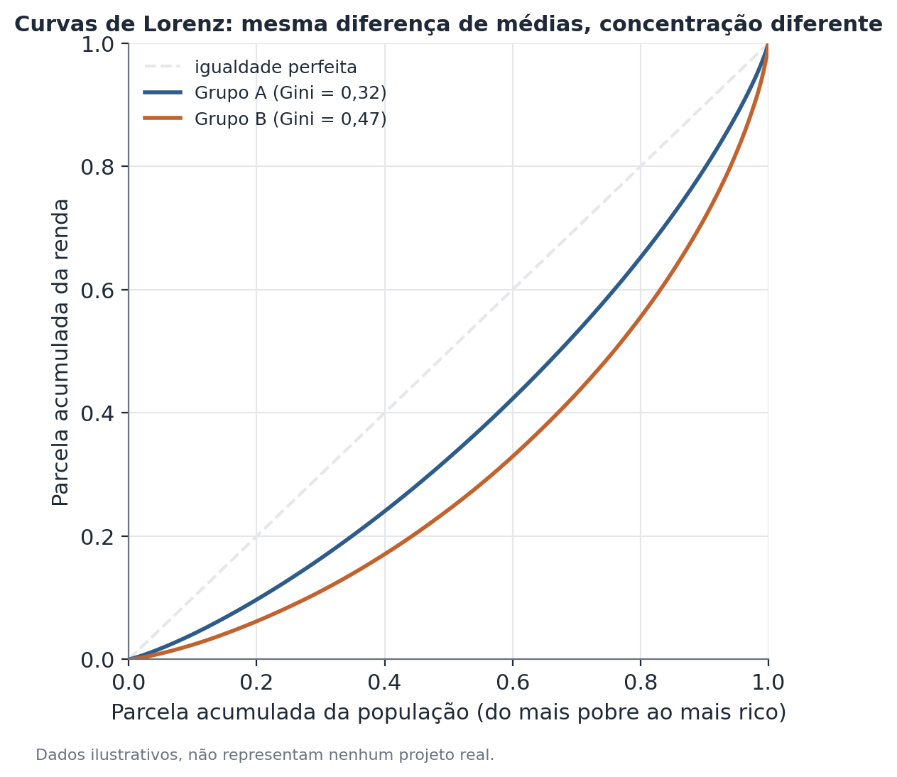

# Decomposição de desigualdade (Theil, Gini, quantis ponderados)

## Conceito

Medir desigualdade de renda com um único número (como a média ou a mediana)
esconde toda a forma da distribuição. Esta seção cobre três ferramentas
complementares para caracterizar desigualdade de forma mais completa: o
índice de Theil (com sua propriedade de decomponibilidade exata entre
componentes "entre grupos" e "dentro dos grupos"), o índice de Gini (uma
medida de concentração amplamente usada, baseada na curva de Lorenz), e
quantis ponderados (estimativas de pontos de corte da distribuição — como
"o que caracteriza os 10% mais ricos" — que levam em conta o desenho
amostral de uma pesquisa).

A pergunta que essas ferramentas respondem, em conjunto, é: de onde vem a
desigualdade observada, e como ela se compara entre diferentes recortes da
população?

## Formulação matemática

**Índice de Theil (índice T, baseado em entropia).** Para uma variável de
renda $y_i > 0$ com média $\bar{y}$, calculada sobre $n$ observações:

$$
T = \frac{1}{n} \sum_{i=1}^{n} \frac{y_i}{\bar{y}} \ln\left(\frac{y_i}{\bar{y}}\right)
$$

$T = 0$ corresponde a igualdade perfeita (todo mundo com a mesma renda);
valores maiores indicam maior desigualdade. Ao contrário do Gini, o Theil não
tem um limite superior fixo de 1.

**Decomposição exata entre e dentro de grupos.** Dividindo a população em
$G$ grupos, cada um com participação $s_g$ na renda total e Theil interno
$T_g$:

$$
T = \underbrace{\sum_{g=1}^{G} s_g \ln\left(\frac{\bar{y}}{\bar{y}_g}\right)}_{T_{\text{entre}}} +
\underbrace{\sum_{g=1}^{G} s_g T_g}_{T_{\text{dentro}}}
$$

onde $\bar{y}_g$ é a renda média do grupo $g$. $T_{\text{entre}}$ é o valor
que o Theil teria se cada pessoa recebesse a renda média do seu grupo (só
capturando a diferença entre médias); $T_{\text{dentro}}$ é a média ponderada
dos índices de Theil calculados dentro de cada grupo, com peso igual à
participação de renda de cada grupo. A soma dos dois é exatamente igual ao
Theil total — não há termo residual, o que é a propriedade central que torna
o Theil especialmente útil para esse tipo de decomposição (o índice de Gini,
por comparação, tem uma decomposição aditiva só sob condições especiais,
geralmente com um termo residual extra de sobreposição entre grupos).

**Índice de Gini.** Para uma amostra ordenada $y_{(1)} \leq y_{(2)} \leq
\dots \leq y_{(n)}$:

$$
G = \frac{2\sum_{i=1}^{n} i \cdot y_{(i)} - (n+1)\sum_{i=1}^{n} y_{(i)}}{n\sum_{i=1}^{n} y_{(i)}}
$$

Geometricamente, $G$ é duas vezes a área entre a curva de Lorenz (que
mostra a parcela acumulada de renda detida pelos $p\%$ mais pobres) e a reta
de igualdade perfeita (a diagonal de 45°). $G = 0$ é igualdade perfeita;
$G \to 1$ é concentração extrema.

**Quantis ponderados.** Dado um conjunto de pesos amostrais $w_i$ (que
refletem quantas unidades da população cada observação da amostra
representa, por causa do desenho amostral), o quantil de ordem $q$ é o valor
$Q_q$ tal que a soma dos pesos das observações com $y_i \leq Q_q$, dividida
pela soma total dos pesos, seja igual a $q$. Ignorar os pesos e calcular um
quantil amostral simples produz uma estimativa enviesada sempre que a
probabilidade de seleção não for constante entre as observações.

## Suposições

1. **Valores estritamente positivos** (Theil): a fórmula do índice T exige
   $y_i > 0$ para todas as observações — rendas zero ou negativas exigem
   tratamento especial (por exemplo, exclusão com nota metodológica
   explícita, ou uso de uma variante do índice de Theil menos sensível a
   isso, como o índice L / desvio logarítmico médio).
2. **Grupos mutuamente exclusivos e exaustivos**: a decomposição do Theil
   entre/dentro pressupõe que cada observação pertence a exatamente um
   grupo — categorizações sobrepostas quebram a decomposição exata.
3. **Representatividade dos pesos amostrais**: quantis ponderados e índices
   calculados a partir de pesquisas amostrais dependem da qualidade dos
   pesos de desenho (e, quando aplicável, de pós-estratificação) — pesos mal
   calibrados produzem estimativas enviesadas independentemente da fórmula
   usada.
4. **Estabilidade em subgrupos pequenos**: ao decompor por muitos grupos
   simultaneamente (por exemplo, cruzando região e raça), alguns subgrupos
   podem ter poucas observações, tornando o $T_g$ daquele subgrupo instável
   — vale reportar o tamanho de amostra de cada subgrupo.

## Hipóteses

Índices de desigualdade como Theil e Gini não têm, tradicionalmente, um
teste de hipótese único e universalmente aceito da mesma forma que uma
diferença de médias — mas comparações entre índices (por exemplo, o Gini do
Grupo A é maior que o do Grupo B?) podem e devem ser acompanhadas de
incerteza:

- Erros-padrão para Gini e Theil são tipicamente obtidos por bootstrap
  (reamostrando a amostra, com reposição, respeitando o desenho amostral
  quando aplicável, e recalculando o índice em cada reamostragem).
- $H_0$: os dois índices (por exemplo, Gini do Grupo A e Gini do Grupo B)
  são iguais — testada comparando a diferença observada com a distribuição
  bootstrap da diferença.
- Para a decomposição de Theil, o componente "entre grupos" pode ter seu
  próprio intervalo de confiança via bootstrap, mas por construção ele é
  sempre não negativo — vale reportar tanto o valor em unidades absolutas de
  Theil quanto sua fração do total.

## Interpretação

A decomposição de Theil entre/dentro contextualiza — mas não substitui — a
comparação direta de médias entre grupos. É perfeitamente possível, e
comum, que uma fração pequena da desigualdade total (digamos, abaixo de 10%)
venha da diferença entre grupos amplos como raça ou gênero, mesmo quando
essa diferença de médias é grande e estatisticamente muito significativa
(ver o teste t de Welch e Oaxaca-Blinder). As duas coisas não competem: a
fração "entre grupos" fala sobre a variância total da renda na população; o
gap médio entre grupos fala sobre a diferença de posição típica entre eles.
Ambas as leituras são válidas e devem ser apresentadas juntas, não uma no
lugar da outra.

Sobre o índice de Gini: comparar Gini entre grupos exige cuidado semelhante.
Um grupo pode ter Gini mais baixo simplesmente porque sua distribuição de
renda está mais comprimida perto da base — ou seja, quase todo mundo naquele
grupo ganha pouco, de forma relativamente parecida. Isso não é "mais
igualdade no sentido positivo"; é compressão numa faixa de renda baixa. Gini
mais baixo não deve ser lido, por si só, como "situação melhor" sem olhar
também o nível de renda (a média ou mediana) daquele grupo.

## Limitações

- O índice de Theil, apesar de decomponível exatamente entre e dentro de
  grupos, é sensível à escolha de como os grupos são definidos — recortar a
  população de formas diferentes (dois grupos amplos vs. dez subgrupos
  específicos) muda a fração atribuída a "entre grupos".
- Nenhum dos índices, sozinho, diz por que a desigualdade dentro de um grupo
  é alta — isso exige investigação adicional (por exemplo, decomposição por
  outras variáveis, ou decomposição por RIF ao longo da distribuição).
- Comparações de Gini ou Theil ao longo do tempo podem ser afetadas por
  mudanças na cobertura da pesquisa, na definição da variável de renda, ou
  em ajustes de inflação — vale garantir comparabilidade metodológica antes
  de interpretar uma mudança como mudança real de desigualdade.
- Quantis ponderados em subgrupos pequenos (baixa contagem de observações
  amostrais, mesmo que o peso populacional seja grande) têm maior
  incerteza — sempre verificar o tamanho de amostra por trás de um quantil
  reportado.

## Exemplo

Considere um cenário hipotético: uma pesquisa domiciliar mede a renda de
duas regiões de um país, Região Norte e Região Sul, com os seguintes dados
agregados (inventados):

- Região Norte: renda média = 3.200, participação na renda total = 35%,
  Theil interno = 0,28.
- Região Sul: renda média = 5.100, participação na renda total = 65%,
  Theil interno = 0,33.

**Passo 1 — Theil entre grupos.** Usando a fórmula de decomposição, com a
renda média geral $\bar{y}$ (uma média ponderada pela participação de renda
de cada região, que resulta em aproximadamente 4.430):

$$
T_{\text{entre}} = 0{,}35 \ln\left(\frac{4.430}{3.200}\right) + 0{,}65 \ln\left(\frac{4.430}{5.100}\right) \approx 0{,}35 \times 0{,}325 - 0{,}65 \times 0{,}140 \approx 0{,}022
$$

**Passo 2 — Theil dentro dos grupos:**

$$
T_{\text{dentro}} = 0{,}35 \times 0{,}28 + 0{,}65 \times 0{,}33 = 0{,}098 + 0{,}215 = 0{,}313
$$

**Passo 3 — Theil total:**

$$
T = T_{\text{entre}} + T_{\text{dentro}} = 0{,}022 + 0{,}313 = 0{,}335
$$

**Interpretação:** a parcela "entre regiões" representa cerca de 0,022 /
0,335 ≈ 6,6% da desigualdade total — mesmo com uma diferença de renda média
de quase 60% entre as duas regiões (3.200 vs. 5.100). A grande maioria da
desigualdade (93,4%) está dentro de cada região, refletindo que, dentro da
Região Norte e da Região Sul separadamente, já existe grande variação entre
quem ganha pouco e quem ganha muito. Isso não torna a diferença regional sem
importância — ela é substancial e mensurável — mas contextualiza seu peso
relativo dentro do quadro geral de desigualdade do país.

A figura abaixo ilustra esse tipo de decomposição, com a parcela "entre
grupos" tipicamente pequena em relação à parcela "dentro dos grupos":

A segunda figura mostra curvas de Lorenz hipotéticas para dois grupos com
Ginis diferentes — ilustrando que um Gini mais baixo corresponde a uma curva
mais próxima da diagonal de igualdade perfeita, mas isso, por si só, não diz
nada sobre o nível de renda de cada grupo:

