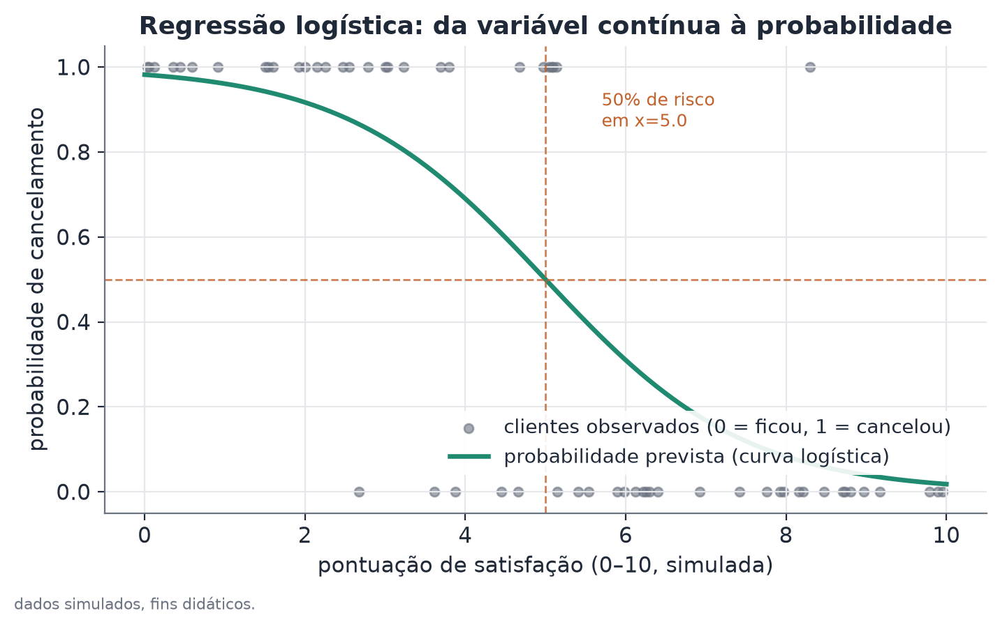
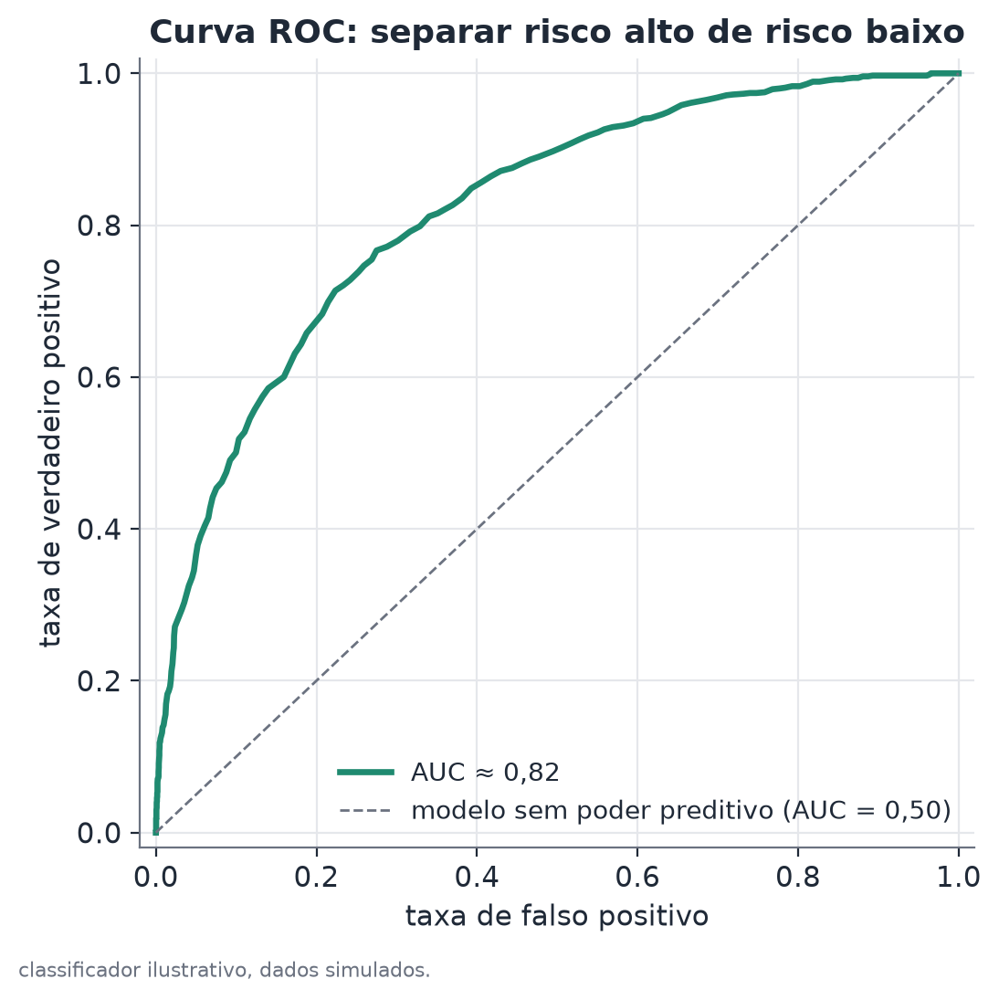

# Regressão logística

## Conceito

A regressão logística é um modelo linear generalizado (GLM) desenhado para variáveis de resposta binárias: um desfecho que só assume dois valores, tipicamente codificado como 0 (não ocorreu) e 1 (ocorreu). É o modelo natural quando a variável de interesse viola a suposição central de uma regressão linear comum aplicada diretamente a um 0/1: a reta ajustada por mínimos quadrados pode prever valores fora do intervalo $[0,1]$, que não correspondem a nenhuma probabilidade válida, e os erros do modelo não têm variância constante (heterocedasticidade estrutural, decorrente da própria natureza binária do desfecho).

A ideia central é modelar, não a probabilidade $p$ diretamente, mas o seu **logit** — o logaritmo da razão de chances, $\log\big(p/(1-p)\big)$ — como uma combinação linear das variáveis explicativas. O logit pode assumir qualquer valor real; a função logística que o converte de volta para uma probabilidade garante que o resultado fique sempre no intervalo $(0,1)$, qualquer que seja o valor dos coeficientes ou das variáveis.

## Formulação matemática

**Variável de resposta.** $Y_i \in \{0, 1\}$ para cada observação $i$, com $Y_i \sim \text{Bernoulli}(p_i)$, onde $p_i = P(Y_i=1 \mid x_i)$.

**Modelo logit-linear.** O logit da probabilidade é modelado como uma combinação linear das variáveis explicativas:

$$
\text{logit}(p_i) = \log\left(\frac{p_i}{1-p_i}\right) = \beta_0 + \beta_1 x_{1i} + \beta_2 x_{2i} + \dots + \beta_k x_{ki}
$$

Isolando $p_i$, obtém-se a função logística (sigmoide):

$$
p_i = \frac{1}{1 + e^{-(\beta_0 + \beta_1 x_{1i} + \dots + \beta_k x_{ki})}}
$$

**Interpretação multiplicativa do coeficiente (razão de chances).** Considere duas observações idênticas exceto pela variável $x_1$, com $x_1=a+1$ na primeira e $x_1=a$ na segunda. A razão de chances entre as duas é

$$
\frac{\text{odds}_i \mid x_1=a+1}{\text{odds}_i \mid x_1=a} = \frac{p/(1-p) \mid x_1=a+1}{p/(1-p) \mid x_1=a} = e^{\beta_1}
$$

onde $\text{odds} = p/(1-p)$. Todos os outros termos se cancelam por serem idênticos nas duas observações — por isso $e^{\beta_1}$ é interpretado como a **razão de chances**: quantas vezes a chance do desfecho ocorrer se multiplica quando $x_1$ aumenta em uma unidade, mantendo tudo o mais constante. Note que razão de chances não é o mesmo que razão de probabilidades ($p_1/p_0$) — as duas coincidem aproximadamente apenas quando $p$ é pequeno.

**Estimação.** Os coeficientes são estimados por máxima verossimilhança. A função de verossimilhança, para $n$ observações independentes, é

$$
L(\beta) = \prod_{i=1}^n p_i^{y_i}(1-p_i)^{1-y_i}
$$

e a log-verossimilhança,

$$
\ell(\beta) = \sum_{i=1}^n \Big[y_i \log(p_i) + (1-y_i)\log(1-p_i)\Big]
$$

Não existe forma fechada para o vetor $\hat\beta$ que maximiza $\ell$; a estimação usa métodos numéricos iterativos (tipicamente Newton-Raphson ou mínimos quadrados reponderados iterativamente, IRLS), que convergem para o máximo porque $\ell(\beta)$ é côncava no caso logístico padrão.

## Suposições

- **Observações independentes** (condicionalmente às variáveis explicativas). Quando várias observações vêm da mesma unidade ao longo do tempo (o mesmo indivíduo, o mesmo time em rodadas diferentes de uma temporada), essa suposição é violada — os erros-padrão de máxima verossimilhança ficam pequenos demais, inflando a aparente significância estatística. A correção usual é agrupar (cluster) os erros-padrão por unidade ou validar por divisões que respeitem a estrutura de grupo (deixar uma unidade inteira de fora, não uma observação isolada).
- **Forma funcional logit-linear correta**: assume-se que o efeito das variáveis é linear na escala do logit, não na escala da probabilidade. A relação entre uma variável contínua e o logit pode não ser de fato linear (por exemplo, ter uma forma de U); nesse caso, termos polinomiais ou splines na variável ajudam a capturar a não linearidade.
- **Ausência de multicolinearidade severa** entre as variáveis explicativas: quando duas variáveis são fortemente correlacionadas entre si, os coeficientes individuais ficam instáveis (erros-padrão grandes) mesmo que o modelo, como um todo, preveja bem.
- **Separação e quase-separação**: quando uma combinação das variáveis explicativas prediz o desfecho quase perfeitamente (por exemplo, toda observação com $x$ acima de um valor tem $y=1$ e toda com $x$ abaixo tem $y=0$), a verossimilhança não tem um máximo finito bem definido — o algoritmo de estimação não converge de forma estável, e os coeficientes (e especialmente seus erros-padrão) ficam artificialmente grandes. Isso costuma surgir justamente quando a variável é muito informativa, não é um sinal de erro no modelo, mas exige reportar os intervalos de confiança com essa ressalva.

## Hipóteses

Para cada coeficiente $\beta_j$, o teste usual é:

- $H_0: \beta_j = 0$ (a variável $x_j$ não afeta o logit da probabilidade do desfecho, controlando pelas demais variáveis)
- $H_1: \beta_j \neq 0$

A estatística de teste (teste de Wald) é $z = \hat\beta_j / \mathrm{SE}(\hat\beta_j)$, comparada a uma distribuição normal padrão. Um intervalo de confiança de 95% para $\beta_j$ é $\hat\beta_j \pm 1,96 \times \mathrm{SE}(\hat\beta_j)$; exponenciando os limites, obtém-se o intervalo de confiança para a razão de chances $e^{\beta_j}$. Sob quase-separação, o teste de razão de verossimilhanças (comparando o modelo completo a um modelo sem a variável $x_j$, via $-2[\ell_{\text{restrito}} - \ell_{\text{completo}}] \sim \chi^2_1$) costuma ser mais estável do que o teste de Wald.

## Interpretação

O coeficiente exponenciado (razão de chances) informa quanto a chance do desfecho muda multiplicativamente por unidade de mudança na variável explicativa, controlando pelas demais variáveis incluídas no modelo. Como no caso da regressão de Poisson, isso é uma afirmação sobre associação condicional dentro do modelo especificado, não uma afirmação causal automática — em dados observacionais, fatores omitidos correlacionados tanto com $x_j$ quanto com o desfecho podem enviesar a estimativa.

A qualidade do modelo como **classificador** é uma pergunta distinta da significância dos coeficientes, e deve ser avaliada separadamente:

- **AUC (área sob a curva ROC)**: a probabilidade de o modelo atribuir uma probabilidade prevista mais alta a uma observação positiva escolhida ao acaso do que a uma observação negativa escolhida ao acaso. Equivale à estatística de Mann-Whitney/Wilcoxon normalizada. AUC = 0,5 corresponde a um modelo sem poder de discriminação (equivalente a uma classificação aleatória); AUC = 1,0, a separação perfeita entre as duas classes.
- **Brier score**: $\frac{1}{n}\sum_i (\hat p_i - y_i)^2$, o erro quadrático médio entre a probabilidade prevista e o desfecho observado (0 ou 1). Mede simultaneamente discriminação e calibração — diferente da AUC, que só mede a ordenação relativa das probabilidades previstas, não se elas estão corretamente calibradas em nível absoluto.
- **Validação fora da amostra**: como em qualquer modelo preditivo, o desempenho dentro da amostra de treino tende a superestimar o desempenho em dados novos. Com painéis pequenos e estrutura de grupo (por exemplo, várias observações por temporada), validar deixando uma unidade inteira de fora por vez (leave-one-group-out) é preferível a uma divisão aleatória simples, que pode vazar informação da mesma unidade entre treino e teste.

## Limitações

- **Quase-separação em variáveis muito preditivas**: paradoxalmente, quanto melhor a variável explicativa separa as classes, maior o risco de instabilidade na estimação do coeficiente e do seu erro-padrão — é preciso relatar isso como ressalva, sem descartar a direção do efeito.
- **Um único regressor pode ter boa AUC e ainda ignorar informação relevante**: a regressão logística com uma variável mede o quanto aquela variável, sozinha, já separa as classes — não invalida a hipótese de que outras variáveis, se incluídas, melhorariam a previsão.
- **Odds ratio não é risco relativo**: para desfechos frequentes (probabilidade base longe de zero), a razão de chances superestima a razão de probabilidades correspondente — a distinção deve ser explicitada ao comunicar resultados para públicos não técnicos, evitando a leitura errada de "a chance dobrou" como "a probabilidade dobrou".
- **Extrapolação fora do intervalo observado**: como em qualquer modelo ajustado, prever a probabilidade para combinações de variáveis muito distantes dos dados de treino é arriscado, ainda que a curva logística sempre devolva um número entre 0 e 1.

## Exemplo

Considere um exemplo fictício de previsão de cancelamento de assinatura em função de uma pontuação de satisfação (0 a 10), estimada sobre uma base sintética de clientes.

Um modelo com um único regressor, ajustado sobre dados simulados, estima:

- Coeficiente da satisfação: $\hat\beta = -0,69$, erro-padrão $= 0,10$
- Estatística de Wald: $z = -0,69/0,10 = -6,90$, valor-p $< 0,001$
- Intervalo de confiança 95% para $\beta$: $[-0,89;\, -0,49]$

Exponenciando o coeficiente e os limites do intervalo: razão de chances estimada $e^{-0,69}\approx 0,50$, com IC 95% aproximado $[e^{-0,89}, e^{-0,49}] \approx [0,41,\, 0,61]$.

**Leitura:** cada ponto a mais na pontuação de satisfação está associado a uma redução estimada de 50% na chance de cancelamento (IC 95%: redução entre 39% e 59%), efeito estatisticamente significativo ($p<0,001$). O ponto de corte de 50% de probabilidade prevista fica em $x = -\hat\beta_0/\hat\beta$; validado fora da amostra, o modelo atinge uma AUC de aproximadamente 0,82 nesse exemplo — bem acima de 0,50 (aleatório), indicando que a pontuação de satisfação, sozinha, já discrimina razoavelmente bem quem cancela de quem fica.

