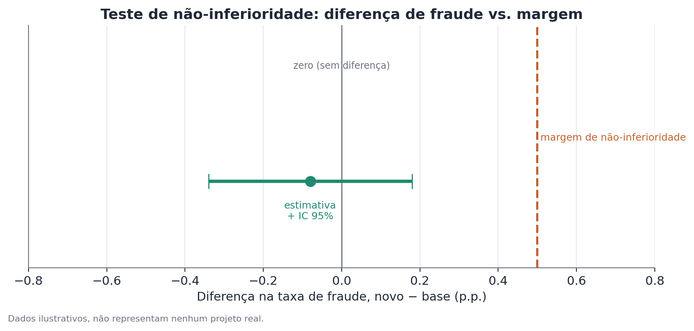
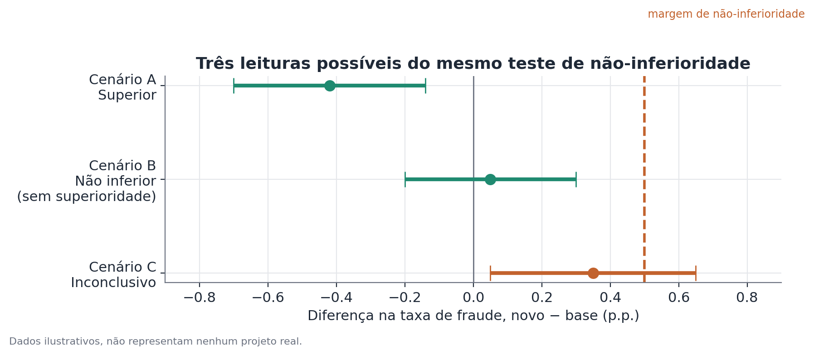

# Teste de não-inferioridade

*Pressupõe os fundamentos de teste A/B — veja
[Fundamentos de teste A/B](./ab-testing.md).*

## Conceito

Um teste de não-inferioridade avalia se uma métrica de tratamento não é
pior que a métrica de controle por mais do que uma margem $\delta$ definida
previamente — em vez de testar se as duas são iguais. É o teste apropriado
para métricas de guardrail: indicadores que não podem se deteriorar além de
um limite aceitável, mesmo quando o objetivo principal do experimento é
outro (por exemplo, ganhar velocidade, reduzir custo, ou melhorar uma
métrica de negócio diferente).

A diferença central em relação a um teste de duas pontas convencional não é
de mecânica estatística — é de formulação lógica das hipóteses. Um teste
comum divide o espaço de possibilidades em "sem diferença" (nulo) e
"alguma diferença, em qualquer direção" (alternativa). O teste de
não-inferioridade divide o espaço de forma assimétrica: a hipótese nula
passa a ser justamente "houve deterioração maior que a margem", e a
hipótese alternativa é "não houve deterioração maior que a margem". Essa
inversão de qual afirmação carrega o ônus da prova é o que torna o teste de
não-inferioridade estruturalmente diferente, não apenas uma reformulação de
palavras do mesmo teste.

## Formulação matemática

Seja $\Delta = \mu_T - \mu_C$ a diferença real (populacional) entre
tratamento e controle numa métrica onde valores maiores são piores (por
exemplo, taxa de fraude). Seja $\delta > 0$ a margem de não-inferioridade,
definida de forma que uma deterioração de até $\delta$ seja considerada
aceitável.

As hipóteses são:

$$
H_0: \Delta \geq \delta \qquad H_1: \Delta < \delta
$$

Note a assimetria: $H_0$ afirma que a métrica piorou pelo menos tanto quanto
a margem (o cenário "ruim" é o nulo); $H_1$ afirma que a piora, se houver, é
menor que a margem. Isso é o oposto estrutural de um teste de superioridade,
onde a hipótese nula é "sem efeito" e a alternativa é "há efeito".

A estatística de teste segue a mesma lógica de um teste de efeito padrão,
mas comparada contra $\delta$ em vez de zero:

$$
z = \frac{\hat{\Delta} - \delta}{SE(\hat{\Delta})}
$$

Rejeita-se $H_0$ (concluindo não-inferioridade) quando $z < -z_{1-\alpha}$,
o que equivale, de forma mais intuitiva, a checar se o limite superior de um
intervalo de confiança unilateral de $(1-\alpha)$ para $\Delta$ fica abaixo
de $\delta$:

$$
\hat{\Delta} + z_{1-\alpha} \cdot SE(\hat{\Delta}) < \delta
$$

Na prática, é comum reportar essa checagem usando o limite superior de um
intervalo de confiança bilateral de $(1-2\alpha)$, que é numericamente
equivalente ao limite superior unilateral de $(1-\alpha)$ — por exemplo, um
IC bilateral de 90% produz o mesmo limite superior que um IC unilateral de
95%.

## Suposições

- **A margem $\delta$ é definida antes de olhar os dados do experimento**,
  como decisão de negócio — não é estimada nem otimizada a partir dos
  próprios dados do experimento. Definir a margem depois de ver o resultado
  invalida a interpretação do teste.
- **A direção de "pior" está claramente definida** para a métrica em
  questão. Para métricas onde valores maiores são ruins (fraude, erro,
  latência), a margem limita o quanto a métrica pode subir; para métricas
  onde valores menores são ruins (satisfação, retenção), a formulação se
  inverte e a margem limita o quanto pode cair.
- **As mesmas suposições de um teste de efeito padrão se aplicam** —
  aleatorização válida, independência entre unidades, amostra grande o
  suficiente para a aproximação normal do erro-padrão ser razoável (ou uso
  de métodos exatos/bootstrap quando não for).
- **O desenho tem poder estatístico suficiente para o teste ser
  informativo** — com amostra pequena e margem apertada, o teste pode ser
  estruturalmente incapaz de concluir não-inferioridade mesmo quando o
  efeito real é favorável, simplesmente por falta de precisão.

## Hipóteses

Como detalhado acima:

$$
H_0: \Delta \geq \delta \qquad H_1: \Delta < \delta
$$

O nível de significância $\alpha$ (tipicamente 0,05, unilateral) representa
a taxa de erro tolerada de concluir não-inferioridade quando, na verdade, a
métrica piorou além da margem. Diferente de um teste de duas pontas, aqui só
existe uma direção de erro relevante — não há preocupação simétrica com
"falso positivo para melhora", porque melhora não é o que está sendo
testado.

## Interpretação

Concluir não-inferioridade é uma afirmação estatística específica: há
evidência, com o nível de confiança escolhido, de que a deterioração real
não excede $\delta$. Não é uma afirmação de equivalência (isso exigiria um
teste de equivalência, com margens nos dois sentidos) nem uma afirmação de
que não há custo algum — a estimativa pontual pode indicar uma piora
pequena, só que dentro do tolerável.

Um resultado inconclusivo — quando o limite superior do intervalo de
confiança cruza $\delta$ — não deve ser lido como "a métrica piorou muito".
Ele significa apenas que os dados não trazem evidência suficiente para
excluir essa possibilidade. A causa mais comum de inconclusão é poder
estatístico insuficiente: amostra pequena, métrica muito variável, ou margem
definida de forma muito apertada em relação à precisão que o desenho
consegue entregar. Antes de reportar um resultado inconclusivo como
definitivo, vale checar se o desenho tinha poder adequado para a margem
escolhida — um cálculo que espelha o de tamanho de amostra para testes de
efeito padrão, mas usando $\delta$ como o "efeito mínimo" de referência.

## Limitações

- A margem é uma escolha de negócio, e escolhas diferentes de margem podem
  levar a conclusões diferentes sobre exatamente os mesmos dados — o teste
  não valida a margem escolhida, só testa contra ela.
- Não-inferioridade concluída em um único experimento, com uma amostra e um
  contexto específicos, não garante que a métrica se manterá dentro da
  margem indefinidamente — mudanças de composição de usuários, de escala, ou
  de contexto podem alterar o comportamento real da métrica ao longo do
  tempo.
- Testar múltiplas métricas de guardrail simultaneamente, cada uma com seu
  próprio teste de não-inferioridade, tem a mesma questão de comparações
  múltiplas que qualquer bateria de testes — vale considerar isso ao
  interpretar "todas as guardrails passaram".
- Um teste de não-inferioridade não substitui um teste de efeito na métrica
  primária; os dois respondem perguntas diferentes e geralmente são usados
  em conjunto, um para o ganho pretendido, outro para o risco a monitorar.

## Exemplo

Uma empresa de pagamentos testa um novo modelo de detecção de fraude,
significativamente mais rápido que o atual, mas com potencial de ser um
pouco menos preciso. Antes do experimento, a equipe de risco define a
margem de não-inferioridade em 0,5 ponto percentual de aumento na taxa de
fraude — um limite acima do qual o ganho de velocidade não compensaria o
risco assumido.

O experimento roda com 12.000 transações em cada braço:

| | Controle (modelo atual) | Tratamento (modelo novo) |
|---|---|---|
| Transações | 12.000 | 12.000 |
| Casos de fraude | 252 | 242 |
| Taxa | 2,10% | 2,02% |

A diferença observada é $\hat{\Delta} = 2{,}02\% - 2{,}10\% = -0{,}08$ ponto
percentual (o modelo novo teve fraude ligeiramente menor). O erro-padrão da
diferença, calculado da mesma forma que num teste de efeito padrão, resulta
num intervalo de confiança de 95% de aproximadamente $[-0{,}34, +0{,}18]$
pontos percentuais.

Como o limite superior do intervalo (+0,18 p.p.) está abaixo da margem de
0,5 p.p., conclui-se não-inferioridade com 95% de confiança: há evidência
estatística de que o novo modelo não aumenta a fraude além do tolerável.

Para ilustrar como a mesma lógica se aplicaria a outros resultados possíveis
do mesmo experimento, considere três cenários hipotéticos para o IC da
diferença, todos contra a mesma margem de 0,5 p.p.:

- **Cenário A (superior)**: IC de $[-0{,}70, -0{,}14]$ — inteiramente abaixo
  de zero. O novo modelo não só é não-inferior, como mostra evidência de
  melhora real.
- **Cenário B (não inferior, sem superioridade)**: IC de $[-0{,}20, +0{,}30]$
  — cruza zero, mas o limite superior ainda fica abaixo da margem de 0,5.
  Não há evidência de melhora, mas há evidência de não-inferioridade.
- **Cenário C (inconclusivo)**: IC de $[+0{,}05, +0{,}65]$ — o limite
  superior ultrapassa a margem. Não é possível concluir não-inferioridade
  com confiança; a piora observada pode, ou não, exceder o tolerável.

Note que só o Cenário C leva a uma decisão de não avançar sem mais
investigação — os Cenários A e B, apesar de terem estimativas pontuais e
formas de intervalo bem diferentes, levam à mesma decisão prática de
aprovar o lançamento do ponto de vista da métrica de guardrail.
