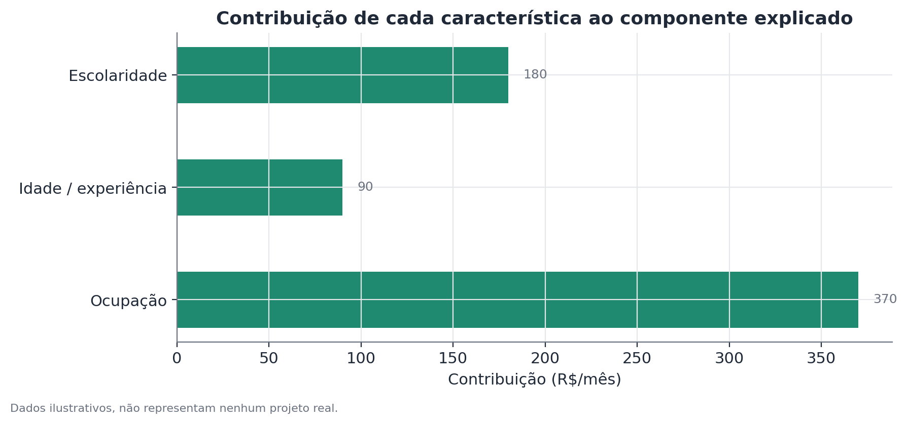

# Decomposição de Oaxaca-Blinder

## Conceito

A decomposição de Oaxaca-Blinder é uma técnica contábil (accounting), baseada
em regressão, que divide a diferença observada nas médias de uma variável de
resultado (tipicamente salário ou renda) entre dois grupos em duas partes:
uma atribuível a diferenças nas características médias observáveis dos
grupos (componente explicado) e outra que permanece mesmo depois de ajustar
por essas características (componente não explicado). Foi proposta
independentemente por Ronald Oaxaca e Alan Blinder em 1973, no contexto de
diferenças salariais entre grupos demográficos.

A intuição central é contrafactual: o método pergunta "qual seria o
resultado médio do Grupo B se ele tivesse a distribuição de características
do Grupo A, mas continuasse sendo remunerado segundo a própria estrutura de
retornos?" A resposta a essa pergunta hipotética é o que permite separar
"diferença de composição" de "diferença de retorno às mesmas
características".

## Formulação matemática

Para cada grupo $g \in \{A, B\}$, ajusta-se um modelo linear:

$$
Y_g = X_g \beta_g + \varepsilon_g
$$

onde $Y_g$ é a variável de resultado (salário, por exemplo), $X_g$ é a matriz
de características observáveis (incluindo um intercepto), $\beta_g$ é o
vetor de coeficientes estimado separadamente para o grupo $g$, e
$\varepsilon_g$ é o termo de erro.

A diferença total de médias é:

$$
\bar{Y}_A - \bar{Y}_B = \bar{X}_A \hat\beta_A - \bar{X}_B \hat\beta_B
$$

A decomposição clássica (de dois termos, na forma "threefold") reescreve isso
somando e subtraindo um termo contrafactual $\bar{X}_B \hat\beta_A$:

$$
\bar{Y}_A - \bar{Y}_B = \underbrace{(\bar{X}_A - \bar{X}_B)\hat\beta_A}_{\text{explicado}} +
\underbrace{\bar{X}_B(\hat\beta_A - \hat\beta_B)}_{\text{não explicado}}
$$

- O **componente explicado** é a diferença de características médias
  ($\bar{X}_A - \bar{X}_B$) ponderada pelos retornos do Grupo A
  ($\hat\beta_A$) — quanto do gap viria só da diferença de composição, se
  ambos os grupos fossem remunerados como o Grupo A.
- O **componente não explicado** é a diferença nos coeficientes
  ($\hat\beta_A - \hat\beta_B$) ponderada pela característica média do Grupo
  B — quanto do gap vem de retornos diferentes às mesmas características.

Essa formulação usa $\hat\beta_A$ como estrutura de referência (variante
"do ponto de vista do Grupo A"). Existe uma formulação simétrica equivalente
usando $\hat\beta_B$, e formulações que usam uma combinação ponderada dos
dois (por exemplo, a proposta de Reimers ou de Cotton) para evitar a
arbitrariedade de escolher um grupo como referência — a escolha pode alterar
moderadamente a divisão entre os dois componentes, especialmente quando os
dois conjuntos de coeficientes diferem bastante.

## Suposições

1. **Especificação correta do modelo de resultado**: o modelo linear em
   $X_g$ deve capturar razoavelmente a relação entre as características e o
   resultado dentro de cada grupo. Não linearidades importantes não
   capturadas (por exemplo, retornos decrescentes à experiência) enviesam a
   decomposição.
2. **Ausência de viés de variável omitida relevante**: qualquer
   característica que afete o resultado e que esteja correlacionada tanto
   com o grupo quanto com as demais variáveis incluídas, mas que não tenha
   sido medida, é absorvida pelo componente não explicado — inflando-o
   artificialmente.
3. **Comparabilidade de suporte**: a decomposição pressupõe que existe
   sobreposição real na distribuição de características entre os grupos.
   Quando um grupo tem quase nenhuma observação em certas combinações de
   características presentes no outro grupo, o contrafactual passa a
   depender de extrapolação do modelo para fora dos dados observados — uma
   forma de instabilidade que vale verificar (por exemplo, comparando as
   distribuições de $X$ entre os grupos).
4. **Ausência de causalidade reversa entre a variável de resultado e as
   características**: se a característica em si é parcialmente determinada
   pelo resultado (por exemplo, ocupação escolhida em resposta a expectativas
   de salário), a interpretação de "quanto explicaria X" fica mais delicada.

## Hipóteses

A decomposição em si não é um teste de hipótese único — é uma técnica
descritiva. Mas cada componente pode (e deve) ter seu próprio erro-padrão e
teste de significância, geralmente obtido por métodos delta ou bootstrap:

- $H_0$ para o componente explicado: a parcela explicada da diferença é
  igual a zero.
- $H_0$ para o componente não explicado: a parcela não explicada é igual a
  zero.
- Erros-padrão: como a decomposição envolve produtos de quantidades
  estimadas ($\bar{X}$ e $\hat\beta$), o erro-padrão de cada componente não é
  trivial de derivar analiticamente — bootstrap (reamostrando ambos os
  grupos e recalculando a decomposição inteira em cada reamostragem) é a
  abordagem mais robusta e amplamente usada na prática.

## Interpretação

O componente explicado tem uma leitura relativamente direta: é a parte do
gap que se pode atribuir à diferença de composição observável entre os
grupos, dada a estrutura de retornos escolhida como referência.

O componente não explicado exige muito mais cautela. É comum — e
problemático — descrevê-lo diretamente como "discriminação". Essa
interpretação só é válida sob a suposição forte de que todas as
características relevantes para determinar o resultado foram medidas e
incluídas no modelo. Na prática, isso quase nunca é verdade: habilidades não
observadas, qualidade da rede de contatos, diferenças em negociação salarial,
viés em processos de contratação e promoção, e muitas outras variáveis
omitidas podem estar dentro do componente não explicado, ao lado de qualquer
efeito de discriminação propriamente dita. O componente não explicado é
melhor lido como um limite superior aproximado do que pode ser atribuído a
fatores não capturados pelo modelo — incluindo, mas não se limitando a,
discriminação.

Além disso, o método não estabelece causalidade nas próprias
características: dizer que "escolaridade explica X unidades do gap" não
significa que aumentar a escolaridade de um grupo necessariamente fecharia
essa parte do gap — presume equilíbrio geral constante e ignora efeitos de
composição de mercado que poderiam mudar junto.

## Limitações

- **Sensibilidade à especificação**: adicionar ou remover variáveis de
  controle pode mudar substancialmente a divisão entre explicado e não
  explicado — é importante reportar como o resultado muda com diferentes
  especificações (análise de robustez).
- **Só decompõe a média**: para entender se o gap muda ao longo da
  distribuição (maior nas pontas, por exemplo), a decomposição de médias não
  é suficiente — ver a decomposição por RIF, que estende essa lógica para
  outros pontos da distribuição.
- **Ambiguidade na escolha do grupo de referência**: diferentes convenções
  (referência A, referência B, referência combinada) produzem resultados
  numericamente diferentes, mesmo usando os mesmos dados — sempre reportar
  qual convenção foi usada.
- **Não corrige por seleção**: se a composição de quem está presente na
  amostra (por exemplo, quem está empregado) já é resultado de um processo
  seletivo relacionado ao grupo, a decomposição herda esse viés de seleção.

## Exemplo

Considere um cenário hipotético: uma organização quer entender a diferença
de salário médio mensal entre dois departamentos, Departamento A e
Departamento B, controlando por anos de experiência.

Dados agregados (inventados):

- Departamento A: salário médio = 5.800, experiência média = 8 anos.
- Departamento B: salário médio = 4.620, experiência média = 5 anos.
- Modelo ajustado para o Departamento A: salário = 3.800 + 250 × experiência.
- Modelo ajustado para o Departamento B: salário = 3.570 + 210 × experiência.

**Passo 1 — gap total:**

$$
5.800 - 4.620 = 1.180
$$

**Passo 2 — componente explicado** (usando a estrutura de retornos do
Departamento A como referência):

$$
(\bar{X}_A - \bar{X}_B)\hat\beta_{\text{exp}, A} = (8 - 5) \times 250 = 750
$$

**Passo 3 — componente não explicado:**

$$
1.180 - 750 = 430
$$

Isso pode ser verificado pela formulação de coeficientes: a diferença de
intercepto (3.800 − 3.570 = 230) mais a diferença de inclinação aplicada à
experiência média do Departamento B ((250 − 210) × 5 = 200) soma 430 —
consistente com a decomposição em nível de coeficientes.

**Interpretação:** aproximadamente 64% do gap salarial (750 de 1.180) pode
ser atribuído à diferença de experiência média entre os departamentos, dado
que ambos fossem remunerados segundo a estrutura do Departamento A. O
restante, 36%, reflete tanto uma diferença no intercepto quanto uma
diferença na inclinação (retorno por ano de experiência) entre os dois
departamentos — algo que não pode ser atribuído à experiência em si, mas que
também não deve ser automaticamente rotulado como discriminação sem
investigação adicional sobre outras variáveis potencialmente omitidas (tipo
de função dentro do departamento, por exemplo).

A figura abaixo detalha a contribuição de diferentes características
hipotéticas para o componente explicado, num cenário com mais de uma
variável de controle:

